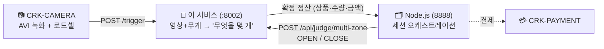

# CRK-model-HG — 스마트 자판기 판정 모델 서비스

무인 자판기에서 **카메라 영상과 무게 변화만으로 "무엇을 몇 개 가져갔는지" 판정해
결제 금액을 확정**하는 엣지 AI 서비스입니다. 레거시 서비스(CRK-model)의 외부 계약을
유지하면서 판정 엔진을 계층 구조로 백지 재설계한 구현체입니다.

| 항목 | 상태 |
|---|---|
| 자동 검증 | **406건 통과** (2026-07-30) · CI: ruff + pytest |
| 냉동 실기 | E2E 검증 완료 (OPEN → 추론 → CLOSE 정산 → 결제 연동) |
| 냉장 실기 | fitting 진행 중 (issue #18) |
| 런타임 의존성 | 코어 **0** (표준 라이브러리) — 장치 결합은 전부 어댑터 |
| 실행 환경 | Jetson Orin Nano 4GB · 단일 프로세스 `:8002` |

---

## 문서 안내

**상세 문서는 [`docs/`](docs/README.md) 문서집에 있습니다.** 이 README는 진입점입니다.

| # | 문서 | 이런 게 궁금하면 |
|---|---|---|
| 01 | [서비스 개요](docs/01-service-overview.md) | 이 시스템이 무엇을 판단해 매출을 확정하나 (비전공자용) |
| 02 | [시스템 아키텍처](docs/02-system-architecture.md) | 외부 계약, 계층 구조, 트리거 처리 흐름 |
| 03 | [판정과 정산](docs/03-judgment-and-settlement.md) | 판정 전략 순서, close 정산 4층, 설계 결정·불변식 |
| 04 | [설정 레퍼런스](docs/04-configuration.md) | 환경변수 전체 카탈로그, 냉장/냉동 프로파일 |
| 05 | [운영·진단 가이드](docs/05-operations.md) | 배포, 로그 읽기, 오판정 사후 분석 |
| 06 | [검증 보고서](docs/06-verification-report.md) | 무엇이 완료됐고 무엇이 남았나 |
| 07 | [배제·폐기 결정 기록](docs/07-rejected-and-retired.md) | 시도했으나 버린 것과 그 근거 |
| 08 | [인수인계](docs/08-handover.md) | 남은 작업, 리스크, 재개 절차 |

- 패키지별 세부 기능 문서: `crk_model/<패키지>/README.md` ([아래 표](#저장소-구조) 참조)
- 개발 당시 원본 자료(히스토리): [`docs/devdoc/`](docs/devdoc/README.md)

## 30초 요약



- 문이 열리면 판매 상품 목록을 받고, 꺼낼 때마다 즉시 판정하되 **청구는 문 닫힘 후
  한 번에 정산**합니다 (되돌려 놓은 물건·타 존 오반납까지 여기서 교정).
- 문이 닫혀도 바로 정산하지 않고 **모든 트리거 처리 완료를 인과적으로 확인한 뒤**
  확정합니다 (늦게 온 이벤트 유실로 0원 결제가 되는 사고 방지).
- 핵심 원칙은 **과청구보다 미청구**(fail-closed) — 증거가 애매하면 청구하지 않습니다.

## 빠른 시작

### Jetson 실기

```bash
git clone <저장소 URL> && cd <저장소>

chmod +x scripts/setup_jetson.sh scripts/install_jetson_torch.sh scripts/jetson_env.sh
./scripts/setup_jetson.sh          # system-site venv + 어댑터 의존성

cp refrg.env.example .env          # 냉장 기기 (냉동은 freezer.env.example)
#  → .env에서 MODEL__VISION__YOLO_MODEL_PATH 등 필수값 확인

source .venv/bin/activate
model-service
```

```bash
curl http://localhost:8002/api/health
# {"status":"ok","door_state":"idle","queue_pending":0,"barrier_satisfied":true,...}
```

`.engine` 파일은 저장소에 없습니다 — TensorRT/GPU에 종속이라 **그 Jetson에서 직접
빌드**해야 합니다(`PT_FILE=<모델>.pt scripts/convert_engine.sh`). 기동 시 프로브가
엔진을 1회 실행하므로 **로드 실패면 서비스가 즉시 죽습니다**(무증상 기동 금지).

배포·엔진 빌드·트러블슈팅 상세는 [05. 운영·진단 가이드](docs/05-operations.md).

### 개발 PC (도메인 코어)

```bash
git clone <저장소 URL> && cd <저장소>
pip install -e ".[dev]"     # pytest / ruff / httpx
pytest -q                   # 코어는 런타임 의존성 0
ruff check .
```

파사드 직접 호출 (HTTP 어댑터는 이 파사드를 감싸기만 합니다):

```python
from crk_model.core.config import Settings
from crk_model.service import ModelService

svc = ModelService(detector=MyTensorRTDetector(),   # Detector 프로토콜 구현
                   settings=Settings.from_env(),
                   startup_probe_frame=probe)       # 로드 실패 = 기동 실패

svc.handle_multi_zone({"session_id": s, "state": "OPEN", "active_products": [...]})
svc.handle_trigger({"zone": 1, "frames": {...}, "loadcells": [...], "video_paths": {...}})
svc.process_pending()                               # 전용 스레드에서 주기 호출
svc.handle_multi_zone({"session_id": s, "state": "CLOSE"})   # 배리어 충족 시 결제 페이로드
```

> 저장소 폴더를 옮기거나 이름을 바꾼 뒤 import가 깨지면, editable 설치 경로가
> 옛 위치를 가리키고 있는 것입니다: `pip install --no-deps -e .`를 다시 실행하고
> `__pycache__`/`.pytest_cache`를 지우면 해결됩니다.

## 저장소 구조

```
crk_model/          도메인 코어 + 어댑터 (약 10,400행 / 9패키지)
├── core/           타입 · SensorProfile · 정책 · env 설정
├── ingest/         로드셀 구간화(BOCPD) · 트리거 멱등성
├── frames/         모션 게이트 · 손 래치 · 선행 디코드
├── perception/     검출 필터 · 변위 증거 · 투표 앙상블 · 조기 종료
├── judgment/       전략 라우터 (순수 판정)
├── ledger/         이벤트 소싱 · close 정산 · 인과 배리어 · 아카이브
├── gateway/        OPEN/CLOSE 상태기계 · 결제 페이로드
├── service/        파사드 · 트리거 파이프라인 · 직렬 워커
└── adapters/       FastAPI · TensorRT · AVI 디코드 · 진단 CLI 3종
tests/              자동 검증 406건 (약 7,200행)
scripts/            Jetson 셋업 · 엔진 변환 · 진단 도구 (crk_model 비의존)
docs/               문서집 01~08 + devdoc(히스토리)
*.env.example       설정 템플릿 3종
```

| 패키지 | 책임 | 세부 문서 |
|---|---|---|
| `core/` | 도메인 타입(I10 분리), 센서 프로파일, 에러 정책, env 설정 | [문서](crk_model/core/README.md) |
| `ingest/` | 로드셀 시계열 → 무게 이벤트, 트리거 멱등성 | [문서](crk_model/ingest/README.md) |
| `frames/` | 프레임 공급: 모션 게이트, 손 래치, 프리페치 | [문서](crk_model/frames/README.md) |
| `perception/` | 필터 체인, 변위 증거, 투표, 조기 종료 | [문서](crk_model/perception/README.md) |
| `judgment/` | 선언적 우선순위 전략 라우터 (순수 함수) | [문서](crk_model/judgment/README.md) |
| `ledger/` | 이벤트 소싱, 정산 4층 + CLOSE 2차 패스, 저널·아카이브 | [문서](crk_model/ledger/README.md) |
| `gateway/` | 문 세션 상태기계, 결제 페이로드 타입 강제 | [문서](crk_model/gateway/README.md) |
| `service/` | 파이프라인 오케스트레이션, 단일 소비자 워커 | [문서](crk_model/service/README.md) |
| `adapters/` | 장치 결합(전부 lazy import) + 진단 CLI | [문서](crk_model/adapters/README.md) |

## 설정

기기 종류에 맞는 템플릿을 복사해 `.env`로 씁니다.

| 템플릿 | 용도 |
|---|---|
| `refrg.env.example` | **냉장 기기 실기 확정값** |
| `freezer.env.example` | **냉동 기기 실기 확정값** |
| `.env.example` | 전체 노브 카탈로그 + 튜닝 가이드 (레퍼런스) |

반드시 확인할 값:

| 환경변수 | 왜 |
|---|---|
| `MODEL__VISION__YOLO_MODEL_PATH` | 그 기기에서 빌드한 `.engine` 경로 |
| `MODEL__MACHINE__CABINET_TYPE` | 냉동 기기는 반드시 `freezer` — 미설정 시 전 존이 냉장(±5g) 프로파일로 판정되어 오판정이 재발합니다 |
| `MODEL__VISION__CAMERA_LAYOUT` | 냉장 `dual` / 냉동 실기 `dual_top_proxy` |

전체 환경변수 카탈로그와 현장 튜닝 절차는 [04. 설정 레퍼런스](docs/04-configuration.md).
게이트·tolerance·구간화 임계는 env가 아니라 `SensorProfile`(코드) 소속입니다 — 존
타입별 물리 특성이므로 배포 설정으로 흔들리지 않게 합니다.

## 운영·진단 도구

| 명령 | 용도 |
|---|---|
| `model-service` | 서비스 기동 (FastAPI :8002) |
| `label-session` | 실험 직후 정답 라벨 기입 (무취출은 `--none`) |
| `analyze-sessions` | 아카이브 오프라인 실측 리포트 (과금 정오·임계 제안·shadow 관측) |
| `render-session` | 기록된 bbox를 AVI 위에 오버레이해 육안 검증 |
| `scripts/live_engine_preview.py` | 카메라+엔진 실시간 프리뷰 |
| `scripts/detection_heatmap.py` | 존×프레임 위치별 검출 분포 계측 |
| `scripts/camera_luma_probe.py` | 내부 AE·노출 통계 진단 |

세션이 확정될 때마다 판정 근거 전체(후보·득표·전략·탈락 사유)가 세션 아카이브
YAML로 남습니다 — **모든 청구는 사후 재구성이 가능해야 한다**는 원칙입니다.
읽는 방법은 [05. 운영·진단 가이드](docs/05-operations.md).

## 개발 규칙

이 저장소를 이어받아 수정할 때 반드시 지켜야 하는 것들입니다.

1. **fail-closed를 깨지 마세요** — 애매하면 청구하지 않고, 에러 세션은 결제를
   차단하고, 무게 변화를 전량 설명하지 못하는 판정은 PARTIAL로 강등합니다.
2. **새 기제는 shadow(관측만)로 먼저** 배포하고, 실기 라벨 실측으로 승격을
   판정합니다. 승격은 env 한 줄, **폐기는 코드 삭제**입니다(".env에서 0으로 꺼두기"는
   코드 기본값과 어긋나 부활 경로를 남깁니다 — 실제 사고 전례가 있습니다).
3. **폐기 근거는 [07번 문서](docs/07-rejected-and-retired.md)에 기록**합니다.
   남기지 않으면 같은 시도가 반복됩니다.
4. **env를 추가·삭제하면** 템플릿 3종과 [04번 문서](docs/04-configuration.md)를
   같은 커밋에서 갱신합니다.
5. **모듈 경계 = 테스트 경계** — 의존 방향(core ← 도메인 ← service ← adapters)을
   거스르지 마세요. 코어에 런타임 의존성을 추가하지 마세요.

## 관련 저장소

| 저장소 | 역할 | 이 서비스와의 접점 |
|---|---|---|
| CRK-CAMERA | 존별 AVI 녹화 + 로드셀 샘플링 | `POST /trigger` 송신 |
| Node.js 서버 | 쇼핑 세션 오케스트레이션 | `POST /api/judge/multi-zone` 송수신 |
| CRK-IO-BOARD | 로드셀 하드웨어 인터페이스 | 5g 양자화·폴링 주기의 물리 계약 |
| Edge_Environment | 엣지 실행 환경·녹화 디렉토리 | 녹화 경로 소유자 (엣지 워터마크 근거) |
| CRK-model (레거시) | 참조 원본 서비스 | 외부 계약 호환 대상 |


-----------------------------------------------------------------------------------------------
chai@chai-desktop:~$ systemctl stop crk-model.service
chai@chai-desktop:~$ cd Desktop/Codes/CRK-model
chai@chai-desktop:~/Desktop/Codes/CRK-model$ source .venv/bin/activate
(.venv) chai@chai-desktop:~/Desktop/Codes/CRK-model$ model-service
