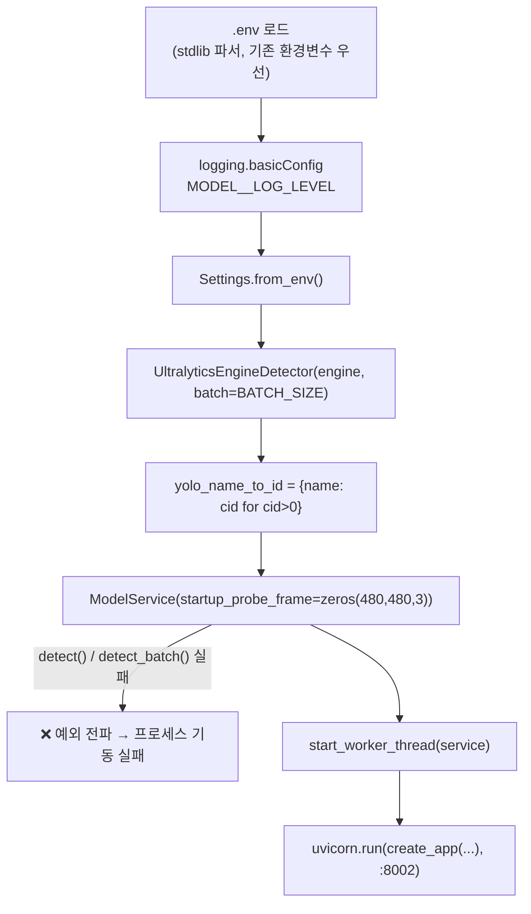

# `adapters/` — 장치·프레임워크와의 결합 전부 (lazy import 경계)와 진단 CLI 3종

> 계층 위치: 최상단 I/O 경계 — 아래로 `service/` 파사드만 호출하고, **어떤 계층도 이 패키지를 import하지 않는다** · 상태성: I/O 경계
> 런타임 의존성: **이 패키지에만** 존재 — `fastapi`/`uvicorn`, `ultralytics`(+`torch`), `cv2` 또는 `ffmpeg`, `numpy`, `PyYAML`. 전부 **함수 안 lazy import**.

---

## 1. 책임과 경계

### 원칙: 무거운 의존성은 전부 lazy import

`crk_model/` 안에서 외부 패키지를 만지는 곳은 여기뿐이다. 그리고 그 import는
모두 **모듈 최상단이 아니라 함수 안**에 있다. 결과:

- `core/`~`service/`는 런타임 의존성이 0이며, 표준 라이브러리만으로 테스트된다.
- 개발 PC에서 `import crk_model.adapters`만으로는 **아무것도 로드되지 않는다** —
  ultralytics·torch·cv2가 없는 환경에서도 모듈 import와 대부분의 테스트가 통과한다.
- Jetson에서는 JetPack의 system-site 패키지(numpy<2, torch, cv2)를 그대로 쓰고,
  `pyproject.toml`의 `[jetson]` extra에는 `fastapi`/`uvicorn`만 둔다 — CPU wheel이
  섞여 들어와 GPU 스택을 오염시키는 사고를 차단하기 위함이다.

### 이 계층에 있는 것 / 없는 것

| 있는 것 | 없는 것 (있으면 잘못된 것) |
|---|---|
| HTTP 라우팅, wire 포맷 번역, 필드 보강 | 계약·불변식 — 전부 `ModelService`에 있다 |
| TensorRT predict 호출과 파라미터 | 판정·투표·필터 규칙 |
| AVI 디코드와 크롭 기하 | 크롭 원점 **선택**(`ModelService.camera_crops`가 단일 소스) |
| 프로세스 기동 순서, 워커 스레드 생성 | 워커의 락 범위·배리어 순서(`service/worker.py`) |
| 오프라인 진단 CLI 3종 | 판정·정산·아카이브의 **변경** — CLI는 라벨 기입 외에는 읽기 전용 |

### `scripts/`와의 경계

`scripts/`(`live_engine_preview.py`, `detection_heatmap.py`, `camera_luma_probe.py`,
`convert_engine.sh`, `setup_jetson.sh`, `install_jetson_torch.sh`, `jetson_env.sh`)는
`crk_model`에 의존하지 않는 **독립 도구**다. 서비스 코드가 아니므로 이 문서의
대상이 아니며, 사용법과 운영 절차는 [05. 운영·진단 가이드](../../docs/05-operations.md) 소관이다.
반면 아래 CLI 3종은 `crk_model`의 아카이브·디코드 계약을 직접 쓰기 때문에 이
패키지에 있고, `pyproject.toml`의 콘솔 스크립트로 설치된다.

## 2. 구성 파일

총 2,468행 / 8파일.

| 파일 | 역할 | 핵심 진입점 |
|---|---|---|
| `http_app.py` (330행) | FastAPI 무로직 바인딩 + wire 계약 번역 + 워커 스레드 | `create_app`, `start_worker_thread` |
| `serve.py` (87행) | `model-service` 프로세스 진입점 | `main`, `load_dotenv` |
| `yolo_detector.py` (168행) | Ultralytics TensorRT `.engine` 어댑터 (`perception.Detector`/`BatchDetector` 구현) | `UltralyticsEngineDetector.detect` / `.detect_batch` / `.class_names` |
| `avi_frames.py` (320행) | AVI → `FrameBundle` 스트리밍 디코드 | `decode_avi`, `LazyAviFrames` |
| `analyze_cli.py` (871행) | `analyze-sessions` — 오프라인 실측 리포트 | `main`, `analyze`, `render`, `render_session` |
| `render_cli.py` (558행) | `render-session` — bbox 오버레이 영상 | `main`, `render_trigger` |
| `label_cli.py` (119행) | `label-session` — 정답 라벨 기입 | `main` |
| `__init__.py` (15행) | `LazyAviFrames`·`UltralyticsEngineDetector`·`create_app`·`decode_avi`·`start_worker_thread` 재수출 | — |

콘솔 스크립트 4종: `model-service`, `label-session`, `analyze-sessions`, `render-session`.

## 3. 파일별 상세

### `http_app.py` — FastAPI 무로직 바인딩

라우트는 3개뿐이고, 각 핸들러는 "wire → 도메인 번역 → 파사드 호출 → 응답 보강"만
한다.

| 라우트 | 위임 | 어댑터가 추가로 하는 일 |
|---|---|---|
| `POST /trigger` | `service.handle_trigger` | 비디오 경로 사전 검증(400 `VIDEO_FILE_NOT_FOUND`), 로드셀 wire 파싱, `ts` 기본값(첫 샘플 → `time.time()`), lazy `decode(video_paths)` 주입, 응답에 wire 필드 보강 |
| `POST /api/judge/multi-zone` | `service.handle_multi_zone` | 객체/배열 양쪽 페이로드 정규화, 문 상태 번역, 상품 필드 매핑, 워터마크 정규화, 응답 변화 시에만 로그 |
| `GET /api/health` | — | 계약 필드(`model`/`status`/`yolo_loaded`/`session_store_ready`/`timestamp`) + 진단 필드(`door_state`, `queue_pending`, `barrier_satisfied`, `barrier_pending`) |

wire 번역 헬퍼 (전부 순수 함수 — 테스트가 직접 호출한다):

| 함수 | 계약 |
|---|---|
| `_to_float` | `"+5000"` 같은 부호 문자열 → float, 파싱 불가 시 `0.0` |
| `_parse_ts` | ISO 문자열 또는 숫자 → float(epoch/상대초) |
| `_loadcell_from_wire` | `filtered_value` → `raw_value` → `values` 순으로 채택 (무게 판단은 필터값 우선) |
| `_door_state` | 문 상태는 별도 필드가 아니라 **`session_id` 필드에 `OPEN`/`CLOSE` 신호**로 실려 온다. 그 외 값·null은 폴링 |
| `_active_product_fields` | 상품 → `ActiveProduct` 필드. class_id 해석: 숫자 별칭(`yolo_class_id`/`yoloClassId`/`trainingidx`/`training_idx`/`trainingIdx`) → 이름 매칭(`product_eng_name` → `product_name` → `productName` → `name`, 공백 제거+대문자 exact) → 실패 시 **`-1`** |
| `_int_key_counts` | `{"4": 2}` → `{4: 2}`. 파싱 불가 항목은 무시 — 워터마크는 부가 신호이므로 잘못된 값으로 CLOSE를 막지 않는다 |
| `_wire_trigger_response` | 기존 `status`/`trigger_id`는 유지하고 `success`/`session_id`/`door_session_id`/`message`/`waiting_for`를 덧붙인다 |

**-1 센티널이 중요한 이유**: 매핑 실패에 `0`을 쓰면 그 상품이 hand(class 0)로
둔갑해 오청구로 이어진다(이슈 #6 실사고). 이름 매핑 사전은 `serve.py`가
`class_names`에서 만들 때 `cid > 0`만 담아 hand를 애초에 제외한다.

**비디오 사전 검증 기본값**: `decode`가 주입되면(테스트 등) 실 파일 경로가 아닐 수
있으므로 검증을 끄고, 기본 디코더일 때만 켠다. `validate_video_paths`를 명시하면
그 값이 항상 우선한다.

**워커 스레드**: `start_worker_thread(service, interval_s=0.05)`가 데몬 스레드
**1개**를 만들어 `process_pending()` 루프를 돈다(I7·C2 — 스레드가 둘이면 TensorRT
동시 추론이 된다). drain 루프의 예외는 잡아서 기록하고 계속한다 — 워커가
죽으면 큐가 영구 적체돼 배리어가 영원히 미충족이 되기 때문이다.

### `serve.py` — `model-service` 진입점

`load_dotenv`는 `os.environ.setdefault`를 쓰므로 **이미 설정된 환경변수가 우선**한다
(systemd·셸 export가 `.env`를 덮어쓴다). 도메인 로거(`[TRIGGER]`/`[MULTI-ZONE]`/
`[GATEWAY]`/`[OPS]`)는 uvicorn의 `log_level`이 다루지 않으므로 `basicConfig`로 별도
핸들러를 붙인다.

**기동 실패가 곧 배포 실패**다 — 엔진 파일 부재·CUDA 불가·batch/dtype 불일치는
모두 여기서 예외로 죽는다. 무증상 기동(서비스는 살아 있는데 모든 트리거가
error)이 가장 나쁜 실패 모드라는 판단이다. 저널(`EventJournal`)과 세션
아카이브(`SessionArchive`)도 이 파일이 **명시적으로** 만들어 주입한다.

### `yolo_detector.py` — Ultralytics TensorRT 어댑터

현행 운영 파라미터를 그대로 보존한다.

| 파라미터 | 값 | 근거 |
|---|---|---|
| `conf` | `0.01` | I4 — 저신뢰 검출도 투표 누적까지 보존. 최종 conf 필터는 투표 결합 후에만 |
| `max_det` | `20` | 원본 동형 |
| `imgsz` | `480` | 480×480 center-crop 계약과 1:1 (letterbox no-op) |
| `device` | `0` (`cuda:0`) | 단일 GPU |
| `hand_class_id` | `0` | 시스템 전역 계약 |
| 엔진 정밀도 | 어댑터가 지정하지 않음 — export 시점에 고정된다 (현행 `scripts/convert_engine.sh`는 `half=False`, 즉 FP32) | 사전 변환 산출물을 그대로 로드 |
| `batch` | `1` | `>1`이면 같은 크기로 재수출된 **정적 batch 엔진**이 전제 |

`allowed_class_ids`는 `predict(classes=...)`로 그대로 전달한다(P0-2). `None`은
무제한, **빈 시퀀스는 predict 호출 없이 즉시 `[]`** — fail-closed이며, 노이즈
클래스가 `max_det` 슬롯을 잠식해 저신뢰 실상품을 밀어내는 것을 원천 차단한다.

**`detect_batch` — 전처리 완료 GPU 텐서 1회 predict.** 프레임당 predict 비용의
**~72%가 CPU 전처리**(파이썬 letterbox/BGR→RGB/HWC→CHW//255 + NMS 후처리)라는
실측에 근거한다. ultralytics는 입력이 텐서면 전처리 분기를 전부 건너뛰므로,
uint8로 업로드(전송량 최소)한 뒤 GPU에서 `permute` + 채널 역순 + `/255`를 수행한다.
입력이 이미 `imgsz` 정방형이라 letterbox가 no-op이고 **반환 bbox 좌표계가 프레임
좌표 그대로**라는 등식이 성립한다.

| 상황 | 동작 |
|---|---|
| `batch > 1`, 입력 N < batch | 0 프레임으로 패딩 후 predict, 패딩 결과 폐기 (정적 엔진의 shape 요구 충족) |
| `batch > 1`, `detect()` 단일 프레임 호출 | **`detect_batch([frame])`로 위임** |
| `batch > 1`, 입력이 480×480×3이 아님 | `ValueError` — 계약 위반을 즉시 드러낸다 |
| `batch == 1`, 입력이 정방형이 아님 | 프레임별 `detect()`로 폴백 (letterbox를 어댑터에서 재구현하지 않는다 — 좌표계 등식 유지) |

`detect()`가 `batch > 1`에서 배치 경로로 위임하는 이유는 실기 사고 대응이다:
ultralytics TRT 백엔드는 정적 엔진에서 **모든** predict가 정확히 batch 크기여야
하고(`input size ... not equal to max model size`), 그렇지 않으면 기동 프로브의
단일 프레임 detect가 warmup부터 실패해 서비스가 뜨지 않는다.

### `avi_frames.py` — AVI → `FrameBundle` 디코드

**기하 계약**: 640×480 소스에서 **center-crop 480×480** — 좌우 각 80px(존 바깥 영역
절반씩)를 버리고 비율을 보존한다. squash resize(비등방 축소)는 금지다 —
conf가 떨어지고 bbox 좌표계가 왜곡돼 ROI·hand_margin 상수가 전부 어긋난다.
크롭 후에도 목표 크기에 못 미치는 소형 소스(테스트 픽스처 등)만 리사이즈로
보정하므로, 운영 640×480에서는 **무손실 크롭만** 일어난다.

**크롭 원점**: `crop="center"`(기본) | `"left"`. 냉장 side 카메라는 존이 화면
왼쪽에 있어 left-crop(x=0..480)을 쓴다. 카메라별 선택은
`LazyAviFrames(crop_by_camera=...)`로 주입되며 단일 소스는
`ModelService.camera_crops`(← `MODEL__VIDEO__SIDE_CROP`)이다. 잘못된 값은
`ValueError`로 죽인다 — 오타가 조용히 center가 되면 bbox 좌표계가 80px 어긋난 채
운영되고 있음을 알 수 없다.

**스트리밍**: 480×480×3 프레임 ~400장을 리스트로 상주시키면 카메라당 ~276MB,
두 카메라 동시 처리 시 4GB Jetson에서 OOM 위험이다. `decode_avi`는 제너레이터로
프레임을 하나씩만 메모리에 둔다. 단, **첫 프레임은 즉시 당겨** "0프레임" 여부를
판정하고 `OSError`로 전파한다(I1 — 조용한 무검출 금지). 이후 프레임은 지연 방출이며,
소비자가 중도 포기하면 `finally`에서 `gen.close()`로 cv2/subprocess를 즉시 해제한다.

**디코더 선택** (`MODEL__VIDEO__DECODER` = `auto`(기본)|`ffmpeg`|`opencv`):

- `auto`는 ① `ffmpeg` 실행 파일 존재 ② `numpy` import 가능 ③ **CUDA 디바이스 실초기화
  성공**을 모두 만족할 때만 ffmpeg를 고르고, 아니면 cv2(CPU)로 폴백한다.
- ③이 핵심이다: `ffmpeg -hwaccels`는 **빌드에 컴파일된** 목록이라 드라이버 없는
  호스트에서도 `cuda`가 나온다. 그 목록만 믿고 `-hwaccel cuda`를 넘기면 디바이스
  생성이 EPERM으로 죽어 디코드 전체가 실패한다(CI 34연속 실패의 원인). 그래서
  `-init_hw_device cuda`로 실사용 가능 여부를 검사하고 1회 캐시한다.
- 런타임 폴백: hwaccel로 **프레임을 하나도 못 얻고** 죽은 경우에만 CPU로 1회 재시도
  한다. 프레임을 얻은 뒤의 실패는 폴백하지 않는다(중복 방출 방지, I1 전파).

**게이트 뷰**: 그레이 120×120 다운스케일(`FrameBundle.gate_view`) — 모션 게이트는
이 뷰를, 검출기는 `full`을 받는다. cv2 없는 ffmpeg 경로의 `_gate_view`는
**nearest 다운샘플 후 채널 평균** 순서를 쓰는데, 종전(풀 프레임 평균 후 다운샘플)과
결과가 **비트 동일**하면서 평균 연산 픽셀이 16배 적다(230,400 → 14,400).

**`LazyAviFrames`**: 카메라→AVI 경로의 `Mapping`. `__getitem__`이 곧 새 디코드
스트림 오픈이므로 디코드는 **워커 스레드에서** 일어나고 `/trigger` 응답은 202
의미론대로 즉시 반환된다. 캐시는 없다 — 소비처(`pipeline._run_vision`)가
카메라당 정확히 1회만 순회하므로, 프레임 전체 상주를 피하는 쪽이 이득이다.

### 진단 CLI 3종

세 도구 모두 서비스 경로와 분리돼 있으며, 라벨 기입(`label-session`)을 제외하면
**아카이브를 읽기만** 한다.

#### `label-session` — 정답 라벨 기입

| 항목 | 내용 |
|---|---|
| 목적 | 실험 직후 실제 취출 품목·수량을 아카이브 YAML에 구조화 기입 (GitHub 이슈에 수기로 적던 것의 대체). conformal 보정·과금 정오 판정이 이 라벨을 읽는다 |
| 전제 | 세션 아카이브가 활성(`MODEL__SESSION__ARCHIVE_DIR`)이고 대상 세션 파일이 존재 |
| 옵션 | `session_id`(위치) **XOR** `--latest` · `--dir`(기본 `data/sessions`) · `--zone`(`--take` 기본 존) · `--take`(반복) · `--note` · `--none` |
| `--take` 형식 | `[존:]<class_id\|이름>x<개수>` — 식별자가 숫자면 class_id, 아니면 이름(진단용). 존 접두사 없으면 `--zone` 사용 |
| 무취출 | **`--none`** — 청구 0이어야 정답인 GT를 기입한다. `--take`와 함께 쓸 수 없고, 둘 중 하나는 필수 |
| 멱등 | 재실행 시 기존 라벨을 대체 (오기입 정정 = 다시 실행) |

`--none`이 정식 경로인 이유: 이전에 `--take`가 필수라 제스처-온리 세션을 `0x1`로
우회 기입했고, 그 결과 정답인 "과금 없음"이 오답으로 집계됐다. `analyze-sessions`는
호환을 위해 `class_id == 0` 항목을 무취출 마커로 간주해 제외한다.

#### `analyze-sessions` — 오프라인 실측 리포트

| 항목 | 내용 |
|---|---|
| 목적 | 아카이브(+라벨)만으로 "현행 판정이 맞게 청구했는가"와 임계 보정 입력을 산출 |
| 전제 | 순수 stdlib(+아카이브가 YAML이면 PyYAML). 판정·정산·아카이브를 **변경하지 않는다** |
| 옵션 | `--dir` · `--json` · `--session SESSION_ID` · `--full` · `--since EPOCH\|ISO일시` |

현재 리포트 섹션 5종(출력 순서):

| 섹션 | 내용 |
|---|---|
| **과금 정오** | 라벨된 세션의 존별 최종 확정 vs 정답 멀티셋. 헤드라인 지표. class_id 미기록 구 아카이브는 `unknown_schema`로 분리 |
| **트랙릿 T1** | 실질(obs≥3) 트랙 수 분포, 단절 의심(≥4), 이동 트랙 한정 `head_obs`의 정답/비정답 분리 — 여기에 **held 강등 관측**(정답 클래스 플래그 = `HELD_TRACK_DEMOTION=active` 승격 보류 신호)이 함께 붙는다 |
| **고스트 shadow** | 정산 notes의 `ghost_classes`/`ghost_shadow` 집계. 정답 오플래그 0 + shadow 우세가 `MODEL__GHOST__MODE=active` 승격 근거 |
| **conformal 보정** | 라벨된 정답 상품의 후보 통계(votes/ratio/share/conf) 경험 분위수 → 채택 임계는 p5 이하 제안(정답 95%가 후보에 남는 하한) |
| **개당 잔차 실측** | `(|Δ| − n·w)/n` 분포 → `MODEL__JUDGMENT__COUNT_UNIT_SLACK` 제안값(편향 포함 RMS) |

- 폐기된 shadow 기제의 구 아카이브 필드(무게 우도·tray prior·튜브 다수결 등)는
  **무시**된다 → [07. 배제·폐기 결정 기록](../../docs/07-rejected-and-retired.md).
- `--since`는 **코드 버전이 섞인 아카이브 오염 방지** 장치다. 기준은 세션 id
  말미의 epoch(`ses-1-1784790155`), 없으면 파일 mtime — 아카이브의 `finalized_at`은
  monotonic clock이라 벽시계 비교에 쓸 수 없다. 파일명만으로 프리필터해
  대상 밖 대형 YAML의 **파싱 자체를 건너뛴다**.
- `--session` 단건 덤프는 전량 로드를 우회하고 `archive.find()`로 해당 파일만
  파싱한다(파일명 stem == session_id 계약). 실측 **9.7s → 80ms**(20세션 ×
  354KB). 기본 출력은 압축(승격·은퇴로 "일치가 기본값"이 된 필드를 접고
  mismatch·몰수·held만 표시)이고, 원자료 전체는 `--full`이다.

#### `render-session` — bbox 오버레이 검증 영상

| 항목 | 내용 |
|---|---|
| 목적 | "모델이 그 순간 실제로 어디를 잡았는지"를 눈으로 확인 |
| 전제 | 세션이 **`MODEL__SESSION__SAVE_DETECTIONS=1`** 로 기록됐어야 한다(`trace.frame_detections`). 없으면 안내 메시지와 함께 건너뛴다 · `ffmpeg` 필수 · `numpy` 필수 |
| 옵션 | `session_id` **XOR** `--latest` · `--dir` · `--out`(기본 `data/render/<세션id>/`) · `--format mp4\|jpg` · `--fps`(0 = 소스 probe, 실패 시 20) · `--trigger`(반복) · `--camera`(반복) · `--map OLD=NEW`(반복) |

- **오프라인 재추론을 하지 않는다.** 기기의 TensorRT 엔진과 결과가 다르므로,
  재추론하면 "그때 모델이 본 것"이 아니라 "지금 다시 본 것"이 된다. 아카이브에
  기록된 검출만 그린다(구 스키마의 `kept=False` 항목은 제외).
- **크롭 기하 재현**: 아카이브의 `camera_crops` 스탬프를 읽어 기록 당시와 동일한
  크롭으로 디코드한다(스탬프 없는 구 아카이브는 center). 좌표계 무변환 계약의
  유지 장치다.
- **cv2를 쓰지 않는다** (런타임 의존성 0 원칙): 디코드는 `avi_frames.decode_avi`
  (운영과 동일 기하), 그리기는 numpy 슬라이싱 + 내장 5×7 비트맵 폰트, 인코드는
  ffmpeg rawvideo 파이프. 디코더는 `MODEL__VIDEO__DECODER=ffmpeg`를 `setdefault`로
  고정한다(env 우선) — 이 CLI는 ffmpeg가 어차피 필수라 cv2 없는 개발 PC에서도
  돌아야 한다.
- **캔버스 레이아웃**: 480×480 프레임을 560×624 캔버스 가운데 두고, 실험 정보
  헤더는 프레임 **밖** 상단 밴드(80px)에 그린다. bbox 라벨이 프레임 위 경계를
  넘어도 24px 띠에서 보이고 헤더를 가리지 않는다. 상품은 클래스별 고정 색(황금각
  hue 순환) 실선 + `id conf`, hand는 흰색. 상태줄은 `POS nnn INFER k` 또는
  `POS nnn SKIP`(기록 없는 프레임 = 게이트 스킵 또는 조기 종료 이후)이다.
- **최적화**: 트리거×카메라당 1회 만드는 캔버스 템플릿(배경·테두리·정적 헤더 사전
  렌더) + 글리프 마스크 캐시로 데모 렌더 **0.64s → 0.28s**, mp4 바이트 동일.
- 카메라 1개의 디코드/인코드 실패는 나머지 렌더를 막지 않고, 실패한 출력은
  `abort()`로 정리해 불완전 파일을 남기지 않는다.

## 4. 계약과 불변식

| 계약 | 내용 |
|---|---|
| 의존 방향 | `adapters → service → 도메인`. 도메인이 어댑터를 참조하면 lazy import 경계가 무의미해진다 |
| lazy import | 외부 패키지 import는 **함수 안**에만. 모듈 최상단 import는 이 패키지에서도 금지다 |
| 무로직 바인딩 | HTTP 핸들러는 번역과 위임만. 조건 분기가 늘어나면 `ModelService`로 올려야 한다 |
| I1 (fail-closed) | 디코드 열기 실패·0프레임은 `OSError`로 전파 — 파이프라인이 error 이벤트로 만든다 |
| I7 / C2 | 워커 스레드는 정확히 1개 |
| 좌표계 | 검출·기록·렌더가 모두 480×480 크롭 좌표계. 크롭 원점은 `camera_crops` 스탬프가 계약 |
| fail-closed allowlist | `allowed_class_ids=[]`면 predict 없이 `[]` |
| 기동 fail-fast | 엔진 로드·프로브 실패는 프로세스 기동 실패 |
| CLI 부작용 | `label-session`만 아카이브를 쓰고(`annotate_ground_truth`), 나머지는 읽기 전용 |

## 5. 설정

`Settings.from_env()`가 대부분을 담당하지만, 이 패키지는 **프로세스 부트스트랩과
디코더 선택에 한해** `os.environ`을 직접 읽는다. 전체 카탈로그는
[04. 설정 레퍼런스](../../docs/04-configuration.md)에 있다.

| 환경변수 | 기본값 | 영향 |
|---|---|---|
| `MODEL__VISION__YOLO_MODEL_PATH` | `models/set9_doorfas_0323_imbal.engine` | 로드할 TensorRT 엔진 (`serve.py`) |
| `MODEL__SERVER__HOST` / `MODEL__SERVER__PORT` | `0.0.0.0` / `8002` | uvicorn 바인딩 |
| `MODEL__LOG_LEVEL` | `INFO` | 도메인 로거 레벨 |
| `MODEL__LEDGER__JOURNAL_PATH` | `logs/events.jsonl` | 이벤트 저널 경로 |
| `MODEL__SESSION__ARCHIVE_DIR` | `data/sessions` | 세션 아카이브 루트. `""`면 아카이브 비활성 |
| `MODEL__SESSION__ARCHIVE_RETENTION_DAYS` | `14` | 아카이브 보존 일수 |
| `MODEL__VIDEO__DECODER` | `auto` | `auto`(ffmpeg NVDEC 실검사 후 cv2 폴백) / `ffmpeg` / `opencv`. `render-session`은 `ffmpeg`를 기본으로 setdefault |
| `MODEL__VIDEO__SIDE_CROP` | `center` | side 디코드 크롭 원점. `Settings` → `ModelService.camera_crops` → `LazyAviFrames` 경로로 전달 (어댑터가 직접 읽지 않는다) |
| `MODEL__VISION__BATCH_SIZE` | `1` | `>1`이면 `UltralyticsEngineDetector(batch=N)` — **같은 N으로 재수출된 정적 엔진 필요** |
| `MODEL__SESSION__SAVE_DETECTIONS` | `false` | `render-session`의 전제 조건 |

## 6. 테스트

| 테스트 파일 | 무엇을 고정하는가 |
|---|---|
| `tests/test_adapters.py` (4건) | `FrameBundle` 계약(게이트는 `gate_view`, 검출기는 `full`) · HTTP 종단 흐름(OPEN → `/trigger` → drain → CLOSE 확정) · `/api/health`의 배리어 보고 · HTTP 경유 중복 트리거 드롭 |
| `tests/test_wire_contract.py` (6건) | `/trigger` 성공 응답의 계약 필드 존재 · `change_timestamps`가 이벤트까지 도달 · 중복 응답도 `success=true` · 검증 ON일 때 없는 경로가 400 `VIDEO_FILE_NOT_FOUND` · `decode` 주입 시 검증 기본 OFF · `/api/health` 계약 필드 |
| `tests/test_product_mapping.py` (17건) | 숫자 별칭 5종(snake/camel) 인식 · 이름 기반 폴백 4순위와 대소문자 무시 · 숫자 0도 이름 폴백을 타는지 · 어느 경로로도 실패하면 **`-1`**(0 금지) · `_normalize_multi_zone`의 매핑 전달 · OPEN 로그의 `mapped=X/Y unmapped=[...]` · 이름만 있는 상품의 HTTP 종단 매핑 |
| `tests/test_frames_streaming.py` (18건) | hwaccel 프로브가 **실초기화 rc**로 판정 · 0프레임 hwaccel 실패의 CPU 1회 폴백 · 첫 프레임 이후 실패는 폴백 없이 전파 · `decode_avi`가 지연 이터레이터 · 부분 소비 후 `close()`가 프로세스 해제 · 없는 파일은 `OSError` · `LazyAviFrames`가 접근마다 새 스트림 · numpy/순수 파이썬 diff ratio 동등성(uint8 오버플로 포함) · `_gate_view` 순서 교환의 **비트 동일성**과 non-square 소스 · 파이프라인의 제너레이터 frames 처리(1회 순회) |
| `tests/test_analyze_cli.py` (22건) | **폐기 shadow 필드 무시** · conformal 분위수와 후보 누락 보고 · 개당 잔차 표본 · 과금 정오(정답/오답, 라벨 없는 존의 과청구도 오답) · 트랙릿 head 분리와 단절 집계 · held shadow의 정답 플래그/비정답 계수 · 고스트 shadow 정오 · `--none` 라벨이 라벨로 집계 · `--session` 압축 vs `--full` · `tube_diag` 렌더 · class_id 없는 구 아카이브의 조용한 제외 · CLI(JSON 출력, 빈 디렉토리 오류, 단건 조회/미발견, `--since` epoch·ISO, 손상 파일 보고, **단건 조회가 대상 파일만 파싱**, `--since` 프리필터가 구 파일 파싱을 건너뛰는지) |
| `tests/test_render_cli.py` (12건) | 오버레이 mp4 생성 · `--map` 경로 이식 · `--format jpg` 프레임 출력 · 기록 없는 세션의 안내 실패 · 영상 없음의 깔끔한 실패 · **left-crop 스탬프 적용** · 구 스키마 `kept=False` 제외 · `crop="left"` vs `center` 기하(x=0..480 vs 80..560) · 잘못된 crop 값 fail-closed · 그리기 프리미티브(픽셀 스탬프, 프레임 밖 클램프) · `_remap` 접두사 치환 |
| `tests/test_t2_batch.py` 중 `TestStaticBatchEngineAdapter` | 정적 batch 엔진 계약: 단일 `detect()`의 배치 위임, non-square 입력의 `ValueError`(batch>1) / 프레임별 폴백(batch=1), 빈 allowlist가 predict 없이 반환 |

FastAPI·ffmpeg·numpy가 없는 환경에서는 해당 테스트가 `importorskip`/`skipif`로
건너뛰어진다 — 어댑터 테스트가 도메인 테스트를 붙잡지 않게 하는 의도다.

## 7. 수정 시 주의

1. **최상단 import를 추가하지 말 것.** `ultralytics`/`torch`/`cv2`/`numpy`/
   `fastapi`를 모듈 레벨에서 import하면 개발 PC·CI에서 `crk_model` import가 깨지고,
   "런타임 의존성 0" 원칙이 이 패키지 밖으로 새어 나간다.
2. **HTTP 핸들러에 판단을 넣지 말 것.** 새 계약 규칙은 `ModelService`에 두고
   어댑터는 필드 번역만 한다 — 그렇지 않으면 규칙이 FastAPI 없이는 테스트되지
   않는다.
3. **크롭 기하를 바꾸면 상수가 전부 어긋난다.** side ROI 경계·hand margin·수직
   ROI 분할선은 모두 480×480 크롭 좌표계 기준이다. `SIDE_CROP`을 바꾸면 원점이
   80px 이동하므로 관련 경계를 재측정해야 한다.
4. **`detect_batch`의 좌표계 등식을 깨지 말 것.** 입력이 `imgsz` 정방형이라는
   전제가 letterbox no-op과 "반환 bbox = 프레임 좌표"를 보장한다. 전처리를
   어댑터에서 재구현하는 대신 프레임별 경로로 폴백하는 현재 설계를 유지할 것.
5. **`batch_size`를 바꾸면 엔진도 함께 재수출해야 한다** (`scripts/convert_engine.sh
   BATCH=N`). 엔진과 설정이 어긋나면 기동 프로브에서 죽는다 — 이는 의도된
   fail-fast이다.
6. **`frame_detections`/`camera_crops` 스키마 변경 시 `render-session`을 같은
   커밋에서 고친다.** 구 아카이브 호환 분기(`kept` 병기, `camera_crops` 부재)를
   제거하면 과거 세션을 재생할 수 없게 된다.
7. **`analyze-sessions`에 판정 로직을 넣지 말 것.** 리포트는 관측이지 재판정이
   아니다(고스트 shadow 비교는 "트리거 재판정 vs 존 최종 확정"이라는 근사 캐비앳이
   코드 주석에 명시돼 있다).
8. **운영 절차는 여기가 아니라 [05. 운영·진단 가이드](../../docs/05-operations.md)에
   쓴다.** 이 문서는 코드 계약, 05는 명령·순서·판독법이다.

관련 문서: [02. 시스템 아키텍처](../../docs/02-system-architecture.md) ·
[04. 설정 레퍼런스](../../docs/04-configuration.md) ·
[05. 운영·진단 가이드](../../docs/05-operations.md) ·
형제 패키지 [`../service/README.md`](../service/README.md) ·
[`../perception/README.md`](../perception/README.md) ·
[`../frames/README.md`](../frames/README.md) ·
[`../ledger/README.md`](../ledger/README.md)
