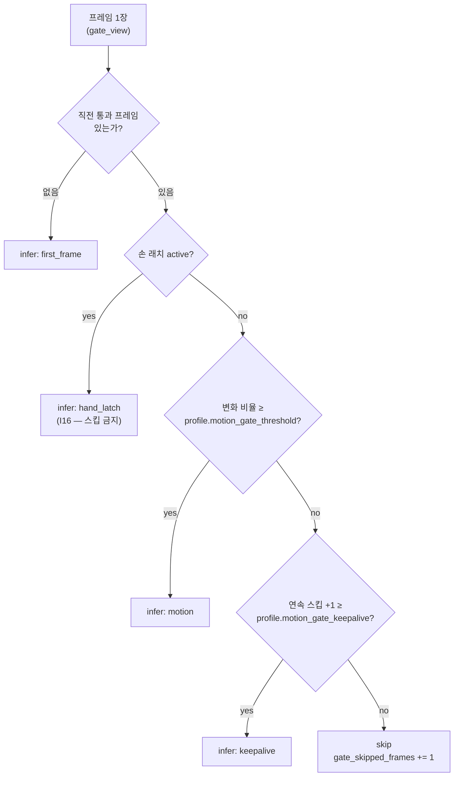

# `frames/` — 프레임 공급과 YOLO 호출 감축 (뷰 분리·모션 게이트·선행 디코드)

> 계층 위치: `core/`(프로파일)만 의존한다. 실제 디코드는 `adapters/avi_frames.py`가 하고,
> 조립·소비는 `service/pipeline.py`가 한다 · 상태성: **트리거 내** — 게이트·래치·프리페처는
> 카메라별로 트리거마다 새로 만들고 트리거 종료와 함께 버린다
> 런타임 의존성: 없음(`threading` / `queue`). numpy는 **있으면 쓰는** 가속 경로

---

## 1. 책임과 경계

처리 시간은 YOLO 호출 수가 지배한다(실측 `처리시간 ≈ 40ms × yolo_calls`). frames는
"**어떤 프레임을 추론할 것인가**"와 "**추론기가 기다리지 않게 프레임을 어떻게 대준
것인가**"만 담당한다.

| 하는 일 | 산출물 |
|---|---|
| 프레임의 두 뷰 계약 정의 (게이트용 / 검출기용) | `FrameBundle(full, gate_view)` |
| 변화 없는 프레임의 추론 생략 결정 | `GateDecision(infer, reason)` |
| 손 상태 래치로 스킵 금지 구간 확보 (I16) | `HandLatch.active`, `.frames_since_exit` |
| 게이트 트레이스 카운터 (I8) | `processed_frames`, `gate_skipped_frames` |
| 디코드와 추론의 파이프라이닝 | `PrefetchFrames` |

이 계층이 **하지 않는** 일:

| 하지 않는 일 | 실제 담당 |
|---|---|
| AVI 디코드·크롭·게이트 뷰 생성 | `adapters/avi_frames.py` (ffmpeg NVDEC / cv2, lazy import) |
| 검출·필터·투표 | `perception/` |
| 조기 종료 판정 | `perception/early_termination.py` — frames는 `frames_since_exit`만 제공 |
| **배치 추론** | `service/pipeline.py`의 마이크로배치 루프 + `adapters/yolo_detector.detect_batch` |
| 손이 "ROI 안"인지의 기하 판단 | `perception/filters.py`(손 conf 하한 통과분) — 게이트는 그 결과만 래치에 받는다 |

설계 단계에 있던 `frames/batch.py`의 `FixedBatchCollector`는 **2026-07-30 삭제**됐다.
D8(고정 배치 + 패딩) 자체는 살아 있지만, 구현체가 이 계층의 수집기가 아니라 파이프라인의
마이크로배치 루프로 낙착됐기 때문이다 — 단일 `consume()` 경로를 배치/비배치가 공유해야
"배치가 판정을 바꿀 수 없다"는 성질이 성립한다. 경위는
[07. 배제·폐기 결정 기록](../../docs/07-rejected-and-retired.md).

## 2. 구성 파일

| 파일 | 역할 | 핵심 진입점 |
|---|---|---|
| `bundle.py` (17행) | 프레임 1장의 두 뷰를 묶는 계약 | `FrameBundle` |
| `motion_gate.py` (113행) | 적응적 프레임 스킵 + 손 래치 | `MotionGate.evaluate()`, `HandLatch.update_after_inference()` |
| `prefetch.py` (99행) | 백그라운드 선행 디코드 래퍼 | `PrefetchFrames`, `.close()` |
| `__init__.py` (11행) | 재수출 + 배치 구현 위치 안내 | `from crk_model.frames import ...` |

`PrefetchFrames`는 `__init__.py`의 `__all__`에 없다 — 성능 레버라 조립 지점(`service/pipeline.py`)만
`from crk_model.frames.prefetch import PrefetchFrames`로 가져간다.

## 3. 파일별 상세

### `bundle.py`

같은 프레임을 게이트와 검출기가 **다른 해상도로** 원한다.

| 소비자 | 뷰 | 형식 | 이유 |
|---|---|---|---|
| `MotionGate` | `gate_view` | 그레이스케일 120×120 | absdiff 비용은 픽셀 수에 비례한다. 480×480 컬러로 차분하면 게이트가 절약한 YOLO 시간을 게이트가 다시 먹는다 |
| 검출기 | `full` | BGR 480×480 | bbox 좌표계가 곧 판정 입력이다(ROI 경계·hand margin 상수가 이 좌표계에 맞춰져 있다) — 다운스케일 불가 |

`FrameBundle`은 필드 2개짜리 dataclass이고 로직이 없다. 파이프라인은
`getattr(frame, "gate_view", frame)` / `getattr(frame, "full", frame)`로 꺼내므로,
번들이 아닌 평범한 프레임(리스트·ndarray)을 넘겨도 양쪽에 같은 값이 쓰인다 —
테스트와 단순 환경 호환을 위한 의도적 duck-typing이다.

뷰 생성은 어댑터 소관이다(`adapters/avi_frames._gate_view`). 그쪽은 **다운샘플 후 채널 평균**
순서로 계산하는데(픽셀 16배 감소), 종전 "풀 프레임 평균 후 다운샘플"과 **비트 동일**해야
한다는 등가성 회귀 테스트가 걸려 있다.

### `motion_gate.py`

**눈먼 stride의 상위호환**이다. 균일 stride(예: 2프레임마다 추론)는 빠른 손동작 프레임도
버린다. 자판기 영상은 대부분의 프레임이 정지 상태이므로, "직전 **통과** 프레임과의
다운스케일 absdiff 변화 비율"이 임계 미만일 때만 스킵하면 스킵률이 상황 적응적이 된다
(정지 구간은 크게 스킵, 동작 구간은 스킵 0).

결정 순서 — 위에서부터 먼저 걸리는 것이 이긴다.

**비교 기준은 직전 "통과" 프레임**이다(직전 프레임이 아니다). 직전 프레임과 비교하면 아주
느린 동작이 매 프레임 임계 미만 → 무한 스킵으로 사라진다. 통과 프레임을 기준으로 두면
변화가 누적되어 언젠가 반드시 임계를 넘는다.

**실패 방향이 안전하다(fail-safe)**: 게이트가 틀리면 "스킵하지 않음 = 정확도 무손실,
속도 이득만 소멸"이다. 그래서 냉동 임계를 0.005까지 낮춰도(김서림·성에·AE 스윙으로 스킵
이득이 0에 수렴) 정확도 리스크가 없다.

| 파라미터 | 값 | 소유 |
|---|---|---|
| 변화 비율 임계 | 냉장 0.02 / 냉동 0.005 | `SensorProfile` (+ env 오버라이드) |
| keepalive(연속 스킵 상한) | 냉장 8 / 냉동 4 | `SensorProfile` (+ env 오버라이드) |
| 픽셀 변화 판정 `pixel_delta` | 15.0 | **생성자 기본값 고정** — env 경로 없음 |

**손 래치 (I16)**. 손 bbox는 YOLO 산출물이다. 즉 **추론하지 않은 프레임에는 손 정보가 아예
없다**. 그래서 "손이 ROI 안에 있는 동안 스킵 금지"는 프레임 단위 검사로는 표현할 수 없고,
래치라는 조작적 정의로만 검증 가능하다: *직전 추론 통과 프레임에서 손이 ROI 내였거나,
손의 ROI 퇴장이 아직 미확인이면 스킵 불가.*

| 상태 | 갱신 규칙 |
|---|---|
| `active=True` | 추론 프레임에서 손 검출 → 즉시 활성, `_pending = exit_confirm_frames`(기본 3) |
| 퇴장 유예 | 손 미검출 프레임마다 `_pending -= 1`, 0이 되면 `active=False` |
| `frames_since_exit` | 래치 비활성 상태에서 손 없는 추론 프레임마다 증가 — 조기 종료(D7)의 "퇴장 후 M프레임" 입력 |

`update_after_inference()`는 **추론한 프레임에서만** 호출해야 한다(파이프라인의 `consume()`
말미). 미추론 프레임에서 호출하면 손 없음(`hand_in_roi=False`)이 계속 들어와 래치가
조기 해제되고 I16이 무력화된다. 또한 여기서 말하는 "ROI 내"는 실제로 **손 conf 하한을
통과한 검출이 프레임에 있는가**로 조작화돼 있다(필터 체인은 손을 ROI로 제거하지 않고
conf로만 거른 뒤 항상 보존한다).

마이크로배치(`MODEL__VISION__BATCH_SIZE>1`)를 켜면 배치가 채워질 때까지 래치 갱신이
**최대 batch−1 프레임 지연**된다. keepalive가 강제 추론 상한이라 위험 창은 유계지만
(냉동 keepalive 4 → 최악 +3프레임 ≈ 0.1s), 승격 전 재생 검증이 필요한 항목이다.

**numpy fast path**: 120×120 이중 파이썬 루프는 트리거당 수백만 회 연산이라 Jetson CPU에서
게이트 이득을 갉아먹는다. ndarray 입력이면 벡터화 경로를 쓰고, numpy가 없거나 입력이
ndarray가 아니면 순수 파이썬으로 폴백한다(동작 등가). uint8 뺄셈은 wrap-around하므로
**int16 승격 후 abs**를 취한다 — 승격을 빼면 250 vs 5의 차이가 11로 왜곡돼 모션을 놓친다.

**트레이스 계약 (I8)**: `processed_frames`의 의미(카메라별로 게이트가 본 프레임 수)를
그대로 유지하고, 스킵 수는 **신설 필드** `gate_skipped_frames`로 분리했다. 게이트를
도입하면서 기존 카운터의 의미를 바꾸면 과거 세션과 수치를 비교할 수 없게 된다. 실제 추론
횟수는 파이프라인의 `yolo_calls`가 따로 센다.

### `prefetch.py`

**배경**: 트리거 처리에서 디코드(ffmpeg 파이프 read + numpy 변환)는 추론과 직렬로 실행돼,
비YOLO 비용(총 처리의 **12~21%**)이 그대로 지연에 더해진다. ffmpeg는 별도 프로세스이고
파이프 read·numpy·TensorRT 파이썬 바인딩은 GIL을 해제하므로, 백그라운드 스레드가 큐 깊이만큼
선행 디코드하면 디코드 비용이 추론 시간에 은닉된다. 카메라별 프리페처를 **트리거 시작
시점에 전부** 만들면 top 추론 중 side 디코드도 함께 진행된다(2캠 동시 디코드).

**메모리 상한**: `depth × 691KB`(480×480×3). depth 4 기준 카메라당 ~2.8MB로, 과거 OOM
경고(프레임 400장 상주 ≈ 276MB/카메라)와는 차원이 다르다.

계약 3가지 — 이것이 "속도 레버가 정확성을 건드리지 않는다"의 근거다.

| 계약 | 구현 | 위반 시 증상 |
|---|---|---|
| 순서 보존 | 소스 이터레이터 방출 순서 그대로 bounded queue를 통과 | 프레임 위치(`pos`) 기반 계측·held 판정이 깨진다 |
| 예외 전파 (I1) | 소스 예외를 보관하고, **큐에 남은 프레임을 모두 소진한 뒤** 소비자에게 재던짐 | 프레임 유실 또는 "무검출 0원"으로 삼켜짐 |
| `close()` 전파 | 생산자 정지 + 소스의 `close()`(제너레이터 → ffmpeg kill)까지 전파. **멱등** | 조기 종료 후 ffmpeg 프로세스·스레드 잔존 |

구현 세부 둘: `_put()`은 `stop` 이벤트를 살피며 타임아웃 put을 반복한다 — 소비자가
`close()`로 떠나도 생산자가 가득 찬 큐에 영원히 블록되지 않는다. `__next__`는 sentinel을
받으면 `stop`을 세워 이후 호출이 즉시 `StopIteration`이 되게 한다(제너레이터 동형).

**기본 off (`MODEL__VIDEO__PREFETCH=0`)이며, off일 때 스트림 오픈 타이밍이 기존과 동일해야
한다.** 2026-07-29 정정 사례: 프리페치가 꺼져 있어도 트리거 시작에 전 카메라 스트림 dict를
즉시 만들었더니, `LazyAviFrames.__getitem__`이 곧 ffmpeg spawn이라 side 디코더가 master
대비 **top 추론 1회분 일찍** 기동했다. "기본값 = 현행 동작"이 깨진 것이다. 지금은
프리페치가 아닐 때 각 카메라의 처리 차례에 열고, 오픈 타이밍 자체를 회귀 테스트로 고정한다.

## 4. 계약과 불변식

| # | 내용 | 강제 지점 |
|---|---|---|
| I16 | 손 래치 활성 동안 게이트 스킵 금지 | `MotionGate._decide()`의 래치 우선 검사 |
| I8 | `processed_frames` 의미 유지 + `gate_skipped_frames` 신설 | `MotionGate.evaluate()` 카운터 |
| I1 | 프레임 공급 실패는 무검출이 아니라 예외 | `PrefetchFrames._pump()` → `__next__` 재던짐 |
| I15 | 반품·냉동에 조기 종료 미적용 | frames 밖(`perception/early_termination.py`) — 래치는 입력만 제공 |
| — | 게이트 실패 방향은 "스킵 안 함" (fail-safe) | 임계·keepalive 설계 |
| — | 성능 레버 기본값은 항상 "기존 동작" | `PREFETCH=0` 오픈 타이밍 회귀 테스트 |
| — | 게이트는 다운스케일 뷰만, 검출기는 풀 프레임만 | `FrameBundle` 뷰 분리 |

## 5. 설정

| 환경변수 | 기본값 | 영향 |
|---|---|---|
| `MODEL__VISION__MOTION_GATE_THRESHOLD` | (미설정 → 프로파일 0.02/0.005) | 변화 비율 임계. 낮추면 스킵 감소(안전·느림), 높이면 스킵 증가(빠름·recall 위험) |
| `MODEL__VISION__MOTION_GATE_KEEPALIVE` | (미설정 → 프로파일 8/4) | 연속 스킵 상한. 배치와 함께 쓸 때 래치 지연 상한을 결정한다 |
| `MODEL__VIDEO__PREFETCH` | `0` (비활성) | 카메라별 선행 디코드 깊이. `>0`이면 트리거 시작에 전 카메라 스트림 오픈 |

인접 레버(이 패키지 소관 아님): `MODEL__VISION__BATCH_SIZE`·`MODEL__VISION__TENSOR_INPUT`는
`service/pipeline.py`, `MODEL__VIDEO__DECODER`·`MODEL__VIDEO__SIDE_CROP`는 `adapters/`.
`pixel_delta`(15.0)에는 env가 없다 — 바꿔야 하면 코드 수정이며 게이트 등가성 테스트를
함께 갱신해야 한다. 전체 카탈로그는 [04. 설정 레퍼런스](../../docs/04-configuration.md).

## 6. 테스트

| 테스트 파일 | 무엇을 고정하는가 |
|---|---|
| `tests/test_frames.py` (7건) | 첫 프레임은 항상 추론, 정지 프레임 스킵 + `gate_skipped_frames` 증가(I8), 모션 프레임 추론, **래치 활성 중 동일 프레임도 스킵 금지(I16)**, 퇴장 확인 후 래치 해제, keepalive 강제 추론, **비교 기준이 직전 통과 프레임**임 |
| `tests/test_frames_streaming.py` (18건) | `TestDiffRatioEquivalence`(5): numpy·순수 파이썬 경로의 `_diff_ratio`와 `evaluate` 결정이 동일, **uint8 오버플로 안전**. `TestDecodeAviStreaming`(4)·`TestHwaccelProbeAndFallback`(4)·`TestGateViewOrder`(2): 어댑터 측 계약(제너레이터 디코드, 0프레임 → IOError(I1), hwaccel 실초기화 프로브, 게이트 뷰 비트 동일). `TestPipelineWithGeneratorFrames`(3): 제너레이터 프레임 1회 순회 계약 |
| `tests/test_t2_batch.py` — `TestPrefetchFrames`(5) | 순서 보존·소진, 프레임 방출 후 소스 예외 전파(I1), `close()` 멱등 + 소스 close 전파, 프리페치 on/off 판정 동등성(`yolo_calls`까지), 조기 종료로 순회하지 않은 side 프리페처도 닫힘 |
| `tests/test_t2_batch.py` — `TestStreamOpenTiming`(2) | **기본값은 top 소비 후에야 side를 열고**, 프리페치 활성 시에만 시작 시점에 전 카메라를 연다 (2026-07-29 정정의 회귀 고정) |
| `tests/test_adapters.py` — `TestFrameBundle`(1) | 게이트는 `gate_view`, 검출기는 `full`을 받는다 — 정지 뷰 9장에서 검출 호출이 `first_frame`+`keepalive` 2회뿐임으로 증명 |

## 7. 수정 시 주의

- **래치 갱신 위치를 옮기지 말 것.** `update_after_inference()`는 추론 프레임에서만
  호출한다. 미추론 프레임에서 부르면 손 정보가 없어 항상 "손 없음"이 되고, 래치가 조기
  해제돼 I16이 조용히 무력화된다(테스트가 잡지 못하는 조합이 생길 수 있다).
- **비교 기준을 "직전 프레임"으로 바꾸지 말 것.** 느린 동작이 누적 없이 매번 임계 미만이 되어
  통째로 스킵된다.
- **keepalive를 키우면 배치와 곱해진다.** 래치 지연 위험 창 ≈ (batch−1) 프레임이고,
  keepalive가 그 상한을 보장한다. 두 값을 동시에 완화하면 손 프레임을 놓칠 수 있다.
- **numpy 경로를 만질 때 int16 승격을 유지할 것.** uint8 wrap-around 회귀는 "모션이 있는데
  스킵"이라는 가장 위험한 방향의 오류다(전용 테스트 있음).
- **프리페치의 예외 타이밍을 바꾸지 말 것.** 예외를 큐 소진 전에 던지면 이미 디코드된
  프레임이 유실된다 — I1이 요구하는 것은 "삼키지 않는 것"이고, 순서는 큐 소진 후다.
- **`PREFETCH=0` 경로의 스트림 오픈 시점은 계약이다.** 오픈 = ffmpeg spawn이라 타이밍이 곧
  동작이다. `_camera_iters()`를 손보면 `TestStreamOpenTiming`이 먼저 깨진다.
- **`FrameBundle`에 필드를 추가하면** 파이프라인의 `getattr` 폴백 경로(번들이 아닌 입력)와
  어댑터 두 디코더(ffmpeg/cv2) 양쪽을 함께 확인해야 한다.
- **`frames/batch.py`를 되살리지 말 것.** 배치 수집을 이 계층으로 되돌리면 배치/비배치가
  `consume()` 단일 경로를 공유하지 못해 "배치가 판정을 바꿀 수 없다"는 성질이 사라진다 →
  [07. 배제·폐기 결정 기록](../../docs/07-rejected-and-retired.md).

관련 문서: [02. 시스템 아키텍처](../../docs/02-system-architecture.md) §6 성능 레버 ·
[05. 운영·진단 가이드](../../docs/05-operations.md) ·
형제 패키지 [`core/`](../core/README.md), [`perception/`](../perception/README.md),
[`service/`](../service/README.md), [`adapters/`](../adapters/README.md)
