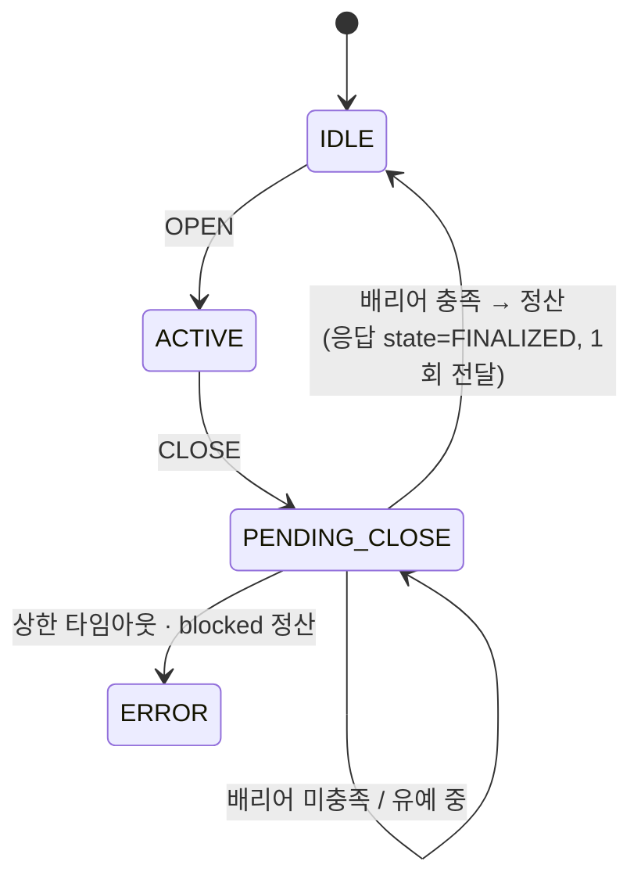

# `gateway/` — 문 세션 상태기계: 언제 확정할지 판단하고, 결제 페이로드를 만든다

> 계층 위치: 위로는 `service/`(ModelService 파사드)가 OPEN/CLOSE/폴링을 이 패키지로 넘기고, 아래로는 `ledger/`(배리어·정산기·이벤트 로그)와 `core/`(타입·프로파일·정책)에 의존 · 상태성: 상태기계
> 런타임 의존성: 없음(표준 라이브러리 — `logging`, `time`, `enum`, `dataclasses`)

---

## 1. 책임과 경계

이 패키지가 답하는 질문은 딱 하나다: **"지금 확정해도 되는가?"** 무엇을 몇 개 청구할지는
`judgment/`와 `ledger/`가 정하고, 여기서는 세션 수명주기(OPEN → 트리거들 → CLOSE →
확정/에러)와 **결제 경계**만 관리한다.

두 가지가 이 패키지에 모여 있다.

1. `MultiZoneGateway` — Multi-Zone OPEN/CLOSE 상태기계(D1). 인과 배리어(I17)가 충족되면
   `ledger/`의 `CloseSettler`를 호출해 확정하고, 만족되지 않은 채 상한 타임아웃이 지나면
   **에러 세션**으로 떨어뜨린다(D9 fail-closed).
2. `build_payment_payload()` — 확정 정산만 결제 wire 형식으로 변환하는 함수(I10). 잠정
   요약을 넘기면 `TypeError`로 거부한다.

**하지 않는 것**: HTTP 파싱·응답 조립(`adapters/http_app.py`) · 트리거 큐 관리와 추론
(`service/worker.py`, `service/pipeline.py`) · 금액 계산(`ledger/settler.py`) · 아카이브
저장(콜백으로 `service/` → `ledger/archive.py`에 위임).

---

## 2. 구성 파일

2파일 391행 — 이 저장소에서 가장 작은 도메인 패키지다.

| 파일 | 역할 | 핵심 진입점 |
|---|---|---|
| `state_machine.py` | 상태기계 + OPS 확정 로그 + 결제 페이로드 빌더 | `MultiZoneGateway.handle_open/handle_close/poll`, `build_payment_payload()`, `DoorState`, `GatewayResponse` |
| `__init__.py` | 공개 표면 (+ `core.policy.ErrorSessionPolicy` 재수출) | — |

---

## 3. 파일별 상세

### `state_machine.py`

#### 상태와 전이

| 상태 | 의미 | 다음 |
|---|---|---|
| `IDLE` | 활성 세션 없음 | OPEN → `ACTIVE` |
| `ACTIVE` | 문 열림 — 트리거 수집 중. 폴링에는 잠정 요약을 돌려준다 | CLOSE → `PENDING_CLOSE` |
| `PENDING_CLOSE` | 문 닫힘 — 인과 완결 대기 | 배리어 충족+유예 경과 → 확정 / 상한 타임아웃 → `ERROR` |
| `FINALIZED` | **응답에만 실리는 값** — 상태로 남지 않는다(아래 참조) | 즉시 `IDLE` |
| `ERROR` | 배리어 타임아웃 또는 blocked 정산 — 결제로 아무것도 나가지 않는다 | 다음 OPEN |

전체 제어 평면 그림과 배리어 조건의 설명은
[`../../docs/02-system-architecture.md`](../../docs/02-system-architecture.md) §5에 있다.

#### 현행 CRK-model과의 차이 — time-paced → causal barrier

레거시는 `PendingClose → Finalizing` 전이를 "20s/3s 경과"(time-paced)로 판단했다. 이
구조는 큐가 밀리면 늦게 도착한 트리거를 잃고(0원 확정 = 매출 누락), 큐가 비었을 때도 기다린다.
재설계에서는 전이 조건이 **인과 배리어 충족**(I17)이고, 고정 대기는 카메라 무응답 대비
**상한 타임아웃**으로 강등됐다. 효과: 큐 적체 시 late-trigger 유실 race 제거 + 큐가 비면 대기
없이 즉시 확정(지연 단축은 부수 효과다).

#### 확정 판단 (`poll()`)

`handle_close()`는 상태를 `PENDING_CLOSE`로 바꾸고 워터마크를 배리어에 심은 뒤 곧바로
`poll()`을 호출한다. 이후 CLOSE 재폴링은 모두 `poll()`로 들어온다.

| 상황 | 응답 |
|---|---|
| 배리어 충족 + (워터마크 없고 유예 창 안) | `PENDING_CLOSE`, detail `close_grace_pending` |
| 배리어 충족 + 유예 경과 | 정산 실행 → `FINALIZED`(정산 객체 실림) 또는 `ERROR`(blocked) |
| 배리어 미충족, 타임아웃 전 | `PENDING_CLOSE`, detail `barrier_pending:<사유 코드들>` |
| 배리어 미충족, 타임아웃 경과 | `ERROR`, payload `None`, detail `barrier_timeout:<사유 코드들>` |

**타임아웃이 두 개인 이유**: `queue_pending`(워커가 처리 중)은 유실이 아니라 **진행 중**이다.
Jetson의 디코드+추론은 `close_timeout_s`(10s)보다 길 수 있어, 큐에 in-flight가 있으면
훨씬 넉넉한 `worker_stall_timeout_s`(120s)를 쓰고 기준점도 마지막 처리 완료 시각으로
갱신한다(진행 = 살아있음). 이 상한까지 넘으면 워커 사망/행으로 보고 에러 세션이다.

**CLOSE 유예 창**(`close_grace_s`, 기본 3s): 배리어는 **"도착한" 트리거만** 셀 수 있다.
문 닫힘 시점에 카메라가 아직 AVI를 쓰고 있으면(실측: CLOSE 0.66s 후 `/trigger` 도착) 배리어가
자명하게 충족되어 0원 확정 + late trigger `rejected` = 매출 누락이 된다. 그래서 CLOSE·마지막
트리거 도착 시각 중 늦은 쪽을 기준으로 유예 동안 확정을 보류한다. **워터마크(카메라 seq 또는
엣지 `expected_triggers`)가 오면 인과 신호가 완결이므로 유예를 생략**한다 — 유예는 워터마크
부재 시의 heuristic 방어일 뿐이다.

**`expected_triggers` 수용**: `handle_close(expected_triggers={zone: n})`은 존별 기대 트리거
수를 배리어에 심는다(I17 ③'). 빈 dict는 "정보 없음"이라 워터마크로 취급하지 않고 유예를
적용한다(안전측). 기대한 트리거가 끝내 오지 않으면 `close_timeout_s`에서 에러 세션이다.

#### 확정 1회 전달 후 즉시 idle (실기 사고 대응)

`FINALIZED`는 **지속 상태가 아니다.** 확정 결과를 응답에 실어 보낸 바로 그 호출에서
`self.state = DoorState.IDLE`로 복귀하고(응답의 `state`만 `FINALIZED`), 이후 CLOSE 재폴링은
`IDLE` + payload `None`을 받는다. 실기에서 `complete`를 반복 응답하면 엣지(Edge_Environment)가
**device busy를 영구 유지**하는 것이 확인됐고, 엣지는 "활성 세션 없음" 응답으로 busy를
해제한다. `session_id`는 유지된다(late trigger 세션 귀속·사후 로그 추적용이며 다음 OPEN이 새
ID를 발급한다).

I11(이중 과금 불가)은 wire 응답을 반복하지 않는 것으로 보장하는 게 아니라 **정산기의 세션 키
멱등 캐시**가 보장한다 — 같은 세션을 다시 정산하면 항상 같은 객체가 나온다.

#### 배리어 공급과 아카이브 훅

| 메서드 | 하는 일 |
|---|---|
| `notify_enqueued(zone)` | 배리어 ① enqueued 카운트 + 유예 창 기준점(`_last_enqueue_ts`) 리셋 |
| `notify_processed(zone)` | 배리어 ① processed 카운트 + stall 판정 기준점(`_progress_ts`) 갱신 |
| `record_trigger(event)` | `EventLog.append()` — 확정 후 도착이면 `False`(거부, I11) |
| `interim()` | `ledger.interim_summary()` 위임 — 1층만 반영한 잠정 요약(I10) |
| `_notify_finalize()` | `on_finalize` 콜백을 FINALIZED/ERROR **최초** 전이 시 1회 호출 (세션 아카이브 훅) |

`_log_ops_close()`는 세션당 1회 `[OPS][CLOSE]` 로그를 남긴다. 존별 줄에 판정 근거
(`judgments=strategy:reason(conf=..)`)와 **채택되지 않은 톱 경쟁 후보**(`runner_up`)를 함께
찍는 것이 실기 피드백("현재 [OPS][CLOSE]는 별로 도움이 안 된다") 대응이다 — 오판정을 로그만
보고 즉시 의심할 수 있어야 한다.

#### `build_payment_payload()`

I10을 **타입으로 강제**하는 함수다. `FinalizedSettlement`가 아니면 `TypeError`,
`blocked` 정산이면 `ValueError`(I13)를 던진다.

wire 형식은 레거시 `multi_zone.py`의 finalize 응답과 동형이다 — `success`/`status="success"`와
**평탄화된 `products` 배열**("Node.js 하위 호환")을 포함한다. 근거: 추론·정산이 정상인데 Node가
"결제할 내역이 없습니다"를 표시한 사고가 있었다. 구버전은 `status="complete"`에 zones 내부
`product_id`/`unit_price`만 보내 Node가 결제 항목을 찾지 못했다.

| 필드 | 의미 |
|---|---|
| `productIdx` | Node IF11 문자열 ID (우리 `ActiveProduct.product_id`) |
| `productId` | YOLO class id (하위 호환 — unmapped면 -1) |
| `confidence` | 해당 zone에서 실제 상품 결론이 난 `COMPLETE`/`PARTIAL` 판정 confidence의 산술평균. 같은 zone 상품에는 같은 값이 들어간다 |
| `status` | 상품이 있으면 `success`, 0상품 정상 확정이면 `complete_no_products` |

---

## 4. 계약과 불변식

| ID | 계약 | 지키는 지점 |
|---|---|---|
| I10 | 결제 입력은 `FinalizedSettlement`만 — 잠정 요약은 타입으로 거부 | `build_payment_payload()`의 `isinstance` 검사, `interim()`의 반환 타입 |
| I11 | 확정 후 재폴링은 항상 같은 정산 객체, 확정 후 도착 이벤트는 거부 | `CloseSettler`의 멱등 캐시(`_settle()` 경유), `record_trigger()` 반환값 |
| I13 | blocked 정산은 결제 불가, 에러 세션은 무성 확정 금지 | `poll()`이 `blocked`를 `ERROR`로 전이, 빌더가 `ValueError` |
| I17 | 확정 조건은 시간이 아니라 인과 완결 | `barrier.status().satisfied`가 유일한 정상 확정 조건 |
| D9 | 상한 타임아웃 만료는 **부분 확정이 아니라 에러** | `barrier_timeout` 분기 — payload `None` |

추가 계약:

- **아카이브 훅은 정확히 1회.** FINALIZED/ERROR **최초** 전이에서만 `on_finalize`가 불린다.
  재폴링이 반복 저장을 유발하지 않는 것이 `ledger/archive.py`의 "세션당 1회" 전제다.
- **콜백 예외 안전은 호출측 책임.** 게이트웨이는 콜백이 `None`인 경우만 방어한다(전이는 이미
  끝난 뒤라 서비스 경로에 영향이 없다).
- **새 OPEN은 배리어를 새로 만든다.** 이전 세션의 미해소 카운트가 다음 세션을 막지 않는다.

---

## 5. 설정

게이트웨이 생성자 인자는 전부 `service/model_service.py`가 `core/config.Settings`에서
주입한다.

| 환경변수 | 기본값 | 영향 |
|---|---|---|
| `MODEL__CLOSE__BARRIER_TIMEOUT_S` | `10.0` | 배리어 상한 타임아웃(정상 경로가 아님) — 만료 시 에러 세션 |
| `MODEL__CLOSE__GRACE_S` | `3.0` | CLOSE 유예 창. `0`이면 비활성. 워터마크가 오면 무시된다 |
| `MODEL__CLOSE__WORKER_STALL_TIMEOUT_S` | `120.0` | `queue_pending` 전용 상한(처리 지연 ≠ 유실). `close_timeout_s` 미만 값을 줘도 그 값으로 하한 보정된다 |
| `MODEL__SESSION__ERROR_POLICY` | `block_payment` | `ledger/`의 정산 결과 `blocked` 여부를 통해 간접 작용(I13) |
| `MODEL__MACHINE__CABINET_TYPE` | `refrigerated` | `default_profile` — 잠정 집계 tolerance를 판정·정산과 같은 값으로 유지 |

---

## 6. 테스트

| 테스트 파일 | 무엇을 고정하는가 |
|---|---|
| `tests/test_gateway.py` (15건) | **배리어 구동 확정** — 큐가 비면 즉시 확정, 큐 미정합 중에는 시간이 지나도 확정 금지, late trigger 처리 완료 후 정상 확정(매출 유실 없음), Jetson 추론이 `close_timeout`을 넘겨도(30s) 살아남고 stall 상한(120s)에서만 에러, seq 워터마크가 도착 전까지 보류. **결제 계약** — ACTIVE 잠정치는 `TypeError`, 확정 결과는 정산기 캐시와 동일 객체(I11), **확정 1회 전달 후 즉시 IDLE**(600s 재폴링에도 반복 없음, 새 OPEN은 정상 시작), 새 세션이 배리어를 리셋. **유예 창** — 트리거 0건 CLOSE는 유예 대기, 유예 내 late trigger 수용 후 도착 기준 재대기, 유예 경과·late 없음이면 0상품 확정, 워터마크는 유예를 생략. **엣지 워터마크** — `expected_triggers` 도착까지 보류 후 유예 없이 즉시 확정, 빈 dict는 워터마크로 인정하지 않음(유예 적용), 기대 트리거 미도착은 `close_timeout`에서 fail-closed 에러 |
| `tests/test_ledger.py` (28건 중 I10 경로) | `interim_summary()` 결과가 `build_payment_payload()`에서 `TypeError`, blocked 정산이 `ValueError`로 거부되는지 |
| `tests/test_lifecycle.py` (33건 중 세션 경로) | 새 OPEN마다 원장 prune 후에도 직전 세션 CLOSE 재폴링이 같은 금액을 내는지(I11), 동시 폴링·워커 drain 락 스모크 |
| `tests/test_session_archive.py` (18건 중 훅 경로) | FINALIZED/ERROR 최초 전이에서만 아카이브가 저장되는지(재폴링 3회에도 1파일) |

---

## 7. 수정 시 주의

1. **`FINALIZED`를 지속 상태로 되돌리지 말 것.** 실기에서 엣지 device busy가 영구 유지된
   사고의 직접 원인이다. 확정 결과는 1회 전달, 상태는 즉시 `IDLE`.
2. **정상 확정 조건은 배리어뿐이다.** "시간이 지나서 확정"은 매출 누락 또는 이중 과금의
   경로이므로, 타임아웃 분기에서 부분 확정을 만들지 말 것(payload `None` 유지).
3. **유예 창은 워터마크의 대체물이지 추가물이 아니다.** `expected_triggers`나 seq 워터마크가
   있으면 유예를 건너뛰는 현재 동작을 유지해야 확정 지연이 다시 늘지 않는다.
4. **`queue_pending`과 다른 pending을 같은 타임아웃으로 묶지 말 것.** 처리 지연(정상)과
   유실(사고)을 구분하는 것이 두 타임아웃의 존재 이유다.
5. **결제 wire 형식은 Node와의 계약이다.** 평탄화된 `products` 배열과 `productIdx`/`productId`
   의미를 바꾸면 결제 화면이 조용히 빈 내역이 된다. 형식 변경은 Node 합의가 선행돼야 한다.
6. **`poll()`에 부작용을 더할 때는 멱등성을 확인할 것.** 재폴링은 정상 트래픽이고, 확정
   1회성은 `_notify_finalize` 호출 지점(최초 전이)과 정산기 캐시에만 의존한다.
7. **`docs/02` 상태도와의 표기 차이 주의.** 문서 다이어그램은 `Finalized → Finalized(재폴링)`
   로 개념을 표현하지만, 구현은 확정 응답 직후 `IDLE`로 복귀한다(§3 참조). 멱등성의 실제
   보증자는 정산기 캐시다.

관련 문서: [`../../docs/02-system-architecture.md`](../../docs/02-system-architecture.md)(제어 평면·배리어 조건) · [`../../docs/05-operations.md`](../../docs/05-operations.md)(`[OPS][CLOSE]` 로그 읽기) · 형제 패키지 [`../ledger/README.md`](../ledger/README.md)(배리어·정산기 구현) · [`../service/README.md`](../service/README.md)(워커·파사드 배선) · [`../core/README.md`](../core/README.md)(타입·정책)
