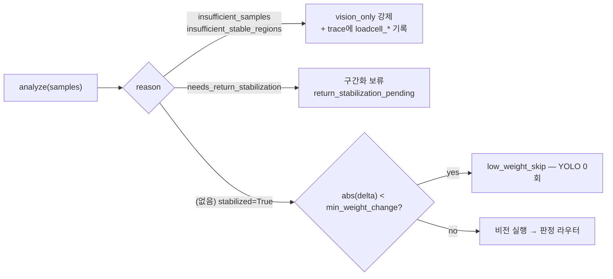

# `ingest/` — 로드셀 시계열의 무게 이벤트 정규화 + 트리거 멱등성

> 계층 위치: `core/`만 의존하고, `service/pipeline.py`가 호출한다. 판정(`judgment/`)·
> 정산(`ledger/`)은 ingest의 출력만 보고 원시 샘플을 다시 보지 않는다 · 상태성: 분석기는
> 무상태(입력 시퀀스 → 출력 값), `IdempotencyRegistry`만 TTL 캐시를 갖는다
> 런타임 의존성: 없음(표준 라이브러리 `math` / `hashlib` / `time`)

---

## 1. 책임과 경계

이 계층의 질문은 하나다: **"이 트리거에서 존의 무게가 얼마나, 어떤 순서로 변했는가?"**
"무엇이 몇 개 빠졌는가"는 묻지 않는다.

| 하는 일 | 산출물 |
|---|---|
| 존 시계열(다채널) → 안정 구간 검출 → `delta_weight` | `LoadcellAnalysis.delta_weight` |
| 변화의 시간 구조 보존 → 구간화 | `segments: tuple[WeightSegment, ...]` |
| 트레이(물리 채널) 단위 이벤트 분해 | `events: tuple[ChannelWeightEvent, ...]` |
| 로드셀 판독을 신뢰할 수 없는 상태를 **사유 문자열로** 보고 | `reason`, `stabilized` |
| 동일 트리거 중복 접수 드롭 (I7) | `RegisterResult(duplicate=True, ...)` |

이 계층이 **하지 않는** 일:

| 하지 않는 일 | 실제 담당 |
|---|---|
| 상품 매칭·개수 결정 | `judgment/` (라우터 + 전략) |
| 저무게 스킵·vision-only 전환 결정 | `service/pipeline.py` — ingest는 사유만 알려준다 |
| 반품 안정화 **재수집** | 장치측 훅. ingest는 "지금은 구간화할 수 없다"고 보류만 한다 (QA Q3 ①) |
| 필터링·EMA·영점 보정 | 엣지(CRK-IO-BOARD). 모델은 5g 양자화된 값을 그대로 받는다 |
| 임계값 소유 | `core/profiles.py`(`min_weight_change_grams`, `segment_step_grams`) |

## 2. 구성 파일

| 파일 | 역할 | 핵심 진입점 |
|---|---|---|
| `loadcell.py` (222행) | plateau 기반 구간화 분석기 + 공용 데이터 타입 | `LoadcellAnalyzer.analyze()`, `LoadcellSample`, `LoadcellAnalysis`, `ChannelWeightEvent` |
| `bocpd.py` (238행) | 베이지안 온라인 변화점 검출(현행 primary) + 계약 동형 어댑터 | `BocpdAnalyzer.analyze()`, `BocpdLoadcellAnalyzer.analyze()` |
| `idempotency.py` (35행) | 트리거 중복 드롭 (I7) | `IdempotencyRegistry.key_for()`, `.register()` |
| `__init__.py` (17행) | plateau 경로·멱등성 재수출 | `from crk_model.ingest import ...` |

`__init__.py`은 BOCPD를 재수출하지 않는다 — primary로 승격된 뒤에도 `__all__`이 갱신되지
않아, 소비자(`service/model_service.py`)는 `from crk_model.ingest.bocpd import BocpdLoadcellAnalyzer`로
직접 가져온다.

## 3. 파일별 상세

### `loadcell.py`

**왜 ingest에 있는가 (D4)**: 구간화는 "판단"처럼 보이지만 실제로는 **입력 정규화**다.
판정 엔진이 원시 샘플 배열을 직접 받으면, 판정 로직 안에 노이즈·드리프트·캐던스 지식이
스며들어 두 관심사가 영구히 엉킨다. 경계를 여기 그어서 `judgment/`는 "부호 있는 delta와
구간 목록"이라는 깨끗한 입력만 본다.

**순서 고정 (QA Q3 ①)**: 반품(`delta > 0`)은 **stabilization이 끝난 뒤에만** 구간화한다.
마지막 안정 구간의 지속이 `stabilization_wait_s`(1.0s) 미만이면 `segments=()`,
`stabilized=False`, `reason="needs_return_stabilization"`으로 반환한다. delta 값 자체는
실어 보낸다 — 판정은 delta를 쓰고, 구간화만 보류하는 것이 구 계약이다.

**드리프트 대응 (QA Q3 ②)**: delta와 segment는 절대값이 아니라 **안정 plateau의 평균
차이**로만 계산한다. 그래서 냉동 컴프레서 사이클의 느린 영점 드리프트는 plateau 평균에
흡수된다(사실상 매 트리거 재영점). 남는 가짜 스텝은 `segment_step_grams`(냉동 20g)가 자른다.

**물리 채널 합산 계약**: 존의 로드셀 채널은 평균이 아니라 **합산**해 존 총량으로 쓴다
(다이어그램 11). 다만 `analyze()`는 곧바로 합산하지 않는다 — 하드웨어 실측(2026-07)에서
존의 두 로드셀은 각자 트레이로 하중이 분리되고 **채널 간 크로스토크 < 5g(1 양자화 스텝)**임이
확인됐다. 합산부터 하면 ① 조용한 트레이의 노이즈가 delta에 섞이고 ② 두 트레이 동시 취출이
한 덩어리로 뭉개진다. 그래서 채널별로 분석한 뒤 게이트를 통과한 채널만 존 delta에
기여시킨다.

`ChannelWeightEvent`(트레이별 이벤트)의 의미: 트레이 분리 구조에서 상품 이벤트는 항상 단일
채널에 온전히 실리므로, `delta_grams`는 **단품(또는 동일 상품 n개)의 무게 그 자체**다.
이벤트가 2개 이상이면 파이프라인이 이벤트별로 판정 라우터를 돌려 단품 매칭으로 분해한다(2단계 판정).

채널 분류와 존 확정 규칙:

| 채널 상태 | 판정 | 존에 대한 영향 |
|---|---|---|
| plateau ≥ 2, 안정 완료, `\|delta\| ≥ min_weight_change` | `settled` + 게이트 통과 | delta·segments·event 기여 |
| plateau ≥ 2, 안정 완료, 게이트 미달 | `settled`, 게이트 탈락 | delta에 합산만(파이프라인의 `below_min_weight_change` 스킵이 판단) |
| 반품 안정화 미완 | `pending` | **존 전체 보류** — delta는 실어 보내고 segments는 비움 |
| 전 구간 평탄(plateau 1개, std ≤ 임계) | 무이벤트 트레이 | baseline에만 기여 — 존 확정을 막지 않는다 |
| 움직였으나 안정 실패(램프 등) | 확정 불가 | **존 delta 확정 불가** (fail-closed) |

`analyze()` 반환의 `reason` 문자열은 파이프라인 분기의 인터페이스다:

시간 의미(IO-BOARD 2.0.3 이후 샘플링 **0.8s** 기준):

- `stable_window=3` → plateau 성립에 연속 2.4s 안정 필요. 구 기본값 5는 0.1s 샘플링 시절
  값으로, 0.8s에서는 4s가 되어 과도하다.
- `stability_threshold_grams=2.5` → 5g 양자화 와이어에서 bin 경계 토글 1회가 섞인
  창(std ≈ 2.36)까지 안정으로 허용한다. 2.0이면 경계에 걸린 참값이 영영 plateau를 못 만든다.
- `_stable_plateaus`는 안정 창의 **끝 인덱스만** 마킹한다. 창 전체를 마킹하면 계단 경계에서
  인접 plateau가 하나로 병합돼 구간이 소실된다.

### `bocpd.py`

Adams & MacKay 2007(arXiv:0710.3742)의 **run-length 사후분포 재귀**를 이 도메인 크기에 맞게
축소 구현한 것이다.

**왜 plateau를 대체했는가.** plateau 휴리스틱은 "3연속 샘플 std ≤ 2.5g"라는 경성 연속 창을
요구하는데, 0.8s 캐던스에서 이 조건이 구조적으로 성립하지 않는 경우가 실기에 있었다.

| 실패 패턴 | 무슨 일이 일어났나 | 결과 |
|---|---|---|
| post-roll 4s = 5샘플 (이슈 #14) | 마지막 안정 구간에 마진이 1샘플뿐, creep이 끼면 창이 안 만들어짐 | `insufficient_stable_regions` → 무음 0원 |
| 1.6초 간격 연속 취출 (이슈 #16 로그 3) | 중간 플래토가 2샘플뿐 → 안정 판정 불가 | ch0 delta 뭉개짐 → 오과금 연쇄의 출발점 |

BOCPD는 연속성 요건 없이 "현재 run이 새 레벨일 확률"과 레벨 추정을 동시에 얻으므로 두 패턴
모두 읽어낸다. 바뀌는 것은 **"안정 구간"의 정의뿐**이고, 그 밖의 계약은 전부 plateau와 동형이다.

모델 파라미터:

| 파라미터 | 기본값 | 의미 |
|---|---|---|
| `sigma` (σ) | 2.5g | 관측 노이즈 고정 가우시안 — 5g 양자화 경계 토글 허용값. `MODEL__WEIGHT__STABILITY_THRESHOLD_GRAMS`가 주입된다 |
| `hazard` (H) | 0.1 | 상수 hazard ≈ 평균 run 10샘플 = 8s |
| `prior_kappa` (κ₀) | 0.01 | run별 평균의 켤레 정규 사전 — 모호 사전이라 새 레벨이 어디로 튀어도 changepoint 가설이 유효 |
| `max_run` | 128 | 메시지 절단(계산 상한) |

구현 요점:

- `_map_run_lengths` — 샘플마다 메시지 `(log가중, 사후 μ, 사후 κ)`를 갱신한다.
  예측분포 `N(x; μ, σ²(1+1/κ))`, 성장 항에 `log(1−H)`, changepoint 항에 `log H`,
  매 스텝 정규화(수치 안정) 후 MAP run length를 기록한다.
- `_segments` — MAP run length에서 구간을 역방향 재구성한다. 경계 부기: changepoint
  메시지(r=0)는 점프 샘플 **도착 전** 단계에서 생성되고 점프 샘플부터 흡수하므로, 시각 t·run r의
  구간은 `(t−r+1 .. t)`다. 재구성 후 레벨 차 ≤ 2σ인 인접 구간은 병합한다 — 경계 1샘플
  파편이 첫/끝 플래토의 n을 깎아 `delta_std`를 부풀리는 것을 막는다.
- `delta_std = σ·√(1/n_first + 1/n_last)` — 판독의 불확실도를 값으로 함께 낸다.
- 계산 비용: 순수 파이썬 `O(n · max_run)`. 트리거당 샘플 20~70개라 무시 가능하다.

**primary 승격 (2026-07-23)** — 승격 절차 자체가 이 레포의 관행이다. shadow로 병행 기록하며
아카이브 실측을 모으고, 정오가 우세할 때만 기본값을 바꾼다.

| 단계 | 실측 |
|---|---|
| shadow 병행 | 63관측 / mismatch 2 |
| 승격 후 회귀 감시 | 10차 17건 mismatch 0 |
| 결정적 사례 | 5차 ses-2: 동시+빠른 취출에서 plateau는 `insufficient_stable_regions`(delta 0, 0원 누락), BOCPD는 −297.5±2.6으로 채널 분해까지 정확 |

shadow 병행 기록 장치는 승격 확정과 함께 2026-07-24 삭제됐다(회귀 감시는 아카이브 delta
정오로 직접 한다). 롤백 스위치는 남아 있다: **`MODEL__LOADCELL__ANALYZER=plateau`**.
냉장 로드셀 환경에서 BOCPD는 아직 미검증이라 killswitch로서 가치가 있다.

`BocpdLoadcellAnalyzer`는 `LoadcellAnalyzer`와 계약 동형이다 — `reason` 문자열, 채널
`min_weight_change` 게이트, `segment_step` 임계, 반품 안정화 대기(QA Q3 ①), 채널 이벤트
분해까지 같은 의미론을 유지한다. `analyzer_factory`로 주입되므로 파이프라인 코드에는 분기가 없다.

### `idempotency.py`

카메라가 같은 트리거를 재전송하거나 네트워크 재시도가 겹치면 같은 취출이 두 번 판정되고
두 번 청구된다. 방어는 단순하다.

| 요소 | 구현 |
|---|---|
| 키 | `MD5("{zone}|" + "|".join(f"{cam}:{path}" for sorted(video_paths)))` — 존 + 정렬된 비디오 경로 |
| TTL | 5.0s (`MODEL__TRIGGER__IDEMPOTENCY_TTL_S`) |
| 만료 처리 | `register()` 호출 시 만료 항목을 훑어 삭제 (별도 스레드 없음) |
| 시계 | 주입 가능(`clock=time.monotonic` 기본) — 테스트가 가짜 시계로 TTL 경계를 고정 |
| 중복 응답 | `RegisterResult(duplicate=True, session_id=<기존 값>)` → 서비스가 `{"status": "duplicate"}` 반환 |

호출 측 계약 두 가지를 알아 둘 것:

- `video_paths`가 없는 트리거는 `{"_ts": str(ts)}`로 대체해 키를 만든다 — 경로가 없으면
  타임스탬프가 동일성 기준이다.
- `RegisterResult.session_id` 필드는 이름과 달리 `service/model_service.py`에서 **trigger_id**를
  담아 쓴다(중복 응답의 `trigger_id`). 필드명이 낡았을 뿐 동작은 의도된 것이다.

## 4. 계약과 불변식

| # | 내용 | 강제 지점 |
|---|---|---|
| I7 | 트리거 멱등성 (MD5 키, TTL 5s) | `IdempotencyRegistry.register()` |
| D4 | 구간화는 판단 엔진이 아니라 ingest 소속 | 패키지 경계 자체 |
| QA Q3 ① | 반품 +delta는 stabilization 완료 후에만 구간화 | 두 분석기 모두 `needs_return_stabilization` |
| QA Q3 ② | delta/segment는 절대값 아닌 plateau 평균 차이 | `_analyze_series`, `_segments` |
| — | 존 총량은 채널 **합산** (평균 금지) | `LoadcellSample.total`, 채널 delta 합 |
| — | `delta_grams` 부호 유지 (취출 −, 반품 +) | `WeightSegment`, `ChannelWeightEvent` |
| — | 임계는 프로파일 소속 (냉장 5g / 냉동 20g 스텝) | `SensorProfile.segment_step_grams` |
| — | 분석기 교체가 파이프라인 계약을 바꾸지 않는다 | `LoadcellAnalysis` 반환 동형 (`name` 식별자 포함) |
| — | 로드셀이 트리거를 냈는데 변화가 안 보이면 판독을 신뢰하지 않는다 | 전 채널 평탄 → `insufficient_stable_regions` → vision-only (보수적 방향) |

## 5. 설정

| 환경변수 | 기본값 | 영향 |
|---|---|---|
| `MODEL__LOADCELL__ANALYZER` | `bocpd` | primary 분석기 선택. `plateau`는 롤백 스위치. 오타 시 기동 거부 |
| `MODEL__WEIGHT__STABILITY_THRESHOLD_GRAMS` | `2.5` | plateau: 안정 창 std 상한 / BOCPD: 관측 노이즈 σ (**같은 값이 두 의미로 쓰인다**) |
| `MODEL__WEIGHT__STABLE_WINDOW` | `3` | plateau 전용 — 안정 창 길이. **BOCPD primary에서는 무시된다** |
| `MODEL__TRIGGER__IDEMPOTENCY_TTL_S` | `5.0` | 멱등 캐시 TTL (I7) |

env가 없는 상수(코드 고정): `stabilization_wait_s=1.0`, BOCPD `hazard=0.1`,
`prior_kappa=0.01`, `max_run=128`. 프로파일 소속 임계(`min_weight_change_grams`,
`segment_step_grams`)는 [`core/README`](../core/README.md) §3 참조.
전체 카탈로그는 [04. 설정 레퍼런스](../../docs/04-configuration.md).

## 6. 테스트

`tests/test_ingest.py` — 18건.

| 테스트 클래스 | 무엇을 고정하는가 |
|---|---|
| `TestIdempotency` (2) | TTL 내 중복은 **기존 ID를 반환**하며 드롭, TTL 경과 후에는 신규 접수 (I7) |
| `TestLoadcellAnalyzer` (4) | 다단 취출의 delta·세그먼트 2개 분해, 반품 미안정 시 구간화 보류/안정 후 재개(QA Q3 ①), 느린 드리프트(±1g)가 가짜 세그먼트를 만들지 않음(QA Q3 ②) |
| `TestPerChannelAnalysis` (4) | 두 트레이 동시 취출이 단품 delta 2개로 분리(−100/−224), 조용한 트레이의 4g 변동이 존 delta를 오염시키지 않음, 무이벤트 평탄 트레이는 존 확정을 막지 않고 baseline만 합산, 램프 이웃은 존 확정을 차단 |
| `TestBocpdShadow` (4) | 깨끗한 계단 delta·`delta_std`, **2샘플 플래토(plateau 실패 패턴)에서 −620 판독**, 두 채널 독립 변화 시점 분해, 1샘플 입력의 `insufficient_samples` |
| `TestBocpdPrimaryAdapter` (4) | plateau가 실패하는 creep 시계열에서 BOCPD는 `stabilized=True`+delta(전제로 plateau 실패를 함께 단언), 반품 대기 계약 동형, 전 구간 평탄의 vision-only 계약, 멀티트레이 채널 이벤트 2개 |

교차 검증: `tests/test_lifecycle.py::TestCabinetTypeDefaultProfile` —
`test_bocpd_default_primary_and_plateau_rollback`(기본이 bocpd이고 plateau 롤백도 동일 판정),
`test_invalid_loadcell_analyzer_env_rejected`(오타 → `ValueError`).

## 7. 수정 시 주의

- **`reason` 문자열은 공개 계약이다.** `service/pipeline.py`가 `insufficient_samples` /
  `insufficient_stable_regions`를 vision-only 강제 집합으로, `needs_return_stabilization`을
  구간화 보류로 분기한다. 새 사유를 추가하면 그 집합을 반드시 함께 갱신해야 한다 —
  누락되면 새 사유는 "정상 판독"으로 취급된다.
- **`_stable_plateaus`의 "끝 인덱스만 마킹"을 되돌리지 말 것.** 창 전체 마킹은 계단 경계에서
  인접 plateau를 병합해 세그먼트를 소실시킨다.
- **BOCPD의 2σ 인접 구간 병합을 제거하지 말 것.** 경계 1샘플 파편이 첫/끝 구간의 n을 깎아
  `delta_std`가 부풀고, 그 값을 소비하는 쪽의 신뢰 구간이 왜곡된다.
- **"움직였는데 안정 실패 → 존 확정 불가"를 완화하지 말 것.** 이 fail-closed 방향이
  이웃 트레이 노이즈가 delta에 새어 들어오는 것을 막는다(합산 방식에서 −170이 −166으로
  샜던 사례가 회귀 테스트로 남아 있다).
- **캐던스 가정이 상수에 박혀 있다.** `stable_window=3`(=2.4s), `hazard=0.1`(≈8s)은 0.8s
  샘플링 기준이다. IO-BOARD 샘플링이 바뀌면 두 값을 재산정해야 한다 — 과거 0.1s → 0.8s
  전환에서 정확히 이 문제로 무음 0원이 발생했다.
- **채널 수 가정을 넣지 말 것.** `analyze()`는 `n_ch <= 1`이면 단일 시계열 경로로 빠지고
  그 외에는 채널 수에 무관하게 동작한다. 존당 2채널은 현재 하드웨어 사실일 뿐 계약이 아니다.
- **`bocpd.py`의 `BocpdLoadcellAnalyzer` docstring이 낡았다** — "기본 plateau"라고 적혀
  있으나 현행 기본은 `bocpd`다(모듈 최상단 docstring이 정본).
- BOCPD 도입 시 함께 만들었던 shadow 병행 기록 장치·무게 우도 shadow는 폐기됐다.
  같은 접근을 재시도하기 전에 [07. 배제·폐기 결정 기록](../../docs/07-rejected-and-retired.md)을 볼 것.

관련 문서: [02. 시스템 아키텍처](../../docs/02-system-architecture.md) ·
[03. 판정과 정산](../../docs/03-judgment-and-settlement.md) ·
[05. 운영·진단 가이드](../../docs/05-operations.md) ·
형제 패키지 [`core/`](../core/README.md), [`frames/`](../frames/README.md),
[`judgment/`](../judgment/README.md), [`service/`](../service/README.md)
