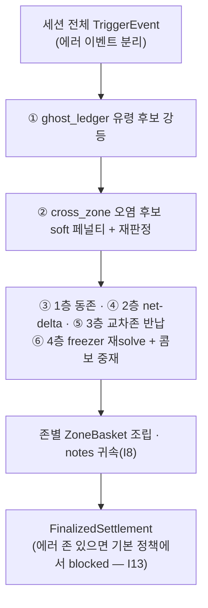

# `ledger/` — 이벤트 소싱 원장: 트리거를 불변 이벤트로 쌓고, 문 닫힘에 한 번에 정산한다

> 계층 위치: 위로는 `service/`(조립·워커)와 `gateway/`(확정 시점 지시)가 호출하고, 아래로는 `core/`(타입·프로파일·정책)와 `judgment/`(CLOSE 2차 패스의 재판정 라우터)만 의존 · 상태성: 영속
> 런타임 의존성: 없음(표준 라이브러리). 예외로 `archive.py`만 저장·읽기 시점에 PyYAML을 lazy import하고, 없으면 JSON으로 폴백한다.

---

## 1. 책임과 경계

판정(`judgment/`)은 트리거 1건 안에서만 보고, 이 패키지는 **세션 전체를 보고 금액을
확정**한다. **이벤트 소싱(D5)**: 트리거 처리 결과는 집계 상태를 갱신하지 않고 `EventLog`에
불변 `TriggerEvent`로 append될 뿐이며, 금액은 CLOSE 시점의 `CloseSettler.settle()` 한
지점에서만 만들어진다.

### 왜 증분 확정이 아니라 close 일괄인가

트리거 단위로 확정하면 되돌릴 수 없는 것들이 생긴다.

| 상황 | 트리거 단위 확정이 실패하는 이유 |
|---|---|
| 반품(같은 존 되돌림) | `+무게` 이벤트 시점에는 어느 청구를 상쇄할지 결정할 근거(그 존의 전체 장바구니)가 아직 완결되지 않았다 |
| 존 착오 반납 | zone1에서 꺼내 zone2에 넣는 반납은 **두 존의 이벤트를 같이 봐야** 매칭된다. 존별 증분 확정은 원리적으로 볼 수 없다 |
| 냉동 net 재해석 | 냉동은 무게가 정체성 판별자가 아니다. 개수는 세션 net delta(`-net / unit_weight`)로만 확정할 수 있고, 트리거별 부분 delta로는 잘못된 개수가 굳는다 |

CLOSE 2차 패스(교차존 페널티·고스트 원장)도 마찬가지다 — 둘 다 **다른 트리거를 봐야 판단이 되는**
기제라 온라인 처리가 불가능하다. **하지 않는 것**: 판정(정체성·개수는 `judgment/` 소관, 여기서는 보존된 후보로 라우터를
재호출만 한다) · 상태 전이 판단(언제 정산할지는 `gateway/`, 여기서는 배리어의 사실 수집기만
제공) · HTTP·페이로드 협상(`adapters/`·`gateway/`).

---

## 2. 구성 파일

8파일 2,136행 — 이 저장소에서 가장 큰 패키지다.

| 파일 | 역할 | 핵심 진입점 |
|---|---|---|
| `events.py` | 불변 트리거 이벤트, 세션별 로그, 확정 후 유입 거부(I11) | `TriggerEvent`, `EventLog.append/events_for/mark_finalized/prune` |
| `barrier.py` | 인과 배리어(I17) — 인과 완결 사실의 수집 | `CausalBarrier.status()`, `BarrierStatus` |
| `settler.py` | close-time 단일 글로벌 정산기 (681행, 이 패키지의 심장) | `CloseSettler.settle()`, `interim_summary()` |
| `cross_zone.py` | 교차존 비전 오염 soft 페널티 (CLOSE 2차 패스, 기본 ON) | `apply_cross_zone_penalty()`, `CrossZonePenaltyConfig` |
| `ghost_ledger.py` | 세션 고스트 원장 — 옷 프린트 유령 표 강등 (기본 shadow) | `detect_ghosts()`, `apply_ghost_demotion()`, `GhostLedgerConfig` |
| `journal.py` | append-only JSONL + 일자 로테이션, replay(G2.5 훅) | `EventJournal.append/replay`, `event_to_dict/from_dict` |
| `archive.py` | 세션 YAML 아카이브 — 오판정 사후 분석의 정본 | `SessionArchive.save/find/latest/annotate_ground_truth` |
| `__init__.py` | 공개 표면 (배리어·정산기·설정 dataclass·저널·이벤트) | — |

①②는 `active_products_provider`(세션 재고 스냅샷)가 주입돼 있어야 동작한다. 없으면 조용히
건너뛰고 ③~⑥만 수행한다(직접 생성 하위호환).

---

## 3. 파일별 상세

### `events.py`

`TriggerEvent`는 `frozen=True` dataclass다 — 만들어지면 아무도 못 고친다. 필드가 hashable해야
하므로 dict가 아니라 튜플로 보관한다(`video_paths`는 `(camera, path)` 튜플).

| 필드 | 의미 |
|---|---|
| `session_id`/`zone`/`ts` | 세션 귀속·존·발생 시각 |
| `delta_weight` / `segments` | 존 무게 변화(음수=취출, 양수=반품) / 로드셀 구간화 결과 |
| `judgment` / `seq` | 트리거 시점의 잠정 판정 / 카메라 시퀀스(선택 — 없어도 동작, D2) |
| `status` | `"ok"` \| `"error"` — 처리 실패는 무검출이 아니라 에러로 전파(I1) |
| `vision_candidates` | **채택되지 않은 후보까지 전부** — 사후 분석과 CLOSE 재판정의 재료 |
| `video_paths` | 판별에 쓰인 AVI 경로 — 오판정 시 즉시 영상을 찾기 위한 것 |
| `change_timestamps` | 에피소드 내 서브이벤트 벽시계 앵커 |

`change_timestamps`는 교차존 오염 판정의 앵커다. 에피소드는 연장 병합될 수 있어(한 파일에
여러 change) `ts` 하나로는 오염 창을 복원할 수 없다. IO-BOARD 단일 클럭(F7)이라 존 간
비교가 성립한다. 구버전 카메라는 빈 튜플이고 그때는 `segments.start_ts` → `ts`로 폴백한다.

`EventLog`는 세션별 이벤트 + 확정 마커 + `rejected` 리스트다. 확정된 세션에 늦게 도착한
이벤트는 **버리지 않고 `rejected`에 기록**하고 `False`를 반환한다(I11 지원 — 유실을 조용히
넘기면 매출 누락 원인을 알 수 없다). `prune(keep_session_ids)`는 24h+ soak 무한 성장 방지용
순수 교집합이고, "몇 개를 남길지"의 정책은 호출측에 있다.

### `barrier.py`

**핵심 사고 전환**: 확정 조건은 "시간이 지나서"가 아니라 **"인과적으로 완결되어서"**다(I17).

| # | 조건 | 공급자 | 미충족 pending 코드 |
|---|---|---|---|
| ① | 존별 `enqueued == processed` (큐 정합) | `service/worker.py` submit/drain | `zoneN:queue_pending(k)` |
| ② | 로드셀 안정 — 명시적으로 불안정 보고된 존만 차단 | `set_loadcell_stable()` (§7-6 주의) | `zoneN:loadcell_unstable` |
| ③ | 카메라 seq 워터마크 이전 트리거 전원 도착 (선택, D2) | `set_close_watermark()`+`note_seq()` | `zoneN:seq_gap(last=..,watermark=..)` |
| ③' | 엣지 워터마크 — CLOSE payload의 존별 기대 트리거 수 도착 | `set_expected_counts()` | `zoneN:awaiting_triggers(arrived=..,expected=..)` |

`status()`가 반환하는 `pending`은 사람이 아니라 **기계가 읽는 사유 코드 튜플**이다(I8) — 게이트웨이가
그대로 응답 detail과 `barrier_timeout:` 사유에 실어 보낸다. ③'는 카메라 펌웨어(seq)를 기다리지 않고
인과 신호를 완결시키는 대안 경로로, 녹화 디렉토리 소유자인 Node가 close 시점에 존별 녹화 수를 센다.

**고정 debounce의 강등**: 레거시는 문 닫힘 후 고정 시간(3s/1s)을 기다렸고 두 방향으로 틀렸다 — 큐가
밀리면 처리 중인 트리거를 놓치고(late-trigger 유실 = 0원 확정), 큐가 비었을 때도 기다렸다. 인과
배리어에서 고정 대기는 **상한 타임아웃**으로만 남았다(`gateway/` 소관). 효과: 적체 시 유실 제거 +
큐가 비면 대기 0초.

### `settler.py`

원래 별개였던 "반품 복구 3계층"과 "freezer close resolver"를 한 정산기로 통합했고, 3계층은
독립 단계가 아니라 **내부 매칭 우선순위**로 강등됐다: 동존 즉시 > net-delta > 교차존.

| 층 | 함수 | 규칙 | note |
|---|---|---|---|
| 1층 동존 즉시 | `pass_same_zone()` | 시간순 순회. `delta<0`은 판정 품목 누적, `delta>0`은 같은 존 장바구니에서 무게 매칭(단품 → 2품 합) 차감. 실패는 `unmatched`로 이월 | (정상 경로 — 없음) |
| 2층 net-delta | `_pass_net_delta()` | 장바구니 무게가 존 net delta를 초과하면(`excess > tol`) 초과분에 가장 가까운 품목을 1개씩 뺀다. 이 보정이 설명한 미매칭 반품은 `unmatched`에서 소거(교차존 이중 차감 방지) | `net_delta_correction:zoneN:<pid>-1` |
| 3층 교차존 반납 | `_pass_cross_zone()` | 남은 미매칭 반품 무게를 **다른 존** 장바구니와 매칭해 차감 | `cross_zone_return:zone{origin}->zone{dest}:<pid>-1` / `unmatched_return:zoneN:+Xg` |
| 4층 freezer | `_freezer_resolve()` | 아래 참조 | `freezer_close_*` |

허용 오차는 항상 존 프로파일에서 온다. 존이 `profiles`에 없으면 `default_profile`로 폴백하며,
그 값은 기기 단위 `cabinet_type`에서 `ModelService`가 주입한다 — 판정·정산·잠정 집계가 같은
tolerance를 쓰게 하는 단일 소스 원칙이다.

#### 4층 freezer close resolve

`weight_is_discriminative`가 False인 존(냉동)만 대상이며 note는 모두 `freezer_close_` 접두다.
① `net >= -count_gate`면 순변화 없음(전량 반품 포함)으로 보고 장바구니를 비운다
(`freezer_close_resolve:zoneN:net~0->clear`).
② 1종이면 `count = round(-net / unit_weight)`로 **스냅**하되 개수 비례 게이트
`gate_n = count_gate + count_unit_slack × (count − 1)`(I3 — DB 편차·오염은 개수에 비례해 누적되므로
판정층 `gate_n`과 같은 산식)와 재고 상한(I12)을 통과해야 한다. ③ 2종 이상이면 재solve를 포기하고 증분
유지(`..._multi_kind:zoneN:keep_incremental`). ④ 스냅이 게이트를 통과하지 못하면 확정하지 않고 증분
유지(`..._gate_failed:zoneN:keep_incremental` — I3의 태도).

#### freezer 비전 콤보 중재와 5중 가드

무게 잔차만으로는 게이트 안에서 동률인 두 가설을 가를 수 없다 — **단일 종 ×N**과 **2종 조합**.
실사고(7회 반복): 3(224g)+44(77.5g)를 꺼냈는데 Δ가 44×4(310g)와 겹쳐 잔차 0인 44×4로 스냅되고 c3의
자격 표 8개는 무시됐다. "무게=거부권, 선택=vision" 원칙에 따라 N≥2 스냅이거나 게이트 실패인 경우에
한해 **자격 표를 받은 2종 조합**을 탐색한다(`_vision_combo`, 자격 표 하한은 코드 상수
`_COMBO_VOTE_FLOOR = 3`). 선택 기준은 **커버한 표 합 최대 → 트리거 증분과의 편차 최소 → 잔차 최소 →
총 개수 최소** — 잔차를 1순위로 두지 않는 것이 이 기제의 존재 이유다(게이트 안이면 무게는 이미
거부권을 행사하지 않은 것이고, 그 선택은 실존 표·판정 증거가 해야 한다).

**이 기제는 반대 방향으로도 사고를 냈다.** 2026-07-27 12~14차 배치에서 콤보가 정답 판정을
뒤집은 **오과금 6건**(12차 ses-11·ses-3, 13차 ses-20, 14차 ses-1·ses-2)이 나와, 자격에 5중
가드가 붙었다.

| # | 가드 | 정의 | 배경 |
|---|---|---|---|
| ① | ghost 제외 | `detect_ghosts()`가 유령으로 판명한 클래스는 콤보 재료 금지 | 유령 표가 정상 ×N 스냅을 쪼갬 |
| ② | 교차존 설명 제외 (`other_zone_backed`) | 다른 존의 **무게 뒷받침 과금**이 이미 설명한 클래스 제외 | 12차 ses-5 — 동시 멀티존 취출이 연장 병합 영상을 공유해 z3의 27표가 z1 콤보로 유입 |
| ④ | 판정 기각 존중 (`rejected_by_judgment`) | 이 존의 COMPLETE 판정이 **과금 클래스 이상 득표**한 클래스를 보고도 과금하지 않았다면 콤보가 되살릴 수 없다 | 13차 ses-20(c13 28표 기각), 14차 ses-1(c13 137표·c30 48표 기각) — 강한 증거의 오염 클래스는 ③을 정의상 통과하므로 이 규칙이 방어선 |
| ③ | 실존 증거 하한 (`low_evidence`) | ①②④ 적용 후 남은 풀 기준, top 대비 득표율 ≥ `combo_min_vote_ratio` **또는** conf ≥ `combo_min_conf` — 많이 보였거나 확실하게 보였거나 | 12차 ses-11 — 이동 상품의 오분류 플리커(7~9표, conf .45~.73)가 정상 스냅을 쪼갬 |
| ⑤ | 확신 스냅 보호 | 게이트 안 스냅을 뒤집으려면 존 판정(COMPLETE) conf가 `combo_override_max_conf`(0.95) 미만이어야 한다 | 14차 ses-2 — 오버라이드 오답 6건은 전부 conf 0.96~1.0, 보호해야 할 케이스는 0.9/0.72 |

번호는 코드 주석의 도입 순서이고 실제 적용 순서는 ①② → ④ → ③이다(③은 남은 풀 기준).
**모든 실패 방향이 "콤보 미형성 = 비전 판정 유지"**라는 점이 이 설계의 안전성이다 — 가드가
과하게 걸려도 결과는 기존 동작(스냅 또는 증분 유지)이며 새 오과금을 만들지 않는다. 대신
억제된 조합은 관측 note로 남아
(`freezer_combo_suppressed:zoneN:<조합>:excluded=class13(rejected_by_judgment),...`)
`analyze-sessions`로 가드 정오를 GT와 실측해 파라미터를 보정하는 근거가 된다. ⑤ 기각은 전용
note(`freezer_combo_rejected_confident_snap:...:conf=1.00`)를 남기고 억제 note는 생략하며,
채택 시에는 `freezer_close_resolve_combo:zoneN:<pid>=n,<pid>=n`.

#### notes 귀속과 잠정 집계

불변식이 코드에서 지켜지는 지점은 §4 표에 정리했다. 조립 단계에서 유의할 두 가지:
`interim_summary()`는 1층만 반영하고 `weight_delta`/`trigger_count`를 채우지 않으며
(`InterimSummary` — 결제 전달 금지 타입, I10), `_notes_for_zone()`은 근사 매칭이다 — `zone{N}:`
또는 `zone{N}->`로 시작하는 패턴만 귀속시키고, 경계 구분자까지 확인해 zone1이 zone11에 오매칭되지
않게 한다.
`cross_zone_return`은 origin 표기가 맨 앞이라 **origin 존에만** 귀속되고 도착 존에는
붙지 않는다(세션 전체 `notes`에는 전부 남으므로 진단 손실은 없다).

### `cross_zone.py`

**문제**: zone1 세션이 유지되는 중 zone2 취출이 일어나면 zone2 판별용 AVI의 프리롤(4s)·
라이브 구간에 **zone1 취출 장면이 물리적으로 섞인다**(F3). zone2 로드셀은 존별 슬라이스라
오염되지 않으므로(F4) 조정 대상은 비전 점수뿐이다. **온라인 순차 처리가 불가능한
이유**(F5): 연장 병합된 zone1 POST가 zone2 POST보다 늦게 도착하는 **역전**이 구조적으로
존재한다. 그래서 확정 페널티는 워터마크(F8)로 전 트리거 도착이 보장되는 CLOSE 시점에만
적용하고 잠정 판정은 손대지 않는다(I10 정합). **zero-GPU 재판정**: `vision_candidates`가
채택 안 된 후보까지 보존하므로(F9) 순수 CPU 재계산이다 — GPU도 영상 재디코드도 필요 없다.

| 단계 | 함수 | 내용 |
|---|---|---|
| ① 앵커 | `sub_event_anchors()` | `change_timestamps` → `segments.start_ts` → `ts`. 프레임 인덱스 환산 금지(F6) |
| ② 오염 창 | `contamination_window()` | `[min(anchors) − replay_s − ε, max(anchors) + trigger_s + ε]` — 넓은(보수적) 창이 안전 방향 |
| ③ 소스 | `_penalty_sources()` | 창이 겹치는 타 존 서브이벤트의 귀속 상품. 무판정·`confidence < θ` 소스는 제외 |
| ④ 무게 모호성 게이트 | `_weight_ambiguous()` | delta 절댓값을 게이트 내로 설명하는 (상품, 개수) 해가 2종 이상일 때만 발동. **원 판정이 COMPLETE일 때만 KEEP** — "무게 매칭이 이미 방어했다"는 전제가 무게 무검증 PARTIAL에는 성립하지 않으므로(이슈 #22 ses-4 z3: relaxed_partial의 오염 청구가 침묵 KEEP됨) PARTIAL 원 판정은 ④를 건너뛰고 재판정한다 |
| ⑤ soft 페널티 | `_penalize_candidates()` | 오염 후보의 `confidence`·`vote_count`·`vote_ratio`를 α배로 강등 (판정 전략의 순위 키가 vote_count·confidence라 세 필드를 함께 내린다) |
| ⑥ 재판정 게이트 | `_repass_event()` | 재판정이 COMPLETE가 아니거나 품목이 없으면 원 판정 유지. 페널티 후에도 오염 후보가 이기면 그대로 인정 |

**3중 안전장치**(핵심은 "하드 제외 금지"): ③ 소스 신뢰도 게이트(오판 전파 차단) / ④ 무게
모호성 게이트(무게 단서 > 비전 페널티) / ⑤ soft 페널티(α 강등만 — 인접 존이 실제로 같은
상품을 팔 수 있다). 여기에 실기 사고로 두 가드가 추가됐다.

- **상호 강등 가드** `_mutual_exemptions()` (8차 ses-3): 두 존이 같은 정체성 X를 판정하고
  오염 창이 **양방향**으로 겹치면 각자가 상대를 소스로 X를 강등해 X가 정산에서 통째로
  소멸한다. 오염 가설("X는 상대 존 취출이 비쳐서 잡혔다")은 소스 존이 X를 유지해야
  성립하므로 자기모순이다. 해소: 무게 잔차가 정확한 쪽이 진짜 소스로 면제받고, 잔차
  동률·비교 불가면 **양쪽 다 면제**(무게가 판별하지 못하면 개입하지 않는다).
- **self-fit 자격 검사** `_self_fit_prefers_alternative()` (10차 ses-1): 자기 존 delta가
  X보다 **다른 vision 후보**를 센서 분해능 마진(5g) 이상 잘 설명하면 그 존은 X의 claimant
  자격이 없다 — 잔차 크기와 무관하게 면제에서 밀려난다.

note 코드: `zoneN:cross_zone_vision_penalty:demoted=..:adopted=..:source=zoneM@t` /
`..._penalty_gate_failed:keep_original` / `..._mutual_exempt:classN` / `..._source_low_conf:zoneM@0.20`
(침묵 진단 — 창은 겹쳤으나 θ 탈락으로 미발동한 사유를 아카이브에 남긴다) /
`..._no_overlap:zoneM@dt=7.2s` (침묵 진단 2종째, 이슈 #23 0806 ses-28 — 소스
자격 이벤트가 있는데 오염 창(앵커 ±5s)이 안 겹쳐 페널티가 검토조차 안 된 경우.
순차 취출 간격이 창보다 크면 상호 강등·소스가 전부 불성립하는데 흔적이 없어
"켜져 있는데 안 돈다"로 보였다. 근접 30s 이내만 보고, 동작 무변경).

### `ghost_ledger.py`

**문제**: 옷에 프린트된 상품 유사 그래픽(실측 c13·c24)이 세션 내내 사람을 따라다니며 존마다
자격 표를 얻는다. 사람이 움직이므로 변위 몰수를 통과하고 표 수·conf도 진짜를 압도할 수 있다
(10차 ses-3: c13 24표 conf 0.74 vs 진짜 c23 5표). **트리거 안에서는 진짜 취출과 구분할 수
없다** — 구분 정보는 트리거 **사이**에 있다: 유령은 여러 존에서 반복 등장하면서 세션 전체에서
**단 한 번도 무게의 뒷받침을 받지 못한다**.

> `ghost(c)` ⇔ c가 서로 다른 존 ≥ `min_zones`의 removal 이벤트에서 자격 표
> (`vote_count ≥ vote_floor`)를 얻고, **서로 다른 에피소드 ≥ 2**에서 등장했으며, 세션 내
> 어떤 **무게 뒷받침** 판정에도 c가 없다.
>
> 무게 뒷받침 = `COMPLETE`이고 `reason`에 `refit`/`near_gate`가 없는 판정의 과금.
> (PARTIAL·near_gate·refit은 무게가 delta 전량 설명을 보증하지 않는 예외 경로다. 실측
> ses-4: 유령 c24가 z1에서 `identity_partial`로 과금됐지만 잔차 93g — 뒷받침이 아니다.)

에피소드 ≥ 2 요건은 11차 실측으로 추가됐다: 동시·연쇄 취출의 존 트리거들은 **연장 병합된 같은
에피소드 영상**을 공유해 후보 집합이 완전히 동일하고, 그러면 모든 클래스가 공짜로 "2존 등장"이 되어
정답이 오플래그된다. 에피소드 판별(`_episode_ids`, union-find)은 2기준이다 — ① `video_paths` 동일
(11차), ② **오염 창 양방향 겹침**(이슈 #22 ses-6: 동시 다존 취출의 존별 트리거는 각자 **다른 녹화
파일**을 가져 파일 동일성 dedup이 뚫렸고, GT class35가 10표 득표 1위인데 유령 오플래그됐다 — 같은
순간의 장면은 파일명과 무관하게 breadth 증거가 아니다. 판별식은 교차존 상호 강등 가드와
`windows_mutually_overlap` 단일 소스). ②는 `apply_ghost_demotion(window_cfg=...)`로 오염 창 상수를
받아야 동작하며 settler가 `cross_zone` 설정을 항상 전달한다(카메라 계약 상수라 페널티 enabled와 무관).
미전달(구 호출)이면 ①만 — 기존 동작. `held` 실물(존A에서 꺼내 들고 존B 진입)은 존A에서 뒷받침 과금을
받으므로 유령이 아니다 — 그쪽은 교차존 페널티 소관이고, 이 원장은 **"어디서도 무게가 설명해 준 적
없는 정체성"**만 잡는다.

**원칙: 배치 사전정보를 쓰지 않는다.** planogram(어느 존에 무엇이 진열되는지의 운영 입력)은 이
프로젝트의 금지 제약이며 판단 근거는 **이 세션에서 관측된 증거뿐**이다. (폐기된 세션 트레이 메모리도
같은 태도였고 무게 뒷받침의 등록 게이트 정의를 그쪽에서 가져왔다. 폐기 경위:
[`../../docs/07-rejected-and-retired.md`](../../docs/07-rejected-and-retired.md).)

| 모드 | 검출 | 후보 강등 | 판정 교체 | note |
|---|---|---|---|---|
| `off` | 안 함 | 안 함 | 안 함 | (없음) |
| `shadow`(기본) | 함 | 안 함 | 안 함 | `ghost_classes:...`, `zoneN:ghost_shadow:billed=..:would=..` |
| `active` | 함 | 전 이벤트 | 게이트 통과 시 | `zoneN:ghost_demotion:billed=..:adopted=..` / `..._gate_failed:keep_original` |

`apply_ghost_demotion()`은 교차존 페널티보다 **먼저** 실행된다 — 유령 후보를 미리 강등해 두면
교차존 재판정의 채택 후보에서도 밀려난다(10차 ses-11: 진짜 27을 강등한 뒤 유령 13을 채택한
사고 차단). shadow 기본인데도 **콤보 자격 판단(가드 ①)에는 검출 결과를 쓴다** — 검출 자체는
순수 관측이고 그 용도의 실패 방향은 "콤보 미형성 = 비전 판정 유지"라 안전하다.

**알려진 위험**(승격 게이트에서 확인할 것): ① 진짜 상품이 다른 클래스에 과금을 빼앗기면 "무게 뒷받침
없음"이 되어 오플래그될 수 있다(9차 ses-8의 c40 — 2존 자격 + 뒷받침 0; 11차 ses-9의 3·27 — 오과금이
진짜의 뒷받침을 가로챔). ② side 카메라가 한 채널의 여러 존 트레이를 동시에 비추는 광학 구조상 **다른
에피소드라도 존 breadth가 독립 증거가 아닐 수 있다**(11차 ses-9: z5 반품 영상에 z3 진열 27이 잡힘) —
에피소드 중복 제거는 공유 영상·같은 순간(창 겹침)만 걸러내고 광학 공유는 남는다. **승격 절차**: `analyze-sessions` GT 라벨
대조에서 **정답 클래스 오플래그율**을 확인한 뒤 `MODEL__GHOST__MODE=active`. active에서도 개입은 soft
페널티(α) + COMPLETE 게이트 + 승자 유지 원칙으로 한정된다(교차존 ⑤·⑥ 준용).

### `journal.py`

트리거 이벤트의 append-only JSONL 영속화. "집계 상태"가 아니라 "이벤트"를 기록하는 것이 레거시 YAML
세션 영속과의 차이다.

- **일자별 로테이션**: 생성자 path는 "베이스 경로"로 재해석된다(`logs/events.jsonl` →
  `logs/events_20260730.jsonl`). append가 날짜 변경을 감지하면 새 파일을 열고 그 시점에 보존기간
  초과 파일을 삭제한다. `today` 훅으로 날짜 주입 가능(테스트 결정성).
- **`replay()`**: 존재하는 모든 로테이션 파일을 날짜순으로 이어 읽는다(동작은 단일 파일이던
  시절과 동일). 이것이 **G2.5(세션 정산 등가성 게이트)의 훅**이다 — 회수한 저널을 재생해
  정산기에 넣으면 라이브 확정과 같은 금액이 나와야 한다.
- **관용 파싱**: `event_from_dict()`가 신규 필드를 `dict.get` 기본값으로 읽어, 신규 필드
  도입 전에 기록된 라인도 그대로 파싱된다.

### `archive.py`

세션 YAML 아카이브 — **오판정 사후 분석의 정본**. 배경: `delta=-76.7g`에 무게가 비슷한 다른
상품이 complete로 오판정됐는데 어떤 후보들이 경쟁했고 어떤 전략이 왜 이겼는지가 로그·저널
어디에도 없어 사후 분석이 불가능했다.

| 설계 원칙 | 구현 |
|---|---|
| 세션당 정확히 1회 저장 | 호출측(`gateway`의 최초 FINALIZED/ERROR 전이 훅)이 보장 — I11과 동형. 재폴링에는 반복 저장되지 않는다 |
| 저장 실패가 서비스를 죽이지 않는다 | `save()`가 예외를 삼키고 warning만 남긴다. 단 `annotate_ground_truth()`는 삼키지 **않는다** — 사람이 지금 실행 중인 작업이라 조용한 실패가 더 해롭다 |
| 런타임 의존성 0 유지 | `yaml`은 저장·읽기 시점 lazy import, ImportError면 같은 내용을 `.json`으로 저장 |
| 보존기간 정리 / 비활성 | 새 저장 시점에 초과 날짜 디렉토리 `rmtree`(journal prune과 같은 패턴) · `archive_dir=""`이면 `enabled=False`로 `save()`가 즉시 무동작 |
| libyaml C 구현 우선 | 읽기 `CSafeLoader`·쓰기 `CDumper` 가용 시 사용 — `SAVE_DETECTIONS` 세션은 수백 KB라 순수 파이썬 로더로는 전량 로드가 분 단위로 늘고, 직렬화가 finalize 경로(워커 락 안)에서 CLOSE 응답을 지연시킨다 |

경로는 `{archive_dir}/{YYYY-MM-DD}/{session_id}.yaml`(폴백 `.json`), 날짜는 finalize 시각
기준이다. 담기는 것:

| 키 | 내용 |
|---|---|
| 세션 | `session_id`, `status`(finalized/error), `finalized_at`, `total_price`, `product_count`, `notes`(정산 사유 전체), `error_detail` |
| `ground_truth` | 정답 라벨 placeholder(`None`) — `label-session` CLI 또는 `annotate_ground_truth()`가 채운다. `{labeled_at, note, items:[{zone, class_id 또는 name, count}]}` |
| `zones[]` | 존별 `weight_delta`, `trigger_count`, `notes`, `products`(product_id·name·**class_id·unit_weight**·count·가격) |
| `triggers[]` | 트리거별 `delta_weight`, `segments`, `status`, `judgment`(전략·사유·conf·품목), **`vision_candidates` 전체**(채택 안 된 것 포함, head_votes·span_ratio·first_pos_ratio), `video_paths`, `change_timestamps`, `trace`, `processing_time_ms` |
| `trace` | `yolo_calls`, `processed_frames`, `gate_skipped_frames`, `early_terminated`, `reason_codes`, `vote_summary` |
| `trace.frame_detections` | **선택**(`MODEL__SESSION__SAVE_DETECTIONS=1`) — 판정 기여 검출의 프레임별 bbox + `camera_crops`(좌표계 계약). off면 키 자체가 없다 |

`class_id`·`unit_weight`를 남기는 이유는 GT 라벨 대조와 σ_db 잔차 실측을 **아카이브만으로** 할
수 있게 하기 위함이다(가격만으로는 불가능했다). `settlement`이 없는 에러 세션(예:
barrier_timeout)도 트리거 이벤트만으로 존별 근사 요약을 재구성해 저장한다. 조회는 `find()`
(최신 날짜 우선), `latest()`(`label-session --latest`용), `annotate_ground_truth()`(기존 라벨
대체 — 오기입 정정).

**아카이브 스키마의 관용 파싱은 계약이다.** 아카이브는 코드 버전이 섞이므로 폐기된 기제의 구
필드(2026-07-30 제거된 `trace.likelihood_shadow`, `vote_summary.tube_shadow` → 현행은 진단 전용
`tube_diag`)는 소비자가 **예외 없이 조용히 무시**해야 한다. 회귀 테스트는
`tests/test_analyze_cli.py::TestAnalyze::test_old_archive_retired_shadow_fields_ignored`.

---

## 4. 계약과 불변식

| ID | 계약 | 지키는 지점 |
|---|---|---|
| I1 | 처리 실패는 무검출이 아니라 에러 이벤트 | `TriggerEvent.status="error"` → `error_zones` |
| I3 | freezer 개수 확정은 게이트 통과 필수, 실패 시 증분 유지 | `_freezer_resolve`, `_vision_combo` |
| I8 | 모든 보정은 기계 판독 가능한 사유 코드로 | `notes`, `BarrierStatus.pending` |
| I10 | 잠정과 확정은 **다른 타입** | `interim_summary()` / `settle()` |
| I11 | 확정 멱등(같은 결과 객체) + 확정 후 이벤트 거부·기록 | `CloseSettler._finalized`, `EventLog.rejected` |
| I12 | 개수는 재고 상한을 넘지 않는다 | freezer 스냅·콤보의 `stock_qty` 검사 |
| I13 | 에러 세션 무성 확정 금지 (fail-closed 기본) | `ErrorSessionPolicy.BLOCK_PAYMENT` → `blocked` |
| I14 | 반품 정산이 존별 count를 음수로 만들 수 없다 | `_Basket` + 조립 시 assert |
| I17 | 확정 조건은 시간이 아니라 인과 완결 | `CausalBarrier`(판단은 `gateway/`) |
| G2.5 | 저널 재생 정산이 라이브 확정과 등가 | `EventJournal.replay()` |

추가 계약: **원본 불변**(CLOSE 2차 패스는 입력을 변형하지 않고 `replace`로 새 리스트를 만든다) ·
**관용 파싱**(저널·아카이브는 구/신 버전이 섞여도 파싱된다) · **에러 정책은 두 가지뿐**
(`BLOCK_PAYMENT` 기본 / `FINALIZE_ERROR_FREE_ZONES`는 Node 합의 시에만 — 모든 존이 에러면
`all_zones_errored`로 blocked).

---

## 5. 설정

`ModelService`가 `core/config.Settings`를 읽어 이 패키지의 dataclass에 주입한다. `CrossZonePenaltyConfig`/
`GhostLedgerConfig`의 dataclass 기본값은 "직접 생성 시의 하위호환 값"이라 서비스 실효 기본값과 다를 수
있다(교차존은 dataclass `False`, 서비스 ON).

| 환경변수 | 기본값 | 영향 |
|---|---|---|
| `MODEL__SESSION__ERROR_POLICY` | `block_payment` | I13 — 전체 차단 vs 에러 존만 제외 |
| `MODEL__MACHINE__CABINET_TYPE` | `refrigerated` | 폴백 프로파일 → tolerance/count_gate/4층 발동 여부 |
| `MODEL__ZONES__FREEZER` | (없음) | 존 단위 freezer 프로파일 오버라이드 |
| `MODEL__JUDGMENT__COUNT_UNIT_SLACK` | `5.0` | `gate_n = gate + slack×(n−1)` — 판정층과 **공유** |
| `MODEL__CLOSE__VISION_COMBO` | `1` | 콤보 중재 kill switch (0이면 스냅/증분 유지) |
| `MODEL__CLOSE__COMBO_MIN_VOTE_RATIO` / `COMBO_MIN_CONF` | `0.5` / `0.8` | 가드 ③ 실존 증거 하한 — 득표율(0이면 비활성) 또는 conf |
| `MODEL__CLOSE__COMBO_SESSION_GUARD` | `1` | 가드 ①②④ 일괄 스위치 |
| `MODEL__CLOSE__COMBO_OVERRIDE_MAX_CONF` | `0.95` | 가드 ⑤ 확신 스냅 보호 (>1이면 비활성) |
| `MODEL__CROSS_ZONE__PENALTY_ENABLED` | `1` | 교차존 2차 패스 ON/OFF |
| `MODEL__CROSS_ZONE__REPLAY_S` / `TRIGGER_S` | `4.0` / `4.0` | 오염 창 — **CRK-CAMERA 설정과 단일 소스** |
| `MODEL__CROSS_ZONE__EPSILON_S` | `1.0` | IO-BOARD 감지 지연 마진(폴링 0.8s 지배) |
| `MODEL__CROSS_ZONE__ALPHA` / `SOURCE_CONF_MIN` | `0.5` / `0.35` | soft 페널티 계수 α / θ — 페널티 소스 최소 판정 신뢰도 |
| `MODEL__GHOST__MODE` | `shadow` | `off`\|`shadow`\|`active` |
| `MODEL__GHOST__MIN_ZONES` / `VOTE_FLOOR` | `2` / `3` | 유령 판정 최소 존 수(1은 금지 방향) / 최소 자격 표 |
| `MODEL__GHOST__ALPHA` | `0.5` | 유령 후보 soft 강등 계수 |
| `MODEL__LEDGER__KEEP_SESSIONS` | `4` | `EventLog`·멱등 캐시 보존 세션 수 (I11: 현재+직전 보존) |
| `MODEL__LEDGER__JOURNAL_PATH` / `JOURNAL_RETENTION_DAYS` | `logs/events.jsonl` / `14` | 저널 베이스 경로(`adapters/serve.py`가 직접 읽음) / 로테이션 파일 보존기간 |
| `MODEL__SESSION__ARCHIVE_DIR` / `ARCHIVE_RETENTION_DAYS` | `data/sessions` / `14` | 빈 문자열이면 아카이브 비활성 / 날짜 디렉토리 보존기간 |
| `MODEL__SESSION__SAVE_DETECTIONS` | `0` | `trace.frame_detections` 동봉(용량 증가 — 품질 확인 기간에만) |

전체 카탈로그는 [`../../docs/04-configuration.md`](../../docs/04-configuration.md).

---

## 6. 테스트

| 테스트 파일 | 무엇을 고정하는가 |
|---|---|
| `tests/test_ledger.py` (28건) | 배리어 3조건(큐 정합·로드셀·seq 워터마크)의 차단/해제. 정산기 불변식 — I11 동일 객체·확정 후 거부, 동존/교차존 반품, net-delta 교정, I14 음수 금지, I13 blocked + 결제 빌더 `ValueError`, 에러 존 제외 정책. freezer close — net~0 clear, 게이트 실패 시 증분 유지, `gate_n` 개수 비례. 콤보 중재 12건 — 스냅 뒤집기 성공/자격 표 하한/게이트 실패 구제/N=1 미탐색/가드 ①②③④⑤ 각각의 억제 note와 과금 결과/kill switch. I10 잠정 타입 `TypeError` |
| `tests/test_cross_zone.py` (24건) | 앵커 폴백 3단, 오염 창 산식, 문서 시나리오 재판정 + 정산기 통합, 상호 강등 가드(잔차 우세/동률 양쪽 면제/self-fit 자격 박탈), θ 미달 소스의 침묵 진단 note, **무겹침 침묵 진단**(이슈 #23 — 근접 노트/30s 상한/겹침 시 무기록), 무게 유일 해·냉장 tolerance에서 미발동, **PARTIAL 원 판정의 ④ 우회 재판정 + COMPLETE 원 판정의 ④ KEEP 보존**(이슈 #22), 재판정 게이트 실패 시 원 판정 유지, 페널티 후 승자 유지, disabled no-op, `change_timestamps` 저널 왕복·구버전 호환 |
| `tests/test_ghost_ledger.py` (15건) | 검출 정의 — 다존+뒷받침 0은 유령 / COMPLETE 뒷받침은 보호(held 실물) / near_gate는 뒷받침 아님 / 단일 존 아님 / **공유 에피소드는 1회 등장** / 서로 다른 에피소드는 성립 / **같은 순간·다른 파일의 창 겹침 병합과 별개 순간의 breadth 성립, window_cfg 미전달 구 동작**(이슈 #22) / vote_floor 미달 제외. shadow는 동작 무변경 + note만(유령 미과금 존은 무기록), off는 no-op, active는 재판정 채택·게이트 실패 시 원 판정 유지·비과금 이벤트도 후보 강등(α). 정산기 기본값 shadow에서 과금 무변경 |
| `tests/test_session_archive.py` (18건) | finalize 시 YAML 1파일 + 후보·전략·`video_paths`·`trace` 포함, ERROR 세션도 `status=error`로 저장, **재폴링 3회에도 1파일**, 보존기간 디렉토리 삭제, PyYAML 부재 시 `.json` 폴백(라벨 기입까지), `archive_dir=""` 비활성, 저널 신규 필드 왕복·누락 시 기본값, settlement 없는 에러 세션의 존 요약 재구성, `ground_truth` placeholder·기입·대체·미존재 `FileNotFoundError`·`latest()`, `label-session` CLI 파싱과 E2E, `SAVE_DETECTIONS` off/on의 키 유무·conf 컷·`camera_crops` |
| `tests/test_lifecycle.py` (33건 중 ledger 관련) | 24h+ soak 무한 성장 방지 — 새 OPEN마다 `EventLog`·멱등 캐시 prune, 활성 세션은 절대 삭제 안 됨, **prune 후에도 직전 세션 CLOSE 재폴링이 같은 금액**(I11). 저널 로테이션 파일명·롤오버·날짜순 replay·세션 필터·보존기간 삭제/보존·단일 인자 생성자 호환·**G2.5 replay 등가성**. `cabinet_type=freezer`가 close 정산까지 도달하는지 |

---

## 7. 수정 시 주의

1. **`settle()`의 패스 순서를 바꾸지 말 것.** ghost → cross_zone에는 실사고 근거가 있고
   (유령을 먼저 강등하지 않으면 교차존 재판정이 유령을 채택한다), 1→2→3→4층 순서도 2층이
   설명한 미매칭 반품을 3층에서 다시 차감하지 않게 하는 `unmatched` 소거에 의존한다.
2. **notes 문자열 포맷은 계약이다.** `analyze-sessions`(`adapters/analyze_cli.py`)와
   `_notes_for_zone()` 정규식이 `zoneN:` / `zoneN->` 접두 규칙에 의존한다 — 새 note도 같은
   규칙을 따르고 존 번호를 맨 앞에 둔다.
3. **`_COMBO_VOTE_FLOOR`(3)는 env가 아니다** — 코드 상수이며 `GhostLedgerConfig.vote_floor`
   (env 있음)와는 별개 값이다.
4. **콤보 가드를 완화할 때는 실패 방향을 확인할 것.** 현재는 모든 실패가 "콤보 미형성 = 비전
   판정 유지"라 fail-safe이며, 이 성질을 깨는 변경은 오과금 방향의 회귀를 만든다.
5. **`ghost`를 `active`로 올리기 전에 라벨 실측**을 반드시 거칠 것 — 정답 클래스 오플래그율이
   승격 게이트이고, side 광학 공유 한계가 아직 남아 있다.
6. **배리어 조건 ②(로드셀 안정)는 현재 서비스 경로에서 공급되지 않는다.** `set_loadcell_stable()`
   호출자는 테스트뿐이며, 실기에서는 ①(큐 정합)과 ③'(엣지 워터마크)·유예 창이 인과 신호를 담당한다.
   훅을 살릴 때는 "불안정 보고가 없으면 안정"이라는 기본 태도를 유지할 것.
7. **아카이브·저널 스키마는 추가만 한다.** 필드를 제거해도 소비자는 구 필드를 조용히 무시해야
   하고(관용 파싱 계약), 신규 필드는 `dict.get` 기본값으로 읽어야 한다.
8. **`prune()`은 정책을 모른다.** "몇 개를 남길지"는 호출측 책임이며, 여기에 교집합 이상의
   판단을 넣으면 I11(현재+직전 세션 보존)이 두 곳에 흩어진다.
9. **주석의 폐기 모듈 참조 주의.** `settler.py`와 `ghost_ledger.py` 주석에 삭제된 세션 트레이
   메모리를 현재형으로 언급한 문구가 남아 있다. 그 모듈은 존재하지 않으며, 살아 있는 것은
   "무게 뒷받침 = COMPLETE ∧ ¬refit ∧ ¬near_gate"라는 **등록 게이트의 정의**뿐이다.

관련 문서: [`../../docs/03-judgment-and-settlement.md`](../../docs/03-judgment-and-settlement.md)(정산 4층의 서비스 관점) · [`../../docs/02-system-architecture.md`](../../docs/02-system-architecture.md)(제어 평면) · 형제 패키지 [`../gateway/README.md`](../gateway/README.md)(확정 시점 판단) · [`../judgment/README.md`](../judgment/README.md)(재판정 라우터) · [`../core/README.md`](../core/README.md)(타입·프로파일·정책)
