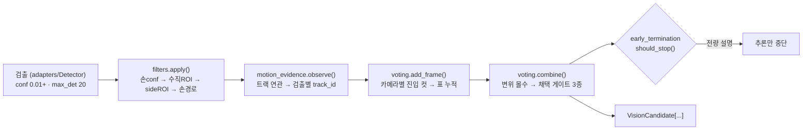

# `perception/` — 프레임 검출을 "클래스별 표"로 바꾸는 vision 계층

> 계층 위치: 상위는 `service/pipeline.py`(조립·호출), 하위는 `core/`뿐 — 단
> `early_termination.py`만 예외적으로 `judgment/strict.py`를 재사용한다(이중 tolerance 기준
> 금지, §3). 검출기 구현체는 `adapters/`에서 주입된다(C1). · 상태성: 트리거 내 — 투표·변위
> 증거는 트리거마다 새 인스턴스, 필터 체인은 재사용 인스턴스를 트리거 시작마다 리셋
> 런타임 의존성: 없음(표준 라이브러리) — YOLO·TensorRT·cv2 import 0

상위 문서: [02. 시스템 아키텍처](../../docs/02-system-architecture.md) ·
형제 패키지: [`frames/`](../frames/README.md)(추론할 프레임 선별) →
**`perception/`** → [`judgment/`](../judgment/README.md)(무엇을 몇 개)

---

## 1. 책임과 경계

이 계층의 유일한 산출물은 `tuple[VisionCandidate, ...]`다 — 클래스별
`(class_id, weighted conf, vote_count, vote_ratio)` + 위치 계측 신호. **한다**:
검출기 인터페이스와 allowlist 계약, 공간·손 근접 필터, **변위 증거**로
"움직이지 않은 것"의 표 몰수, 클래스별 표 누적과 카메라 간 conf 결합,
무게 전량 설명 시 **추론 중단 가능** 신호.

**하지 않는다**

- **정체성·개수 결정**: 어느 상품을 몇 개 청구할지는 `judgment/`의 몫이다.
  이 계층은 득표 순위까지만 만들고, 판정층은 그 순위를 신뢰한다(층별 단일 책임 —
  이슈 #15에서 판정층이 무게로 순위를 뒤집던 경로를 걷어낸 근거).
- **장치 결합**(TensorRT 로드·디코드·크롭 = `adapters/`·`frames/`), **검출 단계
  conf 하한**(I4), **영속화**(아카이브 기록 = `service/`·`ledger/`).
- **모션 게이트**(프레임 차분으로 추론 프레임을 고르는 일)는 `frames/`다.
  여기서 말하는 "모션"은 **검출된 물체의 변위**로 전혀 다른 층이다.



## 2. 구성 파일

| 파일 | 역할 | 핵심 진입점 |
|---|---|---|
| `detector.py` | 검출기 프로토콜·`Detection` 값 타입·hand 클래스 상수 | `Detector.detect` / `BatchDetector.detect_batch` |
| `filters.py` | 공간·손 근접 필터 체인 (트리거 단위 상태 보유) | `DetectionFilterChain.apply` / `.reset_trigger_state` |
| `motion_evidence.py` | 트랙 연관 + 변위 증거(표 몰수의 근거), 튜브 진단 | `.observe` / `.track_qualifies` / `.class_motion` / `.summary` |
| `voting.py` | 표 누적·카메라 conf 결합·후보 채택 게이트 | `.add_frame` / `.combine` / `.debug_summary` |
| `early_termination.py` | 추론 중단 판정 (취출 & 비freezer 한정) | `EarlyTerminator.should_stop` |
| `__init__.py` | 공개 표면 5종 재수출 | — |

합계 1,156행. 진단 산출물 4종은 `service/pipeline.py`가 `trace.vote_summary`로
모아 세션 아카이브에 싣는다.

## 3. 파일별 상세

### `detector.py`

순수 인터페이스다. `Detector`는 `Protocol`이며 구현(Ultralytics TensorRT)은
`adapters/yolo_detector.py`에서 주입된다(C1) — 도메인 계층이 장치를 import하지
않게 만드는 경계이자, 테스트가 페이크 검출기로 전 계층을 돌릴 수 있는 이유다.

- **I4 (저신뢰 보존)**: 어댑터는 `conf=0.01`로 추론하고, 이 계층은 검출 단계에서
  conf 하한을 걸지 않는다. 노이즈 방어는 투표 **진입 컷**(카메라별)에서 하고,
  결합 후 `conf_floor`는 안전판이다.
- **`allowed_class_ids`**: 판매 중 상품의 매핑된 class만 추론을 허용해
  `max_det=20` 슬롯을 노이즈 클래스가 잠식하지 못하게 한다.
  `None` = 무제한(기동 프로브 등), **빈 시퀀스 = fail-closed**(predict 호출 없이
  즉시 `[]`). 카메라별 목록은 `service/pipeline.py`가 구성한다 — top은
  `상품 + hand(0)`, side는 상품만(단 `SIDE_HAND_ENABLED=1`이면 side도 hand 포함).
- `HAND_CLASS_ID = 0`은 전역 계약이며, 미매핑 상품 센티널이 `-1`인 이유(0과의
  충돌 회피)도 여기서 나온다. `BatchDetector`는 선택 확장(duck-typing) —
  `batch_size > 1`이고 구현이 `detect_batch`를 제공할 때만 배치 경로를 쓴다.

### `filters.py`

`apply(camera, detections)`가 4단을 순서대로 적용한다.

| 단 | 대상 | 규칙 | 왜 |
|---|---|---|---|
| ① 손 conf | hand 검출 | `conf < floor`면 제거 (side는 전용 floor 우선) | 유령 손이 손 래치(I16)와 손 경로 기준을 오염시키는 것 차단 |
| ② 수직 ROI | 상품 검출 | 냉동 dual-top이면 **두 카메라** 공통으로 상/하 절반만 유지, 아니면 top 한정(트리거 delta≠0일 때 하단 절반) | 존 밖 진열장이 프레임에 함께 들어오는 실기 레이아웃 |
| ③ side ROI | side 상품 검출 | `center_x ≥ 400`이면 제거 (수직 ROI가 켜져 있으면 **생략**) | side 화면 오른쪽은 다른 존 |
| ④ 손 경로 | 상품 검출 | 최근 손 bbox 궤적(기본 30프레임) ±40px와 교차하지 않으면 제거 | 손이 닿지도 않은 위치의 검출은 이 트리거의 취출이 아니다 |

설계 결정 4가지가 이 파일에 응집돼 있다.

1. **conf 필터를 여기서 하지 않는다** — I4. 필터 체인은 "공간적으로 무관한
   검출"만 걸러내고, 신뢰도 판단은 투표 계층의 단일 지점에 둔다.
2. **fail-open**: bbox가 `(0,0,0,0)`인 검출(공간 정보 없음)은 공간 필터 3단을
   모두 통과시킨다. 과잉 제거는 매출 누락(미청구) 방향이므로 금지다.
3. **손은 항상 보존**: 통과한 hand 검출은 출력에 무조건 남는다. 손은 투표
   대상이 아니지만 래치(I16)와 ④의 기준을 만드는 신호이기 때문이다.
4. **손 궤적은 영상(트리거) 단위 상태**: 파이프라인이 트리거 시작마다
   `reset_trigger_state()`를 호출해야 한다. 과거에 손 이력이 트리거 간에
   남아 **이전 영상의 좌표가 다음 영상의 필터 기준**이 되던 결함이 있었다.

side 손은 **opt-in**이다(`SIDE_HAND_ENABLED`, 기본 off — allowlist 자체는
파이프라인이 구성). side에서는 손 검출 단 1건이 ④를 "무장"시키는 방아쇠라
오탐 손이 상품 recall을 통째로 지우는 비용이 top보다 크다. 그래서 side 전용
conf 하한(`side_hand_conf_floor`, 미설정 시 공용 하한 상속)을 분리했다.

`drop_stats`(카메라×단계별 제거 카운터)는 "side 검출 195개 중 194개가 사라졌는데
어느 단계인지 알 수 없다"(이슈 #6 2차)를 재발시키지 않기 위한 진단이며,
`vote_summary.filter_drops_by_stage`로 아카이브에 실린다. `vertical_roi_region`
오타는 `ValueError` — 조용히 `off`가 되면 ROI 없이 운영 중임을 알 수 없다
(fail-closed, `cabinet_type`과 동일 원칙).

### `motion_evidence.py`

**물리 원칙: 집어간 상품은 움직이고, 진열 상품은 안 움직인다.**

이 모듈 이전에는 같은 물리를 두 개의 대리 신호로 쫓았고 각각 구멍이 있었다
(이슈 #16 실기 4건). `static_track`(연속 IoU 정지)은 연속성을 요구하므로
**깜빡이는** 정지 물체를 놓쳤고, `baseline`(손 등장 전 존재)은 손 신호에 의존해
top(프리롤에 이미 손)에서는 무력하고 side(hand 미추론)에서는 폭주했다.
변위는 대리가 아니라 물리 그 자체를 측정한다 — 깜빡여도 변위 ≈ 0이면 진열이고,
손이 안 보여도 움직이면 취출이다.

- **트랙 연관**: 카메라×클래스 버킷 안에서 **중심 거리 최근접 매칭**(점프 상한
  `max_jump_px=150`, 프레임당 트랙 1회). IoU 앵커를 쓰지 않는 이유는 빠르게
  움직이는 상품이 프레임 간 IoU가 무너져 트랙이 끊기기 때문이다.
- **통과 조건**: 어느 한 트랙이라도 `누적 경로 ≥ thr` **또는** `시점 대비 최대
  변위 ≥ thr`, `thr = max(floor_px, size_scale × 평균 bbox 크기)`. 큰 물체는 더
  크게 움직여야 한다. 같은 클래스가 진열+취출로 동시에 있어도 취출 트랙
  하나가 클래스를 살린다(정체성 판정에 안전한 방향).
- **좌표 계약**: center-crop 480×480. 픽셀 임계(냉장 10px / 냉동 12px)는 1:1
  크롭(비등방 스케일 없음)이면 crop 원점(left/center)과 무관하게 유효하다 —
  과거 squash resize 좌표계에서는 재보정 없이 이식이 불가했다.
- **fail-open**: bbox 없는 검출은 그 카메라×클래스를 면제한다.
- **G2 재연관 창**: 1프레임 이상 끊겼던 트랙은 `reassoc_window=12` 안에서 완화
  반경(`1.5×150 = 225px`)으로 다시 잇는다 — 손 가림으로 grab 순간 트랙이 끊기면
  새 트랙의 변위가 부족해 정답 표가 죽는 잠재 결함의 보완. 오연결의 실패 방향은
  `first` 승계 → 변위 과대 → 표 생존(fail-open)이다.
- **held 트랙 판정**(`track_held`): head 구간 관측 ≥ `held_min_head`
  **+** 스트림 길이 가드(관측 최대 pos + 1 ≥ `held_min_stream`, 프리롤 부족
  카메라는 판정 자체를 비활성) **+ head 구간 내 이동 ≥ `floor_px`**.
  마지막 항이 10차 사고의 정정이다 — 진열 상품도 프리롤 0프레임부터
  관측되므로 head 관측 수만으로는 "진열→취출 전환" 트랙이 carried-in과
  구분되지 않아, 자기 취출 트리거에서 60/61표가 held로 오플래그됐다.
  carried-in은 손에 들려 head 구간에도 움직이고, 진열은 head에 정지해 있다.
- **측정 불가 정책**(`unmeasurable_policy`): 관측 1회 트랙은 `path=0`·
  `max_disp=0`이라 **구조적으로 통과가 불가능**하다. 빠른 취출은 검출이
  1~2프레임뿐이거나 `max_jump` 초과로 단편화되어 전 트랙이 그 상태가 되므로,
  "너무 빨리 움직여서 no_motion"이라는 역설로 정답 표가 몰수된다.
  `exempt`는 클래스에 측정 가능한(관측 ≥ `measurable_min_obs`) 트랙이 **하나도
  없을 때만** 면제한다. "측정했더니 정지"(장수 트랙, path ≈ 0 = 진열)는 계속
  몰수되고, 측정 가능한 형제 트랙이 있으면 단편 트랙도 계속 몰수된다.
- **튜브 층 (진단 전용)**: 클래스-조건 트랙과 **병행**으로 클래스 무관 튜브를
  연관해 관측 클래스 히스토그램을 쌓는다. `tube_minority()`가 "한 궤적 위에서
  깜빡인 결정적 소수 클래스"(의류 프린트 산탄의 시그니처)를 판정하지만,
  **이 판정으로 표를 몰수하지 않는다** — 몰수 경로는 냉동 실측 열세로
  폐기됐다([07. 배제·폐기 기록](../../docs/07-rejected-and-retired.md)).

트랙 상태의 단일 소유자는 이 모듈이며, 투표 계층은 `track_id`만 들고 다닌다.

### `voting.py`

**vote_ratio 분모의 단일 정의**(함정 #4)가 이 파일의 첫 계약이다. 모션
게이트(D6)·조기 종료(D7) 어떤 조합에서도 분모 의미가 바뀌지 않도록,
`add_frame()`은 **게이트를 통과해 실제로 추론된 프레임에서만** 호출한다.

분모는 두 모드다(`ratio_denominator`).

| 모드 | 분모 | 문제·의도 |
|---|---|---|
| `gate` (기본) | 전 카메라 게이트 통과 프레임 합 | 현행 단일 정의. 다만 분자(취출 순간의 표)는 영상 길이와 무관한데 분모는 프리롤·포스트롤·타 카메라까지 세므로 정답 클래스 ratio가 0.03~0.07까지 희석된다(실기: 10표/186 = 0.054) |
| `hand_window` | 카메라별 손 활성 프레임 합 (손을 한 번도 못 본 카메라는 자기 게이트 통과 수로 폴백) | "취출이 보일 수 있었던 프레임"만 세는 길이 불변 밀도. 폴백이 없으면 분모 0인 카메라의 표가 ratio를 부풀린다 |

`hand_window`로 운영한 세션은 `vote_summary.ratio_denominator`가 아카이브에 남는다
— 과거 세션과 vote_ratio를 섞어 비교하는 것을 막는 표식이다.

**conf 결합 산식**(원본 대조로 확정, P1-4):

```
양쪽 검출  weighted = max(top)×top_weight + max(side)×side_weight
                     + min(max(top), max(side))×common_class_bonus     → min(·, 1.0)
단일 검출  weighted = max(conf) × (top_only_weight | side_only_weight)
```

- **카메라별 최대 conf**로 결합한다. 구버전의 평균 결합은 `0.72 한 번 + 0.45
  스무 번 → 0.46`으로 항상 낮게 나와 후단 신뢰도 비교 전반이 열세였다.
- **단일 카메라는 전용 `*_ONLY` 가중**을 쓴다. 공용 0.5/0.5를 쓰면 한쪽이
  0이 되어 conf가 반토막 나고(top 0.7 → 0.35), `conf_floor(0.4)`에서 전멸했다.

**노이즈 방어 지점은 결합 후 `conf_floor`가 아니라 카메라별 진입 컷이다.**
2차 실기에서 conf 0.01 노이즈 표가 평균을 희석해 클래스별 weighted가
0.10~0.16에 머물고, **94~96표를 받은 실제 상품까지 conf_floor에서 전멸**한 것이
확정됐다. 운영 기본은 진입 컷 0.70 + `conf_floor` 0.0이며, 탈락 수는
`entry_dropped`로 카메라별 계상된다.

**후보 채택 게이트 3종** (`combine()`):

| 게이트 | 조건 | 막는 사고 |
|---|---|---|
| ratio / count | `ratio ≥ min_vote_ratio` **또는** `votes ≥ min_vote_count` | 1~2프레임 플리커 |
| `min_vote_share` | `votes ≥ 1위 득표 × share` | 400프레임+ 영상에서 8표(1위의 4%) 노이즈가 판정에 진입해 "무게 filler"(메로나 79g×3)로 채택된 이슈 #10 |
| `conf_floor` | `weighted ≥ conf_floor` | 진입 컷을 0으로 운영할 때의 안전판 |

`min_vote_share`의 기준(1위 득표)은 **변위 몰수 반영 후** 값이다 — 몰수된
배경 1위가 기준을 오염시키면 진짜 상품이 상대 하한에 걸린다.

**트랙릿 투표**: 표는 `(conf, track_id)`로 저장되고 결합 시 **트랙 단위**로 변위
검증된다 — 같은 클래스가 진열+취출로 공존해도 진열 인스턴스의 표만 몰수된다
("오래 보이는 것 = 표 많은 것" 편향의 종결). 귀속 없는 표는 클래스 단위 폴백.

**held 강등**(`held_demotion`): `off` | `shadow`(관측만) | `active`(carried-in
트랙 표 몰수). `active`에서도 원 득표가 남아 있어 몰수 영향의 사후 재구성이
가능하고, share 분모도 같은 경로를 지나 자동 정화된다. 운영 기본은 `shadow` —
승격은 라벨 대조로 정답 클래스가 held로 플래그되지 않음을 확인한 뒤다.

**`debug_summary()`의 `rejected_by`가 오판정 진단의 1차 단서다.** 값은
`ratio` / `share` / `conf_floor` / `no_motion` / `no_motion_unmeasurable` / `None`.
마지막 두 개의 구분이 중요하다 — `no_motion`은 "측정했더니 정지"(진열·배경),
`no_motion_unmeasurable`은 "측정 자체가 불가"(단편 트랙 = 빠른 취출 시그니처)이며,
후자가 정답 클래스에서 반복되면 `MOTION_UNMEASURABLE=exempt` 승격 근거다.

### `early_termination.py`

무게가 이미 전량 설명됐으면 남은 프레임을 추론하지 않는다(D7). **기본 off**
(이슈 #22 0805 냉장 20종 실기 강등 — env `MODEL__VISION__EARLY_TERMINATION=1`로
opt-in).

- **강등 근거 (이슈 #22 0805)**: "현재 후보 창 안의 설명"은 "남은 프레임이
  판정을 못 바꾼다"의 근거가 되지 못한다 — 정답이 아직 화면에 등장하지 않았을
  수 있고(2-9: zone3이 top 9컷 처리 후 종료 → 정답 표 0, 프리롤 진열 5표가
  86×3=258로 Δ-260을 설명해 오과금), 리드 표가 진열·반사광 오검출일 수
  있다(3-3). 무게 겹침이 흔한 20종 구성에서 이 전제 붕괴가 오판정의 지배
  원인이었다. 프레임 처리량은 T2 배치 경로(`BATCH_SIZE`/`TENSOR_INPUT`)가
  대체한다.
- **전 재고 유일해 게이트** (재활성화 시에도 강제): |delta|를 단일 종 n개로
  설명하는 (상품, n) 해가 판매중 전 재고에서 정확히 하나이고 그 상품이 현재
  득표 리드일 때만 종료 — 후보 창 안 유일성은 정보가 아니고, 다품종 조합
  설명은 종료 근거 자격이 없다(ses-46: 3종 조합 738이 Δ-735를 설명해 종료 →
  정답 10×2 표 0).
- **적용 한정 (I15)**: 취출(`delta < 0`) & 비freezer(`profile.early_termination_allowed`)
  에서만. 반품과 냉동은 후반 프레임 증거가 중요하다.
- **추론만 중단**한다. 디코드·손 경로·트레이스는 완주해야 하며 그것은 호출측
  (`service/pipeline.py`) 책임이다 — 이 판정기는 "추론 중단 가능" 불리언만 준다.
  트레이스 의미가 게이트 조합에 따라 흔들리지 않게 하기 위한 경계다.
- **이중 기준 금지**: delta 설명 판정은 `judge()`와 동일한
  `SensorProfile.tolerance_grams` **단일 소스**를 공유하고, 탐색 상한은
  `StrictWeightMatcher.max_items`를 공유한다. 이 한 줄 때문에 perception이
  judgment를 import하는 유일한 지점이 된다.
- 수렴 조건: 1위 득표 ≥ `min_lead_votes`(5), 2위와의 격차 ≥ `lead_margin`(3),
  손 퇴장 후 `hand_exit_frames`(5)프레임 경과, 그리고 무게 전량 설명.
- **T1 최적화**: `candidates`를 시퀀스 대신 **지연 콜러블**(`voting.combine`)로
  받아 값싼 가드를 전부 통과한 뒤에만 평가한다. 반환값이 무조건 `False`인
  냉동에서 매 추론 프레임 `O(누적 표²)` 결합을 100% 폐기하던 낭비가 사라진다
  (판정 무변경 — 평가 시점만 늦춤).

## 4. 계약과 불변식

| # | 계약 | 위반 시 |
|---|---|---|
| I4 | 검출 단계에 conf 하한 없음 — 저신뢰 검출도 투표 누적까지 보존 | 노이즈 방어 지점이 두 곳으로 갈라져 어디서 표가 죽었는지 추적 불가 |
| 분모 단일 정의 | `add_frame()`은 게이트 통과·추론된 프레임에서만 호출 | vote_ratio가 게이트 설정에 따라 의미가 달라져 세션 간 비교 불가 |
| fail-open | 공간 정보 없는 검출은 공간 필터·변위 검사를 면제 | 과잉 제거 = 미청구 = 매출 누락 |
| 트리거 단위 상태 | 트리거 시작마다 `filters.reset_trigger_state()`; 투표·증거는 새 인스턴스 | 이전 영상 좌표가 다음 영상 필터 기준이 됨 |
| 정렬 계약 | `observe()` 반환 track_id 리스트는 입력 `detections`와 인덱스 정렬 동일 (`add_frame`은 `strict=True` zip) | 표가 다른 트랙에 귀속되어 변위 검증이 무의미해짐 |
| 손은 투표 대상 아님 | `is_hand` 검출은 표를 만들지 않음 (래치·손 경로 전용) | hand 클래스가 후보로 올라와 판정층에 유입 |
| 좌표 계약 | 모든 bbox는 480×480 center-crop 좌표계 | 픽셀 임계(10/12px, side ROI 400)가 전부 무의미해짐 |
| 진단 무영향 / fail-closed 설정 | 진단 4종은 읽기 전용 재계산 · 열거형 설정 오타는 `ValueError` | 아카이브가 증거 자격을 잃음 / 조용히 기본값으로 도는 것을 운영이 알 수 없음 |

## 5. 설정

전부 `MODEL__VISION__*` 접두이며 `core/config.py` → `service/model_service.py`가
주입한다. 라이브러리 생성자 기본값은 하위호환용이라 **운영 기본과 다르다**
(예: `conf_floor` 생성자 0.4 vs 운영 0.0, `held_demotion` 생성자 `off` vs 운영
`shadow`). 카탈로그 정본은 [04. 설정 레퍼런스](../../docs/04-configuration.md).

| 환경변수 | 기본값 | 영향 |
|---|---|---|
| `TOP_CONFIDENCE_THRESHOLD` / `SIDE_CONFIDENCE_THRESHOLD` | 0.70 / 0.70 | 카메라별 투표 **진입 컷** — 실질적 노이즈 방어 지점 |
| `CONF_FLOOR` | 0.0 | 결합 후 weighted 하한 (안전판) |
| `MIN_VOTE_RATIO` / `MIN_VOTE_COUNT` | 0.05 / 3 | 후보 채택 절대 게이트 |
| `MIN_VOTE_SHARE` | 0.1 | 1위 대비 상대 하한 (이슈 #10 filler 차단) |
| `VOTE_RATIO_DENOMINATOR` | `gate` | `hand_window`면 손 활성 프레임 분모 |
| `CONF_WEIGHT_TOP` / `_SIDE` / `_TOP_ONLY` / `_SIDE_ONLY` | 0.60 / 0.40 / 0.60 / 0.40 | conf 결합 가중 |
| `CONF_COMMON_CLASS_BONUS` | 0.2 | 양 카메라 동시 검출 보너스 계수 |
| `SIDE_ROI_MAX_CENTER_X` | 400.0 | side 상품 유효 영역 경계 (center-crop 좌표) |
| `FREEZER_ROI_VERTICAL_REGION` / `FREEZER_ROI_Y_SPLIT` | `upper` / 300.0 | 냉동 dual-top 수직 ROI (freezer ∧ `dual_top_proxy`일 때만 적용) |
| `TOP_ROI_ENABLED` / `TOP_ROI_Y_SPLIT` | false / 240.0 | 냉장 top 카메라 수직 ROI (delta≠0일 때) |
| `HAND_CONFIDENCE_THRESHOLD` | 0.30 | 손 검출 conf 하한 |
| `SIDE_HAND_ENABLED` | false | side allowlist에 hand 포함 (opt-in) |
| `SIDE_HAND_CONFIDENCE_THRESHOLD` | -1 = 상속 | side 전용 손 하한 |
| `MOTION_EVIDENCE` | true | 변위 몰수 전체 on/off |
| `MOTION_EVIDENCE_FLOOR_PX` | 미설정 = 프로파일(냉장 10 / 냉동 12) | 변위 임계 하한 |
| `MOTION_UNMEASURABLE` / `MOTION_MEASURABLE_MIN_OBS` | `forfeit` / 3 | 측정 불가 클래스 면제 정책 |
| `HELD_TRACK_DEMOTION` / `HELD_TRACK_MIN_HEAD` | `shadow` / 5 | carried-in 트랙 강등 모드 |
| `EARLY_TERMINATION` | **false** (이슈 #22 0805 강등) | 조기 종료 opt-in — 켜도 전 재고 유일해 게이트 강제 |

`EarlyTerminationConfig`(5/3/5)와 `MotionEvidence`의 트랙 파라미터(`size_scale`,
`max_jump_px`, `reassoc_*`, `held_min_stream`, `tube_minority_ratio`)는 **env로
노출되지 않은 코드 상수**다 — 튜닝은 코드 수정 + 테스트 갱신이 함께 가야 한다.

## 6. 테스트

`tests/test_perception.py` 57건 (클래스 단위).

| 테스트 클래스 | 건수 | 무엇을 고정하는가 |
|---|---|---|
| `TestVoting` | 17 | 분모 = 게이트 통과 프레임 수, 진입 컷이 노이즈를 차단하고 `entry_dropped`로 계상됨, conf 결합 산식(양/단일 카메라·보너스·1.0 clamp·최대 vs 평균), `min_vote_share`의 상대 제거와 0=하위호환, 손 미투표, 위치 계측 신호(head/span/first)와 pos 미제공 시 기본값 |
| `TestMotionEvidence` | 15 | 정지 클래스 몰수·이동 클래스 통과, 깜빡이는 정지 물체 몰수, zero-bbox 면제, 카메라별 독립 몰수, 몰수된 1위가 share 기준을 오염시키지 않음, 트랙릿 투표(진열 인스턴스만 몰수), G2 재연관(창 안/밖), held 판정의 3요건과 head 정지 트랙 비-held, held shadow/active 차이와 잘못된 모드 거부, `track_detail` 계측 |
| `TestEarlyTermination` | 7 | 수렴 시 중단, freezer·반품 금지(I15), 손 미퇴장 차단, 설명 불가 delta 차단, 리드 마진 부족 차단, 지연 콜러블이 가드 통과 전 평가되지 않음 |
| `TestMotionUnmeasurable` | 6 | 기본 `forfeit`에서 단일 관측 트랙 몰수, `exempt`의 면제 범위, "측정된 정지"는 exempt에서도 몰수, 측정 가능 형제가 있는 단편은 계속 몰수, `no_motion_unmeasurable` 라벨, 잘못된 정책 거부 |
| `TestTubeDiagnostics` | 5 | **튜브 판정이 표를 절대 몰수하지 않음**(계약), 결정적 소수 계측, 근소 열세는 소수 아님, 별개 궤적은 튜브 분리, 같은 프레임 이중 박스 흡수, 증거 미부착 시 `None` |
| `TestHandWindowRatio` | 4 | 손 활성 프레임만 분모, 손 못 본 카메라의 게이트 폴백, `gate` 모드는 `hand_active` 무시, 잘못된 모드 거부 |
| `TestSideHandConfFloor` | 3 | side 전용 하한이 side에서만 우선, 미설정 시 공용 상속, side 손 1건이 hand_path를 무장시킴 |

## 7. 수정 시 주의

1. **표를 몰수하는 새 규칙을 추가할 때**는 반드시 `debug_summary()`의
   `rejected_by`에 라벨을 추가할 것. 라벨 없는 몰수는 아카이브에서
   "후보 0"으로만 보이고 원인 추적이 불가능하다.
2. **판정 영향과 계측을 섞지 말 것.** 튜브 층·`track_detail`·`held_summary`는
   "관측만 한다"가 계약이고 테스트가 그것을 고정한다. 계측이 판정을 건드리기
   시작하면 아카이브가 사후 분석의 증거 자격을 잃는다.
3. **픽셀 임계를 손대기 전에 좌표계를 확인할 것.** 480×480 center-crop 1:1
   전제이며, squash resize나 다른 imgsz로 바꾸면 `floor_px`·`side_roi_max_center_x`·
   `y_split`·`max_jump_px`가 전부 재보정 대상이다.
4. **fail-open 방향을 뒤집지 말 것.** 이 계층의 실패는 항상 "증거를 남기는"
   쪽이어야 한다. 정밀도가 필요하면 판정층·정산층의 보수적 게이트로 처리하는
   것이 시스템 전체 원칙(과청구 < 미청구)과 일관된다.
5. **`add_frame` 호출 위치를 옮기지 말 것.** 게이트 스킵 프레임이나 필터 이전
   단계에서 호출하면 분모 단일 정의가 깨진다. `pos`는 게이트 스킵을 **포함한**
   디코드 위치라는 점도 `motion_evidence`와 공유하는 규약이다.
6. **카메라 이름은 `"top"`/`"side"`로 하드코딩**돼 있다(`VotingEnsemble._votes`,
   `filters.drop_stats`) — 세 번째 스트림을 추가하려면 두 모듈의 dict 초기화를
   함께 고쳐야 한다(현재는 `KeyError`). 폐기된 접근(저신뢰 표 회수, 튜브 다수결
   몰수, 트랙 probation·소멸)의 재시도는
   [07. 배제·폐기 기록](../../docs/07-rejected-and-retired.md)을 먼저 읽을 것.
