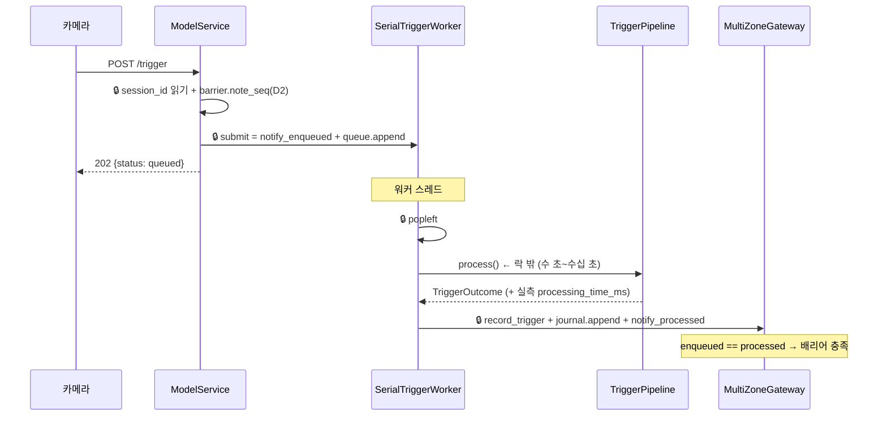

# `service/` — 도메인 계층을 배선하고 실행 순서를 정하는 조립 계층

> 계층 위치: 위는 `adapters/`(이 계층의 파사드만 호출) · 아래는 `ingest`·`frames`·`perception`·`judgment`·`ledger`·`gateway`·`core` 전부 · 상태성: 조립 (판정 규칙 없음 — 세션 상태는 `gateway`/`ledger` 소유)
> 런타임 의존성: 없음(표준 라이브러리). 검출기는 `perception.Detector` 프로토콜로 주입받으므로 이 패키지는 YOLO·TensorRT를 알지 못한다.

---

## 1. 책임과 경계

이 계층은 **조립(assembly)** 계층이다. 도메인 계층들을 연결하고 호출 순서·경로
분기를 정하며, 결과를 트레이스로 기록한다. **판정 규칙은 하나도 갖지 않는다.**

| 질문 | 소관 |
|---|---|
| 무엇을 몇 개 청구하는가 | `judgment/` (전략 라우터) |
| ±몇 g까지 같은 무게로 보는가 | `core/profiles.py` (SensorProfile) |
| 언제 세션을 확정하는가 | `gateway/` + `ledger/barrier.py` (인과 배리어) |
| 어떤 표를 몰수하는가 | `perception/` (필터·변위 증거·투표) |
| **어떤 순서로 무엇을 호출하는가** | **`service/pipeline.py`** |
| **어떤 경로로 갈지 (차단·스킵·vision_only·에러)** | **`service/pipeline.py`** |
| **env 값을 어느 계층의 어느 인자로 넣는가** | **`service/model_service.py`** |
| **동시성(락)과 처리 직렬화** | **`service/worker.py`** |

경계 판정 기준은 하나다 — **그 규칙을 도메인 계층에서 단위 테스트할 수 있으면
그 계층에 둔다.** `service/` 테스트가 고정하는 것은 "배선과 순서"뿐이다.

### 2026-07-30에 삭제된 배선 (살아있는 기능이 아님)

| 삭제된 것 | 있던 자리 |
|---|---|
| 무게 우도 shadow (`_likelihood_shadow`), `TriggerTrace.likelihood_shadow` | `pipeline.py` |
| 세션 트레이 메모리 (`_record_tray_evidence`, `SessionTrayMemory` 생성·리셋) | `pipeline.py` / `model_service.py` |
| `likelihood_*`·`tray_memory`·`tube_identity`·`vote_recovery`·`track_min_hits`·`track_max_gap` 주입 | `model_service.py` |
| `vote_summary.tube_shadow` (승격 장치) | → 진단 전용 `tube_diag`로 대체 |

폐기 사유와 실측 근거는 [07. 배제·폐기 결정 기록](../../docs/07-rejected-and-retired.md)에
있다. 아카이브에 남아 있는 구 필드는 `analyze-sessions`가 무시한다.

## 2. 구성 파일

총 1,472행 / 5파일. 최대 파일은 `pipeline.py`(768행)이다.

| 파일 | 역할 | 핵심 진입점 |
|---|---|---|
| `model_service.py` | 외부 계약 파사드(프레임워크 중립) + env→각 계층 파라미터 배선의 단일 지점 | `ModelService.handle_trigger` / `.handle_multi_zone` / `.process_pending` |
| `pipeline.py` | 트리거 1건의 7단계 오케스트레이션 (ingest → frames → perception → judgment) | `TriggerPipeline.process` |
| `worker.py` | 단일 소비자 직렬 워커 — 배리어 카운트 공급, 락 범위 계약 | `SerialTriggerWorker.submit` / `.drain` |
| `snapshot.py` | 판매 상품 스냅샷 (빈 allowlist fail-closed + `last_valid` 폴백) | `ActiveProductStore.update` / `.snapshot` |
| `__init__.py` | 공개 심볼 재수출 (`ModelService`, `TriggerPipeline`, `TriggerRequest`, `TriggerTrace`, `TriggerOutcome`, `SerialTriggerWorker`, `ActiveProductStore`, `ProductSnapshot`) | — |

## 3. 파일별 상세

### `model_service.py`

외부 계약(HTTP)의 **프레임워크 중립 대응물**이다. 계약·불변식이 전부 여기서
끝나므로 `adapters/http_app.py`에는 로직이 없다.

| 진입점 | 대응 라우트 | 의미론 |
|---|---|---|
| `handle_trigger(payload)` | `POST /trigger` | **202 접수**: 멱등성 검사 → `barrier.note_seq` → 워커 큐 적재까지만 하고 `{"status": "queued", "trigger_id": "trg-N"}` 반환. 중복이면 `{"status": "duplicate", "trigger_id": <기존 id>}`로 드롭(I7) |
| `handle_multi_zone(payload)` | `POST /api/judge/multi-zone` | `state="OPEN"` 재고 스냅샷 갱신 + 세션 발급 / `state="CLOSE"` 정산 요청 / `state=None` 무상태 폴링 |
| `process_pending()` | 워커 drain | `worker.drain()` 위임. 장치에서는 전용 스레드가 주기 호출 |

**기동 fail-fast.** 생성자에 `startup_probe_frame`을 주면 `detector.detect()`를 1회
실행한다 — 엔진 로드 실패·CUDA 불가가 **기동 실패**가 되어야 하고, 무증상으로
기동해 첫 실트리거에서 죽는 일이 없어야 한다. `batch_size > 1`이거나
`tensor_input`이 켜진 구성이면 `detect_batch([frame])`도 함께 1회 실행해 엔진
batch·dtype 불일치도 배포 시점에 드러낸다. 이 프로브를 통과했다는 사실이
`GET /api/health`가 `yolo_loaded: true`를 상수로 반환할 수 있는 근거다.

**env → 계층 배선의 단일 지점.** 생성자 본문 전체가 `Settings` 값을 각 계층
생성자 인자로 옮기는 코드다. 여기 외의 곳에서 `os.environ`을 읽지 않기 때문에
"어떤 노브가 어디에 꽂히는가"를 한 파일에서 추적할 수 있다. 배선 대상:

- `_default_profile_from_settings` — `cabinet_type`으로 **기기 단위 기본 프로파일**
  결정. 존 미지정 시에도 냉동 기기는 FREEZER가 적용된다(미이식 시 전 존이
  냉장 ±3g로 판정되던 이슈 #6 공동 원인).
- `_profiles_from_settings` — `MODEL__ZONES__FREEZER`는 기본 프로파일에 대한
  **존 단위 오버라이드**로만 동작한다.
- `_apply_gate_overrides` — 모션 게이트 임계/keepalive의 env 오버라이드를 기기
  전 존 프로파일에 덮어쓴다(이전에는 env 경로가 없어 "조정해도 안 먹히는"
  유령 노브였다).
- 프로파일 **단일 소스 원칙**: 폴백 프로파일을 판정(`pipeline`)·정산(`settler`)·
  잠정 집계(`gateway` interim) 세 경로에 **같은 값으로** 주입한다 — 하나만
  다르면 `cabinet_type=freezer`인데 정산만 냉장 tolerance로 계산된다.
- `camera_crops = {"top": "center", "side": settings.side_camera_crop}` — 디코드
  크롭 원점의 단일 소스(어댑터 `LazyAviFrames` 구성 + 아카이브 스탬프 공용).

**상품 → YOLO class_id 매핑과 -1 센티널.** class_id 해석은 어댑터가 수행하지만
(`http_app._active_product_fields`: 숫자 별칭 → 엔진 `class_names` 이름 매칭 →
실패 시 **-1**), 그 결과의 관측은 이 파일이 담당한다. 매핑 실패에 0을 쓰면
**미매핑 상품이 hand(class 0)로 조용히 둔갑해 오청구**로 이어지므로(이슈 #6 실사고
원인) -1 센티널을 쓰고 `pipeline`이 allowlist에서 배제한다. OPEN마다 매핑
성공률을 로그로 남긴다:

```
[MULTI-ZONE OPEN] mapped=7/8 unmapped=['새상품A']   ← WARNING
[MULTI-ZONE OPEN] mapped=8/8 unmapped=[]            ← INFO
```

**세션 수명.** `_next_session_id()`가 `ses-<카운터>-<epoch>` 형식으로 유일 ID를
발급한다(EventLog 확정 거부와 settler 멱등 캐시가 session_id 키). OPEN 시점에
`_prune_ledger`가 EventLog·settler 캐시를 최근 K개(`KEEP_SESSIONS`, 기본 4)로
정리한다 — 직전 세션 캐시를 성급히 지우면 새 OPEN 직후 섞여 들어오는 직전 세션
CLOSE 재폴링이 재계산돼 다른 결과를 낼 수 있어, 현재+최근 세션은 항상 보존한다(I11).

**확정 훅.** `_on_session_finalize`는 게이트웨이가 FINALIZED/ERROR로 **최초 전이**할
때 정확히 1회 호출되어, EventLog 이벤트 + 워커 outcomes(트레이스·처리시간)를
`SessionArchive.save()`에 넘기고 `[OPS][SESSION_ARCHIVE] path=...`를 남긴다.
저장 실패는 아카이브 내부에서 흡수한다(부가 기능이 판정을 막지 않는다).

**응답 변환(`_to_response`).** I10 — 확정 타입만 결제 페이로드가 된다.

| 게이트웨이 상태 | 응답 |
|---|---|
| FINALIZED | `build_payment_payload(...)` — `success`/`status`/평탄화 `products`/`totalPrice` 포함 |
| ERROR | `{"success": false, "status": "error", "detail": ...}` — 결제 필드 없음(I13, 무성 확정 금지) |
| 그 외 | `{"status": "processing", "provisional": true, ...}` — InterimSummary면 존별 잠정 집계 동봉 |
| CLOSE인데 열린 세션 없음 | `"No active door session to close"` 고정 본문 — 에지가 이 응답으로 device busy를 해제한다(complete를 반복 주면 busy가 안 풀리는 실기 이력) |

**로그 소음 억제.** CLOSE는 재폴링되는 level-triggered 신호라 동일 응답이 분 단위로
반복된다. `_last_close_log_key`로 **결과가 바뀔 때만** 기록한다(프로토콜 응답
자체는 매 호출 그대로 반환).

### `pipeline.py`

트리거 1건을 처리하는 최대 파일이다. `process()`가 `_process()`를 감싸며,
**모든 예외를 `status="error"` 이벤트로 전파**한다(I1 — 무검출로 조용히 바꾸지
않는다. `reason="processing_error:<예외타입>"`).

경로 분기(빠른 탈출이 곧 성능이자 안전장치):

| 조건 | 결과 | reason_codes |
|---|---|---|
| 스냅샷이 `empty` (빈 allowlist) | 추론 차단, YOLO 0회 (I2 fail-closed) | `empty_allowlist_fail_closed` |
| 스냅샷이 `last_valid` 폴백 | 계속 진행하되 사실을 기록 | `snapshot_source=last_valid` |
| 로드셀 신뢰 불가 (`insufficient_samples` / `insufficient_stable_regions`) | `vision_only=True` 강제 | `loadcell_<사유>` |
| 재수집 대기 (`needs_return_stabilization`) | 구간화 보류 사실만 기록 (재수집은 장치측 훅) | `return_stabilization_pending` |
| `abs(delta) < profile.min_weight_change_grams` (vision_only 아닐 때) | vision 전체 생략, YOLO 0회 | `low_weight_skip` |
| 매핑된 class_id가 0개 | allowlist가 hand만 남음 | `no_mapped_class_ids` |
| 채택된 비전 1위가 과금 목록에 없음 | 관측만 (판정 무변경) | `vision_top_not_billed:class<N>` |

**멀티트레이 판정 (`_judge_tray_events`).** 로드셀 분석이 이벤트를 2건 이상
내면(트레이 분리 구조) 존 합산 delta를 조합 탐색하지 **않고** 이벤트별로 라우터를
1회씩 돌린다. 각 `ChannelWeightEvent.delta`가 단품(또는 동일 상품 n개) 무게 그
자체이므로 분해 근거가 **물리(트레이)** 이고, 이슈 #6이 금지한 자유 조합 탐색과
성질이 다르다. 비전 후보 풀은 공유한다(영상 1개, YOLO 재실행 없음).

- `_pool_exhaustion_retry` — 형제 트레이가 COMPLETE로 소진한 정체성을 미확정
  이벤트의 후보 풀에서 빼고 **1회** 재판정한다. 동시 다중 취출은 영상이 하나라
  트레이별 상품이 표를 나눠 갖고, 1위 정체성이 near-gate로 조기 반환되면 진짜
  상품이 무성 소멸한다(실사고 #16). 무게로 정체성을 고르는 게 아니라 이미
  설명된 정체성을 제거하고 남은 득표 순위에 다시 맡기는 것이며, COMPLETE로
  개선될 때만 채택한다(악화 금지). ERROR 이벤트는 재판정하지 않는다.
- **PARTIAL 과금 2중 가드** — 병합을 COMPLETE로만 한정하면 두 취출이 한 영상에
  담겼다는 이유로 덜 과금된다. 고유 정체성 PARTIAL은 과금에 포함하되,
  ① 형제 COMPLETE와 정체성이 겹치면 제외, ② PARTIAL끼리 겹쳐도 전부 제외한다
  (과청구가 미청구보다 나쁘다).
- 병합 결과 상태: 전원 COMPLETE → COMPLETE / 일부만 과금 → PARTIAL / 없음 →
  NO_DETECTION. `reason`은 `multi_tray[ch0:..., ch1:...]`로 채널별 사유를 보존한다.

**`_segment_target_retry` (오염 delta 이중 타깃).** 취출 시 손이 선반을 누르는
접촉 하중이 delta 또는 세그먼트 한쪽을 왜곡한다. delta 타깃을 우선하되, 실패했고
`|delta − sum(segments)| > gap`(기본 5g)이라는 오염 서명이 있을 때만 세그먼트 합을
타깃으로 라우터를 1회 재실행한다. YOLO 재실행이 없는 순수 CPU 재판정(수 ms)이며,
깨끗한 트리거는 발동 자체가 없다.

**배치·프리페치·텐서 입력이 판정을 바꿀 수 없는 이유.** `_run_vision` 안에
`consume(camera, pos, raw, latch)` **단일 경로**가 있고, 프레임별 루프와 배치
루프가 모두 이 함수를 호출한다. 필터 → 기록 → 변위 증거 → 투표 → 손 래치 →
조기 종료의 순서와 의미가 양쪽에서 동일하다.

| 스위치 | 경로 | 동등성 장치 |
|---|---|---|
| 기본 (`BATCH_SIZE=1`, `TENSOR_INPUT=0`) | 프레임별 `detector.detect` | — |
| `TENSOR_INPUT=1` | `detect_batch([frame])` (1프레임 배치) | 같은 `consume()` |
| `BATCH_SIZE=N>1` | 게이트 통과 프레임 N장 모아 `detect_batch` 1회 | 배치 결과를 **프레임 순서대로** 순차 `consume()`. 중간에 조기 종료가 발동하면 **잔여 결과를 폐기**해 투표 누적이 비배치와 같아진다(비용은 이미 지불, `yolo_calls`는 소비분만 집계) |
| `PREFETCH=N>0` | 카메라 스트림을 트리거 시작 시점에 **함께** 열어 top 추론 중 side 디코드를 은닉 | 기본값은 카메라 차례에 여는 현행 동작 유지 — `LazyAviFrames.__getitem__`이 곧 ffmpeg spawn이라 오픈 시점이 곧 동작이다 |
| 검출기가 `detect_batch`를 제공하지 않음 | 자동으로 프레임별 경로 (duck-typing) | 기존 페이크·구현 무변경 |

배치의 알려진 트레이드오프: 대기 중에는 손 래치(I16) 갱신이 최대 `batch_size-1`
프레임 지연된다 — keepalive가 강제 추론 상한이라 위험 창은 유계이나, 승격 전
재생 검증(과금 diff)이 조건이다. 리소스 정리는 2중으로, 카메라별 `finally`가
프레임 이터레이터를 닫고(조기 종료 시 ffmpeg/cv2 즉시 해제) 바깥 `finally`가
순회하지 않은 카메라의 프리페처 스레드까지 멈춘다.

**트레이스(I8) 구성.** `TriggerTrace`는 아카이브·`analyze-sessions`의 1차 자료다.

| 필드 | 내용 |
|---|---|
| `processed_frames` / `gate_skipped_frames` | 카메라별 추론 프레임 수 / 게이트 스킵 수 |
| `yolo_calls` | `consume()` 실행 횟수 = 실제 소비한 추론 프레임 수 |
| `early_terminated` / `reason_codes` | 조기 종료 여부 / 위 표의 경로 코드 목록 |
| `vote_summary` | `classes`(클래스별 득표·탈락 사유), `filtered_out_by_camera`, `filter_drops_by_stage`, `entry_dropped_by_camera`, `motion_evidence`, `held_shadow`, `tube_diag`(+`tubes`), `ratio_denominator`(기본 `gate`가 아닐 때만) |
| `frame_detections` | `save_detections` 시 프레임별 bbox (아래) |
| `camera_crops` | `frame_detections`의 좌표계 스탬프 |

`vote_summary`가 있어야 "후보 0"이 **모델 미검출/필터/투표 진입 컷/결합 임계**
어디에서 죽었는지 사후에 구분할 수 있다.

**`save_detections` 탭.** `MODEL__SESSION__SAVE_DETECTIONS=1`이면 추론 프레임마다
`{camera, pos, detections[{class_id, conf, bbox, hand}]}`를 기록한다. 담는 것은
**판정에 실제로 기여한 검출만** — 필터 체인 통과분 중 투표 진입 conf 이상, 그리고
hand(투표하지 않지만 래치·hand_path로 기여). 검출 0인 프레임도 기록하는데, 렌더에서
"게이트 스킵"과 "추론했으나 무검출"을 구분할 유일한 근거이기 때문이다. bbox는
검출 입력 프레임(480×480 크롭) 좌표계 그대로이고, 크롭 원점은 `camera_crops`
스탬프가 계약한다 — `render-session`이 같은 크롭으로 디코드해야 bbox가 맞는다.

### `worker.py`

단일 소비자 직렬 워커다. TensorRT 동시 추론 금지(C2)가 이 구조의 이유다.

**배리어 공급 지점.** `submit()`이 `notify_enqueued`를, 처리 완료가
`notify_processed`를 카운트한다. **enqueue가 항상 append보다 먼저**이므로
"CLOSE가 큐 잔량을 못 보는" race가 구조적으로 불가능하다(I17 ①). `deque.append`
자체는 GIL로 원자적이지만 "notify 후 append 전" 구간이 관측되면 카운트만 오른
순간이 생기므로 복합 구간 전체를 락으로 묶는다.

**락 범위 계약** — 이 파일의 핵심 설계다.

| 구간 | 락 | 이유 |
|---|---|---|
| `submit`: `notify_enqueued` + `queue.append` | **안** | 배리어와 큐의 원자적 갱신 |
| `drain`: `popleft` | **안** | 큐 상태 확인과 꺼내기 |
| `pipeline.process()` (디코드 + 추론, 수 초~수십 초) | **밖** | 큐 전체를 잠그면 추론 동안 multi-zone 폴링이 전부 블록된다 |
| `record_trigger` + `journal.append` + `notify_processed` + `outcomes.append` | **안** | 게이트웨이·저널 기록의 원자성 |

`ModelService`는 단일 `threading.RLock`을 주입한다 — 폴링은 10초/1회, 트리거는
초당 1건 미만이라 경합이 사실상 0에 가까워 세분화된 락 대신 검증 가능한 락 하나를
쓴다. `lock=None`이면 잠그지 않는다(락 없이 워커를 만드는 기존 테스트 호환).
`ModelService.process_pending`이 `drain()`을 추가로 감싸지 않는 이유도 같다 —
감싸면 추론 구간이 다시 락 안에 들어가 coarse lock의 목적이 무효화된다.



부가: `pipeline`은 시간을 모르므로 워커가 `processing_time_ms`를 실측해 채운다.
`outcomes`는 `deque(maxlen=OUTCOMES_KEEP)`으로 상한(24h+ soak 무한 성장 방지)이
있고, 확정 후 유입 이벤트는 `accepted=False`로 기록되며 정산에 반영되지
않는다(I11 — 유실이 아니라 rejected).

### `snapshot.py`

`ActiveProductStore` — OPEN마다 갱신되는 판매 상품 스냅샷. 40행이지만 fail-closed의
근원이다.

| 상태 | 조건 | `inference_allowed` | 파이프라인 동작 |
|---|---|---|---|
| `current` | 직전 OPEN이 비어 있지 않은 목록을 줬다 | ✅ | 정상 |
| `last_valid` | 현재는 비었지만 과거 유효 목록이 있다 | ✅ | 진행 + `snapshot_source=last_valid` 기록 |
| `empty` | 유효 목록을 한 번도 못 받았다 | ❌ | 추론 차단, YOLO 0회 (I2) |

`update()`는 빈 목록으로 `last_valid`를 덮어쓰지 않는다. `ModelService`도
빈 `active_products`로는 스냅샷을 갱신하지 않는다(폴링성 OPEN 보호).

## 4. 계약과 불변식

| 코드 | 불변식 | 이 계층에서의 구현 |
|---|---|---|
| I1 | 처리 실패는 무검출이 아니라 에러 | `pipeline.process`의 `except` → `status="error"` 이벤트 |
| I2 | 빈 allowlist에서 추론 금지 | `snapshot.inference_allowed` + `_process` 조기 반환 |
| I7 | 트리거 멱등 + 직렬 처리 | `IdempotencyRegistry`(MD5(zone+경로), TTL 5s) + `SerialTriggerWorker` |
| I8 | 모든 청구는 사후 재구성 가능 | `TriggerTrace` 전 필드 + 세션 아카이브 |
| I10 | 잠정 결과는 결제가 될 수 없다 | `_to_response` — FINALIZED만 결제 페이로드 |
| I11 | 확정 후 유입 이벤트는 rejected(유실 아님), 최근 세션 캐시는 보존 | `worker` accepted 로그 + `_prune_ledger` |
| I13 | 에러 세션은 무성 확정 금지 | `_to_response` ERROR 분기 (`success=false`) |
| I16 | 손 래치는 카메라별 | `_run_vision`이 카메라마다 `HandLatch` 새로 생성 |
| I17 ① | enqueued는 append보다 먼저 | `worker.submit` 순서 |
| C2 | TensorRT 동시 추론 금지 | 단일 소비자 워커 (`adapters`가 스레드 1개만 기동) |
| D2 | 카메라 seq 워터마크 | `handle_trigger`가 `barrier.note_seq(zone, seq)` |

추가 계약:

- `TriggerRequest.frames`의 각 카메라 스트림은 **정확히 1회만 순회**된다(제너레이터
  허용 — `adapters.LazyAviFrames`가 접근마다 새 스트림을 연다).
- `TriggerEvent`·`TriggerOutcome`은 불변(frozen) — 처리시간 주입도 `replace`로 새 객체.
- `handle_trigger`는 판정을 기다리지 않는다(202). 판정 결과는 CLOSE·폴링으로만 나간다.

## 5. 설정

이 계층은 `os.environ`을 직접 읽지 않는다. `Settings.from_env()`(→ `core/config.py`)가
유일한 파서이고 `adapters/serve.py`가 호출한다. 아래는 **조립 구조에 영향을 주는**
노브만 발췌한 것이며, 전체 카탈로그는 [04. 설정 레퍼런스](../../docs/04-configuration.md)에 있다.

| 환경변수 | 기본값 | 영향 |
|---|---|---|
| `MODEL__MACHINE__CABINET_TYPE` | `refrigerated` | 기기 기본 프로파일(FREEZER/REFRIGERATOR)을 판정·정산·interim 세 경로에 동시 주입 |
| `MODEL__ZONES__FREEZER` | (빈 목록) | 특정 존만 FREEZER로 오버라이드 |
| `MODEL__VISION__MOTION_GATE_THRESHOLD` / `_KEEPALIVE` | (미설정 = 프로파일 상수) | 기기 전 존 프로파일의 게이트 임계·keepalive를 코드 수정 없이 조정 |
| `MODEL__LOADCELL__ANALYZER` | `bocpd` | `analyzer_factory` 선택. 회귀 시 `plateau`로 롤백 |
| `MODEL__VISION__BATCH_SIZE` | `1` | >1이면 마이크로배치 경로 (정적 batch 엔진 전제) |
| `MODEL__VIDEO__PREFETCH` | `0` | >0이면 카메라 스트림을 트리거 시작 시점에 함께 오픈 |
| `MODEL__VISION__TENSOR_INPUT` | `false` | batch 1에서도 `detect_batch` 경로 (GPU 전처리만 분리 측정) |
| `MODEL__VIDEO__SIDE_CROP` | `center` | `camera_crops` 스탬프 + 어댑터 디코드 원점 (냉장 side는 `left`) |
| `MODEL__SESSION__SAVE_DETECTIONS` | `false` | 프레임별 bbox 기록 (아카이브 용량↑, 판정 무변경) |
| `MODEL__VISION__SIDE_HAND_ENABLED` | `false` | side allowlist에 hand(0) 포함 |
| `MODEL__VISION__MOTION_EVIDENCE` | `true` | 변위 증거 활성 (라이브러리 기본값은 `False` — 직접 생성 테스트 하위호환) |
| `MODEL__WEIGHT__SEGMENT_RETRY_GAP_GRAMS` | `5.0` | `_segment_target_retry` 발동 임계 |
| `MODEL__TRIGGER__IDEMPOTENCY_TTL_S` | `5.0` | 중복 트리거 드롭 창 |
| `MODEL__TRIGGER__OUTCOMES_KEEP` | `256` | 워커 outcomes deque 상한 |
| `MODEL__LEDGER__KEEP_SESSIONS` | `4` | OPEN 시 prune에서 보존할 최근 세션 수 |

## 6. 테스트

| 테스트 파일 | 무엇을 고정하는가 |
|---|---|
| `tests/test_service.py` (42건) | 멀티트레이 판정(동시 2트레이 과금, 동일 상품 병합, #16 표 지배 회복, near-band distractor 회복, 고유 PARTIAL 과금, 상호 중복 PARTIAL 미과금, 단일 이벤트 레거시 경로) · E2E(OPEN→trigger→CLOSE, 조기 종료 절감, 확정 후 CLOSE의 "활성 세션 없음", 재폴링 로그 1회, 연속 세션 독립, ERROR 세션의 다음 OPEN 복구) · allowlist(top=상품+hand / side=상품만, side_hand 옵트인, -1 센티널 배제) · 가드(빈 allowlist fail-closed, last_valid 폴백, 저무게 스킵의 YOLO 0회, 예외의 error 이벤트화, 중복 드롭, **기동 프로브 fail-fast**) · 저널 재생 정산 등가성 · `vision_top_not_billed` 관측 · 필터 체인 배선 · `_segment_target_retry` 3케이스 · `save_detections` 탭(기본 off, 기여 검출만, env 배선) |
| `tests/test_t2_batch.py` (19건) | **배치 동등성**(batch4 == 비배치, 잔여분 flush, `detect_batch` 없으면 무시, 배치 중간 조기 종료 동등) · `PrefetchFrames`(순서 보존, 프레임 이후 예외 전파, close 전파) · 프리페치 판정 동등성과 미소비 카메라 정리 · **스트림 오픈 시점 계약**(기본은 카메라 차례, 프리페치는 시작 시 전 카메라) · `TENSOR_INPUT` 단독 스위치 · 정적 batch 엔진 어댑터 계약(단일 detect의 배치 위임, non-square 예외/폴백, 빈 allowlist가 predict 없이 반환) · env 배선 |
| `tests/test_ops_logging.py` (4건) | CLOSE 확정 시 `[OPS][CLOSE]` 요약 1줄 + 존별 줄, **재폴링 3회에도 요약 1회 유지**, ERROR 세션의 `[OPS][CLOSE_ERROR]` 1회, 존 바스켓의 weight_delta·trigger_count·notes |
| `tests/test_frames_streaming.py` 중 `TestPipelineWithGeneratorFrames` | 파이프라인이 dict-of-list뿐 아니라 **dict-of-generator** frames로도 동작하고, 스트림을 정확히 1회만 순회 |
| `tests/test_product_mapping.py` 중 `TestOpenMappingLog` | OPEN 로그의 `mapped=X/Y unmapped=[...]` 형식 |

## 7. 수정 시 주의

1. **판정 규칙을 여기 추가하지 말 것.** "무게/득표를 보고 무엇을 청구할지"는
   `judgment/`, tolerance 상수는 `core/profiles.py`가 정본이다. 이 계층에 규칙이 새면
   도메인 단위 테스트로 고정할 수 없게 된다.
2. **`consume()`을 우회하는 추론 경로를 만들지 말 것.** 배치·프리페치·텐서
   입력이 판정을 바꾸지 않는다는 보증은 "단일 소비 경로" 하나에 걸려 있다.
   새 경로를 추가하면 `tests/test_t2_batch.py`의 동등성 테스트도 확장해야 한다.
3. **락 범위를 넓히지 말 것.** 추론을 락 안에 넣으면 그 수 초~수십 초 동안
   multi-zone 폴링이 전부 멈춘다. 반대로 `submit`의 notify+append를 쪼개면
   배리어 race가 되살아난다.
4. **`trace` 필드의 의미를 바꾸면 아카이브 호환이 깨진다.** `analyze-sessions`·
   `render-session`이 필드 이름으로 읽는다. 필드 제거·개명은 CLI 쪽 구 스키마
   처리와 같은 커밋에서 다룬다.
5. **`startup_probe_frame`을 옵션으로 남겨 둘 것.** 테스트는 프로브 없이
   `ModelService`를 만들지만, 운영 진입점은 반드시 프로브를 넘긴다.
6. **`ModelService`는 아카이브·저널을 자동 활성화하지 않는다.** 주지 않으면
   비활성(`SessionArchive("")`) — 테스트·임시 인스턴스가 실제 `data/sessions`에
   부작용을 남기지 않게 하는 의도이고, 활성화는 `adapters/serve.py`가 명시적으로 한다.
7. **새 env 노브는 반드시 `Settings`를 거쳐 이 계층에서 주입할 것.** 하위 계층이
   `os.environ`을 직접 읽으면 "런타임 의존성 0 + 배선 단일 지점" 원칙이 무너지고
   env 템플릿 3종과의 동기화도 추적 불가능해진다.

관련 문서: [02. 시스템 아키텍처](../../docs/02-system-architecture.md) ·
[03. 판정과 정산](../../docs/03-judgment-and-settlement.md) ·
[05. 운영·진단 가이드](../../docs/05-operations.md) ·
형제 패키지 [`../adapters/README.md`](../adapters/README.md) ·
[`../judgment/README.md`](../judgment/README.md) ·
[`../gateway/README.md`](../gateway/README.md) ·
[`../ledger/README.md`](../ledger/README.md)
