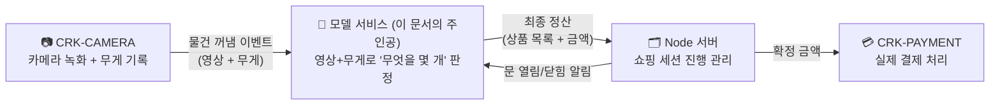
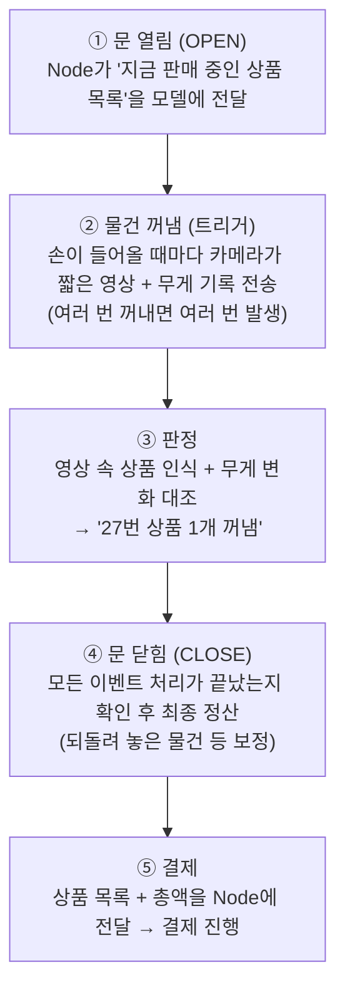

# 01. 서비스 개요

> 대상: AI/개발 비전공자를 포함한 누구나
> 목적: 이 시스템이 무엇을 판단해 매출을 확정하는지, 다른 시스템과 어떤 대화(API)를
> 주고받는지 이해하기
> 최종 갱신: 2026-07-30

---

## 1. 한 줄 요약

**손님이 냉장고 문을 열고 상품을 꺼내 문을 닫으면, 카메라 영상과 무게 센서 기록만으로 "무엇을 몇 개 가져갔는지"를 판단해 결제 금액을 확정하는 AI 소프트웨어**입니다.

편의점처럼 계산대가 없습니다. 손님은 그냥 꺼내서 가면 되고, 판단은 전부 이 시스템이 합니다. 그래서 이 시스템의 정확도가 곧 **매출의 정확도**입니다.

---

## 2. 전체 그림 — 4개의 시스템이 협력합니다

자판기 한 대 안에는 역할이 다른 4개의 소프트웨어가 함께 돌아갑니다.



| 시스템 | 하는 일 | 비유 |
| --- | --- | --- |
| **CRK-CAMERA** | 각 칸(존)의 카메라 영상을 녹화하고 무게 센서 값을 기록. 손이 들어와 물건을 꺼낼 때마다 모델에게 알림 | 눈과 저울 |
| **모델 서비스**<br/>(CRK-model-HG) | 영상과 무게를 종합해 "무엇을 몇 개 꺼냈는지" 판정 | 두뇌 |
| **Node 서버** | 문 열림부터 결제까지 쇼핑 한 번(세션)의 전체 진행을 지휘 | 매장 매니저 |
| **CRK-PAYMENT** | 확정된 금액으로 실제 결제 | 계산원 |

이 모든 것이 자판기 안에 들어 있는 **Jetson**이라는 손바닥만 한 AI 컴퓨터에서 실행됩니다. 영상이 외부 클라우드로 나가지 않고 **기기 안에서 모두 처리**됩니다.

---

## 3. 쇼핑 한 번의 흐름 — "세션"

손님 한 명의 쇼핑 시작부터 결제까지를 **세션**이라고 부릅니다.



포인트 두 가지:

- **꺼낼 때마다 즉시 판정**하지만, 청구는 문이 닫힌 뒤 **한 번에 정산**합니다. 꺼냈다가 도로 넣은 물건, 다른 칸에 잘못 반납한 물건까지 이 마지막 정산 단계에서 바로잡습니다.
- 문이 닫혔다고 바로 정산하지 않습니다. 아직 도착 중인 영상이 있으면 **전부 도착해 처리가 끝난 것을 확인한 뒤** 정산합니다(늦게 온 이벤트가 누락돼 0원 결제가 되는 사고 방지).

---

## 4. AI의 "눈" — 카메라 영상은 어떻게 판독하나요?

### 상품을 알아보는 모델: YOLO

**YOLO**는 사진 한 장을 주면 "어디에 무엇이 있는지"를 네모 박스로 찾아주는, 널리 쓰이는 사물 인식 AI입니다. 우리는 이 모델에 **우리 판매 상품들과 사람 손**을 알아보도록 학습시켜 사용합니다.

- 얼굴 인식이나 신원 파악은 하지 않습니다. 모델이 아는 것은 "상품 종류"와 "손"뿐입니다.
- Jetson에서 빠르게 돌도록 **TensorRT 엔진**이라는 전용 실행 파일(`.engine`)로 변환해 탑재합니다.

### 한 프레임을 믿지 않고 "투표"로 결정합니다

영상은 1초에 수십 장의 사진(프레임)입니다. 한 장의 인식 결과는 틀릴 수 있어도, 수십 장의 **다수결**은 훨씬 안정적입니다. 그래서:

1. **움직임이 있는 프레임만 골라냅니다** (모션 게이트) — 아무 일도 없는 장면에 AI 연산을 낭비하지 않습니다.
2. 골라낸 프레임마다 YOLO로 상품을 인식합니다.
3. **말이 안 되는 검출은 걸러냅니다** (필터) — 예: 옆 칸 영역에서 잡힌 것, 진열된 채 움직이지 않은 것, 손으로 잘못 인식된 것.
4. 살아남은 인식 결과들로 **투표**합니다 — "전체 프레임 중 70%에서 콜라로 인식됨" 같은 득표율과 신뢰도가 높은 상품이 후보가 됩니다.

---

## 5. AI의 "저울" — 무게 센서는 어떻게 쓰나요?

각 칸 바닥에는 **로드셀**(전자저울 부품)이 있어 무게 변화를 그램 단위로 기록합니다.

- 통계 기법으로 무게 그래프에서 "언제, 얼마나 줄었는지" 변화 구간을 찾아냅니다.
- 상품 DB에 등록된 개당 무게와 대조합니다: "192g 줄었네? 개당 64g인 A상품 3개와 일치."

즉 **영상은 "무엇인지"**, **무게는 "몇 개인지 / 정말 가져갔는지"**를 주로 담당하고, 최종 판정은 두 증거를 조합해 내립니다.

### 냉장과 냉동은 역할 분담이 다릅니다

| | 냉장 칸 | 냉동 칸 |
| --- | --- | --- |
| 로드셀 정확도 | 좋음 (±5g) | 나쁨 (성에·저온으로 5~15g 오차) |
| 주도권 | **무게가 주도**, 영상은 후보 제공 | **영상이 주도**, 무게는 검증(거부권)만 |

같은 코드가 칸 종류 설정에 따라 자동으로 다르게 동작합니다.

---

## 6. 판정은 어떻게 내리나요? — "확실한 것부터, 안 되면 포기"

판정 로직은 15개 안팎의 **전략이 우선순위대로 줄 서 있는 구조**입니다. 가장 전제가 확실한 전략부터 차례로 시도하고, 처음으로 답을 낸 전략의 결과를 채택합니다. 대략 이런 순서입니다:

1. 특수 상황 우선 — 예: "냉동 칸 + 영상 후보가 뚜렷함" → 영상 우선 판정
2. 기본 경로 — 영상 후보들과 무게 변화가 딱 맞아떨어지는 조합 찾기
3. 완화 경로 — 허용 오차를 넓혀 재시도, 그래도 애매하면 "일부만 확인됨(PARTIAL)"으로 강등
4. 전부 실패 → **"판정 불가(NO_DETECTION)"로 남기고 억지로 과금하지 않음**

모든 판정 결과에는 **어느 전략이 왜 그렇게 판단했는지 사유가 기록**됩니다. 나중에 "왜 이렇게 청구됐지?"를 추적할 수 있게 하기 위해서입니다.

---

## 7. 가장 중요한 설계 원칙 — "더 받느니 못 받는다" (fail-closed)

오청구는 두 방향이 있습니다: **더 받기(과청구)** 와 **못 받기(미청구)**. 이 시스템은 일관되게 **과청구가 더 나쁘다**는 원칙으로 설계됐습니다. 미청구는 매출 일부의 손해로 끝나지만, 과청구는 고객 신뢰를 잃습니다.

실제 코드 곳곳에 이 원칙이 박혀 있습니다:

- 증거가 애매하면(비슷한 무게의 상품이 둘 이상 등) 추측하지 않고 **판정 불가** 처리
- 처리 중 에러가 난 세션은 **결제 자체를 차단** (조용히 넘어가지 않고 에러로 기록)
- 무게 변화를 전부 설명하지 못하는 판정은 **"완전"이 아닌 "부분"으로 강등** — 확인 안 된 부분은 청구하지 않음
- 문 닫힘 정산 때 4단계 교정: 되돌려 놓은 물건 차감 → 청구 합계가 실제 무게 변화보다 무거우면 감산 → 다른 칸에 반납한 물건 상쇄 → 냉동 칸은 최종 무게로 개수 재확인

---

## 8. API — 시스템끼리 주고받는 메시지

**API**란 프로그램끼리 대화할 때 쓰는 약속된 창구와 메시지 형식입니다. 이 서비스의 창구는 딱 3개입니다.

### ① 상태 확인 — `GET /api/health`

"살아 있니?"라고 물어보는 창구입니다. 모니터링과 장애 확인에 씁니다.

```
요청:  http://자판기주소:8002/api/health
응답:  { "status": "ok", "door_state": "idle", "queue_pending": 0, ... }
```

- `door_state`: 지금 문이 열려 있는지(active), 닫혀 정산 대기 중인지, 대기(idle)인지
- `queue_pending`: 아직 처리 안 끝난 물건 꺼냄 이벤트 수

참고로 서비스는 시동 시 AI 모델을 한 번 실제로 돌려보고, 실패하면 **아예 뜨지 않습니다**. 그래서 이 창구가 응답한다는 것 자체가 "모델이 정상 탑재됨"의 증거입니다.

### ② 문 열림/닫힘 — `POST /api/judge/multi-zone` (Node → 모델)

매장 매니저(Node)가 세션의 시작과 끝을 알리는 창구입니다.

**문 열림(OPEN)** — 지금 이 자판기에서 팔고 있는 상품 목록을 함께 보냅니다:

```json
{
  "session_id": "OPEN",
  "products": [
    { "productIdx": "P001", "name": "콜라", "unit_weight": 64, "price": 1500, ... }
  ]
}
```

이 목록이 중요한 이유: 판정은 **이 목록 안에서만** 답을 고릅니다. 팔지도 않는 상품으로 청구되는 일을 원천 차단합니다. 목록이 비어 있으면 판정 자체를 거부합니다(안전 우선).

**문 닫힘(CLOSE)** — 정산이 끝나면 결제용 응답이 돌아옵니다:

```json
{
  "success": true,
  "status": "success",
  "products": [
    { "productIdx": "P001", "name": "콜라", "count": 2, "price": 1500 }
  ],
  "totalPrice": 3000,
  "zones": [ ... 칸별 상세 ... ]
}
```

정산이 아직 안 끝났으면 "대기 중" 응답이 나가고, Node가 잠시 후 다시 물어봅니다. 확정된 뒤에는 몇 번을 다시 물어봐도 **항상 같은 금액**이 나갑니다(중복 청구 방지).

### ③ 물건 꺼냄 이벤트 — `POST /trigger` (카메라 → 모델)

손이 들어와 물건을 꺼낼 때마다 카메라 시스템이 보내는 창구입니다.

```json
{
  "zone": 2,
  "videos": { "top": "…/top.avi", "side": "…/side.avi" },
  "loadcells": [ { "ts": 1784698526.1, "weight": 1280.5 }, ... ]
}
```

- `zone`: 몇 번째 칸에서 일어난 일인지
- `videos`: 그 순간을 담은 짧은 영상 파일들(위에서 본 카메라 + 옆에서 본 카메라)
- `loadcells`: 그 구간의 무게 기록

같은 이벤트가 실수로 두 번 오면 자동으로 무시합니다(중복 방지). 접수만 즉시 응답하고, 실제 판정은 뒤에서 순서대로 처리합니다.

---

## 9. 기록은 어디에 남나요? — "모든 청구는 재구성 가능해야 한다"

과금이 이상하다는 문의가 오면 근거를 되짚을 수 있어야 합니다. 그래서 두 종류의 기록이 항상 남습니다.

- **운영 로그** — 세션이 확정될 때마다 칸별 무게 변화·상품·금액 요약이 한 줄로 남습니다. 정산 과정에서 교정(감산·상쇄 등)이 있었다면 그 흔적(`notes`)도 함께 남아, 과금이 이상할 때 가장 먼저 봅니다.
- **세션 아카이브** — 세션마다 "영상에서 어떤 후보가 몇 표를 받았는지, 어떤 전략이 왜 채택/탈락시켰는지"까지 판정 근거 전체를 파일 하나로 저장합니다(기본 14일 보관). 이 파일만으로 "왜 이렇게 청구됐는가"를 완전히 재구성할 수 있습니다. 실험 시에는 실제 꺼낸 상품을 정답 라벨로 기입해 정확도 측정과 임계값 보정에도 씁니다.

---

## 10. 용어 사전

| 용어 | 쉬운 설명 |
| --- | --- |
| **세션** | 손님 한 명의 쇼핑 한 번 (문 열림 → 닫힘 → 결제) |
| **존(zone)** | 자판기 내부의 칸. 칸마다 카메라와 무게 센서가 있음 |
| **트리거** | "물건을 꺼냈다"는 이벤트. 영상 + 무게 기록 묶음 |
| **YOLO** | 사진에서 사물을 찾아주는 AI 모델. 우리 상품들을 학습시켜 사용 |
| **TensorRT / .engine** | AI 모델을 Jetson에서 빠르게 돌도록 변환한 실행 파일 |
| **Jetson** | 자판기 안에 들어가는 손바닥 크기의 AI 전용 소형 컴퓨터 |
| **로드셀** | 칸 바닥의 무게 센서 (전자저울 부품) |
| **프레임** | 영상을 이루는 사진 한 장 (1초 = 수십 프레임) |
| **신뢰도(conf)** | AI가 "이건 콜라야"라고 할 때의 확신 정도 (0~1) |
| **투표** | 여러 프레임의 인식 결과를 다수결로 종합하는 방식 |
| **delta(델타)** | 무게 변화량. -64g면 64g짜리를 하나 꺼냈다는 뜻 |
| **배리어** | 문 닫힘 후 "모든 이벤트 처리 완료"를 확인하고 나서야 정산하는 안전장치 |
| **fail-closed** | 애매하면 청구하지 않고, 에러면 결제를 차단하는 안전 우선 원칙 |
| **NO_DETECTION** | "증거 부족으로 판정하지 않음" — 억지 추측 대신 선택하는 결과 |
| **PARTIAL** | 무게 변화 일부만 설명된 판정 — 확인된 부분만 인정 |
| **세션 아카이브** | 세션별 판정 근거 전체를 담은 기록 파일 (사후 분석용) |

---

## 11. 자주 묻는 질문

**Q. 손님 얼굴을 인식하나요?**
아니요. 모델이 학습한 것은 판매 상품과 "손" 뿐이며, 신원 관련 기능은 없습니다.

**Q. 영상이 외부로 전송되나요?**
아니요. 녹화·AI 판정 모두 자판기 안의 Jetson에서 처리됩니다.

**Q. AI가 틀리면 어떻게 되나요?**
설계상 틀릴 것 같으면 "판정 불가"로 물러나 과청구를 피합니다(미청구 방향의 손실은 감수). 틀린 사례는 세션 아카이브로 원인을 재구성해 임계값·모델을 개선합니다.

**Q. 냉장 자판기와 냉동 자판기는 다른 프로그램인가요?**
같은 프로그램입니다. 설정값 하나(`CABINET_TYPE`)로 판정 방식(무게 주도 ↔ 영상 주도)이 전환됩니다.

**Q. 자판기 여러 대에 어떻게 배포되나요?**
자판기마다 Jetson에 이 서비스가 설치되고, 그 기기 전용으로 변환한 AI 엔진 파일을 탑재합니다. 엔진 파일은 기기(하드웨어·소프트웨어 버전)에 종속이라 기기별로 빌드합니다.

---

## 12. 다음 문서

| 궁금한 것 | 문서 |
| --- | --- |
| 시스템 경계와 계층 구조, 처리 흐름 다이어그램 | [02. 시스템 아키텍처](02-system-architecture.md) |
| 판정 규칙과 정산 4층의 상세 | [03. 판정과 정산](03-judgment-and-settlement.md) |
| 현장 배포 설정값 | [04. 설정 레퍼런스](04-configuration.md) |
| 과금이 이상할 때 어디를 보나 | [05. 운영·진단 가이드](05-operations.md) |
| 무엇이 검증됐고 무엇이 남았나 | [06. 검증 보고서](06-verification-report.md) |
