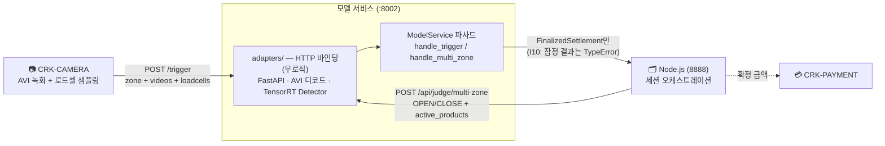
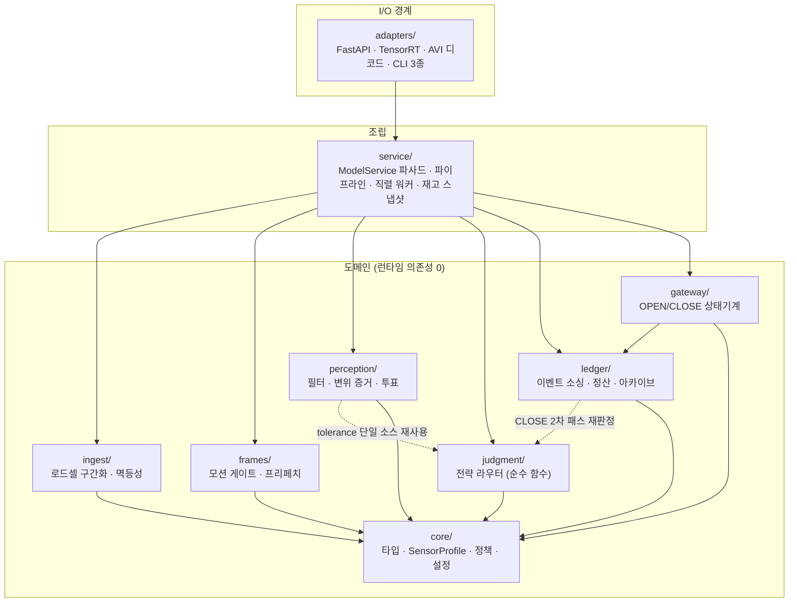
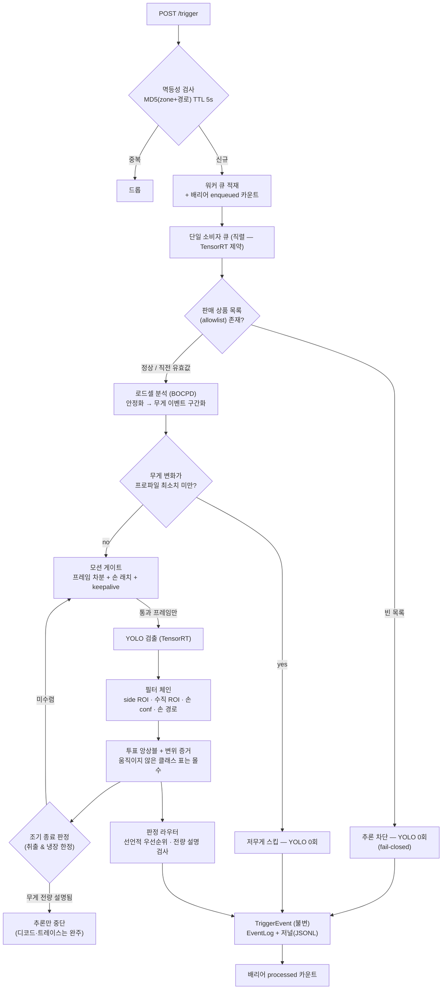
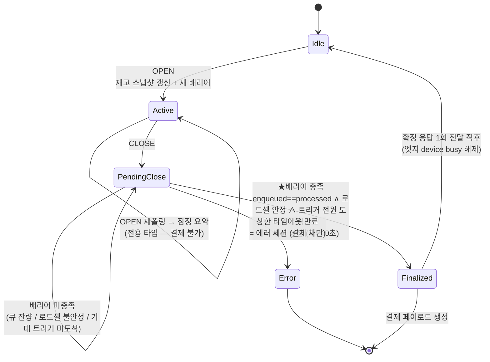
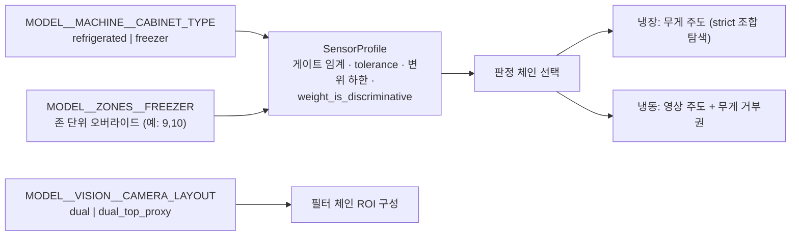

# 02. 시스템 아키텍처

> 대상: 개발자·아키텍트 · 최종 갱신: 2026-07-30
> 선행 문서: [01. 서비스 개요](01-service-overview.md)

---

## 1. 설계 전제

| 항목 | 내용 |
|---|---|
| 구현 형태 | 순수 파이썬 패키지 (`crk_model/`) + 장치 어댑터 (`crk_model/adapters/`) |
| 런타임 의존성 | **코어는 0** — 표준 라이브러리만. YOLO/TensorRT/cv2/FastAPI는 전부 어댑터에서 lazy import |
| 외부 계약 | 레거시 서비스(CRK-model)의 HTTP 계약을 그대로 유지 — Node·카메라 측 변경 불필요 |
| 실행 환경 | Jetson Orin Nano 4GB (JetPack / Ubuntu 22.04), 단일 프로세스 :8002 |
| 동시성 제약 | TensorRT 동시 추론 금지 → **단일 소비자 직렬 워커** (C2) |
| 캐비닛 대응 | 냉장/냉동을 코드 분기가 아니라 **파라미터 프로파일**로 처리 (D3) |

이 저장소는 레거시 서비스의 판정 엔진(단일 파일 10,000행대)을 계층 경계가 있는
9개 패키지로 재설계한 결과물입니다. 재설계 시 확정한 설계 결정 D1~D10과 불변식
I1~I17이 코드 구조 자체에 표현돼 있습니다 → [03. 판정과 정산 §5](03-judgment-and-settlement.md#5-설계-결정과-불변식).

## 2. 시스템 컨텍스트 — 외부 계약

계약 창구는 3개뿐입니다.

| 엔드포인트 | 방향 | 의미론 |
|---|---|---|
| `POST /trigger` | 카메라 → 모델 | 202 접수 즉시 응답, 처리는 워커가 순차 수행. 중복(zone+경로 MD5, TTL 5s)은 드롭 |
| `POST /api/judge/multi-zone` | Node → 모델 | `state=OPEN` 재고 스냅샷 갱신 / `state=CLOSE` 정산 요청 / 무상태 폴링은 진행 상황 반환 |
| `GET /api/health` | 모니터링 | 문 상태·큐 잔량·배리어 충족 여부. 서비스가 응답한다는 것 = 엔진 로드 성공(기동 프로브) |

## 3. 계층 구조와 의존 방향

의존은 **한 방향으로만** 흐릅니다. 각 패키지 경계가 곧 테스트 경계입니다(D10).

점선 2개는 **의도된 하향 재사용**입니다.

- `ledger → judgment` — CLOSE 2차 패스(교차존 페널티·고스트 원장)가 보존된 후보로
  **재판정**하므로 라우터가 필요합니다 (zero-GPU 재계산).
- `perception → judgment` — 조기 종료의 "무게 전량 설명" 판정이 `judge()`와 **같은**
  매처·tolerance를 써야 합니다 (이중 기준 금지). 별도 구현을 두면 두 게이트가
  서로 다른 답을 내는 사고가 납니다.

`ledger/archive.py`에는 타입 힌트 목적의 `service` 참조가 있으나 `TYPE_CHECKING`
블록에 격리돼 런타임 순환이 생기지 않습니다.

| 패키지 | 책임 | 상태성 | 세부 문서 |
|---|---|---|---|
| `core/` | 도메인 타입, 센서 프로파일, 에러 정책, env 설정 | 무상태 | [core/README](../crk_model/core/README.md) |
| `ingest/` | 로드셀 시계열 → 무게 이벤트 구간화, 트리거 멱등성 | 무상태 | [ingest/README](../crk_model/ingest/README.md) |
| `frames/` | 프레임 공급: 모션 게이트, 손 래치, 선행 디코드 | 트리거 내 | [frames/README](../crk_model/frames/README.md) |
| `perception/` | 검출 필터 체인, 변위 증거, 투표 앙상블, 조기 종료 | 트리거 내 | [perception/README](../crk_model/perception/README.md) |
| `judgment/` | 전략 라우터 — "무엇을 몇 개" 결정 (순수) | 무상태 | [judgment/README](../crk_model/judgment/README.md) |
| `ledger/` | 이벤트 소싱, close 정산, 인과 배리어, 저널·아카이브 | 영속 | [ledger/README](../crk_model/ledger/README.md) |
| `gateway/` | 문 세션 상태기계, 결제 페이로드 | 상태기계 | [gateway/README](../crk_model/gateway/README.md) |
| `service/` | 파이프라인 오케스트레이션, 직렬 워커, 파사드 | 조립 | [service/README](../crk_model/service/README.md) |
| `adapters/` | 장치 결합 전부 (lazy import) + 진단 CLI | I/O 경계 | [adapters/README](../crk_model/adapters/README.md) |

규모: 코드 약 10,800행 / 테스트 약 7,900행 (테스트 443건).

## 4. 데이터 평면 — 트리거 1건의 처리

이벤트 구동이며 고정 주기가 없습니다. YOLO 호출 수가 처리 시간을 지배하므로
(실측 `처리시간 ≈ 40ms × YOLO 호출수`), 호출을 줄이는 게이트가 성능의 핵심입니다.

핵심 안전 성질:

- **처리 예외는 무검출이 아니라 에러 이벤트**로 전파됩니다 (I1). 조용한 0원 확정 금지.
- **빈 allowlist에서는 추론하지 않습니다** (I2). 판매 중이 아닌 상품 청구 원천 차단.
- 조기 종료는 **추론만** 멈추고 디코드·손 경로·트레이스는 완주합니다 — 트레이스
  의미가 게이트 조합에 따라 흔들리지 않게 하기 위함입니다.

## 5. 제어 평면 — 세션 확정

레거시는 문 닫힘 후 고정 시간(3s/1s) 대기 후 확정했습니다. 이 구조는 큐가 밀리면
늦게 도착한 트리거를 잃고(0원 확정), 큐가 비었을 때도 불필요하게 기다립니다.
재설계에서는 **인과 배리어**로 바꿨습니다 — 고정 대기는 상한 타임아웃으로 강등.

> **확정의 멱등성은 상태가 아니라 정산기가 보증합니다.** 게이트웨이는 확정
> 응답을 내보낸 그 호출에서 상태를 `Idle`로 되돌립니다 — 엣지 단이 `finalized`
> 상태를 보고 장치를 잠근 실기 사고 때문입니다. 같은 세션을 다시 정산하면
> `CloseSettler`의 멱등 캐시가 **같은 결과 객체**를 돌려줍니다(I11).
> `session_id`는 유지되어 late trigger의 세션 귀속과 사후 추적이 가능합니다.

배리어의 조작적 정의(세 조건 동시 충족):

1. 존별 `enqueued == processed` — 접수한 트리거를 전부 처리했다.
2. 로드셀 안정 — 명시적으로 불안정 보고된 존이 없다.
3. 기대 트리거 전원 도착 — Node가 CLOSE에 존별 녹화 수(`expected_triggers`)를
   실어 보내면 인과적으로 정확해집니다. 없으면 유예 3초 폴백.

## 6. 성능 레버

| 레버 | 상태 | 효과 |
|---|---|---|
| 모션 게이트 | 기본 ON | 변화 없는 프레임의 YOLO 생략. 실패 방향이 "스킵 안 함"이라 정확도 무손실 |
| 조기 종료 | **기본 OFF** (이슈 #22 0805 강등 — opt-in, 취출·냉장 한정) | 전 재고 유일해 + 득표 리드 일치 시에만 남은 프레임 추론 중단. 처리량은 T2 배치가 대체 |
| GPU 텐서 입력 | 기본 OFF (`TENSOR_INPUT=1`) | 프레임별 CPU 전처리(측정 비용의 ~72%) 제거. batch-1 엔진 그대로 사용 |
| 마이크로배치 | 기본 OFF (`BATCH_SIZE=N`) | 게이트 통과 프레임 N장을 1회 추론으로 상각. 정적 batch 엔진 재수출 전제 |
| 디코드 프리페치 | 기본 OFF (`PREFETCH=N`) | top 추론 중 side 디코드를 은닉 |
| 세션 조회 최적화 | 적용 완료 | `analyze-sessions --session` 단건 조회 9.7s → 80ms |

배치·프리페치·텐서 입력은 **판정 비트를 바꾸지 않도록** 단일 `consume()` 경로를
공유하며, 동등성 회귀 테스트로 고정돼 있습니다. 기기 실측(A/B/C/D 매트릭스)은
대기 중입니다 → [08. 인수인계](08-handover.md).

## 7. 냉장·냉동 겸용 구조

캐비닛 분기는 세 가드 뒤에 격리돼 있어, 냉장 기기 투입에 코드 수정이 필요 없습니다.

- **`weight_is_discriminative`** — 냉장은 무게(±5g)가 정체성 판별자, 냉동은
  로드셀 오차(5~15g) 때문에 무게가 거부권만 갖습니다. 냉동 전용 로직은
  precondition에서 스스로 꺼집니다.
- **존 수 가정이 없습니다** — 트리거의 `zone` 필드로만 동작하므로 존이 몇 개든
  무관합니다.
- 냉장 물리 구성이 top 1대 + 존별 side 5대여도 엣지가 존→{top, side} 2스트림으로
  매핑해 주므로 모델 계약은 불변입니다.

## 8. 관측 가능성

모든 청구는 사후 재구성이 가능해야 한다는 원칙에 따라 3층으로 기록합니다.

| 층 | 산출물 | 용도 |
|---|---|---|
| 운영 로그 | `[OPS][CLOSE]` 등 구조화 로그 | 실시간 확인, 알람 |
| 이벤트 저널 | `logs/events_YYYYMMDD.jsonl` (append-only) | 재생(replay) 기반 정산 등가성 검증 |
| 세션 아카이브 | `data/sessions/<날짜>/<세션>.yaml` | 후보·득표·전략·탈락 사유 전체. 오판정 사후 분석의 정본 |

읽는 방법은 [05. 운영·진단 가이드](05-operations.md)에 있습니다.
