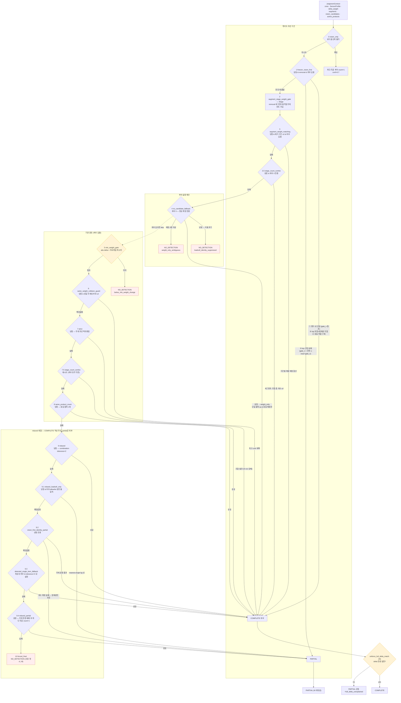
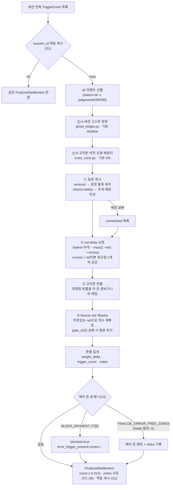

# 03. 판정과 정산

> 대상: 개발·QA · 최종 갱신: 2026-07-30
> 선행 문서: [02. 시스템 아키텍처](02-system-architecture.md)

이 문서는 "무엇을 몇 개 가져갔는가"를 정하는 **판정층**(`crk_model/judgment/`)과,
문이 닫힌 뒤 세션 전체를 한 번에 재해석하는 **정산층**(`crk_model/ledger/`)을
다룹니다. 두 층은 같은 물리 상수(`SensorProfile`)를 공유하고 같은 게이트 산식을
씁니다 — 판정과 정산이 서로 다른 기준을 쓰면 한쪽이 인정한 결과를 다른 쪽이
뒤집습니다.

순서: §1~4 판정 · **§5 설계 결정과 불변식(D1~D10 / I1~I17)** · §6~8 정산 ·
§9 승격 대기와 폐기 항목.

---

## 1. 판정의 두 증거 — 권한 분리와 불변식 I-V

판정에는 증거가 둘뿐입니다 — **영상**(YOLO 투표)과 **무게**(로드셀 delta).
둘의 권한 배분은 캐비닛 종류에 따라 다르며, 그 근거는 센서 물리입니다.

| | 냉장 (`REFRIGERATOR`) | 냉동 (`FREEZER`) |
|---|---|---|
| `tolerance_grams` | 5.0 | 15.0 |
| `count_gate` (I3) | 5.0 (tolerance 상속) | 15.0 |
| `weight_is_discriminative` | **True** | **False** |
| `segment_step_grams` | 5.0 | 20.0 (컴프레서 사이클·드리프트 방어) |
| `min_weight_change_grams` | 5.0 | 5.0 |
| `early_termination_allowed` | True | False (I15) |
| 무게의 역할 | **정체성 판별자** | **거부권만** |

물리 제약(C3): 로드셀(LABD-B3/K3)의 보증 분해능은 5g이고 IO-BOARD 엣지 단이 5g
양자화를 적용합니다 — 냉장에서 5g 미만 임계는 물리적으로 무의미합니다. 냉동고는
노이즈가 **5~15g**이라 "185g인가 170g인가"를 무게로 가릴 수 없습니다. 값은
`crk_model/core/profiles.py`에 코드 상수로 있습니다(env가 아님 — 존 타입별 물리
특성이므로 배포 설정으로 흔들리면 안 됩니다).

### 불변식 I-V (이슈 #15 신설)

> `weight_is_discriminative=False`(냉동)에서 **청구 정체성은 vision 득표 순위에서만
> 유도한다.** 무게의 권한은 ⑴ 지목된 정체성의 개수 산정·검증, ⑵ 정체성의 반증뿐이며,
> 무게 적합성이 정체성을 **선택**하는 경로는 금지된다.

발단은 실사고였습니다 — 득표 1위(65표, conf 0.86)가 3g 차이로 ±15g 게이트를
놓치자 16표짜리 배경 후보가 "무게가 맞아서" COMPLETE로 채택됐습니다. 같은 상품을
2회 연속 취출한 세션이 로드셀 20g 차이 때문에 서로 다른 두 상품으로 과금됐습니다.
±15g 창은 여러 상품이 우연히 걸릴 만큼 넓기 때문입니다.

I-V의 구조적 표현은 **precondition 배제**입니다. 무게로 후보 중 정체성을 고르는
전략 7종 — `segment_weight_matching`, `stage_count_combo`,
`same_weight_collision_guard`, `strict`, `same_product_count`, `relaxed`,
`relaxed_loadcell_only` — 은 냉동 존에서 precondition이 스스로 꺼집니다.
`no_candidate_fallback`은 precondition은 통과하지만 solve가
`loadcell_identity_suppressed`로 **식별 자체를 포기**합니다(무후보 상태에서
전 재고를 대상으로 무게 식별하는 것이 "178g 사건"의 형태였습니다).

냉동에서 정체성을 청구할 수 있는 전략은 `vision_only`,
`freezer_vision_first`, `vision_first_identity_partial`,
`detected_single_item_fallback`(vision 최상위 후보 고정) 넷뿐입니다.

**유일한 예외**는 `freezer_vision_first` ④ 유일-적합 구제입니다 — top 정체성이
결정적으로 반증됐을 때(잔차 > near 밴드), 남은 정체성 중 게이트 내 적합이 **정확히
하나**면 채택합니다. 둘 이상이면 "무게로는 고를 수 없다"는 뜻이므로 불발입니다.

오검출 억제는 지각층(`perception/` — 모션 변위 증거, share floor)의 책임이고
판정층은 득표 순위를 신뢰합니다. 층별 단일 책임을 깨면 같은 방어를 두 곳에서
서로 다른 기준으로 하게 됩니다.

## 2. 전략 라우터

`crk_model/judgment/router.py`의 `default_pipeline()`은 **순서가 데이터(리스트)로
선언**돼 있습니다. 순서를 바꾸려면 리스트 diff 한 줄입니다. 원칙은 "누적 + 특이도
우선" — 특수한 전제를 가진 전략이 앞, 일반 폴백이 뒤입니다.

두 종류의 항목이 섞여 있고, 이 구분이 인터페이스에 표현돼 있습니다
(`judgment/interfaces.py`).

- **Stage** — 판정하지 않고 `JudgmentContext`만 변형합니다 (`apply`).
- **Strategy** — 결정자. `precondition`을 만족하면 `solve`를 시도하고, `None`이면
  다음 항목으로 넘어갑니다. **첫 non-None이 즉시 반환**됩니다.



### I6 — 전량 설명 검사는 라우터가 전건 적용

`enforce_full_delta_match`는 전략이 아니라 **라우터**가 모든 반환값에 적용합니다.
`abs(explained_weight − abs(delta_weight)) > tol_n`이면 COMPLETE를 PARTIAL로
강등하고 reason에 `+full_delta_unexplained`를 붙입니다. **부분만 설명하고
전액 청구하는 것을 금지**하는 장치입니다.

두 가지 주의점이 있습니다.

- `tol_n = tolerance + count_unit_slack × (n−1)` — 냉동 존에서만 slack이 전달되고
  냉장은 항상 flat(slack=0)입니다. 냉동에서 `gate_n`으로 적합을 인정해 놓고 I6이
  flat tolerance로 강등하면 두 게이트가 서로 모순되기 때문입니다.
- `ctx.vision_only=True`인 경로는 **I6을 거치지 않습니다** — 설명할 delta 자체가
  없는 상태이기 때문입니다.

전략이 `None`을 반환하면 라우터가 `miss_log`에 `{name}_mismatch`를 남기고(deque,
상한 256), 채택된 전략은 `telemetry` 카운터를 올립니다. 실전에서 안 맞는 전략을
데이터로 제거할 근거가 여기서 나옵니다. 파이프라인이 소진되는 경우는 구조상
없지만(`forced_final`이 항상 잡습니다) 방어적으로 `pipeline_exhausted`를 반환합니다.

## 3. 전략별 요약

세션 아카이브 YAML의 `judgment.strategy`와 `[OPS][CLOSE]`의 `judgments=`에
찍히는 값이 아래 **이름(name)** 그대로입니다. `judgment.reason`은 더 세분화된
코드입니다(예: `freezer_vision_first`의 reason은 `_single` / `_single_arbitrated` /
`_near_gate` / `_combo` / `_unique_refit` / `_refit_arbitrated` 6종).

| 순위 | 이름 | 전제 (precondition) | 무엇을 결정하나 | 실패 시 |
|---|---|---|---|---|
| 0 | `vision_only` | `vision_only=True` | 최다 득표 후보 count=1, conf×0.7 | 후보 없으면 `no_vision_candidates` NO_DETECTION (확정 반환) |
| 1 | `freezer_vision_first` | 냉동 & 후보 있음 & delta<0 | 정체성=vision top, 개수=무게 게이트. 4단계(①단일 ②근접 PARTIAL ③조합 ④유일-적합) | → 9.2 (정체성 보존 partial) |
| 2 | `augment_stage_weight_gate` | **Stage** — 결정자 아님 | `stage_hints["segment_targets"]` 주입 (removal 세그먼트별 목표 무게) | 해당 없음 (removal 세그먼트 없으면 무변경) |
| 3 | `segment_weight_matching` | 냉장 & removal 구간 ≥2 & 후보 있음 | 구간별로 개별 매칭해 합산 — 합계로는 모호한 조합을 시계열로 분해 | 한 구간이라도 실패 → 다음 |
| 3.5 | `stage_count_combo` | 냉장 & 후보 **0** & 세그먼트 목표 ≥2 | 세그먼트 단위 개수 조합 (총 개수 ≥2만 채택) | → 4 |
| 4 | `no_candidate_fallback` | 후보 0 & `vision_only=False` | 냉동: 식별 포기(`loadcell_identity_suppressed`) / 냉장: 단일 품목 (p,n) 유일 매칭만 | **항상 확정 반환** — 후보없음 체인의 종점 |
| 5 | `min_weight_gate` | 후보 있음 & `abs(delta) < min_weight_change` | 저무게 변화 → NO_DETECTION | 해당 없음 (확정 반환) |
| 6 | `same_weight_collision_guard` | 냉장 & 후보 있음 & delta<0 | 동일 무게대 후보 2개 이상 충돌 시 최고 conf 채택 | 충돌 아님 → 다음 |
| 7 | `strict` | 냉장 & 후보 있음 | 무게 우선 백트래킹 조합(최대 6개/3종), I5·I12는 탐색 공간에서 강제 | `strict_mismatch` → 7.5 |
| 7.5 | `stage_count_combo` | 냉장 & 세그먼트 목표 ≥2 | 위와 동일 (strict 실패 후 구제) | → 8 |
| 8 | `same_product_count` | 냉장 & 후보 있음 | 동일 품목 n개(n≥2) 중 무게 오차 최소 | → 9 |
| 9 | `relaxed` | 냉장 & 후보 있음 | tolerance×2로 조합 재시도, conf×0.8 (I6이 다시 강등할 수 있음) | → 9.1 |
| 9.1 | `relaxed_loadcell_only` | 냉장 & 후보 있음 & **모든 후보가 allowlist 불일치** | 전 재고 nearest-single, 5g 내만, count=1 PARTIAL | 5g 초과 → 9.2 |
| 9.2 | `vision_first_identity_partial` | 냉동 & 후보 있음 & delta<0 | 무게 검증 통과 시 COMPLETE(`vision_identity_weight_validated`), 실패 시 정체성만 count=1 PARTIAL | 청구 conf < 하한이면 **폴스루 없이 None** |
| 9.3 | `detected_single_item_fallback` | 후보 있음 & delta<0 (프로파일 무관) | vision 최상위 후보 1종만 확인, tolerance×3 내면 구제. conf 상한 0.65 | → 9.4 |
| 9.4 | `relaxed_partial` | 냉장 & 후보 있음 | **무게 반증 거부권**(단위무게 > 최대 removal 관측량 + tolerance×3인 후보 배제 — 이슈 #22) 후 최다 득표 count=1 PARTIAL, conf×0.5 | 생존 후보 없음 또는 청구 conf < 하한이면 **폴스루 없이 None** |
| 10 | `forced_final` | 항상 True | `forced_final_no_match` NO_DETECTION | — |

두 가지 설계 판단을 명시해 둡니다.

- **9.1~9.4의 순서는 레거시와 의도적으로 다릅니다.** 레거시는 `relaxed`가 자체
  partial(count=1)까지 반환해 버려 뒤의 폴백들이 사실상 도달 불가였습니다.
  "무게로 뒷받침된 count 격상"이 "무게 미검증 count=1"보다 결제 정확도상 우선해야
  하므로, `relaxed_partial`을 최종 폴백(9.4)으로 내렸습니다. 근거는
  `crk_model/judgment/router.py` docstring에 기록돼 있습니다.
- **conf 하한 미달 시 하위 후보로 폴스루하지 않습니다.** 폴스루하면 "청구되는
  후보"를 증거 순위가 아니라 하한 통과 여부가 고르게 되는 **후보 쇼핑**이 됩니다.
  유일한 예외는 9.4의 무게 반증 거부권(이슈 #22) — 증거 강도가 아니라 물리적
  배제(단위무게상 1개 취출조차 불가능)라 배제 후 남은 서열대로 고르는 것이 맞고,
  conf 하한은 생존 후보에 다시 폴스루 없이 적용됩니다.

## 4. 판정 노브

값은 `crk_model/core/config.py`(`Settings`)에서 확인하고, `ModelService`가
`FreezerVisionFirstStrategy`·`JudgmentRouter`에 주입합니다. 모든 노브는 "구 동작으로
되돌리는 센티널"을 갖습니다 — 실기에서 문제가 생기면 코드 배포 없이 롤백합니다.

| 노브 (env `MODEL__JUDGMENT__*`) | 기본값 | 하는 일 | 막는 실기 사고 | 비활성 값 |
|---|---|---|---|---|
| `SINGLE_SHARE` | 0.5 | ① 단일 적합 시도 자격: top 득표의 이 비율 이상 | 득표 1위가 3g 차로 게이트를 놓치면 16표 배경 후보가 "무게가 맞아서" 채택되던 경로 (이슈 #15) | 1.0 (top만) |
| `COMBO_SHARE` | 0.3 | ③ 조합 멤버 자격 하한 | 배경 후보가 오염 잔차의 filler로 끼어드는 것 — 메로나 79g×3 (이슈 #10) | 1.0 |
| `NEAR_FACTOR` | 2.0 | ② `gate_n`의 이 배수까지를 접촉 하중 오염 마진으로 간주 | 실측 8~18g 오염 delta 때문에 top 정체성을 **교체**해 버리는 것. 정체성·개수 보존 PARTIAL로 착지 | 1.0 |
| `REFIT_SHARE` | 0.1 | ④ 유일-적합 구제 자격 하한 | 3표(top 171표의 1.75%) 멜로나가 79×3=237로 유일 적합이 되어 COMPLETE 채택 (ses-1-1783924418) | 1.0 |
| `COUNT_UNIT_SLACK` | 5.0 | `gate_n(n) = count_gate + slack×(n−1)` — 판정·정산 공용 산식 | flat ±15g가 n≥4에서 정답 상품의 자기 적합을 깨고 우연 적합(5×155 ≈ 4×185)에 확정을 넘김 — 베이글 5개 → 만두 4개 오과금 (이슈 #16) | 0 (flat) |
| `CONF_OVERRIDE` | 0.9 | ① share 미달이어도 이 conf 이상(+`REFIT_SHARE` 득표)이면 적합 시도 자격. ④ 중재 포화 해제 문턱도 겸함 | 진열 오염이 득표 순위를 왜곡한 경우 — conf 1.0의 진짜 상품 19표 vs 오염 63표 | 2.0 |
| `CONF_MARGIN` | 0.15 | ①·④ 복수 적합 중재에서 conf가 득표 서열을 뒤집는 최소 격차 | 최다 득표 적합이 오염이고 최고 conf 적합이 정답인 경우 | 2.0 |
| `PARTIAL_MIN_CONFIDENCE` | 0.18 | 무게 미검증 count=1 partial 청구의 conf 하한 (9.2·9.4) | 5표/청구 conf 0.157짜리 identity partial이 잔차 65g 오상품을 과금 (ses-3-1784788285) | 0 |
| `PARTIAL_IMPOSSIBLE_FACTOR` | 3.0 | 9.4 무게 반증 거부권 — 단위무게가 최대 removal 관측량 + tolerance×이 계수를 넘는 후보는 청구 부적격(냉장 전용) | 다종 동시 취출의 교차존 오염 표로 득표 1위가 된 이웃 존 상품(525g)이 Δ-80g 이벤트에 count=1 청구 — 1개 취출조차 물리적으로 불가능 (이슈 #22 ses-4 z3) | 0 |
| `REFIT_ARB_CONF_FLOOR` | 0.8 | ④ 복수 적합 중재 승자의 **절대** conf 하한 | margin 우세만으로는 "덜 흐린 유령"이 이긴다 — 13(conf 0.69)이 24(0.35)를 꺾고 오과금(ses-1-1784791905 ch1). 정당 케이스(ses-3-1784790444 ch0)는 0.82 | 2.0 |
| `COUNT_OCCAM` | 1 | ① 개수 오컴 — n=1 적합이 있으면 그보다 잘 맞지 않는 n≥2 적합을 실격 | 저중량 상품이 n을 키워 아무 중량대나 덮는 "만능 filler" — 잭슨빌 155×1(잔차 0)이 라라스윗 70×2(잔차 15)에 득표로 패배 (0730 시나리오 실패 6/7건) | 0 |
| `STRICT_COUNT_OCCAM` | 1 | 위 규칙의 **냉장 strict판** — `StrictWeightMatcher`가 단일 종 n≥2 조합을 n=1 적합보다 엄격히 잘 맞을 때만 유지 (매처 소비 전략 전부·multi_tray 채널 포함) | Δ-275에서 오로나민×1(잔차 0)과 단백질바 55×5(잔차 0)가 동률 → match_score의 conf 항만으로 ×5 승리, 54x6 오과금 (이슈 #23 0806 3-1) | 0 |
| `SEGMENT_COMBO` / `SEGMENT_COMBO_MIN_SEGMENTS` | 0 / 2 | ①⁺ 세그먼트 근거 조합 도전 — removal 세그먼트가 분리 취출을 증언할 때만 ③ 조합이 ①의 ×N 확정을 뒤집음 | 단위무게가 비슷한 2종을 1개씩 꺼낸 delta가 항상 ×N 단일로 확정 — 메로나 80+월드콘 70 = −150 → 월드콘×2 (0730 2-4). 실측 1건이라 **기본 off** | 0 |

출처: 위 실측 수치는 `docs/devdoc/fix_logs.md`의 이슈 #10·#15·#16·#22 및 0731 항목과
`crk_model/judgment/strategies.py`의 각 노브 주석에 근거가 남아 있습니다.

### conf 중재의 상한 포화

conf 척도는 천장에서 압축됩니다. `vt conf = 0.855`면 `+margin(0.15) = 1.005`가
되어 **어떤 후보도 margin 우세가 원리적으로 불가능**해집니다(실기 ses-10 z1:
정답 conf 1.0이 패배). 그래서 중재 문턱을 `min(0.99, rival + margin)`으로
포화시킵니다.

단 두 경우는 포화하지 않습니다.

- `margin ≥ 1.0` — 비활성 센티널이므로, 포화하면 conf ≥ 0.99 후보가 비활성
  설정에서도 중재를 발동해 버립니다.
- `rival conf ≥ CONF_OVERRIDE(0.9)` — 둘 다 천장권이면 conf 차이는 압축 노이즈이고
  득표가 판별자입니다. 8차 ses-4에서 vt 0.96/126표의 정답을 bc 1.0/66표의 반납
  상품이 포화 중재로 뒤집은 실사고 대응입니다.

### ③ 조합만 flat 게이트인 이유

`gate_n`(n-스케일)은 ①(동일 정체성 n개)과 ④(유일-적합)에만 적용하고, ③ 조합의
개수 배분 열거(`_allocations`)는 **의도적으로 flat 게이트**를 유지합니다. 조합은
우연 적합 공간이 조합적으로 커지고, 실사고(#10 메로나 filler)가 조합형이었습니다.

## 5. 설계 결정과 불변식

재설계 시 확정한 설계 결정 D1~D10과 불변식 I1~I17(+I-V)은 **예외 처리가 아니라
구조**로 표현돼 있습니다. 대부분은 실제 사고(오과금·매출 누락)의 재발 방지책입니다.

### 설계 결정 D1~D10

| 결정 | 채택안 | 구현 위치 |
|---|---|---|
| D1 확정 모델 | 인과 배리어(I17), 고정 debounce는 상한 타임아웃으로 강등, 만료 시 에러 세션 | [`ledger/barrier.py`](../crk_model/ledger/barrier.py), [`gateway/state_machine.py`](../crk_model/gateway/state_machine.py) |
| D2 공통 시간축 | 카메라 seq 워터마크 (선택 — 없어도 동작) | `barrier.set_close_watermark`, `TriggerEvent.seq` |
| D3 판정 구조 | Stage/Strategy 분리 + 선언적 순서 + `SensorProfile` 파라미터화 + 전략 텔레메트리 | [`judgment/`](../crk_model/judgment/), [`core/profiles.py`](../crk_model/core/profiles.py) |
| D4 구간화 위치 | ingest 소속, stabilize 후 순서 고정. primary는 BOCPD(2026-07-23 승격), plateau는 롤백 스위치 | [`ingest/loadcell.py`](../crk_model/ingest/loadcell.py), [`ingest/bocpd.py`](../crk_model/ingest/bocpd.py) |
| D5 정산 구조 | 이벤트 소싱 + close-time **단일** 정산기 (구/신 병행 diff는 승격 완료로 은퇴) | [`ledger/settler.py`](../crk_model/ledger/settler.py), [`ledger/journal.py`](../crk_model/ledger/journal.py) |
| D6 프레임 공급 | 모션 게이트 + 손 래치 + keepalive + 냉동 별도 임계 | [`frames/motion_gate.py`](../crk_model/frames/motion_gate.py) |
| D7 조기 종료 | removal·비냉동 한정, `judge()`와 tolerance 단일 소스 | [`perception/early_termination.py`](../crk_model/perception/early_termination.py) |
| D8 배치 | 기본 OFF, 고정 배치 + 패딩, 카메라 분리. **파이프라인의 마이크로배치 루프로 구현** (설계 단계의 `frames/batch.py` 수집기는 2026-07-30 삭제) | [`service/pipeline.py`](../crk_model/service/pipeline.py), [`adapters/yolo_detector.py`](../crk_model/adapters/yolo_detector.py) |
| D9 에러 세션 | 계약 enum, 기본 fail-closed | [`core/policy.py`](../crk_model/core/policy.py), `ledger/settler.py` |
| D10 모듈 경계 | 모듈 경계 = 테스트 경계 | 패키지 구조, `tests/` |

### 불변식 I1~I17

| 불변식 | 내용 | 구현 위치 |
|---|---|---|
| I1 | 처리 실패는 무검출이 아니라 `status="error"` 이벤트 — 조용한 0원 확정 금지 | `service/pipeline.py`(except 절), `ledger/events.py`, `adapters/avi_frames.py` |
| I2 | 빈 allowlist에서 추론 금지 (fail-closed) + `last_valid` 폴백 | [`service/snapshot.py`](../crk_model/service/snapshot.py) |
| I3 | 냉동 개수 게이트(±15g) — **판정·정산 양쪽** 필수. 정산에서 게이트 실패 시 재solve 확정 금지 | `core/profiles.py`, `judgment/strategies.py`, `ledger/settler.py` |
| I4 | conf 하한은 카메라별 투표 결합 **후**에만 — 검출 단계(conf 0.01)에서 자르지 않음 | `perception/detector.py`, `perception/filters.py`, `perception/voting.py` |
| I5 | 품절(`stock_qty=0`)·미검출 후보는 탐색 공간에서 원천 배제 | `judgment/strict.py`, `judgment/strategies.py`(`_product_by_class`) |
| I6 | `enforce_full_delta_match` 라우터 전건 적용 — 부분 설명 과금 금지 | [`judgment/strategies.py`](../crk_model/judgment/strategies.py), `judgment/router.py` |
| I7 | 트리거 멱등 TTL(MD5 zone+경로) + 단일 소비자 큐 | [`ingest/idempotency.py`](../crk_model/ingest/idempotency.py), `service/worker.py` |
| I8 | 모든 판정·정산·배리어 미충족에 기계 판독 가능한 사유 코드(reason/notes/pending) | `core/types.py`, `ledger/settler.py`, `ledger/barrier.py` |
| I9 | 924 시나리오 계약은 게이트 G1에서 인수 (코드가 아니라 검증 항목) | → [06. 검증 보고서](06-verification-report.md) |
| I10 | `InterimSummary`/`FinalizedSettlement` 타입 분리 — 결제 빌더가 잠정 타입을 `TypeError`로 거부 | [`core/types.py`](../crk_model/core/types.py), `gateway/state_machine.py` |
| I11 | 정산 멱등 (`session_id` → 항상 같은 객체) + 확정 후 유입 이벤트는 거부하고 기록 | `ledger/settler.py`, `ledger/events.py` |
| I12 | `count ≤ stock_qty` — 탐색 공간에서 강제 | `judgment/strict.py`, `judgment/strategies.py`, `ledger/settler.py` |
| I13 | 에러 트리거를 안은 세션의 무성 확정 금지 (D9 정책으로만 처리). 저증거 청구 금지도 같은 태도 | `core/policy.py`, `ledger/settler.py`, `judgment/strategies.py` |
| I14 | 반품 정산이 존별 count를 음수로 만들 수 없음 (환수 > 청구 금지) | `ledger/settler.py`(`_Basket.remove_one`) |
| I15 | 조기 종료는 removal·비냉동에서만 | `core/profiles.py`, `perception/early_termination.py` |
| I16 | 손 래치 활성 중 프레임 스킵 금지 | [`frames/motion_gate.py`](../crk_model/frames/motion_gate.py), `perception/filters.py` |
| I17 | 세션 확정은 시간이 아니라 인과 배리어 충족으로 | `ledger/barrier.py`, `gateway/state_machine.py`, `service/worker.py` |
| **I-V** | 냉동에서 무게는 정체성을 **선택**할 수 없다 (개수 산정·검증·반증만) — §1 | `judgment/strategies.py`(전략별 precondition) |

## 6. close 정산 4층

문이 닫히면 `crk_model/ledger/settler.py`의 `CloseSettler.settle()`이 세션 전체
이벤트를 **한 번에** 재해석합니다. 트리거별 판정은 손대지 않고(잠정 결과는 그대로
남습니다) 확정 입력만 보정합니다 — I10 정합.



| 층 | 하는 일 | 실패하면 | 실패 방향이 안전한 이유 |
|---|---|---|---|
| ⓪ 2차 패스 | 세션 스코프 증거로 판정 입력을 강등·재판정 (§8) | 재판정이 COMPLETE가 아니면 **원 판정 유지** | "보정하려다 더 나빠지는" 경로를 구조적으로 차단. 페널티 후에도 오염 후보가 이기면 그대로 인정 |
| ① 동존 즉시 | ts 순으로 removal 품목 축적, 반품(+delta)은 단일 무게 → 2개 조합 순으로 매칭 차감 | 차감 없이 `unmatched`로 이월 | 무게가 안 맞는데 아무 상품이나 차감하면 **매출이 사라집니다**. 이월된 반품은 ②·③이 다시 처리 |
| ② net-delta 교정 | 존 청구 합계가 로드셀 순변화보다 무거우면 최근접 상품을 1개씩 감산 (`net_delta_correction`) | 감산 후보 없으면 중단 | 감산 대상을 `unit_weight ≤ excess + tol`로 제한 — 초과분보다 무거운 품목을 지워 과소 청구로 넘어가지 않습니다 |
| ③ 교차존 반품 | 미매칭 반품을 **다른 존** 장바구니와 매칭 (존 착오 반납) | `unmatched_return:zone{N}:{+X.Xg}` note만 남김 | 임의 차감 대신 근거를 남깁니다. **4층 중 유일하게 실패가 과청구 잔여 위험**이므로 이 note는 운영 확인 대상입니다 |
| ④ freezer net 재solve | 냉동 존을 close 시점 순변화로 재해석 — 단일 종 ×N 스냅, 콤보 중재(§7) | `gate_n` 실패 → `freezer_close_gate_failed:keep_incremental`, 2품목 이상 → `freezer_close_multi_kind:keep_incremental` | 증분(트리거별) 판정 결과를 유지합니다. 다품목 조합 재solve를 아예 금지해 "178g 사건"형 무게 기반 오식별을 원천 차단 |

④의 세부 분기:

- `net ≥ −gate` (순변화 사실상 0, 전량 반품 포함) → 청구 클리어
  (`freezer_close_resolve:zone{N}:net~0->clear`).
- 단일 종이면 `count = round(−net / unit_weight)`를 계산하고
  `1 ≤ count ≤ stock_qty` (I12) ∧ 잔차 ≤ `gate_n(count)` (I3)일 때만 스냅 확정
  (`freezer_close_resolve:zone{N}:{상품ID}={n}`). 이것이 **정상 경로**입니다 —
  증분 합보다 net이 정확합니다.
- 존 2품목 이상은 재solve하지 않습니다.

정산 층의 tolerance·게이트는 전부 존 프로파일에서 옵니다. 존이 `profiles` 맵에
없으면 `default_profile`(기기 단위 `MODEL__MACHINE__CABINET_TYPE`)로 폴백합니다 —
판정과 정산의 단일 소스 원칙을 지키기 위해 `ModelService`가 주입합니다.

두 가지 알려진 근사가 있습니다.

- `_notes_for_zone`은 note 문자열의 `zone{N}:` / `zone{N}->` 패턴으로 존을 귀속시키는
  **근사 매칭**입니다. `cross_zone_return`은 origin 존 표기가 앞에 오므로 origin
  쪽에만 귀속됩니다(도착 존 완전 매칭은 하지 않습니다).
- `interim_summary()`(폴링 응답)는 **① 동존 층만** 반영합니다. 결제로 전달할 수
  없는 타입(I10)인 이유가 여기 있습니다.

note 코드 해석표는 [05. 운영·진단 가이드](05-operations.md)에 있습니다.

## 7. freezer close 콤보 중재와 5중 가드

**왜 콤보 중재가 있는가.** 무게 잔차만으로는 게이트 안에서 동률인 두 가설을 가를
수 없습니다 — "단일 종 ×N" vs "2종 조합". 2026-07-23부터 7회 반복된 실사고가
`3 + 44` 취출을 `44×4` 스냅으로 확정한 앨리어싱이었습니다. 이때의 선택권은
무게가 아니라 vision입니다("무게=거부권, 선택=vision" — §1과 같은 원칙).

`_vision_combo`의 선택 기준 순서가 이 기제의 존재 이유를 그대로 보여줍니다.

```
① 커버한 표 합 최대 → ② 트리거 증분과의 개수 편차 최소 → ③ 잔차 최소 → ④ 총 개수 최소
```

잔차를 1순위로 두지 않습니다. 게이트 안이라면 무게는 이미 거부권을 행사하지 않은
것이고, `3+44`(잔차 8.5) vs `44×4`(잔차 0)의 선택은 c3의 실존 표와 판정 증거가
해야 합니다. 콤보 탐색은 `count ≥ 2` 스냅이거나 게이트 실패(`snap_ok=False`)일 때만
시도합니다 — N=1 정상 스냅은 탐색 대상이 아닙니다.

**그런데 콤보가 정답을 뒤집었습니다.** 2026-07-27 12~14차 배치에서 판정층이 맞춘
존을 콤보 재solve가 반대로 뒤집는 사고가 **연속 6건** 났습니다
(출처: `docs/devdoc/fix_logs.md` "2026-07-27 12~14차 배치").

| 배치 | 세션 | 뒤집힌 결과 |
|---|---|---|
| 12차 | ses-11 | `13x2` → `13x1+24x1` |
| 12차 | ses-3 | `3x4` → `3x3+30x3` |
| 12차 | ses-5 | z1 / z3 |
| 13차 | ses-20 | `23x4` → `13x1+23x3` |
| 14차 | ses-1 | `3x4` → `3x3+30x3` |
| 14차 | ses-2 | `13x4` → `13x3+24x1` |

원인은 콤보 재료가 될 소수 클래스의 자격 요건이 **"표 3개 이상"**(`_COMBO_VOTE_FLOOR`)
하나뿐이었다는 것입니다. 그 문턱은 ① 오분류 플리커(7~9표), ② 멀티존 공유 영상으로
유입된 타존 표, ③ 판정층이 이미 명시적으로 기각한 클래스를 전부 통과시킵니다.
게다가 정산은 판정보다 **적은 정보**(무게 산수)만 보는데도 잔차가 몇 g 작다는
이유로 판정을 덮을 수 있었습니다(13차 ses-20: 잔차 2g vs 스냅 11g).

### 5중 가드

| # | 가드 | 판정 기준 | env |
|---|---|---|---|
| ① | **실존 증거 하한** (12차) | top 대비 득표율 ≥ 0.5 **또는** conf ≥ 0.8 — "많이 보였거나 확실하게 보였거나". 제외 사유 `low_evidence` | `MODEL__CLOSE__COMBO_MIN_VOTE_RATIO` / `..._MIN_CONF` |
| ② | **교차존 설명 제외** (12차) | 다른 존의 **무게 뒷받침 과금**이 이미 설명한 클래스는 재료 금지 (동시 멀티존 취출의 공유 영상 표 유입 차단). 사유 `other_zone_backed` | `MODEL__CLOSE__COMBO_SESSION_GUARD` |
| ③ | **고스트 제외** (12차) | `ghost_ledger`가 유령으로 검출한 클래스 금지. 사유 `ghost` | 같음 |
| ④ | **판정 기각 존중** (13차 → 14차 일반화) | 이 존의 COMPLETE 과금 클래스보다 **표가 많거나 같은 미과금 클래스는 전부 판정의 명시적 기각**으로 간주. 콤보가 추가할 수 있는 건 과금 클래스보다 표가 적은 진짜 소수 클래스뿐. 사유 `rejected_by_judgment` | 같음 |
| ⑤ | **확신 스냅 보호** (14차) | 게이트 **안** 스냅을 콤보가 뒤집으려면 존 판정(COMPLETE) conf < 0.95. 오버라이드 오답 6건은 전부 conf 0.96~1.0, 보호 케이스는 0.90/0.72 | `MODEL__CLOSE__COMBO_OVERRIDE_MAX_CONF` (>1로 비활성) |

콤보 자체를 끄는 스위치는 `MODEL__CLOSE__VISION_COMBO=0`입니다.

세부 규칙 세 가지를 짚어둡니다.

- ④의 판단 기준은 **제외 적용 전** 원본 풀의 득표 1위입니다 — "판정이 무엇을
  보고도 기각했는가"를 판별해야 하기 때문입니다. 과금 클래스가 풀에 없으면
  (`weight_only` 등) 득표 1위만 기각으로 간주하고, 존에 COMPLETE 과금이 없으면
  (partial 등) 이 규칙은 미적용입니다.
- ①의 top 기준은 ②·③·④ 제외를 적용한 **뒤** 남은 풀입니다.
- ⑤는 `snap_ok=True`(게이트 안)일 때만 작동합니다. 게이트 실패 구제
  (`snap_ok=False`)는 이 규칙과 무관하게 기존대로 동작합니다.

**실패 방향은 전부 "콤보 미형성 = 비전 판정 유지"** 라서 fail-safe 쪽으로만 틀어집니다.
알려진 트레이드오프: 같은 클래스를 두 존에서 동시에 집는 세션에서 한쪽 판정이 그
클래스를 놓치면 콤보 구제도 막힙니다.

**관측 장치.** 가드의 정오를 실측할 수 있도록 두 note를 남깁니다.

- `freezer_combo_suppressed:zone{N}:{조합}:excluded=class{cid}({사유})` — 자격 제외가
  없었다면 나왔을 조합이 억제된 경우 (`guarded=False`로 한 번 더 계산해서 비교).
- `freezer_combo_rejected_confident_snap:zone{N}:{조합}:conf={c}` — ⑤로 기각된 경우.

회귀 안전: 보호 케이스(`3+44 → 44x4` 앨리어싱 구제)의 c3은 57% 득표 또는 conf 0.89로
자격을 유지하고, 표 시그니처(8표 < 14/46표)가 규칙 ④의 "소수 클래스" 정의와 정확히
일치합니다.

## 8. CLOSE 2차 패스 2종

두 기제 모두 **판정 결과를 바꾸는 것이 아니라 판정 입력(vision 후보)을 강등한 뒤
재판정**합니다. `TriggerEvent.vision_candidates`가 채택되지 않은 후보까지 보존하므로
**zero-GPU 순수 CPU 재계산**입니다. CLOSE 시점에 두는 이유는 워터마크 덕분에 이
시점에는 늦게 도착한 연장 병합 이벤트까지 전부 `EventLog`에 있다는 것입니다 —
온라인 순차 처리로는 존 간 POST 도착 역전을 다룰 수 없습니다.

실행 순서는 **고스트 → 교차존**입니다. 유령 후보를 먼저 강등해 두면 교차존 재판정의
채택 후보에서도 밀려납니다(진짜 상품을 강등한 뒤 유령을 채택하는 사고 차단).

### 8-1. 교차존 비전 오염 페널티 — 기본 ON

`crk_model/ledger/cross_zone.py` · Phase 3 승격 완료(2026-07-21) ·
`MODEL__CROSS_ZONE__PENALTY_ENABLED=0`으로 비활성.

**문제**: zone1 세션이 유지되는 중 zone2 취출이 일어나면, zone2 판별용 AVI의
프리롤(4s)·라이브 구간에 zone1 취출 장면이 **물리적으로** 섞입니다. zone2의 로드셀은
존별 슬라이스라 오염되지 않으므로 조정 대상은 비전 점수뿐입니다.

**오염 창**: `W(E) = [min(anchors) − replay_s − ε, max(anchors) + trigger_s + ε]`.
앵커는 `change_timestamps` → `segments.start_ts` → `ts` 순으로 폴백하며, 세 경우 모두
IO-BOARD 클럭 축이라 존 간 비교가 가능합니다(프레임 인덱스 환산은 금지). 기본값은
replay 4.0 / trigger 4.0 / ε 1.0으로 카메라 계약과 단일 소스입니다.

**안전장치 3중 방어**

| 장치 | 내용 | 기본값 |
|---|---|---|
| 소스 신뢰도 게이트 (θ) | 무판정이거나 `confidence < θ`인 소스는 페널티 소스로 인정하지 않음 — 오판 전파 차단. 창은 겹쳤는데 θ에서 탈락하면 `cross_zone_source_low_conf`, 소스 자격 이벤트가 있는데 창(앵커 ±5s)이 안 겹치면 `cross_zone_no_overlap:zoneM@dt=…`(이슈 #23 — 순차 취출 간격 >5s에서 기제가 원리적으로 미발동함을 아카이브만으로 판별) note로 침묵 진단 | `SOURCE_CONF_MIN=0.35` |
| 무게 모호성 게이트 | `abs(delta)`를 게이트 내로 설명하는 (상품, 개수) 해가 **2종 이상**일 때만 페널티 발동. 무게가 유일 해를 지지하면 개입하지 않음 (무게 단서 > 비전 페널티). 이 KEEP은 **원 판정이 COMPLETE일 때만** — "무게 매칭이 이미 방어했다"는 전제가 무게 무검증 PARTIAL에는 거짓이므로(이슈 #22 ses-4 z3: relaxed_partial의 오염 청구가 침묵 KEEP됨) PARTIAL 원 판정은 게이트를 건너뛰고 재판정으로 갑니다 | — |
| soft 페널티 (α) | 오염 후보의 `confidence` · `vote_count` · `vote_ratio`를 α배로 강등. **하드 제외 금지** — 인접 존이 실제로 같은 상품을 팔 수 있으므로, 페널티 후에도 오염 후보가 이기면 그대로 인정 | `ALPHA=0.5` |

후속 보강 2종:

- **상호 강등 가드** (8차 ses-3, note `cross_zone_mutual_exempt`) — 두 존이 같은
  정체성 X를 판정하고 오염 창이 **양방향**으로 겹치면 서로를 소스로 X를 강등해 X가
  정산에서 통째로 소멸합니다(실사고: 잔차 1인 맞던 존까지 오답). 오염 가설은 소스 존이
  X를 유지해야 성립하므로 자기모순입니다. 무게 잔차가 더 정확한 쪽을 진짜 소스로 보아
  면제하고, 잔차 동률·비교 불가면 **양쪽 다 면제**합니다. 10차 ses-1에서 "자기 delta가
  다른 후보를 분해능 마진(5g) 이상 잘 설명하는 존은 claimant 자격이 없다"는 self-fit
  검사를 추가했습니다.
- **재판정 COMPLETE 게이트** — 재판정이 COMPLETE가 아니거나 산출물이 없으면 원 판정
  유지(`cross_zone_penalty_gate_failed:keep_original`). 페널티로 후보가 전멸해
  NO_DETECTION으로 전락하는 것을 막습니다.

판정이 실제로 교체되면 `cross_zone_vision_penalty:demoted=...:adopted=...:source=...`
note와 `[CROSS-ZONE]` 로그가 남고, reason에 `+cross_zone_vision_penalty`가 붙습니다.

### 8-2. 세션 고스트 원장 — 기본 shadow

`crk_model/ledger/ghost_ledger.py` · `MODEL__GHOST__MODE` = `off`|`shadow`|`active`.

**문제**: 사람 옷에 프린트된 상품 유사 그래픽(실측 c13·c24)이 세션 내내 사람을
따라다니며 존마다 자격 표를 얻습니다. 사람이 움직이므로 모션 변위 몰수를 통과하고,
표 수·conf도 진짜를 압도할 수 있습니다(10차 ses-3: 유령 c13 24표 conf 0.74 vs 진짜
c23 5표). **트리거 안에서는 진짜 취출과 구분이 불가능**하고, 구분 정보는 트리거
사이에 있습니다.

**정의** (배치 사전정보가 아니라 이 세션에서 관측된 증거만):

> `ghost(c)` ⇔ c가 서로 다른 존 ≥ `min_zones`의 removal 이벤트에서 자격 표
> (`vote_count ≥ vote_floor`)를 얻고, **서로 다른 에피소드 ≥ 2**에서
> 등장했으며, 세션 내 어떤 **무게 뒷받침 판정**에도 c가 없다.
>
> 무게 뒷받침 = `COMPLETE`이고 reason에 `refit`/`near_gate`가 없는 판정의 과금.

에피소드 중복 제거는 11차 실측 정정입니다 — 동시·연쇄 취출의 존 트리거들은 연장
병합된 **같은 영상**을 공유해 후보 집합이 동일하므로, 모든 클래스가 공짜로 "2존
등장"이 되어 정답까지 오플래그됐습니다. 에피소드 판별은 2기준입니다: ①
`video_paths` 동일(11차), ② **오염 창 양방향 겹침**(이슈 #22 ses-6 — 동시 다존
취출의 존별 트리거는 각자 다른 녹화 파일을 가져 파일 동일성만으로는 못 걸렀고,
GT class35가 득표 1위인데 유령 오플래그됐습니다. 같은 순간의 장면은 파일명과
무관하게 breadth 증거가 아닙니다). PARTIAL·`near_gate`·`refit`을 뒷받침으로
치지 않는 이유도 실측입니다(ses-4-1784807732: 유령 c24가 identity partial로 과금됐지만
무게 잔차 93g).

존A에서 꺼내 들고 존B로 이동한 **실물**은 존A에서 무게 뒷받침 과금을 받으므로 유령이
아닙니다 — 그쪽은 교차존 페널티 소관입니다.

| 노브 | 기본값 | 의미 |
|---|---|---|
| `MODEL__GHOST__MODE` | `shadow` | `shadow`는 검출·재판정 시뮬레이션을 note로만 남김 |
| `MODEL__GHOST__MIN_ZONES` | 2 | 1이면 단일 존 등장만으로 유령이 되어 진짜 소수 표 후보까지 쓸림 — ≥2 고정 권장 |
| `MODEL__GHOST__VOTE_FLOOR` | 3 | 저득표 스파이크 차단 |
| `MODEL__GHOST__ALPHA` | 0.5 | soft 페널티 계수 (교차존 α와 같은 의미) |

**모드별 동작**

- `shadow`(현재) — `ghost_classes:class{cid}@z{...}` + 존별
  `ghost_shadow:billed=...:would=...` note만. 판정 교체 없음.
- `active` — 유령 후보를 soft 페널티로 강등한 뒤 재판정. 교차존과 동일하게
  COMPLETE 게이트(`ghost_demotion_gate_failed`)와 승자 유지 원칙을 준용하고,
  채택 시 `ghost_demotion:billed=...:adopted=...` note + reason `+ghost_demotion`.
  과금에 유령이 없는 이벤트도 후보만 교체해 둡니다(후속 교차존 패스가 강등된 후보를
  보도록).

> **주의 — shadow가 완전히 무개입은 아닙니다.** §7 콤보 자격 가드 ③이
> `mode != "off"`일 때 `detect_ghosts()` 결과를 **콤보 재료 자격 판단에** 사용합니다.
> 검출 자체는 순수 관측이고 실패 방향이 "콤보 미형성 = 비전 판정 유지"라 안전하다는
> 판단이지만, `MODEL__GHOST__MODE=off`와 `shadow`의 정산 결과가 다를 수 있다는 점은
> 알고 있어야 합니다.

**승격 게이트와 알려진 위험.** 진짜 상품이 다른 클래스에 과금을 빼앗기면 "무게 뒷받침
없음"이 되어 오플래그될 수 있습니다(9차 ses-8의 c40, 11차 ses-9의 3·27). 또한 side
카메라가 한 채널에서 여러 존 트레이를 동시에 비추는 광학 구조상 존 breadth가 독립
증거가 아닐 수 있습니다(11차 ses-9: z5 반품 영상에 z3 진열 27이 잡힘). 에피소드 중복
제거가 공유 영상 케이스는 걸러내지만 광학 공유는 남는 한계이고, 승격 판단은
`analyze-sessions` 라벨 대조에서 **정답 클래스 오플래그율**을 확인한 뒤입니다.

## 9. 승격 대기 shadow와 폐기된 기제

현재 코드베이스에 살아 있는 승격 대기 shadow는 **2종뿐**입니다.

| shadow | env | 위치 | 승격 조건 |
|---|---|---|---|
| held 트랙 강등 | `MODEL__VISION__HELD_TRACK_DEMOTION=shadow` | 지각층 (`perception/motion_evidence.py` 판정 + `perception/voting.py` 몰수) — 이 문서 범위 밖 | `analyze-sessions`에서 정답 클래스에 held 플래그가 붙지 않음을 확인 |
| 세션 고스트 원장 | `MODEL__GHOST__MODE=shadow` | `ledger/ghost_ledger.py` — §8-2 | 라벨 대조 오플래그율 확인 |

2026-07-30 정리에서 **미채택 shadow 기제는 코드째 삭제**했습니다. 아래 항목은
**살아 있는 기능이 아닙니다** — 옛 문서나 env 템플릿에서 이름을 보더라도 동작하지
않습니다.

| 삭제된 것 | 비고 |
|---|---|
| `vote_recovery` (저신뢰 표 회수) | — |
| `tube_identity` (튜브 다수결 표 몰수) | 튜브 **계측**(`tube_summary` / `tube_diag`)은 진단용으로 유지 |
| `track_min_hits` / `track_max_gap` (probation·트랙 소멸) | — |
| `likelihood` (무게 우도 score shadow) | `judgment/likelihood.py` 파일 삭제 |
| `tray_prior` (세션 트레이 메모리) | `ledger/tray_memory.py` 파일 삭제 |
| `frames/batch.py` (`FixedBatchCollector`) | 배치 추론(D8)은 `service/pipeline.py` + `adapters/yolo_detector.detect_batch`로 구현돼 있고 기본 OFF |

폐기 사유와 재시도 방지 근거는 [07. 배제·폐기 결정 기록](07-rejected-and-retired.md)에
있습니다.

---

## 다음 문서

| # | 문서 | 이 문서와의 관계 |
|---|---|---|
| 04 | [설정 레퍼런스](04-configuration.md) | §4·§7·§8의 노브 전체 카탈로그와 냉장/냉동 프로파일 값 |
| 05 | [운영·진단 가이드](05-operations.md) | §6~§8이 남기는 note·reason 코드 해석표, 오판정 사후 분석 3종 도구 |
| 06 | [검증 보고서](06-verification-report.md) | I1~I17·I-V의 테스트 커버리지, 게이트 G0~G4 현황 (I9 인수 포함) |
| 07 | [배제·폐기 결정 기록](07-rejected-and-retired.md) | §9의 삭제 항목별 폐기 근거 |
| 08 | [인수인계](08-handover.md) | §9 shadow 2종의 승격 절차, 남은 리스크 |
