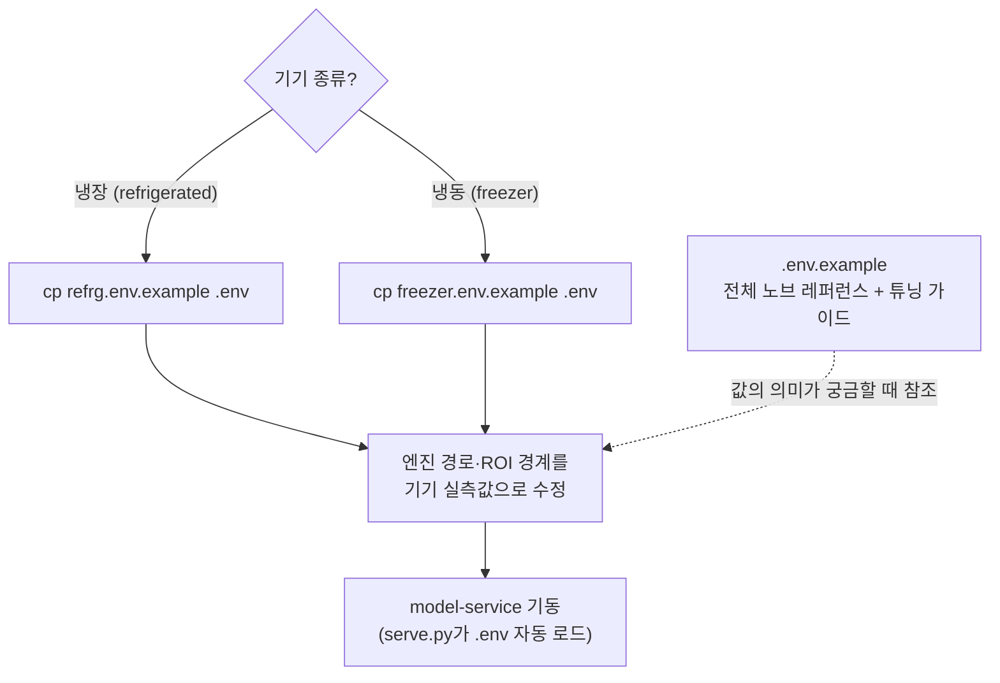
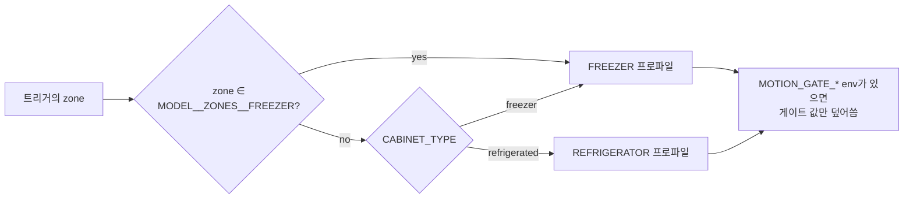
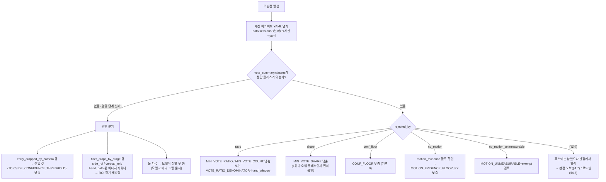

# 04. 설정 레퍼런스

> 대상: 운영·현장 배포 담당자
> 목적: 기기에 올릴 `.env`를 어떤 근거로 채우고, 현장에서 무엇을 어떤 순서로
> 조정하는지 판단할 수 있게 하기
> 최종 갱신: 2026-07-30
> 선행 문서: [02. 시스템 아키텍처](02-system-architecture.md) · [03. 판정과 정산](03-judgment-and-settlement.md)

---

## 1. 설정 원칙

이 서비스의 설정 체계는 네 가지 원칙 위에 서 있습니다. 값을 바꾸기 전에 이
원칙을 먼저 읽으십시오 — 표만 보고 만지면 사고가 납니다.

### ① 레버마다 독립 플래그 + 즉시 롤백 env

새 기제를 넣을 때는 **그 기제만 끄는 env 한 줄**을 반드시 함께 만듭니다. 현장에서
회귀가 보이면 코드를 고치거나 재배포하지 않고 `.env` 한 줄 수정 + 프로세스
재시작으로 이전 동작으로 돌아갈 수 있어야 합니다.

| 기제 | 롤백 방법 |
| --- | --- |
| 로드셀 BOCPD 분석기 | `MODEL__LOADCELL__ANALYZER=plateau` |
| 모션 변위 증거 몰수 | `MODEL__VISION__MOTION_EVIDENCE=0` |
| 교차존 오염 페널티 | `MODEL__CROSS_ZONE__PENALTY_ENABLED=0` |
| 냉동 close 비전 조합 중재 | `MODEL__CLOSE__VISION_COMBO=0` |
| 무게 중재 conf 자격/격차 | `MODEL__JUDGMENT__CONF_OVERRIDE=2.0` / `CONF_MARGIN=2.0` (2.0 = 비활성) |
| held 트랙 강등 / 고스트 원장 | `..._DEMOTION=off` / `MODEL__GHOST__MODE=off` |

### ② 오타는 조용히 기본값이 되지 않는다 (fail-closed)

열거형 env는 `crk_model/core/config.py`의 `_env_choice` / `_env_cabinet_type`을
통해 파싱되고, **허용값이 아니면 `ValueError`로 기동이 실패**합니다.

```
MODEL__MACHINE__CABINET_TYPE=frozen   # → ValueError: Invalid cabinet type: frozen
MODEL__VIDEO__SIDE_CROP=rihgt         # → ValueError: Invalid value for ...
```

이유: 오타가 기본값으로 조용히 폴백하면 **의도한 구성이 아닌 채 운영되고 있음을
아무도 알 수 없습니다**. 냉동 기기가 냉장 프로파일로 도는 사고(이슈 #6)가 바로
그 형태였습니다. 기동 실패는 즉시 눈에 보이는 실패이므로 더 안전합니다.

fail-closed 대상 env: `CABINET_TYPE`, `VIDEO__SIDE_CROP`, `VISION__CAMERA_LAYOUT`,
`VISION__VOTE_RATIO_DENOMINATOR`, `VISION__MOTION_UNMEASURABLE`,
`VISION__HELD_TRACK_DEMOTION`, `LOADCELL__ANALYZER`, `GHOST__MODE`,
`SESSION__ERROR_POLICY`.

### ③ 물리 특성값은 env가 아니라 코드(`SensorProfile`) 소속

게이트 임계·tolerance·구간화 스텝·변위 하한은 **존 타입의 물리**(로드셀 분해능,
냉동고 노이즈 대역)에서 나온 값입니다. 배포 설정으로 흔들리면 판정의 기준선 자체가
기기마다 달라져 사후 분석이 불가능해집니다. 따라서 이 값들은 env가 아니라
`crk_model/core/profiles.py`의 상수입니다 → [§5](#5-sensorprofile--env가-아닌-값들).

### ④ 코드 기본값과 배포 `.env`가 어긋나면 사고가 난다

**실측 교훈 (`STATIC_TRACK` 사례, 2026-07-24)**: 정지 트랙 억제 기능은
`.env.example`에 `0`(비활성)으로 적혀 있었지만 **코드 기본값은 24로 살아
있었습니다**. 즉 `.env`에 `=0`을 명시하지 않은 기기는 실제로 검출을 드랍하고
있었고, 문서만 보는 사람은 그 사실을 알 수 없었습니다.

여기서 나온 원칙: **폐기는 코드 삭제로 한다.** env만 0으로 두거나 템플릿에서만
지우는 방식은 금지합니다. 은퇴시킬 기능은 필드·파싱·배선·테스트를 코드에서
제거하고, 그 결정을 [07. 배제·폐기 결정 기록](07-rejected-and-retired.md)에
남깁니다. 따라서 **이 문서의 표에 없는 `MODEL__*` 키는 존재하지 않는 키**이며,
과거 문서·템플릿에서 발견되면 그것이 낡은 것입니다.

---

## 2. 템플릿 3종 사용법

env 템플릿은 세 개이고 역할이 다릅니다. **기기에 올릴 `.env`는 실기 확정값
템플릿에서 복사**하고, `.env.example`은 노브 카탈로그·튜닝 가이드로만 읽습니다.



| 파일 | 성격 | 언제 쓰는가 |
| --- | --- | --- |
| `refrg.env.example` | **냉장 실기 확정값** (2026-07-28 사용자 결정) | 냉장 기기 배포: `cp refrg.env.example .env` |
| `freezer.env.example` | **냉동 실기 확정값** (냉동 E2E 검증을 통과한 값) | 냉동 기기 배포: `cp freezer.env.example .env` |
| `.env.example` | **전체 노브 카탈로그 + 튜닝 가이드** (냉장 기본값 기준으로 서술) | 값의 의미·조정 방향을 읽을 때. 기기에 그대로 복사하는 용도가 아닙니다 |

### 로딩 규칙

- `.env`는 `crk_model/adapters/serve.py`의 `load_dotenv()`가 기동 시 자동으로
  읽습니다 (stdlib 파서, 의존성 0).
- `os.environ.setdefault`를 쓰므로 **이미 export된 환경변수가 `.env`보다
  우선**합니다. systemd `Environment=`나 셸 export로 임시 오버라이드할 수 있습니다.
- `#`으로 시작하는 줄과 `=`가 없는 줄은 무시됩니다.
- **빈 값(`KEY=`)은 "미설정"과 같습니다** — 코드 기본값(또는 프로파일 기본값)이
  적용됩니다. `MOTION_GATE_*`, `MOTION_EVIDENCE_FLOOR_PX`처럼 "비우면 프로파일
  기본"인 노브가 이 규칙을 이용합니다.

### 세 템플릿의 실질 차이

| 항목 | `refrg.env.example` | `freezer.env.example` |
| --- | --- | --- |
| `CABINET_TYPE` | `refrigerated` | `freezer` |
| `CAMERA_LAYOUT` | (미기재 → 기본 `dual`) | `dual_top_proxy` (0806부터 상시 — 냉동 실기는 side 스트림도 top 뷰) |
| `VIDEO__SIDE_CROP` | `left` (존이 side 화면 왼쪽) | (미기재 → 기본 `center`) |
| `SIDE_ROI_MAX_CENTER_X` | `240` (left-crop 좌표계, 0805 축소) | `480` (사실상 비활성 — dual-top에서 x-ROI 생략) |
| `TOP_CONFIDENCE_THRESHOLD` / `SIDE_...` | `0.40` / `0.30` (0805 완화 — 정답 후보 유실 대응) | `0.4` / `0.4` (김서림·성에 보정) |
| `MIN_VOTE_RATIO` / `COUNT` | `0.02` / `2` | `0.02` / `2` |
| `VOTE_RATIO_DENOMINATOR` | `hand_window` (0805 전환) | (미기재 → 기본 `gate`) |
| conf 결합 가중 (top/side/top_only/side_only) | `0.70/0.30/0.70/0.40` (0805 top 상향) | `0.70/0.30/0.80/0.40` |
| `TOP_ROI_ENABLED` / `Y_SPLIT` | `1` / `240.0` (0805 — 진열 오투표 1차 방어선) | `0` (dual-top은 수직 ROI가 별도: `FREEZER_ROI_*`) |
| `HAND_CONFIDENCE_THRESHOLD` | `0.5` (0805 상향) | `0.30` |
| `SIDE_HAND_ENABLED` / 전용 conf | `1` / `0.5` (0805 — side 손 근접 게이팅) | (미기재 → 기본 off) |
| `FREEZER_ROI_*` | 미사용 (dual 레이아웃) | `upper` / `350.0` |
| `EARLY_TERMINATION` | `0` — 이슈 #22 0805 강등 (켜면 냉장에서 동작) | `0` — freezer 프로파일에서는 켜도 I15로 항상 비활성 |

---

## 3. 필수 설정 — 배포 전 반드시 확인

아래 네 개는 **틀리면 조용히 오판정이 나거나 기동이 실패**합니다. 배포 체크리스트의
첫 항목으로 두십시오.

| # | 환경변수 | 확인 사항 |
| --- | --- | --- |
| 1 | `MODEL__VISION__YOLO_MODEL_PATH` | TensorRT 엔진 파일은 **레포에 없습니다**. 기기별로 빌드·복사해야 합니다. 기본값 `models/set9_doorfas_0323_imbal.engine`. 경로가 틀리면 기동 프로브(`serve.py` → `startup_probe_frame`)에서 즉시 실패합니다 (무증상 기동 금지) |
| 2 | `MODEL__MACHINE__CABINET_TYPE` | **냉동 기기는 반드시 `freezer`**. 미설정 시 기본값 `refrigerated`가 전 존에 냉장 프로파일(tolerance ±5g, 무게=정체성 판별자)을 적용해 오과금/매출누락이 발생합니다 (이슈 #6 실사고의 공동 원인). 냉장 기기도 실수 방지를 위해 `refrigerated`를 명시합니다 |
| 3 | `MODEL__VISION__CAMERA_LAYOUT` | `dual`(기본, top+side 실제 2뷰) \| `dual_top_proxy`(냉동 실기 — side 스트림도 top 뷰). **냉장 기기에서 `dual_top_proxy` 설정 금지** — side x-ROI가 꺼지고 수직 ROI 전제가 깨집니다. `dual_top_proxy`는 `CABINET_TYPE=freezer`와 조합될 때만 수직 ROI가 켜집니다 |
| 4 | `MODEL__ZONES__FREEZER` | 기본 프로파일에 대한 **존 단위 오버라이드** (예: `9,10`). 냉장 기기 안의 냉동 코너용. 미설정이 정상이며, 설정하면 해당 존만 FREEZER 프로파일이 됩니다 |

### 프로파일 결정 순서



기동 로그에 `[CONFIG] cabinet_type=... default_profile=... freezer_zones=...
camera_layout=... side_crop=...` 한 줄이 찍힙니다 — **배포 직후 이 줄로 의도한
구성인지 확인**하십시오.

---

## 4. 전체 env 카탈로그

`crk_model/core/config.py`의 `Settings.from_env()`가 읽는 **75개** + 어댑터가 직접
읽는 **6개** = 총 **81개**가 이 서비스에 존재하는 env 전부입니다. 표의 기본값은
dataclass 기본값과 `from_env()` 기본값이 일치함을 확인한 값입니다.

> 🅐 표시는 `Settings`를 거치지 않고 어댑터(`serve.py` / `avi_frames.py`)가 직접
> 읽는 키입니다.

### 4.1 서비스 기동·기기 프로파일

| 환경변수 | 기본값 | 의미 / 언제 만지나 |
| --- | --- | --- |
| `MODEL__VISION__YOLO_MODEL_PATH` 🅐 | `models/set9_doorfas_0323_imbal.engine` | TensorRT 엔진 경로. 기기별 빌드 필수. `BATCH_SIZE>1`이면 재수출 엔진(`{stem}_batch{N}.engine`)으로 함께 바꿔야 합니다 |
| `MODEL__MACHINE__CABINET_TYPE` | `refrigerated` | 기기 단위 기본 프로파일. `refrigerated`\|`freezer`. 오타는 기동 실패 |
| `MODEL__ZONES__FREEZER` | (없음) | freezer 프로파일을 적용할 존 목록 (`9,10`). 콤마 구분 정수 |
| `MODEL__VISION__CAMERA_LAYOUT` | `dual` | `dual`\|`dual_top_proxy`. freezer와 조합 시 두 카메라 모두 수직 ROI 적용 + side x-ROI 생략 |
| `MODEL__SERVER__HOST` 🅐 | `0.0.0.0` | uvicorn 바인드 주소 |
| `MODEL__SERVER__PORT` 🅐 | `8002` | 서비스 포트. Node·카메라 측 계약이므로 변경 시 양쪽 합의 필요 |
| `MODEL__LOG_LEVEL` 🅐 | `INFO` | `crk_model` 도메인 로거 레벨. 현장 진단 시 `DEBUG` |

### 4.2 세션 확정·인과 배리어

| 환경변수 | 기본값 | 의미 / 언제 만지나 |
| --- | --- | --- |
| `MODEL__CLOSE__BARRIER_TIMEOUT_S` | `10.0` | 인과 배리어 상한 타임아웃 (I17). **정상 경로가 아닙니다** — 이 값에 걸리면 유실이 있었다는 뜻. debounce 3s보다 길게 유지 |
| `MODEL__CLOSE__GRACE_S` | `3.0` | CLOSE 유예 창 (이슈 #8). 배리어 충족 후에도 이 시간 동안 확정을 보류 — 카메라가 아직 쓰고 있는 AVI의 late trigger 유실(0원 확정 + event rejected) 방지. `0`=비활성(권장 안 함) |
| `MODEL__CLOSE__WORKER_STALL_TIMEOUT_S` | `120.0` | 워커 처리 중(`queue_pending`) 전용 상한. Jetson 디코드+TRT 추론이 배리어 타임아웃보다 길 수 있어 분리. 이 값 초과 = 워커 사망/행 |
| `MODEL__SESSION__ERROR_POLICY` | `block_payment` | 에러 트리거 포함 세션의 결제 정책 (D9/I13). `block_payment`(fail-closed) \| `finalize_error_free_zones`. **변경은 Node 합의 필요** |
| `MODEL__TRIGGER__IDEMPOTENCY_TTL_S` | `5.0` | 트리거 멱등성 TTL (I7) — 같은 트리거 재전송의 중복 처리 차단 창 |
| `MODEL__TRIGGER__OUTCOMES_KEEP` | `256` | 워커 결과 트레이스 보존 개수 상한 (24h+ soak 메모리 방어) |
| `MODEL__LEDGER__KEEP_SESSIONS` | `4` | EventLog/settler 멱등 캐시 보존 세션 수 (I11: 현재+직전 세션은 항상 보존) |

### 4.3 비전 투표 — 진입·채택

판정 흐름: **YOLO 검출 → (진입 컷) → 투표 누적 → (ratio/count 게이트) → (share)
→ (conf_floor) → 후보 확정**. 각 단계의 탈락은 아카이브 `vote_summary`에
`rejected_by`로 남습니다.

| 환경변수 | 기본값 | 의미 / 언제 만지나 |
| --- | --- | --- |
| `MODEL__VISION__TOP_CONFIDENCE_THRESHOLD` | `0.70` | top 카메라 **투표 진입** conf 컷. 미만 검출은 투표에 들어가지 않아 평균 conf를 희석하지 않습니다. 후보가 안 잡히면 0.50 → 0.35 순으로 낮춤 (냉동 실기 확정값 0.4) |
| `MODEL__VISION__SIDE_CONFIDENCE_THRESHOLD` | `0.70` | side 카메라 진입 컷. 냉장 템플릿은 0.50/0.50에서 출발했다가 0805 실기 보정으로 `0.40`(top)/`0.30`(side) — 정답 클래스가 후보에 아예 없던 트리거 9건(이슈 #22 0805) 대응. side가 더 낮은 것은 측면 뷰 conf가 구조적으로 낮아서 |
| `MODEL__VISION__MIN_VOTE_RATIO` | `0.05` | 후보 채택 최소 투표율. COUNT와 **둘 중 하나만** 넘으면 유지. 실기 템플릿 0.02 |
| `MODEL__VISION__MIN_VOTE_COUNT` | `3` | 후보 채택 최소 절대 투표 수. 실기 템플릿 1~2. 노이즈 후보가 자주 살아남으면 올림 |
| `MODEL__VISION__VOTE_RATIO_DENOMINATOR` | `gate` | ratio 분모 정의. `gate`=전 카메라 게이트 통과 프레임 합 \| `hand_window`=손 활성(손 검출 ∨ 래치 열림) 프레임 합. `gate`는 프리롤·포스트롤까지 세어 정답 클래스 ratio가 0.03~0.07로 희석됩니다(실기 ses-6). **`hand_window`로 바꾸면 ratio 절대값이 2~4배 오르므로 `MIN_VOTE_RATIO`를 0.10~0.15로 함께 올려야** 문턱이 유지됩니다 |
| `MODEL__VISION__MIN_VOTE_SHARE` | `0.1` | 1위 후보 득표 대비 **상대** 하한. 절대 COUNT는 400프레임+ 영상에서 노이즈도 통과시켜 8표(1위의 4%) 후보가 "무게 filler"로 채택되던 사고(이슈 #10)의 방어선. `0`=비활성 |
| `MODEL__VISION__CONF_FLOOR` | `0.0` | 결합 후 weighted_conf 하한. 원본에 없는 안전판이라 기본 0 — 진입 컷을 0으로 낮춰 저신뢰 투표를 보존할 때만 0.1~0.4로 올려 씁니다 |

### 4.4 카메라 conf 결합 가중

산식 (`crk_model/perception/voting.py`):

```
양카메라 검출: weighted = top·W_TOP + side·W_SIDE + min(top,side)·COMMON_CLASS_BONUS
단일 카메라  : weighted = conf·W_TOP_ONLY  (또는 W_SIDE_ONLY)
```

| 환경변수 | 기본값 | 의미 / 언제 만지나 |
| --- | --- | --- |
| `MODEL__VISION__CONF_WEIGHT_TOP` | `0.60` | 양카메라 검출 시 top 가중. top 가림이 잦으면 낮춤 |
| `MODEL__VISION__CONF_WEIGHT_SIDE` | `0.40` | 양카메라 검출 시 side 가중. side 오검출(의류 산탄) 과다 시 낮춤 |
| `MODEL__VISION__CONF_WEIGHT_TOP_ONLY` | `0.60` | top만 검출됐을 때 전용 가중 — 한쪽 conf가 반토막나지 않게 하는 장치. `W_TOP`과 독립 조정 가능 (냉동 확정값 0.80) |
| `MODEL__VISION__CONF_WEIGHT_SIDE_ONLY` | `0.40` | side만 검출됐을 때 전용 가중 |
| `MODEL__VISION__CONF_COMMON_CLASS_BONUS` | `0.2` | 양카메라 합치 보너스 계수 (`min(top,side)`에 곱함) |

### 4.5 ROI·손 검출

| 환경변수 | 기본값 | 의미 / 언제 만지나 |
| --- | --- | --- |
| `MODEL__VIDEO__SIDE_CROP` | `center` | side 카메라 크롭 원점. `center`\|`left`. **냉장 실기는 `left`** (존이 side 화면 왼쪽, 640×480에서 x=0..480). top은 항상 center. **이 값은 판정 좌표계 그 자체이므로 `SIDE_ROI_MAX_CENTER_X`와 반드시 함께 움직입니다** |
| `MODEL__VISION__SIDE_ROI_MAX_CENTER_X` | `400.0` | side 검출 제거 경계 (center_x ≥ 값이면 존 바깥). 좌표계가 crop 원점에 종속 — 냉장(left-crop) `300`(2026-07-28) → `240`(0805 축소: 타 존 진열 오투표 차단), 냉동(dual-top) `480`(사실상 비활성). **크롭을 바꾸면 재측정 필수** |
| `MODEL__VISION__FREEZER_ROI_VERTICAL_REGION` | `upper` | 냉동 dual-top 수직 ROI가 유지할 절반. `upper`\|`lower`. **`CABINET_TYPE=freezer` ∧ `CAMERA_LAYOUT=dual_top_proxy`일 때만 적용**되고, 그 밖에는 코드가 `off`로 강제합니다 |
| `MODEL__VISION__FREEZER_ROI_Y_SPLIT` | `300.0` | 위 ROI의 분할선 (center-crop 480×480 세로축 — 크롭 원점 이동 영향 없음). 원본 운영값 240 → 300 상향(2026-07-24), 냉동 템플릿은 `350.0` |
| `MODEL__VISION__TOP_ROI_ENABLED` | `0` | 냉장(dual) 레이아웃 **top 카메라 전용** 하단 ROI — 트리거 delta ≠ 0일 때 `center_y ≥ Y_SPLIT`만 유지. 냉장에서 top 공용 카메라가 여러 존 진열을 넓게 보므로 진열 오투표의 1차 방어선입니다. 코드 기본은 보수적 off — 냉장 템플릿은 0805부터 on(`Y_SPLIT=240`) |
| `MODEL__VISION__TOP_ROI_Y_SPLIT` | `240.0` | 위 ROI 분할선. 원본 운영값 — 실기 재측정 대상 |
| `MODEL__VISION__HAND_CONFIDENCE_THRESHOLD` | `0.30` | 손 검출 conf 하한. 미만 hand는 모션 게이트 래치(I16)·hand_path 궤적에 쓰지 않습니다 — 유령 손의 래치·궤적 오염 차단. `0`=비활성. 냉장 템플릿은 0805부터 `0.5` 상향 |
| `MODEL__VISION__SIDE_HAND_ENABLED` | `0` | side 카메라 hand 추론 (이슈 #18). 켜면 side allowlist에 hand(0)이 포함되고 side에서도 래치·hand_path 필터가 작동해 정지 진열 오투표를 거릅니다. **원본에 없는 신설 동작이라 코드 기본 off. `dual_top_proxy`(냉동)에서는 의미가 다르니 냉장 전용으로 켜십시오** — 냉장 템플릿은 0805부터 on(전용 conf `0.5`) |
| `MODEL__VISION__SIDE_HAND_CONFIDENCE_THRESHOLD` | `-1.0` | side 전용 손 conf 하한. side는 손 1건이 hand_path를 무장시키는 방아쇠라 top보다 조일 수 있게 분리. **음수 = `HAND_CONFIDENCE_THRESHOLD` 상속** |

### 4.6 모션 게이트 · 변위 증거 · 조기 종료

| 환경변수 | 기본값 | 의미 / 언제 만지나 |
| --- | --- | --- |
| `MODEL__VISION__EARLY_TERMINATION` | `0` | 조기 종료 (D7) — **기본 off** (이슈 #22 0805 냉장 20종 실기: 정답 등장 전에 프리롤 진열·반사광 표가 delta를 설명해 종료되는 오과금이 지배적 — 2-9는 top 9컷 처리 후 종료로 정답 표 0). 처리량은 T2 배치(`BATCH_SIZE`/`TENSOR_INPUT`)로 확보. 켜면 **전 재고 유일해 게이트**(단일 종 (상품,n) 해 유일 + 득표 리드 일치)가 강제되고, removal & 비freezer에서만 유효(freezer는 I15로 항상 비활성) |
| `MODEL__VISION__MOTION_GATE_THRESHOLD` | (프로파일) | 모션 게이트 변화 픽셀 비율 임계 **오버라이드**. 비우면 프로파일 기본(냉장 0.02 / 냉동 0.005). 올리면 스킵 증가(처리 절약), 내리면 거의 전 프레임 추론 |
| `MODEL__VISION__MOTION_GATE_KEEPALIVE` | (프로파일) | 연속 스킵 상한 **오버라이드**. 비우면 냉장 8 / 냉동 4. 스킵이 길어져도 이 간격마다 강제 추론합니다 |
| `MODEL__VISION__MOTION_EVIDENCE` | `1` | 모션 변위 증거 몰수. 클래스 트랙의 누적 변위가 `max(floor, bbox×0.10)`을 못 넘으면 그 카메라의 표를 결합에서 몰수 — "집어간 상품은 움직이고 진열 상품은 안 움직인다"의 직접 검사. `0`=롤백 |
| `MODEL__VISION__MOTION_EVIDENCE_FLOOR_PX` | (프로파일) | 변위 하한 px. 비우면 냉장 10 / 냉동 12. 픽셀 임계라 1:1 크롭이면 crop 원점과 무관하게 유효 |
| `MODEL__VISION__MOTION_UNMEASURABLE` | `forfeit` | no_motion "측정 불가" 정책. `forfeit`(현행 몰수) \| `exempt`. 관측 1회 트랙은 path=0이라 변위 통과가 **구조적으로 불가능** — 빠른 취출이 "너무 빨리 움직여서 no_motion"으로 죽는 역설이 생깁니다. `exempt`는 측정 가능한 트랙이 하나도 없는 클래스만 면제하고, "측정된 정지"(진열)는 계속 몰수 |
| `MODEL__VISION__MOTION_MEASURABLE_MIN_OBS` | `3` | 위 정책에서 "측정 가능"으로 인정할 최소 관측 수 |

### 4.7 판정 노브 (냉동 존 전용 — FreezerVisionFirst)

아래 블록은 **`weight_is_discriminative=False`인 freezer 프로파일 존에서만**
쓰입니다. 냉장 존은 무게가 정체성 판별자라 strict 체인이 담당하므로 값을 남겨
둬도 무해합니다 (혼합 기기 대비). 비율은 전부 "top 후보 득표 대비".

| 환경변수 | 기본값 | 의미 / 언제 만지나 |
| --- | --- | --- |
| `MODEL__JUDGMENT__SINGLE_SHARE` | `0.5` | 이 비율 이상 득표한 후보만 단일 정체성 교체 시도 허용. 낮추면 이슈 #15형 "갈아타기" 재발 위험 |
| `MODEL__JUDGMENT__COMBO_SHARE` | `0.3` | 다품종 조합 멤버 자격 하한. 낮추면 배경 후보가 오염 잔차 filler로 낌(이슈 #10 메로나 79g×3), 높이면 정당한 3종 동시 취출이 조합 불발 |
| `MODEL__JUDGMENT__NEAR_FACTOR` | `2.0` | `count_gate × 이 배수`까지를 "접촉 오염 마진"(실측 8~18g)으로 보고 top 정체성·개수를 보존한 PARTIAL 처리. 올리면 count 오판 위험, 내리면 이슈 #15형 3g 차이 탈락 부활 |
| `MODEL__JUDGMENT__REFIT_SHARE` | `0.1` | top 결정적 반증 시 유일-적합 구제 자격 하한. 3표(1.75%) 후보가 무게 우연으로 COMPLETE 되던 사고의 하한 |
| `MODEL__JUDGMENT__COUNT_UNIT_SLACK` | `5.0` | 개수당 게이트 가산(g) — `gate_n(n) = gate + slack×(n−1)`. DB unit_weight 편차·접촉 오염이 개수에 비례 누적되는 것을 흡수 (실사고: 베이글 5개 잔차 32g > flat 15g). `0`=flat(구 동작). **`analyze-sessions`의 개당 잔차 제안값이 이 노브의 보정 입력** |
| `MODEL__JUDGMENT__CONF_OVERRIDE` | `0.9` | `SINGLE_SHARE` 미달이어도 conf가 이 값 이상(+`REFIT_SHARE` 득표)이면 적합 자격 — 진열 오염이 득표 순위를 왜곡해도 max-conf는 독립 신호이기 때문 (실사고: conf 1.0 진짜 상품 19표 vs 오염 63표). `2.0`=비활성 |
| `MODEL__JUDGMENT__CONF_MARGIN` | `0.15` | 복수 적합 중재에서 conf가 득표 서열을 뒤집는 최소 격차. 발동 시 reason에 `…single_arbitrated`로 남습니다. `2.0`=비활성 |
| `MODEL__JUDGMENT__PARTIAL_MIN_CONFIDENCE` | `0.18` | 무게 미검증 `count=1` partial 청구의 conf 하한 (원본 `multi_kind_min_confidence` 동형). 실기 ses-3: 5표/conf 0.157 청구가 잔차 65g 오상품을 과금 — 저증거 청구 차단. `0`=비활성 |
| `MODEL__JUDGMENT__PARTIAL_IMPOSSIBLE_FACTOR` | `3.0` | `relaxed_partial`(냉장 최종 폴백)의 **무게 반증 거부권** — 단위무게가 최대 removal 관측량 + tolerance×이 계수를 넘는 후보는 count=1 청구 부적격, 다음 득표 순위로. 이슈 #22 ses-4: 교차존 오염으로 득표 1위가 된 525g 상품이 Δ-80g에 청구(1개 취출조차 물리적으로 불가능). `0`=비활성(구 동작) |
| `MODEL__JUDGMENT__REFIT_ARB_CONF_FLOOR` | `0.8` | refit 복수 적합 중재의 **절대** conf 하한. 실기 ses-1: 0.69 유령이 margin 우세만으로 오과금 — 승자는 자체로 선명해야 합니다. `2.0`=중재 비활성(유일-적합만) |
| `MODEL__JUDGMENT__COUNT_OCCAM` | `1` | ① 개수 오컴 — n=1 적합이 있으면 그보다 잘 맞지 않는 n≥2 적합을 실격. 저중량 상품이 n을 키워 아무 중량대나 덮는 "만능 filler" 차단 (0730 시나리오 실패 6/7건: 잭슨빌 155×1 → 라라스윗 70×2). `0`=구 동작 |
| `MODEL__JUDGMENT__STRICT_COUNT_OCCAM` | `1` | 위 규칙의 **냉장 strict판** (이슈 #23 0806 3-1): `StrictWeightMatcher`가 단일 종 n≥2 조합을 n=1 적합의 최소 잔차보다 엄격히 잘 맞을 때만 유지 — Δ-275에서 잔차 동률(0)인 단백질바 55×5가 오로나민×1을 conf 차이만으로 꺾어 54x6 오과금. 매처 소비 전략 전부(strict·segment·stage·relaxed, multi_tray 채널 포함)에 공유 배선. 다품종 조합 미적용. `0`=구 동작 |
| `MODEL__JUDGMENT__SEGMENT_COMBO` | `0` | ①⁺ 세그먼트 근거 조합 도전 — removal 세그먼트 ≥ `MIN_SEGMENTS`가 분리 취출을 증언할 때만 ③ 조합이 ①의 ×N 확정을 뒤집습니다 (0730 2-4: 메로나+월드콘 −150 → 월드콘×2). 실측 1건이라 **기본 off** — 아카이브 segments 확인 후 승격 |
| `MODEL__JUDGMENT__SEGMENT_COMBO_MIN_SEGMENTS` | `2` | 위 도전 자격의 removal 세그먼트 최소 수. 올리면 더 보수적 |

### 4.8 로드셀

| 환경변수 | 기본값 | 의미 / 언제 만지나 |
| --- | --- | --- |
| `MODEL__LOADCELL__ANALYZER` | `bocpd` | primary 분석기. `bocpd`(2026-07-23 정식 승격) \| `plateau`(구 3연속 안정 창, **롤백 스위치**). 계약(reason·게이트·반품 안정화·멀티트레이 이벤트)은 동일하고 "안정 구간"의 정의만 다릅니다. 냉장 로드셀 환경에서 BOCPD는 미검증이므로 killswitch 가치가 있습니다 |
| `MODEL__WEIGHT__STABILITY_THRESHOLD_GRAMS` | `2.5` | 안정 판정 임계(g). plateau에서는 연속 샘플 std 상한, **bocpd에서는 관측 노이즈 σ**로 쓰입니다(양쪽 경로 공용). `2.5`는 5g 양자화 bin 경계 토글 1회 허용값 — 2.0이면 경계값이 영영 안정 판정을 못 받습니다 |
| `MODEL__WEIGHT__STABLE_WINDOW` | `3` | plateau 성립에 필요한 연속 안정 샘플 수. **`ANALYZER=plateau`일 때만 효력**이 있습니다(bocpd 경로는 사용하지 않음). post-roll 4s = 5샘플이라 3은 마진이 얇습니다 — `delta 0`(`insufficient_stable_regions`)이 잦으면 카메라 post-roll 연장이 1순위, window 2 축소는 노이즈 plateau 위험이 있는 최후 수단 |
| `MODEL__WEIGHT__SEGMENT_RETRY_GAP_GRAMS` | `5.0` | 오염 delta 이중 타깃 재시도 문턱(g). `abs(delta − sum(segments))`가 이 값을 넘고(접촉 하중 오염 서명, 실측 8~18g / 깨끗한 트리거 0) delta 타깃 판정이 실패하면 세그먼트 합 타깃으로 1회 재판정. YOLO 재실행 없음(순수 CPU). 아주 크게 주면 사실상 비활성 |

### 4.9 CLOSE 정산 — 비전 조합 중재 (냉동 존 전용)

냉동 close 재solve에서 "단일 종 ×N 스냅(N≥2)"이 게이트에 실패할 때, 자격 표를
받은 2종 조합이 게이트 안에서 net을 설명하면 조합을 우선합니다 — "무게=거부권,
선택=vision" 원칙. 냉장 존은 4층 재solve 자체를 건너뜁니다.

> **주의**: 아래 `COMBO_*` 네 개는 env 템플릿 3종 어디에도 적혀 있지 않습니다.
> 코드 기본값으로 동작하며, 조정이 필요하면 `.env`에 직접 추가하십시오.

| 환경변수 | 기본값 | 의미 / 언제 만지나 |
| --- | --- | --- |
| `MODEL__CLOSE__VISION_COMBO` | `1` | 조합 중재 전체 스위치. `0`=비활성 |
| `MODEL__CLOSE__COMBO_MIN_VOTE_RATIO` | `0.5` | 콤보 소수 클래스의 실존 증거 하한 — top 대비 득표율. 오분류 플리커 7~9표가 정상 ×N 스냅을 쪼개는 사고 차단. `0`=하한 비활성 |
| `MODEL__CLOSE__COMBO_MIN_CONF` | `0.8` | 위 득표율 대신 넘어도 되는 conf 하한 (**둘 중 하나**만 넘으면 자격) |
| `MODEL__CLOSE__COMBO_SESSION_GUARD` | `1` | 세션 관측 증거 기반 콤보 자격 제외 (ghost / 타존 무게 뒷받침) — 동시 멀티존 취출의 공유 영상 표 유입 차단 |
| `MODEL__CLOSE__COMBO_OVERRIDE_MAX_CONF` | `0.95` | 게이트 안 스냅을 콤보가 뒤집으려면 존 판정 conf가 이 값 **미만**이어야 합니다 (확신 스냅 존중 — 오버라이드 오답 6건 전부 conf 0.96~1.0). `>1`로 비활성 |

### 4.10 교차존 비전 오염 페널티

세션 유지 중 타 존 취출 장면이 판별용 AVI에 섞이는 오염을 CLOSE 2차 패스에서
soft 페널티로 보정합니다. **Phase 3 승격 완료(2026-07-21) — 기본 ON**, 캐비닛 무관.

| 환경변수 | 기본값 | 의미 / 언제 만지나 |
| --- | --- | --- |
| `MODEL__CROSS_ZONE__PENALTY_ENABLED` | `1` | 기제 전체 스위치. `0`=롤백 |
| `MODEL__CROSS_ZONE__REPLAY_S` | `4.0` | 오염 창의 앞쪽 폭. **CRK-CAMERA의 `replay_duration`과 단일 소스로 맞출 것**. 고스트 원장의 에피소드 병합(같은 순간 판별, 이슈 #22)도 이 창을 쓰므로 `PENALTY_ENABLED=0`이어도 값은 유효합니다 |
| `MODEL__CROSS_ZONE__TRIGGER_S` | `4.0` | 오염 창의 뒤쪽 폭. CRK-CAMERA trigger duration과 동일 소스 (0.8s 로드셀 캐던스 대응으로 3.0 → 4.0) |
| `MODEL__CROSS_ZONE__EPSILON_S` | `1.0` | IO-BOARD 감지 지연 마진 ε: 폴링 0.8s(지배 항) + serial/SSE ~0.1s + 여유. 구값 0.3은 0.099s 폴링 시절 산정값 |
| `MODEL__CROSS_ZONE__ALPHA` | `0.5` | soft 페널티 계수 α — 오염 후보의 표·신뢰도에 곱합니다 (하드 제외 아님) |
| `MODEL__CROSS_ZONE__SOURCE_CONF_MIN` | `0.35` | 페널티 소스로 인정할 최소 판정 conf θ. **0.5는 금지** — 저conf 난장 장면(오염이 가장 심한 상황)에서 기제 전체를 꺼버립니다(9차 ses-8). 기기 `.env`가 0.5로 남아 있으면 0.35로 내리십시오 |

오염 창 = `[min앵커 − REPLAY − ε, max앵커 + TRIGGER + ε]`

### 4.11 세션 고스트 원장

옷 프린트 유령 표(실측 c13·c24): 사람을 따라다니며 존마다 자격 표를 얻지만 **세션
전체에서 무게 뒷받침 과금이 0**인 클래스를 CLOSE 2차 패스에서 강등합니다.
트리거 안에서는 진짜와 구분 불가한 **세션 스코프 신호**입니다.

| 환경변수 | 기본값 | 의미 / 언제 만지나 |
| --- | --- | --- |
| `MODEL__GHOST__MODE` | `shadow` | `off` \| `shadow`(notes 기록만, 판정 무변경) \| `active`. 승격 조건은 [§7](#7-승격-대기-shadow-2종) |
| `MODEL__GHOST__MIN_ZONES` | `2` | 유령 판정 최소 존 수. **1은 금지 방향** — 단일 존 등장은 정상입니다. 존 breadth와 별개로 **서로 다른 에피소드 ≥ 2**도 요구합니다 — 같은 `video_paths`(11차)와 오염 창이 상호 겹치는 같은 순간의 트리거(이슈 #22, `MODEL__CROSS_ZONE__REPLAY_S`/`TRIGGER_S`/`EPSILON_S` 창 상수 사용)는 한 에피소드로 병합됩니다 |
| `MODEL__GHOST__VOTE_FLOOR` | `3` | 존 등장으로 인정할 최소 자격 표 수 (저득표 스파이크 차단) |
| `MODEL__GHOST__ALPHA` | `0.5` | soft 페널티 계수 (cross-zone ALPHA와 같은 의미, 하드 제외 금지) |

### 4.12 승격 대기 shadow — held 트랙 강등

| 환경변수 | 기본값 | 의미 / 언제 만지나 |
| --- | --- | --- |
| `MODEL__VISION__HELD_TRACK_DEMOTION` | `shadow` | carried-in(프리롤 head부터 지속 관측) 트랙의 표를 결합에서 몰수. `off` \| `shadow`(`vote_summary.held_shadow` 관측만) \| `active`. 같은 클래스의 취출 트랙 표는 유지됩니다(클래스 단위 설계의 원리적 구멍 S2 해소) |
| `MODEL__VISION__HELD_TRACK_MIN_HEAD` | `5` | held 판정 head 관측 임계. 실측 분리 하한(held 27~33 vs 진짜 취출 0~2) |

### 4.13 성능 — 배치·프리페치·텐서 입력

| 환경변수 | 기본값 | 의미 / 언제 만지나 |
| --- | --- | --- |
| `MODEL__VISION__BATCH_SIZE` | `1` | 게이트 통과 프레임 마이크로배치 크기. **`>1`은 정적 batch 엔진 재수출이 전제**입니다: `BATCH=4 bash scripts/convert_engine.sh` → `models/{stem}_batch4.engine`. `YOLO_MODEL_PATH`도 같은 파일로 바꿔야 하며, 짝이 어긋나면 기동 프로브가 즉시 실패합니다 |
| `MODEL__VIDEO__PREFETCH` | `0` | 카메라별 백그라운드 선행 디코드 깊이. `0`=비활성(현행 직렬). 켜면 top 추론 중 side 디코드가 은닉됩니다. 권장 시작값 4, 메모리 `깊이×691KB/카메라` |
| `MODEL__VISION__TENSOR_INPUT` | `0` | `BATCH_SIZE=1`(기존 batch-1 엔진 그대로, 재수출 불필요)에서도 추론을 `detect_batch` 경로로 보내 **GPU 전처리만** 취합니다. 배치 상각과 전처리 소멸의 효과를 기기에서 분리 측정하는 변인 스위치. `BATCH_SIZE>1`이면 무의미(중복) |

### 4.14 아카이브·저널·진단

| 환경변수 | 기본값 | 의미 / 언제 만지나 |
| --- | --- | --- |
| `MODEL__SESSION__ARCHIVE_DIR` | `data/sessions` | 세션 확정 YAML 아카이브 루트 — 오판정 사후 분석의 정본. **빈 문자열이면 비활성**(`save`가 무동작). 끄지 마십시오 |
| `MODEL__SESSION__ARCHIVE_RETENTION_DAYS` | `14` | 아카이브 날짜 디렉토리 보존기간(일) |
| `MODEL__SESSION__SAVE_DETECTIONS` | `0` | 프레임별 bbox 기록. 판정에 실제 기여한 검출(필터 체인 통과 ∧ 진입 conf 이상)을 아카이브에 동봉 → `render-session`으로 AVI 오버레이 영상 생성. **필드테스트 기간에만 켭니다** (트리거당 수십~수백 KB 증가). `detection-heatmap` 스크립트도 이 기록이 전제 |
| `MODEL__LEDGER__JOURNAL_PATH` 🅐 | `logs/events.jsonl` | 이벤트 저널(JSONL, 일자 로테이션). replay 기반 정산 등가성 검증의 입력 |
| `MODEL__LEDGER__JOURNAL_RETENTION_DAYS` | `14` | 저널 일자별 로테이션 파일 보존기간(일) |

### 4.15 비디오 디코더

| 환경변수 | 기본값 | 의미 / 언제 만지나 |
| --- | --- | --- |
| `MODEL__VIDEO__DECODER` 🅐 | `auto` | `auto` \| `ffmpeg` \| `opencv`. `auto`는 NVDEC(`hwaccel cuda`) + numpy 가용 시 ffmpeg 스트리밍을 택합니다. 디코드 이상 진단 시 `opencv`로 고정해 비교. `render-session` CLI는 내부적으로 `ffmpeg`을 기본으로 세팅합니다 |

---

## 5. SensorProfile — env가 아닌 값들

`crk_model/core/profiles.py`의 상수입니다. **env로 바꿀 수 없습니다**(모션 게이트
2개만 예외적으로 오버라이드 env가 있습니다).

| 항목 | REFRIGERATOR | FREEZER | 근거 |
| --- | --- | --- | --- |
| `tolerance_grams` | `5.0` | `15.0` | 로드셀(LABD-B3/K3) 보증 분해능 5g + IO-BOARD 엣지 5g 양자화 → 냉장 5g 미만 임계는 물리적으로 무의미. 냉동고 노이즈는 5~15g (제약 C3) |
| `weight_is_discriminative` | `True` | `False` | 냉동고에서 무게는 "무엇인지"를 가리지 못하고 "몇 개인지"만 검증 → vision-first |
| `count_gate_tolerance_grams` | `None` (=tolerance 5.0) | `15.0` | freezer 개수 검증 게이트 (I3) |
| `min_weight_change_grams` | `5.0` | `5.0` | 저무게 스킵 게이트 |
| `segment_step_grams` | `5.0` | `20.0` | 냉장은 5g 양자화 와이어에서 스텝이 5g 배수로만 옴. 냉동은 컴프레서 사이클·드리프트의 가짜 세그먼트 방지 |
| `motion_gate_threshold` | `0.02` | `0.005` | 냉동은 김서림·AE 스윙 때문에 보수적으로 낮게 — 스킵 이득이 0에 수렴해도 정확도 무손실(fail-safe) |
| `motion_gate_keepalive` | `8` | `4` | 연속 스킵 시 강제 추론 간격 |
| `early_termination_allowed` | `True` | `False` | 냉동·반품에는 조기 종료 금지 (I15). 반품은 delta 부호로 별도 차단 |
| `motion_evidence_floor_px` | `10.0` | `12.0` | 냉동은 김서림·AE 스윙 노이즈 때문에 +2px 보수적 |

**왜 env가 아닌가**: 이 값들은 센서·냉기의 **물리**에서 나온 상수이고 판정 기준선
그 자체입니다. 배포 설정으로 흔들리면 기기마다 판정 기준이 달라져 아카이브 간
비교와 사후 재구성이 성립하지 않습니다 (원칙 ③).

`judge()`와 조기 종료가 **같은 `tolerance_grams` 하나**를 공유한다는 점도
불변식입니다 — 이중 기준을 만들면 "판정은 통과했는데 조기 종료가 먼저 끊는"
모순이 생깁니다.

---

## 6. 현장 튜닝 절차

**손으로 값을 흔들지 말고 아카이브를 읽고 고칩니다.** 순서는 아래 흐름을
따릅니다.



### 6.1 후보가 아예 안 잡힐 때 (미청구·0원 확정)

1. **진입 컷** — `vote_summary.entry_dropped_by_camera`가 크면 컷이 높습니다.
   `TOP/SIDE_CONFIDENCE_THRESHOLD`를 0.50 → 0.35 순으로 낮춥니다.
2. **필터** — `filter_drops_by_stage`에서 어느 단계가 지웠는지 봅니다.
   `side_roi`가 크면 `SIDE_ROI_MAX_CENTER_X`(와 `VIDEO__SIDE_CROP` 좌표계),
   `vertical_roi`가 크면 `TOP_ROI_*` / `FREEZER_ROI_*`, `hand_path`가 크면 손
   검출 품질(`HAND_CONFIDENCE_THRESHOLD`)을 봅니다.
3. **채택 게이트** — `rejected_by: "ratio"`면 `MIN_VOTE_RATIO`/`MIN_VOTE_COUNT`를
   낮춥니다. 정답 클래스 ratio가 0.03~0.07로 희석되는 패턴이 반복되면
   `VOTE_RATIO_DENOMINATOR=hand_window`가 근본 처방이지만, **`MIN_VOTE_RATIO`를
   0.10~0.15로 함께 올려야** 문턱이 유지됩니다.
4. **로드셀 delta 0** — `insufficient_stable_regions`가 잦으면 노브가 아니라
   **카메라 post-roll 연장이 1순위**입니다. `STABLE_WINDOW` 축소는 노이즈
   plateau 위험이 있는 최후 수단이며, `ANALYZER=bocpd`(기본)에서는 애초에
   효력이 없습니다.

### 6.2 오검출이 많을 때 (오과금)

1. **진입 컷을 올립니다** — 가장 부작용이 적은 첫 수.
2. **`MIN_VOTE_COUNT` / `MIN_VOTE_SHARE`를 올립니다** — 저득표 노이즈 후보가
   "무게 filler"로 채택되는 패턴(이슈 #10)의 직접 방어.
3. **진열 오투표라면 ROI로 물리적으로 차단합니다** — 냉장은
   `TOP_ROI_ENABLED=1`, 냉동 dual-top은 `FREEZER_ROI_*`. 노브보다 ROI가 근본적.
4. **카메라별 편중이면 conf 결합 가중을 조정합니다** — side 오검출(의류 산탄)
   과다 시 `CONF_WEIGHT_SIDE`를 내립니다.
5. **정지 진열이 표를 얻는다면** `SIDE_HAND_ENABLED=1`(냉장 전용)로 side에도
   손 근접 게이팅을 켭니다. 관측 지표는 `filter_drops_by_stage.hand_path.side`
   — 급증하면 손 오탐이 진짜 상품을 지우고 있다는 신호입니다.

### 6.3 근거 있는 임계값 — `analyze-sessions`

손튜닝을 대체하는 도구입니다. `label-session`으로 정답을 기입한 뒤 실행합니다.

```bash
analyze-sessions                     # data/sessions 전체 리포트
analyze-sessions --dir data/sessions --json   # 기계 판독용
```

| 리포트 섹션 | 출력 | 어떻게 쓰는가 |
| --- | --- | --- |
| **conformal 보정** | 라벨된 정답 상품의 votes/ratio/share/conf 분위수 (`min`/`p5`/`p25`/`median`/`max`) | **채택 임계는 `p5` 이하로** 설정 — "정답 상품 95%가 후보에 남는 하한"입니다. `MIN_VOTE_RATIO`/`MIN_VOTE_SHARE`의 근거값 |
| **개당 잔차 실측** | `(abs(delta) − n·w)/n`의 `mean`/`std` + `suggested_slack`(편향 포함 RMS) | 그 값을 `MODEL__JUDGMENT__COUNT_UNIT_SLACK`에 넣습니다 — 잔차의 "전형적 크기"를 게이트 가산으로 흡수 |
| **과금 정오** | 라벨 세션의 확정 vs 정답 | 헤드라인 지표. 노브를 바꾼 전/후를 이 숫자로 비교 |
| **승격 대기 shadow 정오** | held / ghost의 shadow 관측 vs 라벨 | [§7](#7-승격-대기-shadow-2종)의 승격 판단 재료 |

> `⚠ 정답 상품이 최종 후보에 없던 트리거` 경고가 뜨면 그것이 최우선 과제입니다 —
> 임계 조정으로는 해결되지 않는 검출 단계의 실패일 수 있습니다.

### 6.4 튜닝 작업 규칙

- **한 번에 하나만 바꿉니다.** 두 노브를 동시에 움직이면 어느 쪽이 효과였는지
  귀속할 수 없습니다.
- 바꾼 값과 이유를 기기별로 기록합니다. `.env`는 배포 산출물이므로 주석에 남기는
  것이 가장 안전합니다.
- 프로파일 상수(§5)를 바꿔야 하는 결론이 나오면 **코드 변경 + 문서 갱신**으로
  처리합니다 — env로 우회하지 않습니다.

---

## 7. 승격 대기 shadow 2종

**shadow 모드**는 기제를 켜서 관측만 기록하고 **판정·정산은 전혀 바꾸지 않는**
상태입니다. 아카이브에 "만약 켰다면 이렇게 됐을 것"을 남겨 두고, 라벨 대조로
안전이 확인된 뒤에만 `active`로 올립니다.

| 항목 | env | 현재 | 무엇을 하는가 |
| --- | --- | --- | --- |
| held 트랙 강등 (T2) | `MODEL__VISION__HELD_TRACK_DEMOTION` | `shadow` | carried-in 트랙(프리롤 head부터 지속 관측)의 표를 결합에서 몰수. 같은 클래스의 취출 트랙 표는 유지 |
| 세션 고스트 원장 | `MODEL__GHOST__MODE` | `shadow` | 여러 존에서 자격 표를 얻고도 세션 내 무게 뒷받침이 0인 클래스를 CLOSE 2차 패스에서 강등 |

### 세 가지 모드

| 모드 | 판정 영향 | 아카이브 기록 | 쓰는 상황 |
| --- | --- | --- | --- |
| `off` | 없음 | 없음 | 관측 오버헤드조차 원치 않을 때 |
| `shadow` | **없음** | `vote_summary.held_shadow` / `ghost_classes`·`ghost_shadow` notes | 기본. 승격 판단 데이터를 모으는 단계 |
| `active` | 표 몰수·강등이 실제로 적용 | 동일 | 승격 게이트 통과 후 |

### 승격 게이트

> **정답 클래스 오플래그 0인 배치를 확인한 뒤에만 `active`.**

`analyze-sessions`의 "승격 대기 shadow 정오" 섹션이 판단 재료입니다.

- `gt_flagged`(정답 클래스에 shadow 플래그가 붙은 건수)가 **0**이어야 합니다.
  1건이라도 있으면 그 기제는 진짜 취출을 죽일 수 있다는 뜻이므로 보류합니다.
- 동시에 `라벨 정오: shadow만 정답 N / 현행만 정답 M`에서 **shadow 우세가
  지속**돼야 합니다.
- 두 조건이 함께 성립하면 리포트가 `→ 정답 오플래그 0 + shadow 우세 지속 시
  MODEL__GHOST__MODE=active 승격 근거` 줄을 출력합니다.

이력: held T2는 10차 배치에서 정답 플래그 5건, 11차 3건이 나와 **보류 중**입니다.
고스트 원장은 11차에서 에피소드 공유 결함을 수정하고 `shadow` 유지 중입니다.

### 승격·폐기의 비대칭

| 방향 | 방법 | 이유 |
| --- | --- | --- |
| **승격** | **env 한 줄** (`shadow` → `active`) | 회귀가 보이면 같은 한 줄로 즉시 롤백할 수 있어야 합니다 (원칙 ①) |
| **폐기** | **코드 삭제** (필드·파싱·배선·테스트 + 07번 문서 기록) | env만 끄면 코드 기본값이 살아남아 "문서와 실제가 다른" 배포가 생깁니다 (원칙 ④, `STATIC_TRACK` 사례) |

승격이 확정되면 대비용 shadow 관측 장치도 함께 걷어냅니다 — 배선 조건이 항상
False인 dead code가 남지 않게 합니다 (BOCPD·교차존 페널티가 그 경로를 밟았습니다).

---

## 8. 다음 문서

| 궁금한 것 | 문서 |
| --- | --- |
| 배포 절차, 로그 읽기, 아카이브 분석 3종 도구(`analyze-sessions`/`render-session`/`detection-heatmap`) 사용법 | [05. 운영·진단 가이드](05-operations.md) |
| 이 노브들이 개입하는 판정 규칙과 정산 4층의 원리 | [03. 판정과 정산](03-judgment-and-settlement.md) |
| 여기 없는 `MODEL__*` 키를 옛 문서에서 발견했을 때 (폐기 사유·은퇴 이력) | [07. 배제·폐기 결정 기록](07-rejected-and-retired.md) |
| 프로파일·`cabinet_type`·`camera_layout`이 계층 구조에서 어디에 걸리는가 | [02. 시스템 아키텍처](02-system-architecture.md) |
| 어떤 값이 실기에서 검증됐고 어떤 값이 미검증인가 | [06. 검증 보고서](06-verification-report.md) |
| 승격 대기 항목의 남은 작업과 리스크 | [08. 인수인계](08-handover.md) |
