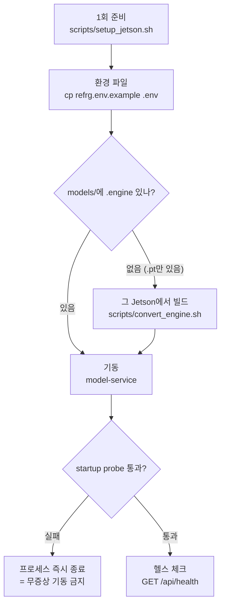
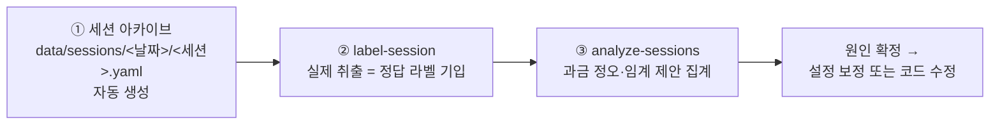

# 05. 운영·진단 가이드

> 대상: 운영·현장 지원 담당자 · 최종 갱신: 2026-07-30
> 선행 문서: [01. 서비스 개요](01-service-overview.md) · 설정값은 [04. 설정 레퍼런스](04-configuration.md)

---

이 문서는 **자판기 1대에 서비스를 올리고, 굴리고, 과금이 이상할 때 원인을 찾는
절차**를 다룹니다. 판정 규칙의 근거는 [03. 판정과 정산](03-judgment-and-settlement.md)에
있습니다. 명령 예시의 `<저장소>`는 이 저장소를 클론한 디렉터리입니다(폴더명은
기기마다 다를 수 있어 고정하지 않습니다).

## 1. 배포와 기동

### 1.1 전체 흐름



### 1.2 Jetson 1회 준비

Jetson Orin Nano(JetPack / Ubuntu 22.04)에서 최초 1회만 수행합니다.

```bash
cd <저장소>
chmod +x scripts/setup_jetson.sh scripts/install_jetson_torch.sh scripts/jetson_env.sh
./scripts/setup_jetson.sh
```

`scripts/setup_jetson.sh`가 하는 일:

| 단계 | 내용 | 왜 필요한가 |
|---|---|---|
| 전제 확인 | python3.10, `nvcc`, TensorRT 파이썬 패키지, 시스템 torch의 CUDA 가시성 | 이 중 하나라도 없으면 이후 전부 실패하므로 먼저 끊는다 |
| venv 생성 | `uv venv --system-site-packages` | JetPack의 CUDA/TensorRT/torch/OpenCV/numpy를 **그대로 쓴다**. 격리 venv는 CPU torch를 끌어와 CUDA를 잃는다 |
| 프로젝트 설치 | `uv pip install --no-deps -e .` + 어댑터 의존성 | `--no-deps`가 필수 — 의존성 해석이 Jetson torch를 CPU wheel로 덮어쓰는 것을 막는다 |
| NumPy 핀 | `numpy>=1.24.0,<2.0.0` | Jetson torch는 NumPy 1.x 빌드다. 2.x가 들어오면 추론·export가 깨진다 |
| export 의존성 | `onnx`, `onnxslim`을 NumPy 핀과 **한 명령으로** 설치 | 나중에 엔진 export 시 ultralytics가 자동 설치하며 NumPy를 2.x로 올리는 사고를 예방 |
| 런타임 설정 | `.env`가 없으면 `.env.example`에서 생성, `models/`의 `.engine` 개수 보고 | 엔진이 0개면 경고 — 1.5절로 |
| 검증 | `crk_model.core.config` import + 해석된 캐비닛 타입/카메라 레이아웃/배치 출력, torch CUDA 가용성, `model-service` 엔트리포인트 | 설치가 끝났는데도 CPU torch면 여기서 실패로 드러난다 |
| 활성화 훅 | `.venv/bin/activate`에 `scripts/jetson_env.sh` source 추가 | 이후에는 `source .venv/bin/activate`만으로 CUDA/TensorRT 런타임 경로가 복원된다 |

이 스크립트는 `.env`를 **`.env.example`(냉장 기본)** 에서 생성합니다. 냉동 기기라면
1.3에서 `freezer.env.example`로 덮어쓰세요.

#### torch 그림자 — 이 환경의 가장 흔한 기동 실패

Jetson에서 정상 동작하는 torch는 **venv 밖**(JetPack `dist-packages` 또는 사용자
사이트 `~/.local/...`)에 있고, venv는 `--system-site-packages`로 그것을 빌려 씁니다.
그래서 **venv 안에 torch가 하나라도 설치되면 밖의 정상 torch를 가립니다.**

- 어떻게 들어오나: `torch`를 의존성으로 선언한 패키지(`ultralytics`,
  `ultralytics-thop`)를 `--no-deps` 없이 설치하면 resolver가 PyPI의 CUDA 13 빌드를
  venv에 넣습니다. 2026-07-30 실기에서 `.venv`를 지우고 재설치한 직후 발생했습니다.
- 증상: 기동 시 `Nvidia driver ... too old (found version 12060)`.
- 진단: `torch.__file__`가 `.venv/lib/.../site-packages/torch`를 가리키면 그림자입니다
  (정상은 `~/.local/...` 또는 `/usr/lib/python3/dist-packages/...`).
- 복구: `uv pip uninstall torch torchvision torchaudio` →
  `uv pip install --no-deps "ultralytics-thop>=2.0.18"`.
- 예방: 현재 `setup_jetson.sh`는 ① 의존성 설치를 torch 검증보다 **먼저** 하고,
  ② 검증 실패 시 venv 로컬 torch를 자동으로 걷어내 밖의 torch로 되돌리며,
  ③ 7단계 검증이 `PyTorch origin` 경로를 항상 출력합니다.

### 1.3 환경 파일과 기동

기기 종류에 맞는 템플릿을 `.env`로 복사합니다. `.env`는 기동 시 자동 로드되며,
이미 export된 환경변수가 있으면 그쪽이 우선합니다.

```bash
cd <저장소>
cp refrg.env.example .env      # 냉장 기기
# cp freezer.env.example .env  # 냉동 기기

source .venv/bin/activate
model-service
```

`.env`에서 기기별로 **반드시** 확인할 두 값:
`MODEL__VISION__YOLO_MODEL_PATH`(그 기기에서 빌드한 `.engine`을 가리켜야 함)와
`MODEL__MACHINE__CABINET_TYPE`(`refrigerated`/`freezer` 오설정은 판정 체인 자체를
바꿔 오과금·매출누락으로 직결됨). 기동 확인은 `curl -s
http://localhost:8002/api/health`입니다. 기존 레거시 서비스(CRK-model)를 가동
중이라면 **중단한 뒤** 실행합니다(같은 포트, 같은 카메라 자원).

### 1.4 코드 업데이트

```bash
cd <저장소>
deactivate 2>/dev/null
git pull origin master

source .venv/bin/activate
model-service
```

콘솔 스크립트 구성(`pyproject.toml`의 `[project.scripts]`)이나 패키지 구조가 바뀐
릴리스에서는 `uv pip install --no-deps -e .`를 한 번 더 실행합니다. 일상 실행에
`uv run`/`uv sync`(무옵션)는 쓰지 않습니다 — 환경 재동기화로 CUDA torch가 CPU wheel로
덮일 수 있습니다.

> **각주 — venv 재설치가 필요한 경우**: editable 설치(`-e .`)는 venv 안에
> 저장소의 **절대 경로**를 박아 둡니다. 저장소 폴더를 옮기거나 이름을 바꾸면
> `import crk_model`이 깨지고 `model-service`가 실행되지 않습니다. 이때는
> 폴더 이동 후 `source .venv/bin/activate && uv pip install --no-deps -e .`를
> 다시 실행하세요. `.venv` 디렉터리 자체를 옮겼다면 venv를 재생성합니다
> (`uv venv --system-site-packages --python python3.10 .venv` 후 재설치).

### 1.5 `.engine` 파일은 그 Jetson에서 빌드한다

TensorRT 엔진은 **TensorRT 버전과 GPU 아키텍처에 종속된 바이너리**입니다. 다른
기기(또는 다른 JetPack 버전)에서 빌드한 파일은 로드되지 않으므로 저장소에
포함하지 않습니다. Jetson을 리셋했거나 JetPack을 재플래시했다면 `.pt`에서 다시
빌드해야 합니다.

```bash
cd <저장소>
source .venv/bin/activate

# .pt를 models/에 둔 뒤
PT_FILE=0204_morning.pt scripts/convert_engine.sh
#  → models/0204_morning_batch1.engine

BATCH=4 PT_FILE=0204_morning.pt scripts/convert_engine.sh
#  → models/0204_morning_batch4.engine
```

`scripts/convert_engine.sh`의 입력 환경변수:

| 변수 | 기본값 | 의미 |
|---|---|---|
| `PT_FILE` | `0204_morning.pt` | `models/` 아래의 입력 `.pt` 파일명 |
| `IMGSZ` | `480` | export 입력 해상도 — 서비스 추론 해상도와 같아야 한다 |
| `BATCH` | `1` | 정적 배치 크기. `MODEL__VISION__BATCH_SIZE`와 **짝**이어야 한다 |
| `MODELS_DIR` | `<저장소>/models` | 입출력 디렉터리 |

**`_batch{N}.engine` 접미사 규칙**: ultralytics export는 항상 `{stem}.engine`으로
쓰기 때문에, batch-4 재빌드가 배포된 batch-1 파일을 조용히 덮어쓰는 사고가 있었습니다
(`docs/devdoc/fix_logs.md` 2026-07-28~29, 도입 결함 ③). 이후 스크립트가 export
결과를 `{stem}_batch{N}.engine`으로 rename하며, `.env`의
`MODEL__VISION__YOLO_MODEL_PATH`도 이 접미사 파일을 가리켜야 합니다.

스크립트가 자체적으로 막아 주는 것: torch가 CUDA를 못 보면 export 전에 중단(종료
코드 2), venv에 NumPy 2.x가 있으면 중단하고 복구 명령 안내(3), 실행 중
`YOLO_AUTOINSTALL=false`로 ultralytics 자동 설치 차단, export 후 NumPy가
올라갔으면 경고(4). 학습 PC(NumPy 2.x)에서 저장된 `.pt`의 RNG 픽클 비호환도
무해한 스텁으로 우회합니다(가중치는 손대지 않음).

### 1.6 기동 프로브 fail-fast 계약

서비스는 생성 시 480×480 더미 프레임으로 **엔진을 1회 실제 실행**합니다
(`crk_model/adapters/serve.py`의 `startup_probe_frame`). 배치 구성
(`MODEL__VISION__BATCH_SIZE>1` 또는 `MODEL__VISION__TENSOR_INPUT=1`)이면 배치
경로까지 검증합니다. 엔진 로드 실패·CUDA 불가·엔진 배치 크기와 `BATCH_SIZE`
불일치는 모두 **프로세스 즉시 종료**로 이어집니다 — "떠 있지만 추론이 안 되는
서비스"는 매출 누락을 조용히 만들기 때문에 무증상 기동을 금지하는 의도된
계약입니다. 따라서 `/api/health`가 응답한다는 사실 자체가 엔진 로드 성공의
증거입니다.

## 2. 일상 점검 — `GET /api/health`

```bash
curl -s http://localhost:8002/api/health
```

| 필드 | 값 | 의미 | 정상 판단 |
|---|---|---|---|
| `status`·`model`·`yolo_loaded`·`session_store_ready` | `"ok"`·`"HEALTHY"`·`true`·`true` **고정** | 레거시 계약 호환 필드. 이 핸들러에 도달했다는 것 자체가 startup probe 통과를 뜻하므로 고정값이다 | 응답 자체가 오면 정상 |
| `timestamp` | epoch 초 | 응답 생성 시각 | 시계 이상 점검용 |
| `door_state` | `idle`\|`active`\|`pending_close`\|`finalized`\|`error` | 게이트웨이 상태 | 손님이 없을 때 `idle`. `error`가 오래 유지되면 다음 OPEN까지 복구되지 않는다 |
| `queue_pending` | 정수 | 워커가 아직 처리하지 못한 트리거 수 | 문 열림 중 1~수개는 정상. 문 닫힌 뒤에도 계속 남으면 워커 지연/사망 의심 |
| `barrier_satisfied` | `true`/`false` | 인과 배리어 충족 여부 | `idle`에서는 `true` |
| `barrier_pending` | 문자열 배열 | 미충족 사유 | 아래 표 참조 |

`barrier_pending`에 나오는 사유:

| 사유 문자열 | 의미 |
|---|---|
| `zone{N}:queue_pending(n)` | 그 존의 트리거 n건이 아직 추론 중 — 진행 중이면 정상 |
| `zone{N}:loadcell_unstable` | 로드셀이 안정 판정을 못 받음 — 진동/드리프트 의심 |
| `zone{N}:awaiting_triggers(arrived=a,expected=e)` | 엣지 워터마크가 알려준 기대 트리거 수에 미달(8절). `seq_gap(...)`은 카메라 seq 워터마크 경로(미배포) |

**즉시 대응이 필요한 신호**: 응답 없음(프로세스 사망 — 기동 로그 확인),
`door_state=error` 지속(직전 세션 에러 확정 — `[OPS][CLOSE_ERROR]` 사유 확인,
다음 OPEN에서 자동 복구), 문 닫힘 뒤 `queue_pending>0`이 120초 초과(워커 이상),
`loadcell_unstable` 상주(무게 센서 하드웨어 점검).

## 3. 운영 로그 읽기

운영 로그는 별도 설정 없이 표준 출력에 남습니다. 진단용 요약은 전용 로거
(`crk_model.ops`)로 나가므로 `[OPS]` 접두사만 grep해도 세션 단위 흐름을 볼 수
있습니다.

| 로그 | 나오는 시점 | 정상 형태 | 이상 신호 |
|---|---|---|---|
| `[MULTI-ZONE OPEN] new session ses-N-<epoch> (prev_state=…, products=N)` | 문 열림(OPEN)마다 | 세션 ID 발급 | `products=0`이면 Node가 재고를 안 보냄 → 판정 후보가 없어 매출 누락 |
| `[MULTI-ZONE OPEN] mapped=n/total unmapped=[…]` | OPEN마다 | `unmapped=[]` (info) | 목록이 있으면 **warning** — 그 상품은 영상으로 식별 불가(9절) |
| `[MULTI-ZONE CLOSE] session=… queue_pending=N` | 문 닫힘(CLOSE) 최초 수신 시 | 확정 시작 | — |
| `[MULTI-ZONE CLOSE] session=… -> finalized\|error detail=…` | 확정/에러 확정 시 1회 | `finalized` | `error` |
| `[OPS][CLOSE] session_id=… total_weight_delta=… total_products=… total_price=…` | 세션 확정 시 1회(세션 요약) | 무게 변화와 청구 금액이 상식적으로 대응 | 무게가 크게 줄었는데 `total_products=0` → 매출 누락 |
| `[OPS][CLOSE] zone=N weight_delta=… products=… triggers=N notes=… judgments=… runner_up=…` | 세션 확정 시 존마다 1줄 | `notes` 없음이 가장 단순한 정상 | `notes`가 있으면 close 시점 재해석이 일어난 것(4절). `runner_up`이 채택 후보와 표 차이가 작으면 오판정 의심 |
| `[OPS][CLOSE_ERROR] session_id=… reason=…` | 에러 세션 확정 시 | 나오지 않는 것이 정상 | `error_trigger_present:zones=[…]` / `all_zones_errored` / `barrier_timeout:…` |
| `[OPS][SESSION_ARCHIVE] path=…` | 세션 아카이브 파일 기록 성공 시 | 세션당 1줄 | 이 줄이 없으면 아카이브 미기록 → 사후 분석 불가 |
| `[SESSION_ARCHIVE] failed to save session=… (non-fatal)` | 아카이브 기록 실패 시 warning | — | 디스크 용량/권한 확인. 서비스는 죽지 않는다 |
| `[GATEWAY] session=… FINALIZED: totalPrice=… products=… notes=[…]` | 확정 시 | — | `notes` 내용은 4절 |
| `[CROSS-ZONE]`/`[GHOST] zone=N rejudged: … -> …` | 교차존 페널티·고스트 강등이 판정을 교체할 때(고스트는 `active` 모드에서만) | 드물게 발생 | 빈발하면 존 간 오염 상황 — 카메라 배치/타이밍 점검 |
| `[WORKER] drain loop error — continuing` | 워커 루프에서 예외 발생 | 나오지 않는 것이 정상 | 반복되면 큐가 적체되어 배리어 미충족 → 에러 세션 |

**로그 소음 억제 계약**: CLOSE는 문이 닫혀 있는 동안 계속 재폴링되는 신호이므로,
응답이 실제로 바뀔 때만 `[MULTI-ZONE]` 계열 로그를 남깁니다. 같은 줄이 반복되지
않는 것은 정상이며 "멈춘 것"이 아닙니다.

## 4. 정산 notes 해석표

`[OPS][CLOSE]`·`[GATEWAY] FINALIZED`·세션 아카이브 YAML의 `notes=[...]`는
**close 시점 정산기가 트리거별 판정을 재해석한 흔적**입니다. note가 있다는 것은
"트리거 판정 그대로가 아니다"라는 뜻이므로, 과금이 이상할 때 가장 먼저 볼 곳입니다.
존별 `notes`에는 `zone{N}:` 또는 `zone{N}->`로 시작하는 것만 귀속됩니다(근사 매칭 —
`cross_zone_return`은 반품 **출발** 존에만 붙습니다).

### 4.1 정산 4층이 남기는 note

| note | 발생층 | 의미 | 볼 것 |
|---|---|---|---|
| `net_delta_correction:zone{N}:{상품ID}-1` | ② net-delta | 존 청구 합계가 로드셀 순변화보다 무거워 가장 근접한 상품 1개를 감산 — "꺼냈다 되돌림"이 트리거 판정에 안 잡혔을 때의 교정 | 감산이 정당한지: 그 존 트리거들의 delta 부호와 반품 세그먼트 |
| `cross_zone_return:zone{A}->zone{B}:{상품ID}-1` | ③ 교차존 | A존의 미매칭 반품(+delta)이 B존 장바구니 상품 무게와 일치 — 존 착오 반납으로 보고 B존에서 1개 감산 | A존 반품 무게와 B존 상품 무게가 실제로 같은 상품인지 |
| `unmatched_return:zone{N}:{+X.Xg}` | ③ 교차존 | 반품이 어느 존 장바구니와도 매칭 실패 — 임의 차감 대신 근거만 기록. **4층 중 유일하게 실패 방향이 과청구 잔여 위험**이라 이 note는 운영 확인 대상 | 반품 무게가 상품 DB `unit_weight`와 얼마나 어긋나는지(무게 DB 문제 신호). 같은 존 과청구는 ②가 이미 backstop하므로, 이 note는 대개 **타 존 착오 반납 + 무게 불일치**의 조합이다 |
| `freezer_close_resolve:zone{N}:{상품ID}={n}` | ④ freezer | 냉동 존을 close 시점 순변화로 재해석 — 단일 품목 n개로 개수 확정(개수 게이트 통과) | n이 실물과 맞는지. **이 note가 정상 경로다** |
| `freezer_close_resolve:zone{N}:net~0->clear` | ④ freezer | 냉동 존 순변화가 게이트 이내(사실상 0) — 전량 반품으로 보고 청구 클리어 | 실제로 되돌려놨는지. 아니라면 로드셀 드리프트 의심 |
| `freezer_close_resolve_combo:zone{N}:{ID}={n},{ID}={m}` | ④ freezer | 단일 품목 ×N 스냅 대신 **2품목 조합**이 순변화를 설명 — 앨리어싱 스냅(예: 3+44 → 44×4) 구제 경로 | 두 품목이 아카이브 후보에서 실제 득표를 받았는지 |
| `freezer_combo_rejected_confident_snap:zone{N}:…:conf=0.98` | ④ freezer 가드 | 조합 후보가 있었지만 존 판정이 COMPLETE·고신뢰라 스냅을 존중해 조합을 기각 | 판정 conf가 정말 신뢰할 만한지(오답 사례는 conf 0.96~1.0이었음) |
| `freezer_combo_suppressed:zone{N}:…:excluded=class{cid}({사유})` | ④ freezer 관측 | 자격 제외가 없었다면 나왔을 조합이 억제됨 — **동작 무변경, 관측용**. 사유는 `ghost`/`other_zone_backed`/`rejected_by_judgment`/`low_evidence` | 억제된 조합이 정답이었는지 → 가드 파라미터 보정 근거 |
| `freezer_close_gate_failed:zone{N}:keep_incremental` | ④ freezer | 순변화 재해석이 개수 게이트를 통과하지 못해 안전하게 증분 결과 유지 | 순변화와 증분 청구 합의 차이 — 크면 무게 DB/드리프트 문제 |
| `freezer_close_multi_kind:zone{N}:keep_incremental` | ④ freezer | 냉동 존에 2품목 이상 — 단일 품목 재해석 불가라 증분 유지 | 다품목 청구가 아카이브 판정 근거와 일치하는지 |
| `error_zones_excluded:[존 목록]` | 에러 정책 | `FINALIZE_ERROR_FREE_ZONES` 정책에서 에러 존만 제외하고 확정 | 제외된 존의 매출 누락. 기본 정책(`BLOCK_PAYMENT`)에서는 발생하지 않는다 |

### 4.2 교차존 페널티가 남기는 note

close 2차 패스에서 **다른 존의 취출이 이 존 카메라에 비쳐 들어온 오염**을 보정한
흔적입니다.

| note | 의미 | 볼 것 |
|---|---|---|
| `zone{N}:cross_zone_vision_penalty:demoted=…:adopted=…:source=zone{z}@{t}` | 오염 후보를 강등한 뒤 재판정이 다른 결과를 채택 | `adopted`가 실물과 맞는지, `source` 존이 실제 취출 존인지 |
| `zone{N}:cross_zone_penalty_gate_failed:keep_original:source=…` | 재판정이 게이트를 통과하지 못해 원 판정 유지("보정하려다 더 나빠지는" 경로 차단) | 원 판정이 오염 후보인지 |
| `zone{N}:cross_zone_source_low_conf:zone{z}@{conf}` | 오염 창은 겹쳤지만 소스 판정 신뢰도가 임계 미만이라 페널티 미발동(침묵 진단) | 반복되면 `MODEL__CROSS_ZONE__SOURCE_CONF_MIN` 재검토 |
| `zone{N}:cross_zone_mutual_exempt:class{cid}` | 상호 강등 가드 — 이 존이 그 클래스의 진짜 소스로 판별되어 면제 | 면제가 정당한지 |

### 4.3 세션 고스트 원장이 남기는 note

여러 존에서 동시에 표를 받지만 무게 뒷받침이 없는 "유령 클래스"(예: 옷 프린트)를
다루는 층입니다. 기본값 `MODEL__GHOST__MODE=shadow`(관측만).

| note | 의미 | 볼 것 |
|---|---|---|
| `ghost_classes:class{cid}@z{a}/{b}` | 유령으로 판정된 클래스와 검출 존 | 그 클래스가 실제 정답이었다면 **승격 보류 신호** |
| `zone{N}:ghost_shadow:billed=class{cid}:would=…` | shadow 모드 — "강등했다면 이렇게 판정됐을 것"의 관측(`keep_original`이면 무변화) | `analyze-sessions`가 라벨과 대조해 승격 정오를 집계 |
| `zone{N}:ghost_demotion:billed=…:adopted=…` | `active` 모드에서 실제로 판정을 교체 | 교체 결과가 실물과 맞는지 |
| `zone{N}:ghost_demotion_gate_failed:keep_original:billed=…` | `active`인데 재판정이 게이트를 통과하지 못해 원 판정 유지 | — |

### 4.4 에러 세션의 차단 사유

에러 세션(`[OPS][CLOSE_ERROR]`)의 `reason`은 notes가 아니라 **결제 차단 사유**입니다:
`error_trigger_present:zones=[…]`(에러 트리거 포함 → 결제 차단, 기본 정책),
`all_zones_errored`(모든 존이 에러), `barrier_timeout:{미충족 사유들}`(배리어 상한
타임아웃 초과 — 카메라/워커 무응답 의심).

## 5. 오판정 사후 분석 3단 절차



### 5.1 ① 세션 아카이브 — 무엇이 어디에 남는가

세션이 확정(FINALIZED/ERROR)될 때마다 **정확히 1회** 저장됩니다. 정산 로직에는
영향을 주지 않는 부가 기능이며, 저장 실패는 서비스를 죽이지 않습니다. 경로는
`data/sessions/<YYYY-MM-DD>/<session_id>.yaml`(PyYAML이 없으면 `.json` 폴백),
루트는 `MODEL__SESSION__ARCHIVE_DIR`(기본 `data/sessions`, 빈 문자열이면 **비활성**),
보존은 `MODEL__SESSION__ARCHIVE_RETENTION_DAYS`(기본 14일, 일자 디렉터리 단위 삭제)입니다.

| 키 | 담기는 것 |
|---|---|
| `session_id`, `status`, `finalized_at`, `total_price`, `product_count`, `error_detail` | 세션 요약 |
| `notes` | 세션 전체 정산 notes (4절) |
| `ground_truth` | 정답 라벨. 미라벨은 `null` |
| `zones[]` | 존별 최종 확정 — `weight_delta`, `trigger_count`, `notes`, `products[class_id, count, unit_weight, unit_price, total_price]` |
| `triggers[]` | 트리거별 원자료 — `delta_weight`, `segments`, `judgment{status, strategy, reason, confidence, products}`, **채택되지 않은 후보까지 포함한** `vision_candidates[class_id, confidence, vote_count, vote_ratio, head_votes, span_ratio, first_pos_ratio]`, `video_paths`, `processing_time_ms` |
| `triggers[].trace` | 왜 그 후보만 봤는지 — `yolo_calls`, `processed_frames`, `gate_skipped_frames`, `early_terminated`, `reason_codes`, `vote_summary` |
| `triggers[].trace.vote_summary` | 클래스별 득표·탈락 사유(`classes`), 필터 단계별 제거(`filter_drops_by_stage`), 투표 진입 컷 탈락(`entry_dropped_by_camera`), 변위 증거(`motion_evidence`), held 트랙 관측(`held_shadow`), 튜브 진단(`tube_diag`), 분모 정의가 기본과 다를 때만 `ratio_denominator` |
| `triggers[].trace.frame_detections` | `MODEL__SESSION__SAVE_DETECTIONS=1`일 때만 — 프레임별 bbox(+`camera_crops`). 6절 `render-session`의 전제 |

> **구 아카이브 관용 파싱이 계약입니다.** 폐기된 필드(과거의 `tube_shadow`,
> `likelihood_shadow` 등)는 조용히 무시되고, 신규 필드가 없는 예전 파일은 해당
> 항목만 집계에서 빠집니다(`구 스키마로 판정 불가`로 보고).

### 5.2 ② 정답 라벨 기입 — `label-session`

실험 직후 Jetson에서 실제 취출 내역을 기입합니다. 이 라벨이 없으면
`analyze-sessions`의 정오 판정이 불가능합니다.

```bash
label-session --latest --zone 2 --take 27x5 --note "1.6s 간격 연속 취출"
label-session ses-10-1784698526 --take 2:27x1 --take 3:30x1
label-session --latest --none          # 무취출(제스처만) — 청구 0이어야 정답
```

| 옵션 | 의미 |
|---|---|
| `session_id` 또는 `--latest` | 대상 세션. **둘 중 정확히 하나**를 지정 |
| `--take [존:]<class_id\|이름>x<개수>` | 실제 취출 항목. 반복 지정 가능. 식별자가 숫자면 `class_id`, 아니면 이름(진단용) |
| `--zone N` | `--take`에 존 접두사가 없을 때의 기본 존 |
| `--none` | 무취출 세션. `--take`와 함께 쓸 수 없다 |
| `--note` | 실험 메모 |
| `--dir` | 아카이브 루트 (기본 `data/sessions`) |

재실행하면 기존 라벨을 **대체**합니다(오기입 정정 = 다시 실행). 세션 파일이 없으면
조용히 넘기지 않고 오류로 보고합니다. 무취출 세션에 `--take 0x1` 같은 우회 기입은
금물입니다 — `--none`이 정식 경로이며, 우회 기입은 "청구 0"을 오답으로 집계하게
만듭니다.

### 5.3 ③ 집계 — `analyze-sessions`

아카이브(+라벨)만 읽는 **읽기 전용** 도구입니다. 판정·정산·아카이브를 바꾸지
않습니다.

```bash
analyze-sessions                                   # data/sessions 전체
analyze-sessions --since 2026-07-30T09:00          # 이 배포 이후만
analyze-sessions --session ses-3-1784788285        # 단건 압축 덤프
analyze-sessions --session ses-3-1784788285 --full # 단건 원자료 전체
analyze-sessions --json                            # 기계 판독용
```

| 옵션 | 의미 |
|---|---|
| `--dir` | 아카이브 루트 (기본 `data/sessions`) |
| `--since EPOCH\|ISO일시` | 이 시각 이후 세션만 집계. **코드 버전이 섞인 아카이브의 집계 오염 방지에 필수** |
| `--session SESSION_ID` | 세션 1건 상세 덤프(전량 로드를 우회하므로 빠름) |
| `--full` | `--session` 덤프를 원자료 전체로. 기본은 압축(예외만 표시) |
| `--json` | JSON 출력 |

**`--since`를 쓰는 이유**: 임계값을 바꾸거나 코드를 배포하면 그 전후 세션은 서로 다른
시스템의 결과이고, 섞어서 평균을 내면 개선/악화가 상쇄되어 보이지 않습니다. 기준
시각은 세션 ID 말미의 epoch(없으면 파일 mtime)입니다.

**현재 리포트 섹션** (`analyze_cli.py`의 `analyze()`/`render()`):

| 섹션 | 읽는 법 |
|---|---|
| 헤더 | 세션 수 / 라벨 수 / 상태별 분포 / 읽기 실패 파일 |
| **과금 정오 (라벨 대비 최종 확정)** | 이 리포트의 헤드라인. `정답 N/M 세션` + 틀린 세션의 `과금 ← 정답` 존별 diff |
| **트랙릿 T1** | 실질 트랙 수 분포(단절 감시), 이동 트랙의 `head_obs` 분포, held 강등 관측(정답 클래스에 held 플래그가 서면 `HELD_TRACK_DEMOTION=active` **승격 보류 신호**) |
| **고스트 shadow** | 유령 검출 세션 수, 정답 클래스 오플래그(승격 보류 신호), shadow/현행 정오 비교 → `MODEL__GHOST__MODE=active` 승격 근거 |
| **conformal 보정** | 라벨된 정답 상품의 `votes`/`ratio`/`share`/`conf` 분위수 → 채택 임계는 p5 이하로. 정답 상품이 후보에 아예 없던 트리거 목록도 함께 |
| **개당 잔차 실측** | `(\|Δ\| − n·w)/n`의 평균·표준편차 → `MODEL__JUDGMENT__COUNT_UNIT_SLACK` 제안값 |

단건 덤프(`--session`)는 GT, 정산 notes, 존별 확정, 트리거별 판정·후보·탈락 사유,
모션 몰수, held 트랙, 튜브 진단을 한 화면에 재구성합니다 — YAML을 직접 뒤지지
않아도 오답 1건의 원인을 추적할 수 있습니다.

## 6. 육안 검증 도구

수치로 원인이 좁혀지지 않을 때 "모델이 실제로 무엇을 봤는가"를 눈으로 확인합니다.

| 도구 | 언제 쓰나 (한 줄) |
|---|---|
| `render-session` | **이미 끝난 세션**에서 모델이 어디를 잡았는지 확인할 때 |
| `scripts/live_engine_preview.py` | 카메라·엔진이 지금 제대로 도는지 실시간으로 볼 때(설치·교체 직후) |
| `scripts/detection_heatmap.py` | 특정 존/화면 위치에서만 검출이 안 되는 구조적 편향을 의심할 때 |
| `scripts/camera_luma_probe.py` | 노출·밝기가 원인으로 의심될 때(내부 자동 노출 작동 여부 판정) |

### 6.1 `render-session` — 아카이브 bbox를 AVI에 오버레이

운영 파이프라인이 **그 순간 실제로 본 검출**을 그대로 재생합니다(오프라인 재추론은
TensorRT 엔진 추론과 결과가 달라 하지 않습니다).

```bash
render-session --latest                                  # 최근 세션 전체
render-session ses-3-1784788285 --trigger 0              # 특정 트리거만
render-session --latest --format jpg                     # 프레임 JPEG로
render-session --latest --map /home/crk/videos=./videos  # 경로 이식
```

| 옵션 | 의미 |
|---|---|
| `session_id` 또는 `--latest` | 대상 세션(둘 중 하나) |
| `--dir` / `--out` | 아카이브 루트 / 출력 루트(기본 `data/render/<세션id>/`) |
| `--format mp4\|jpg` | 출력 형식(기본 mp4) |
| `--fps` | 출력 fps(기본 0 = 소스 AVI에서 probe, 실패 시 20) |
| `--trigger N` / `--camera top\|side` | 렌더 대상 한정(반복 지정 가능) |
| `--map OLD=NEW` | `video_paths` 접두사 치환 — 아카이브를 개발 PC로 내려받아 볼 때 |

**전제**: 그 세션이 `MODEL__SESSION__SAVE_DETECTIONS=1`로 기록됐어야 하고(없으면
그릴 검출이 없음), `ffmpeg`와 `numpy`가 필요합니다. 크롭 기하는 아카이브의
`camera_crops` 스탬프로 기록 당시와 동일하게 재현되므로 bbox 좌표가 어긋나지
않습니다. 헤더 밴드에는 세션/트리거/존/delta/판정과 프레임별 `INFER n` 또는
`SKIP`이 찍혀, 모션 게이트로 건너뛴 프레임과 조기 종료 지점도 보입니다.

### 6.2 `scripts/live_engine_preview.py` — 실시간 프리뷰

서비스와 완전히 분리된 독립 스크립트입니다(`crk_model` 패키지에 의존하지 않음).

```bash
source scripts/jetson_env.sh   # CUDA/TensorRT 경로가 필요한 환경에서만
python scripts/live_engine_preview.py \
  --model models/<엔진파일>.engine --source 0 \
  --imgsz 480 --conf 0.25 --display-backend ffplay
```

자주 쓰는 옵션: `--source`(카메라 인덱스 / `/dev/videoN` / 비디오 파일 / RTSP /
`csi:N` / `gst:<파이프라인>`), `--backend {auto,v4l2,gstreamer,ffmpeg}`,
`--width`·`--height`·`--fps`, `--imgsz`, `--conf`, `--classes 0,2,5`,
`--crop-width`(서비스와 같은 center-crop 폭, 0이면 비활성), `--record <mp4>`,
`--display-backend {auto,opencv,ffplay,none}`, `--list-devices`.

**카메라를 열 수 없을 때** (`can't open camera by index` /
`camera/video source could not be opened`):

| 원인 | 조치 |
|---|---|
| **카메라 점유(V4L2 배타 오픈)** — CRK-CAMERA/Edge_Environment 캡처 서비스가 상시 녹화 중 | 프리뷰 전에 캡처 서비스를 중지하거나, 캡처가 쓰지 않는 다른 `/dev/videoN` 지정 |
| CSI 카메라(V4L2 인덱스로 열리지 않음) | `--source csi:0` (nvarguscamerasrc 파이프라인). 커스텀은 `--source 'gst:<파이프라인>'` |
| 홀수 번호 노드 | USB 카메라는 장치당 노드 2개(캡처+메타데이터)를 만들며, 메타데이터 노드는 캡처 소스로 열리지 않는다 |
| 원인 미상 | `--list-devices` — 모델 로드 없이 `/dev/video*` 목록, `v4l2-ctl --list-devices`, 점유 프로세스(pid)를 출력. 열기 실패 시에도 자동 실행된다 |

### 6.3 `scripts/detection_heatmap.py` — 존×프레임 위치 검출 분포

아카이브의 `frame_detections`를 파싱해 카메라별로 존×프레임 격자의 검출 밀도와
평균 conf를 냅니다(`SAVE_DETECTIONS=1` 세션 필요).

```bash
python scripts/detection_heatmap.py --dir data/sessions --out heatmaps --min-conf 0.25
python scripts/detection_heatmap.py --dir data/sessions/2026-07-28/ses-6-xxx.yaml
```

옵션: `--dir`(아카이브 루트 또는 세션 파일 1개), `--out`(기본 `heatmaps`),
`--grid`(격자 분할, 기본 12), `--size`(프레임 한 변 px, 기본 480),
`--min-conf`(기본 0 = 기록 전부).

출력은 `cells.csv`·`class_summary.csv`와 존별 히트맵 PNG(matplotlib이 없으면
ASCII 폴백)입니다. **`--min-conf`를 쓰는 이유**: 고정 위치의 저신뢰 유령 검출
(conf~0.1이 1,400건 이상)이 raw count를 부풀려 실제 분포를 가리는 사례가 있었습니다
(`docs/devdoc/fix_logs.md` 2026-07-29). 배경 오탐 제거에는 0.25~0.3을 권장합니다.

### 6.4 `scripts/camera_luma_probe.py` — 내부 AE·노출 통계

세션 AVI의 프레임별 luma 시계열로 ① 카메라 내부 자동 노출(AE)이 도는지,
② 노출이 적정한지를 판정합니다. cv2+numpy가 필요하므로 Jetson에서 실행합니다.

```bash
python scripts/camera_luma_probe.py data/videos
python scripts/camera_luma_probe.py ses1_top.avi ses1_side.avi --csv luma_series.csv --plot luma_plots/
```

옵션: `paths...`(파일 또는 디렉터리 재귀), `--stride`(샘플 간격),
`--patch-size`(모서리 패치 한 변 px, 기본 48), `--ae-threshold`(AE 판정 임계,
기본 2.0), `--csv`, `--plot`.

판정 원리: 네 모서리 패치가 **동시에 같은 방향으로** 움직이면 노출 변화(AE),
한 곳만 움직이면 손/상품 가림입니다. 노출 적정성은 정규화 평균 μ<0.5(dark),
4σ≤1/3(저대비), 채널 클리핑 비율로 봅니다 — 조치는 추론단 감마보다 **카메라단**
(brightness/contrast/exposure_time_absolute)이 우선입니다.

## 7. 이벤트 저널

트리거 이벤트 시퀀스를 append-only JSONL로 남깁니다. 정산 등가성 검증(replay)과
장애 후 재구성에 씁니다.

| 항목 | 내용 |
|---|---|
| 경로 | `MODEL__LEDGER__JOURNAL_PATH`(기본 `logs/events.jsonl`)는 **베이스 경로**로 해석되어 실제로는 `logs/events_YYYYMMDD.jsonl`로 기록된다 |
| 로테이션·보존 | 일자 단위(append 시 날짜가 바뀌면 새 파일). `MODEL__LEDGER__JOURNAL_RETENTION_DAYS`(기본 14일) 초과분은 날짜 롤오버 시점에 삭제 |
| replay | 존재하는 모든 로테이션 파일을 날짜순으로 이어 읽는다(세션 필터 가능) |

한 줄에 담기는 것: `session_id`, `zone`, `ts`, `delta_weight`, `segments`,
`judgment`(status/confidence/reason/strategy/products), `seq`, `status`,
`vision_candidates`, `video_paths`, `change_timestamps`. 세션 아카이브와의 역할
분담은 **저널 = "이벤트가 무엇이었나"(재생용), 아카이브 = "왜 그렇게
판정했나"(진단용)** 입니다 — 오판정 분석은 아카이브를 봅니다.

## 8. 엣지 워터마크 (권장 — Node 측 구현 필요)

**문제**: 인과 배리어는 "도착한" 트리거만 셀 수 있습니다. 문 닫힘 시점에 카메라가
아직 AVI를 쓰고 있으면 그 트리거는 배리어에 보이지 않아, 배리어가 자명하게 충족되어
**0원 확정 + late trigger rejected = 매출 누락**이 발생합니다(실측: CLOSE 0.66초 뒤
트리거 도착 → 7,400원 누락, `docs/devdoc/fix_logs.md` 2026-07-09 issue #8).

**근본 해결**: Node가 CLOSE payload에 존별 기대 트리거 수를 실으면 시간 휴리스틱
없이 인과적으로 정확해집니다.

```json
{ "session_id": "CLOSE", "expected_triggers": { "4": 2, "5": 1 } }
```

| 항목 | 내용 |
|---|---|
| 왜 Node가 할 수 있나 | 녹화 디렉터리(`Edge_Environment/<세션>/inference/zone_N/…`)의 소유자가 엣지이므로 close 시점에 존별 녹화 디렉터리 수를 세면 된다 — **카메라 펌웨어 변경 불필요** |
| 워터마크가 있으면 | 기대 수만큼 도착할 때까지 확정 보류(`awaiting_triggers`), 전부 도착하면 **유예 없이 즉시** 확정 |
| 기대 트리거가 끝내 안 오면 | `MODEL__CLOSE__BARRIER_TIMEOUT_S`(기본 10초)에서 에러 세션 — 조용한 매출 누락 대신 명시적 에러(fail-closed) |
| 워터마크가 없으면 | **유예 3초 폴백**(`MODEL__CLOSE__GRACE_S`, 기본 3.0). `max(CLOSE 시각, 마지막 트리거 도착 시각) + 3초`까지 확정을 보류하고 `close_grace_pending`으로 응답 |
| 하위호환 | 선택 필드이므로 Node 무변경으로도 동작한다. 파싱 불가한 값은 무시된다(부가 신호 원칙) |

시간 유예가 휴리스틱인 이유: 카메라가 3초보다 늦으면 여전히 누락되고, 3초보다
빠르면 불필요하게 기다립니다. 기대 수는 그 둘 다 없습니다.

## 9. 상품 → YOLO 클래스 매핑과 `weight_only` 의미론

### 9.1 매핑 규칙 (미매핑 센티널 `-1`)

Node가 보내는 상품마다 YOLO `class_id`를 부여합니다. ① 숫자 필드 별칭
(`yolo_class_id`/`yoloClassId`/`trainingIdx`/`training_idx`/`trainingidx`) → ② 실패 시
**엔진 `class_names` 기반 이름 매칭**(`product_eng_name` → `product_name` →
`productName` → `name` 순, 대소문자 무시) → ③ 어느 경로로도 못 찾으면
`class_id = -1`(**미매핑 센티널**).

`0`을 쓰지 않는 이유: `0`은 hand(손) 클래스입니다. 매핑 실패 상품이 조용히 손으로
둔갑해 오청구로 이어진 실사고가 있었습니다(이름 매칭 사전에서도 hand는 제외).
매핑 결과는 OPEN마다 `[MULTI-ZONE OPEN] mapped=n/total unmapped=[...]`로 남습니다.
`unmapped`에 이름이 있으면 **그 상품은 영상으로 식별할 수 없습니다** — 상품 DB의
영문명/`trainingIdx`를 엔진 클래스명과 맞춰야 합니다.

### 9.2 `weight_only` (fail-closed)

vision 후보가 0개일 때의 폴백 규칙입니다.

| 상황 | 동작 | 사유 코드 |
|---|---|---|
| 냉동 존 | 품목 식별을 **아예 포기**하고 `NO_DETECTION` — 로드셀 오차(5~15g)로는 무게가 정체성 판별자 자격이 없다 | `loadcell_identity_suppressed` |
| 그 외 존, 유일 매칭 성공 | 전 재고 대상 **단일 품목·유일 매칭만** 시도(다품목 조합 탐색 금지 — 우연한 무게 합 일치로 인한 오청구 방지) | `weight_only` |
| 그 외 존, 허용오차 내 후보 2개 이상 | 모호하다고 보고 `NO_DETECTION` | `weight_only_ambiguous` |

원칙은 일관됩니다: **과청구가 미청구보다 나쁩니다.**

## 10. 트러블슈팅

| 증상 | 원인 | 조치 |
|---|---|---|
| `model-service`가 이 서비스가 아니라 **레거시 CRK-model을 띄운다** | 레거시 서비스도 같은 이름의 콘솔 스크립트를 등록한다 — 한 venv에 두 패키지가 설치되면 나중에 설치된 쪽이 이름을 차지한다 | `which model-service`로 어느 venv인지 확인 → 이 저장소 venv에서 `pip install --no-deps -e .` 재실행. 애초에 두 서비스를 같은 venv에 섞지 않는다 |
| 업데이트 후 `model-service: command not found` | 2026-07-30 이전 버전은 엔트리포인트 이름이 `model-service-hg`였다 — 이름이 바뀌면 재설치 전까지 새 이름이 생기지 않는다 | `pip install --no-deps -e .` 재실행(1.4절). systemd·기동 스크립트의 명령 이름도 함께 갱신 |
| `Nvidia driver on your system is too old (found version 12060)` | 드라이버 문제가 **아니다** — 12060은 이 Jetson의 정상 드라이버 CUDA(12.6). venv에 CUDA 13 빌드 PyPI torch가 섞여 JetPack torch를 가린 것 | `python -c "import torch; print(torch.__version__, torch.version.cuda, torch.__file__)"` → 빌드 CUDA가 12.6보다 새것이면 `uv pip uninstall torch torchvision torchaudio` 후 `uv pip install --no-deps "ultralytics-thop>=2.0.18"`. 자세한 배경은 아래 "torch 그림자" |
| `pip list`와 `import`의 패키지 버전이 다르다 | `uv venv`로 만든 venv에는 pip가 없어(`--seed` 미사용 시) 활성화 상태의 `pip`가 **시스템 pip**로 떨어진다 — 즉 venv 밖 목록을 보여준다 | 진단은 `pip list`가 아니라 `python -c "import <pkg>; print(<pkg>.__file__)"`로 한다. `ls .venv/bin | grep ^pip`이 비어 있으면 이 상황 |
| 기동 직후 프로세스가 죽는다 (엔진 로드 실패) | `.engine` 경로 오류, 또는 다른 기기/TensorRT 버전에서 빌드한 엔진 | `MODEL__VISION__YOLO_MODEL_PATH` 확인 → 그 Jetson에서 `scripts/convert_engine.sh`로 재빌드(1.5절) |
| 기동 시 CUDA 관련 실패 | venv가 `--system-site-packages` 없이 만들어져 CPU torch를 씀, 또는 CUDA/TensorRT 경로 미설정 | venv 재생성(`uv venv --system-site-packages`) → `source .venv/bin/activate`(활성화 훅이 `jetson_env.sh`를 source) |
| 추론/export가 NumPy 오류로 죽는다 | venv에 NumPy 2.x가 들어옴(Jetson torch는 1.x 빌드). 보통 ultralytics 자동 설치가 원인 | `uv pip install onnx onnxslim "numpy>=1.24.0,<2.0.0"` (핀과 함께 한 명령으로). `convert_engine.sh`는 사전 검사로 미리 차단한다 |
| 배치 엔진 도입 후 기동 크래시 (`input size … not equal to max model size`) | 정적 배치 엔진과 `MODEL__VISION__BATCH_SIZE`가 어긋남 — 엔진 파일이 조용히 덮어써졌을 가능성 | 엔진 파일명의 `_batch{N}` 접미사와 `BATCH_SIZE`를 일치시킨다. 짝이 맞지 않으면 기동 프로브가 즉시 실패한다 (`docs/devdoc/fix_logs.md` 2026-07-28~29) |
| 추론·정산은 정상인데 0원 확정 + `late trigger rejected` | CLOSE가 카메라 AVI 업로드보다 먼저 도착해 배리어가 자명하게 충족 | 1차: `MODEL__CLOSE__GRACE_S`(기본 3초) 유지·상향. 근본: Node가 `expected_triggers`를 전송(8절) |
| 냉동 존에서 트리거가 13초씩 걸리고 `barrier_timeout` | 추론 시간이 `close_timeout`보다 길다(냉동 평균 13.7s/트리거 vs 냉장 5.7~6.8s, CPU 전처리가 비용의 ~72%) | `MODEL__VISION__TENSOR_INPUT=1`(엔진 재빌드 불필요) 또는 `BATCH_SIZE=4`+배치 엔진 재수출로 전처리를 GPU로 이관. 실측 근거는 `docs/devdoc/fix_logs.md` 2026-07-28~29 |
| 후보가 전멸해 `NO_DETECTION`(0원)만 나온다 | ① 투표 진입 컷(`TOP/SIDE_CONFIDENCE_THRESHOLD`)이 너무 높다 ② `vote_ratio` 분모 희석으로 정답이 플리커 수준으로 떨어짐 | 아카이브 `vote_summary`의 `entry_dropped_by_camera`(진입 컷)와 `classes[].rejected_by`(`ratio`/`conf_floor`)로 어느 단계가 지웠는지 확인 → 진입 컷 0.50→0.35, 필요 시 `MODEL__VISION__VOTE_RATIO_DENOMINATOR=hand_window` |
| 빠른 취출인데 정답 클래스가 몰수됐다 | 관측 1~2개짜리 트랙은 변위 측정이 구조적으로 불가해 `no_motion`으로 몰수된다 | 아카이브 `vote_summary`의 `rejected_by`가 `no_motion_unmeasurable`인지 확인 → `MODEL__VISION__MOTION_UNMEASURABLE=exempt`(기본 `forfeit`) 검토 |
| 프리뷰에서 카메라를 열 수 없다 | V4L2 배타 오픈 — 캡처 서비스가 카메라를 점유 중 | 캡처 서비스 중지 또는 다른 `/dev/videoN`. `--list-devices`로 점유 pid 확인(6.2절) |
| 매핑 경고 `unmapped=[…]`가 뜬다 | 상품 DB의 영문명/`trainingIdx`가 엔진 클래스명과 불일치 | 상품 마스터 데이터 정정. 미매핑 상품은 `class_id=-1`이라 영상 식별이 불가하다(9절) |
| 냉장에서 특정 존만 검출이 나쁘다 | side 카메라가 학습 대표존 위치에서만 잘 일반화되는 구조적 편향 | `scripts/detection_heatmap.py --min-conf 0.25`로 존×위치 분포 확인 → ROI/크롭 설정 재검토(`docs/devdoc/fix_logs.md` 2026-07-29) |
| `analyze-sessions`가 느리다 | `SAVE_DETECTIONS=1` 세션은 파일당 수백 KB — 전량 로드가 지배 비용 | 단건은 `--session`(전량 로드 우회), 집계는 `--since`로 대상 축소. libyaml C 로더가 있으면 자동 사용된다(실측 9.7s → 80ms, 같은 문서 2026-07-28) |
| 아카이브 용량이 계속 늘어난다 | `SAVE_DETECTIONS=1`을 켜 둔 채 운영 | 상시 운영에서는 `MODEL__SESSION__SAVE_DETECTIONS=0`(기본값), 검증 기간에만 1. 보존은 `ARCHIVE_RETENTION_DAYS`(기본 14일)가 일자 디렉터리 단위로 정리한다 |
| `[OPS][SESSION_ARCHIVE]`가 안 나온다 | `MODEL__SESSION__ARCHIVE_DIR=""`(비활성) 또는 디스크/권한 문제 | env 확인. 실패 시 `[SESSION_ARCHIVE] failed to save …` warning이 남는다 — 아카이브 없이는 사후 분석이 불가하므로 우선 복구 |
| 확정 후 키오스크가 계속 "처리 중"으로 보인다 | 확정 결과는 **1회만** 전달되고 상태는 즉시 `idle`로 복귀하는 계약(엣지의 device busy 해제 조건) | 정상 동작이다. 이후 CLOSE 재폴링은 "활성 세션 없음" 응답을 받는다. 이중 과금은 세션 키 멱등 캐시가 막는다 |

## 11. 다음 문서

| 알고 싶은 것 | 문서 |
|---|---|
| 환경변수 전체 카탈로그, 냉장/냉동 프로파일 차이 | [04. 설정 레퍼런스](04-configuration.md) |
| 무엇이 검증됐고 실기 이력은 어떤가 | [06. 검증 보고서](06-verification-report.md) |
| 남은 작업, 리스크, 승격 대기 항목 | [08. 인수인계](08-handover.md) |
