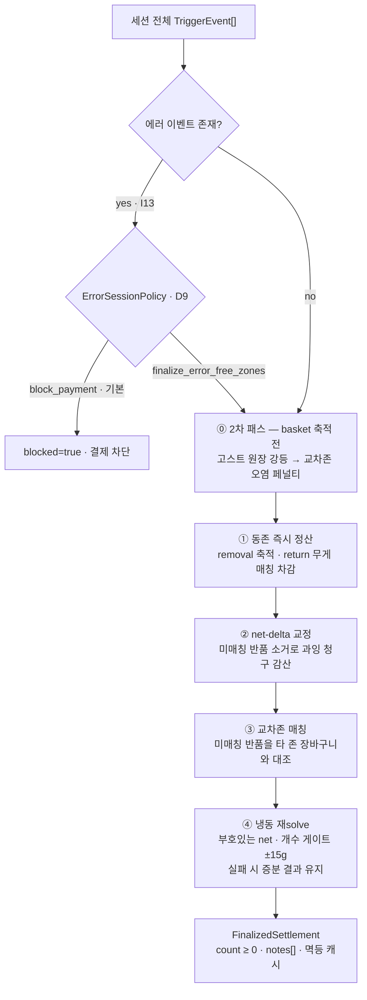
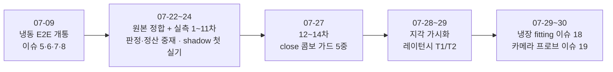

# 06. 검증 보고서

> 대상: 인수 담당자 · 기준일: 2026-07-30
> 선행 문서: [02. 시스템 아키텍처](02-system-architecture.md) · [03. 판정과 정산](03-judgment-and-settlement.md)
> 목적: 무엇이 어디까지 검증됐고, 무엇이 아직 검증되지 않았는지를 근거와 함께 고정

---

## 1. 요약

기능 구현과 자동 검증은 완료 상태입니다. 냉동 실기에서는 문 열림부터 결제
페이로드 전달까지 E2E가 통과했고, 냉장 실기는 지각 계층 fitting이 진행 중입니다.
자동 검증은 **443건 전부 통과**(2026-08-06)이며 불변식 I1~I17을 전건 커버합니다.
남은 위험은 기능 결함이 아니라 **기기 실측이 필요한 항목**에 몰려 있습니다 —
냉동 지연(13.7s) > CLOSE 상한 타임아웃(10s) 충돌, T2 레버 실측 미확인, 24h+ soak 미수행.

| 영역 | 상태 | 근거 |
|---|---|---|
| 도메인 코어 (판정·정산·배리어) | ✅ 구현 완료 | `crk_model/` 9패키지 약 10,800행, 테스트 443건 통과 |
| 외부 계약 (HTTP 3종) | ✅ 확정 | 레거시 wire 형식과 동형, `tests/test_wire_contract.py`·`test_adapters.py` |
| 불변식 I1~I17 | ✅ 전건 커버 (I9 제외) | 본 문서 §4 — I9는 G1 인수 항목 |
| 냉동 실기 E2E | ✅ 통과 (2026-07-09 개통) | 이슈 #5·#6·#7·#8 전 과정, `devdoc/fix_logs.md` |
| 냉동 판정 정확도 | ⏳ 개선 진행 중 | 1~14차 배치 누적 실측, 12~14차 오과금 6건 대응 완료 |
| 냉장 실기 fitting | ⏳ 진행 중 | issue #18 — 지각 노브 3종 투입, 전부 기본 off |
| 성능 (냉동 지연) | ⚠ 구조적 미해결 | 13.7s/트리거 > `close_timeout` 10s. T1 적용, T2 실측 대기 |
| 24h+ soak (G4) | ❌ 미수행 | 무한 성장 방지는 구현·테스트됨, 장시간 가동은 미검증 |
| 판정 등가성 (G1) | ❌ 미인수 | 924 시나리오 계약 — P1·P2 확보물 대기 |

범례: ✅ 완료 · ⏳ 진행 중 · ⚠ 알려진 위험 · ❌ 미착수/미수행

---

## 2. 개발 완료 범위

### 2.1 계층별 구현

레거시 서비스의 단일 판정 엔진(10,000행대)을 계층 경계가 있는 9패키지로
재설계한 결과입니다. 모듈 경계 = 테스트 경계(D10)가 그대로 유지됩니다.

| 계층 | 구현 완료 항목 | 규모 | 테스트 |
|---|---|---|---|
| [`core/`](../crk_model/core/) | 타입 분리(I10), SensorProfile(D3), 에러 정책(D9), env 설정 카탈로그 | 733행 | (전역) |
| [`ingest/`](../crk_model/ingest/) | 트리거 멱등성(I7), 로드셀 구간화, BOCPD 분석기(primary) + plateau(롤백) | 523행 | `test_ingest` 18 |
| [`frames/`](../crk_model/frames/) | 프레임 번들, 모션 게이트(L1) + 손 래치(D6/I16), 디코드 프리페치 | 240행 | `test_frames` 7 |
| [`perception/`](../crk_model/perception/) | Detector 프로토콜, 필터 체인 4단, 모션 변위 증거(트랙 단위), 투표 앙상블, 조기 종료(L2 — 기본 off, 이슈 #22) | 1,199행 | `test_perception` 60 |
| [`judgment/`](../crk_model/judgment/) | Stage/Strategy 분리, 선언적 우선순위 라우터(L5) 17단, 냉동 vision-first 전략, strict 매처(개수 오컴) | 1,580행 | `test_judgment` 79 |
| [`ledger/`](../crk_model/ledger/) | 이벤트 소싱, close-time 단일 정산기(L6) 4층, CLOSE 2차 패스 2종, 인과 배리어(I17), 저널, 세션 아카이브 | 2,173행 | `test_ledger` 28 외 |
| [`gateway/`](../crk_model/gateway/) | OPEN/CLOSE 상태기계, 결제 페이로드 빌더(I10 타입 강제) | 391행 | `test_gateway` 15 |
| [`service/`](../crk_model/service/) | 파이프라인 7단계 오케스트레이션, 단일 소비자 워커, 재고 스냅샷(I2), 파사드 | 1,481행 | `test_service` 44 |
| [`adapters/`](../crk_model/adapters/) | FastAPI 바인딩, TensorRT Detector, AVI 스트리밍 디코드, 진단 CLI 3종, 진입점 | 2,472행 | `test_adapters` 4 외 |
| 합계 | — | **약 10,800행** | 테스트 약 7,900행 |

코어는 런타임 의존성이 0입니다 — YOLO/TensorRT/cv2/FastAPI는 전부 `adapters/`에서
lazy import되며, 테스트는 Detector를 주입해 장치 없이 돕니다.

### 2.2 외부 계약 3종

레거시 wire 계약을 그대로 유지하므로 Node·카메라 측 변경이 필요 없습니다.

| 엔드포인트 | 호출자 | 계약 요점 | 구현 |
|---|---|---|---|
| `POST /trigger` | CRK-CAMERA | zone + AVI 경로 + 로드셀 시계열 (+ 선택 `seq`). 멱등 키 = MD5(zone+paths) | `adapters/http_app.py` |
| `POST /api/judge/multi-zone` | Node | `OPEN`/`CLOSE` + `active_products` (+ 선택 `expected_triggers` 워터마크). 확정 결과는 **정확히 1회** 전달 후 즉시 idle | `gateway/state_machine.py` |
| `GET /api/health` | 운영·엣지 | `door_state`, `queue_pending`, `barrier_satisfied` 등 상태 노출 | `adapters/http_app.py` |

결제 페이로드는 레거시 finalize 응답과 동형입니다 — `success`/`status` +
평탄화된 `products` 배열(`productIdx`/`productId`/`name`/`count`/`price`) +
존별 분해. 잠정 집계(`InterimSummary`)는 타입 자체가 달라 결제 빌더에 넘기면
`TypeError`가 납니다(I10).

### 2.3 판정 전략 라우터 (L5)

`judgment/router.py`의 `default_pipeline()` — 위에서 아래로 첫 non-None이
즉시 반환되는 선언적 우선순위 체인입니다. 원본 다이어그램 5의 순서를
보존하며, 모든 성공 결과는 `enforce_full_delta_match`(I6)를 거칩니다.

| 순위 | 전략 | 역할 |
|---|---|---|
| 0 | `vision_only` | 로드셀 없음/강제 vision — count=1, conf×0.7 |
| 1 | `freezer_vision_first` | **냉동 전용** — vision이 정체성을 고르고 무게는 개수 게이트(±15g)로만 거부권 |
| 2 | `augment_stage_weight_gate` | Stage (컨텍스트 보강, 결정자 아님) |
| 3 · 3.5 | `segment_weight_matching` · `stage_count_combo` | 구간 단위 무게 매칭, 후보없음 체인 진입 |
| 4 | `no_candidate_fallback` | 후보 0 — 냉장은 단일 품목 유일 매칭, 냉동은 억제(`loadcell_identity_suppressed`) |
| 5 · 6 | `min_weight_gate` · `same_weight_collision_guard` | 저무게 스킵, 동일 무게 후보 충돌 방어 |
| 7 · 7.5 | `strict` · `stage_count_combo` | **냉장 주 경로** — 무게 조합 탐색(I5·I12를 탐색 공간에서 강제) |
| 8 · 9 | `same_product_count` · `relaxed` | 동일 상품 n개, tolerance×2 완화 |
| 9.1~9.4 | `relaxed_loadcell_only` … `relaxed_partial` | 완화 하위 폴백 — "무게로 뒷받침된 count 격상 > 무검증 count=1" 원칙으로 재배치 |
| 10 | `forced_final` | 최종 폴백 |

냉동(`weight_is_discriminative=False`)에서는 무게만으로 정체성을 정하는 경로
전부가 스스로 꺼집니다 — 로드셀 오차 5~15g으로 정체성을 판별하면 오식별 과금이
나기 때문입니다.

### 2.4 close 정산 4층 + 2차 패스 2종



| 구성 | 상태 | 구현 |
|---|---|---|
| 4층 반품 복구 통합 | ✅ 기본 동작 | `ledger/settler.py` |
| 교차존 비전 오염 페널티 | ✅ 승격 완료 (기본 ON, 2026-07-21) | `ledger/cross_zone.py` |
| 세션 고스트 원장 | ⏳ shadow (승격 대기) | `ledger/ghost_ledger.py` |
| 냉동 vision 조합 중재 | ✅ 기본 ON + 자격 5중 가드 | `ledger/settler.py` |

정산기는 세션 키 단위로 멱등합니다(I11) — 같은 `session_id`는 항상 같은 결과를
반환하고, 확정 후 도착 이벤트는 반영하지 않고 거부 기록만 남깁니다.

### 2.5 인과 배리어 (I17)

확정 기준이 "시간이 지나서"가 아니라 "인과적으로 완결되어서"입니다.

| 조건 | 의미 | 없을 때의 대비책 |
|---|---|---|
| ① `enqueued == processed` | 큐에 들어온 트리거가 전부 처리됨 | — (항상 적용) |
| ② 로드셀 안정 | 마지막 구간이 안정화됨 | — |
| ③ 카메라 seq 워터마크 | 카메라가 "몇 번째까지 보냈다"를 선언 | 펌웨어 미배포 → ③'로 대체 |
| ③' 엣지 워터마크 `expected_triggers` | Node가 존별 녹화 수를 세어 전달 | 부재 시 CLOSE 유예 3초 폴백 |
| 상한 타임아웃 | 위가 충족되지 않으면 에러 세션 (D9 fail-closed) | 부분 확정·유실 확정 금지 |

### 2.6 이벤트 소싱 · 저널 · 아카이브

| 층 | 산출물 | 검증 상태 |
|---|---|---|
| 이벤트 로그 | `EventLog` — 불변 `TriggerEvent` 축적, 세션 prune | ✅ `test_lifecycle` |
| 이벤트 저널 | `logs/events_YYYYMMDD.jsonl` — append-only, 일자 로테이션 + 보존기간 삭제 | ✅ `EventJournal.replay` 훅 완성 (G2.5) |
| 세션 아카이브 | `data/sessions/<날짜>/<세션>.yaml` — 후보·득표·전략·탈락 사유·정답 라벨 | ✅ `test_session_archive` 18 |

아카이브는 오판정 사후 분석의 정본입니다 — `SAVE_DETECTIONS=1`이면 프레임별 bbox까지
동봉되어 `render-session`으로 육안 검증이 가능합니다.

### 2.7 진단 CLI

| 도구 | 형태 | 용도 |
|---|---|---|
| `label-session` | 콘솔 스크립트 | 실험 직후 정답 라벨 기입 (`--latest`, `--take`, `--none`) |
| `analyze-sessions` | 콘솔 스크립트 | 아카이브 오프라인 리포트 — 과금 정오, shadow 게이트, conformal 분위수, `--since`/`--session` |
| `render-session` | 콘솔 스크립트 | 기록된 bbox를 트리거 AVI에 오버레이 (라이브와 동일 크롭 기하 재현) |
| `detection-heatmap` | `scripts/detection_heatmap.py` | 존×프레임 위치별 검출 밀도·평균 conf 히트맵 (`--min-conf`, per-frame 정규화) |

2026-07-30에 `scripts/camera_luma_probe.py`(카메라 노출·내부 AE 프로브, 이슈 #19)가
추가되어 실질 5종입니다. 콘솔 스크립트 3종은 `pyproject.toml` 엔트리포인트라
**배포 시 `uv pip install --no-deps -e .` 재실행이 필요**합니다.

### 2.8 냉장·냉동 겸용 가드

냉동 실기로 검증해 온 코드베이스를 그대로 냉장 실기에 올릴 수 있습니다 —
캐비닛 분기가 전부 아래 세 가드 뒤에 격리되어 코드 수정이 없습니다.

| 가드 | 값 | 효과 |
|---|---|---|
| `SensorProfile.weight_is_discriminative` | 냉장 True / 냉동 False | 냉장은 무게 주도(±5g strict), 냉동은 vision 주도 + 무게 거부권 |
| `MODEL__MACHINE__CABINET_TYPE` | `refrigerated`\|`freezer` | 기기 단위 기본 프로파일. 존 단위 오버라이드는 `MODEL__ZONES__FREEZER` |
| `MODEL__VISION__CAMERA_LAYOUT` | `dual`\|`dual_top_proxy` | 필터 체인 ROI 구성(냉동 dual-top 수직 ROI vs 냉장 side x-ROI) |

존 수 가정은 코드 어디에도 없습니다 — 트리거의 `zone` 필드로만 동작합니다.

### 2.9 성능 레버 (상세는 §6)

| 레버 | 상태 | 판정 영향 |
|---|---|---|
| T1 — `combine()` 지연 평가 · 게이트 뷰 선(先)다운샘플 | ✅ 적용 완료 (2026-07-28) | 없음 — 출력 비트 동일(등가성 테스트 동봉) |
| T2 — GPU 텐서 입력 / 고정 배치 predict / 디코드 프리페치 | ⏳ 구현 완료 · **기본 off** | 단일 `consume()` 경로 공유 → 배치가 판정을 바꿀 수 없음. 등가성 테스트로 고정 |
| T3 — 냉동 게이트 정상화 | ❌ 미착수 | **판정 변경 가능** — 별도 배치 필요 |

---

## 3. 자동 검증 (게이트 G0)

### 3.1 실행 결과

`.venv/bin/python -m pytest tests -q` → **443 passed** (2026-08-06, 실패·에러 0건).

| 테스트 파일 | 건수 | 주 검증 대상 |
|---|---|---|
| `test_judgment.py` | 79 | 라우터 순위 보존, I6 전건 적용, 냉동 vision-first 단계별 중재, strict 탐색 공간(I5·I12), 개수 오컴·세그먼트 조합 도전(0731), relaxed_partial 무게 반증 거부권(이슈 #22), strict 개수 오컴(이슈 #23) |
| `test_perception.py` | 60 | 투표 결합 산식, 진입 컷, 필터 체인 4단, 모션 변위 몰수, 조기 종료 한정(I15)·전 재고 유일해 게이트(이슈 #22) |
| `test_service.py` | 44 | 파이프라인 7단계, 멀티트레이 2-pass 재판정, 스냅샷 fail-closed(I2), 래치(I16) 배선, 조기 종료 기본 off |
| `test_lifecycle.py` | 33 | OPEN→trigger→CLOSE→결제 페이로드 E2E, cabinet_type 프로파일 E2E, 무한 성장 방지 |
| `test_ledger.py` | 28 | 정산 4층, 냉동 재solve 게이트(I3), 콤보 자격 가드, 멱등(I11), 음수 차단(I14) |
| `test_analyze_cli.py` | 22 | 리포트 집계 정오, `--since` 프리필터, 단건 조회, 구 스키마 호환 |
| `test_cross_zone.py` | 24 | 교차존 페널티 창·self-fit 자격·상호 소멸 방지, PARTIAL 원 판정의 ④ 우회(이슈 #22), 무겹침 침묵 진단(이슈 #23) |
| `test_t2_batch.py` | 19 | 배치 vs 비배치 판정 동등성, 배치 중간 조기 종료, 프리페치 시맨틱 |
| `test_session_archive.py` | 18 | 아카이브 직렬화·정답 라벨 기입·보존기간 |
| `test_ingest.py` | 18 | 로드셀 구간화, BOCPD 계약 동형, 멱등 TTL(I7) |
| `test_frames_streaming.py` | 18 | 스트리밍 디코드, hwaccel 프로브·CPU 폴백, 크롭 기하 |
| `test_product_mapping.py` | 17 | 상품→YOLO 클래스 매핑(숫자 별칭·이름 매칭·미매핑 센티널 −1) |
| `test_gateway.py` | 15 | 상태기계 전이, 확정 1회 전달, CLOSE 유예, 엣지 워터마크, 결제 빌더(I10) |
| `test_ghost_ledger.py` | 15 | 고스트 검출 요건(존 수·표 하한·에피소드 ≥2), 같은 순간 트리거의 에피소드 병합(이슈 #22), shadow 무개입 |
| `test_render_cli.py` | 12 | 오버레이 렌더 좌표계 재현, legacy 레코드 스킵 |
| `test_frames.py` | 7 | 모션 게이트 판정, 손 래치 스킵 금지(I16), keepalive |
| `test_wire_contract.py` | 6 | HTTP 요청·응답 필드 계약 |
| `test_adapters.py` | 4 | FastAPI 바인딩, 워커 스레드 배선(I7·I17) |
| `test_ops_logging.py` | 4 | `[OPS][CLOSE]` 구조화 로그, 중복 로그 억제 |
| **합계** | **443** | |

### 3.2 무엇을 커버하는가

- **불변식 전건** — I1~I17 중 I9(924 시나리오 계약, G1 인수 항목)를 제외한
  전부에 대응 테스트가 있습니다. 상세는 §4.
- **E2E** — `OPEN → trigger → CLOSE → 결제 페이로드`가 `test_lifecycle.py`에서
  Detector를 주입한 형태로 완주합니다. 확정 결과 1회 전달 후 idle 복귀,
  재폴링 시 "활성 세션 없음" 응답까지 포함합니다.
- **HTTP wire 계약** — 요청 필드 정규화(문자열 키 → int, 파싱 불가 값 무시)와
  응답 형식을 `test_wire_contract.py`·`test_adapters.py`가 고정합니다.
- **정산 등가성 훅** — `EventJournal.replay`가 저널에서 세션을 재구성해 같은
  정산 결과를 내는지 검증하는 경로가 완성돼 있습니다(G2.5). 실기 코퍼스
  replay는 아카이브 확보(P2) 후 과제입니다.
- **판정 동등성** — 성능 레버(T1·T2)는 "출력 비트 동일" 또는 "판정 결과 동일"을
  회귀 테스트로 고정합니다 — 속도 개선이 판정을 조용히 바꾸는 사고의 구조적 차단.

### 3.3 환경 의존 테스트

일부 테스트는 선택 의존성이 없으면 자동으로 skip됩니다 — 결함이 아니라
의도된 동작입니다.

| 의존성 | 없을 때 | 대상 |
|---|---|---|
| `numpy` | skip | 벡터화 모션 게이트, 렌더 오버레이, GPU 텐서 경로 |
| `ffmpeg` 바이너리 | skip | AVI 스트리밍 디코드, hwaccel 프로브·CPU 폴백 |
| `fastapi` | skip | HTTP 어댑터 E2E, wire 계약 |

CI는 세 의존성을 모두 설치해 skip 없이 돌립니다 — 개발 PC에서 건수가 다르면
먼저 skip 여부를 확인하세요.

### 3.4 CI 구성

`.github/workflows/ci.yml` — `master` push 및 PR에서 동작합니다.

| 단계 | 내용 |
|---|---|
| 실행 환경 | `ubuntu-latest`, Python 3.10 |
| 시스템 의존성 | `ffmpeg` 설치 (스트리밍 디코드 테스트가 skip되지 않게) |
| 파이썬 의존성 | `pip install -e ".[dev,jetson]" numpy` — Jetson 전용 `ultralytics`/`torch`는 불필요(테스트가 Detector를 주입) |
| Lint | `ruff check .` |
| Test | `pytest -q` |

**lint의 정본은 CI입니다.** 로컬에서 같은 검사를 돌리려면 개발 의존성을
설치한 뒤 실행하세요 — `pip install -e ".[dev]"` 후 `ruff check .`.

ruff 설정(`pyproject.toml`)은 `line-length = 100`, 규칙셋 `E,F,W,I,UP,B`이며
`crk_model/adapters/http_app.py`만 `B008`(FastAPI `Body(...)` 관용구)을
예외로 둡니다. 2026-07-30에 `scripts/detection_heatmap.py`의 `B007` 위반으로
CI lint가 실패한 전례가 있으니, `scripts/`도 검사 대상임을 유념하세요.

---

## 4. 불변식 커버리지 (I1~I17)

전부 실제 사고(오과금·매출 누락)의 재발 방지책이며, 예외 처리가 아니라 **구조**로
표현했습니다 — 타입 분리, 탐색 공간 제약, 상태기계 전이 제약.

| 불변식 | 무엇을 막는가 | 강제 지점 | 검증 테스트 |
|---|---|---|---|
| **I1** 처리 실패 → error 이벤트 | 추론 예외가 "무검출"로 조용히 바뀌어 매출 누락 | `service/pipeline.py` (except 절), `frames/prefetch.py` (예외 재전파) | `test_service`, `test_frames_streaming` |
| **I2** 빈 allowlist fail-closed | 판매 중이 아닌 상품 청구. 빈 스냅샷이면 YOLO 호출 0, `last_valid` 폴백 | `service/snapshot.py`, `service/pipeline.py` | `test_service` |
| **I3** 냉동 ±15g 개수 게이트 | 무게가 설명하지 못하는 개수의 확정. **판정·정산 양쪽 동일 산식** | `core/profiles.py`, `judgment/strategies.py`, `ledger/settler.py` | `test_judgment`, `test_ledger` |
| **I4** conf 하한은 투표 결합 후에만 | 프레임 단계 conf 컷이 저신뢰 증거를 미리 버려 후보 전멸 | `perception/detector.py`, `perception/filters.py` (conf 필터 없음), `perception/voting.py` | `test_perception` |
| **I5** 품절 상품 탐색 배제 | `stock_qty = 0` 상품이 무게 조합에 끼어 오청구 | `judgment/strict.py`, `judgment/strategies.py` (`_product_by_class`) | `test_judgment` |
| **I6** 전량 설명 강제 | delta를 전량 설명하지 못하는 결과의 COMPLETE 확정(부분 설명 과금) | `judgment/strategies.py` (`enforce_full_delta_match`), `judgment/router.py` — 라우터가 **전건**에 적용 | `test_judgment` |
| **I7** 트리거 멱등 + 단일 소비자 | 같은 트리거 중복 처리, TensorRT 동시 추론 | `ingest/idempotency.py` (MD5+TTL), `service/worker.py`, `adapters/http_app.py` | `test_ingest`, `test_service`, `test_lifecycle`, `test_adapters` |
| **I8** 기계 판독 사유 코드 | "왜 이렇게 판정했는가"가 남지 않아 사후 분석 불가 | `core/types.py` (`reason`/`notes`), `ledger/barrier.py` (`pending`), `ledger/settler.py` | `test_judgment`, `test_ledger`, `test_frames` |
| **I9** 시나리오 계약 (924) | 재설계가 원본 판정과 다른 답을 내는 회귀 | — (미커버, G1에서 인수) | ❌ P1·P2 확보물 대기 |
| **I10** Interim/Finalized 타입 분리 | 잠정 집계가 결제로 전달되는 사고. 빌더가 `TypeError`로 거부 | `core/types.py`, `gateway/state_machine.py` (`build_payment_payload`) | `test_gateway`, `test_ledger` |
| **I11** 정산 멱등 + 확정 후 이벤트 거부 | 이중 과금. 확정 후 도착 이벤트는 유실이 아니라 거부 기록 | `ledger/settler.py` (세션 키 캐시), `ledger/events.py` | `test_ledger`, `test_gateway`, `test_lifecycle`, `test_service` |
| **I12** 재고 상한 | 재고보다 많은 개수 청구 | `judgment/strategies.py`, `judgment/strict.py`, `ledger/settler.py` | `test_judgment`, `test_ledger` |
| **I13** 에러 세션 무성 확정 금지 | 에러를 안은 세션이 조용히 결제로 흐르는 것 | `core/policy.py` (`ErrorSessionPolicy`), `ledger/settler.py` (`blocked=true`) | `test_ledger`, `test_service` |
| **I14** count 음수 금지 | 반품 정산이 청구보다 커져 환수가 되는 것 | `ledger/settler.py` (`_Basket.remove_one`) | `test_ledger` |
| **I15** 조기 종료 한정 | 냉동·반품에서 프레임을 덜 봐 증거 소실 | `perception/early_termination.py`, `core/profiles.py` (`early_termination_allowed`) | `test_perception` |
| **I16** 손 래치 중 스킵 금지 | 취출 순간 프레임을 모션 게이트가 버리는 것 | `frames/motion_gate.py` (래치), `perception/filters.py` (손은 항상 보존) | `test_frames`, `test_service` |
| **I17** 인과 배리어 확정 | 트리거가 도착하기 전에 0원 확정 | `ledger/barrier.py`, `gateway/state_machine.py`, `service/worker.py` | `test_gateway`, `test_ledger`, `test_service`, `test_adapters` |

**I9만 미커버**입니다 — 원본 924 시나리오 계약 인수는 현장 AVI 코퍼스(P1)와
아카이브 replay(P2)가 선행 조건이며, 게이트 G1로 분리돼 있습니다.

---

## 5. 실기 검증 이력

냉동 실기는 2026-07-09 E2E 개통 후 14차까지, 냉장 실기는 2026-07-29부터 issue
#18로 fitting 중입니다. 원자료는 [`devdoc/fix_logs.md`](devdoc/fix_logs.md)입니다.



### 5.1 냉동 실기

| 배치 | 시기 | 주요 발견 | 조치 |
|---|---|---|---|
| E2E 개통 | 2026-07-09 | 확정 결과 반복 전달로 엣지 device busy 미해제(#5), 상품→클래스 매핑 전멸로 전 트리거 weight_only 추락(#6), CLOSE가 카메라 업로드보다 빨라 0원 확정(#8), 카메라 진단 부재(#7) | 확정 1회 전달 후 idle, 이름 기반 매핑 + 미매핑 센티널 −1, CLOSE 유예 3s + 엣지 워터마크, `live_engine_preview` 진단 |
| 원본 정합 1 | 2026-07-22 | 같은 엔진인데 성능이 낮은 구조적 원인 — squash resize, 전 클래스 추론, conf 평균 결합 | 입력 크롭 정합, `predict classes` 허용목록, conf 결합을 카메라별 max로 |
| 실측 1차 | 2026-07-23 | 라벨 20세션 — 리포트가 shadow mismatch만 세고 "현행이 몇 세션을 맞게 과금했나"가 사각 | `analyze-sessions` 과금 정오 총괄 + `--session` 상세 덤프 |
| 실측 2차 | 2026-07-23 | **22/29**. held-object 표 오염, 빠른 취출로 정답 표 소멸, 저증거 partial 과금 | held A-1 계측(판정 영향 0), `PARTIAL_MIN_CONFIDENCE` 0.18 |
| 실측 3차 | 2026-07-23 | **25/36**. held 후보가 `min_vote_share` 분모를 인플레이션, refit 유일적합이 "모호"로 차단 | refit conf 중재, 덤프에 A-1 신호 표시 |
| 실측 4차 | 2026-07-23 | **30/43**. 교차존 페널티 첫 실기 교정 성공, held head 임계 실증(27~33 vs 0~2), 전날 넣은 refit 중재가 유령을 채택해 악화 | `REFIT_ARB_CONF_FLOOR` 0.8, 무게 우도 Phase 2 승격 **부결** |
| 5~9차 | 2026-07-23~24 | fix_logs에 개별 항목이 없고 issue #17 코멘트 13개(라벨 누적 ~90세션)에 기록. 오답 34건 전수 분류 — 옷 프린트 유령표 15 / 동일존 동시취출 12 / 무게 정수배 스냅 9 / 교차존 6 / hold 잔상 5 | 정산 중재 2종(self-fit 자격, vision 조합) + 세션 고스트 원장 shadow 도입 |
| 10차 | 2026-07-23 | **8/12**(실질 9/12). held 정답 클래스 오플래그 5건 — 결정타는 진열→취출 전환 트랙 60/61표. shadow 게이트가 잘못된 승격을 실제로 차단. BOCPD primary mismatch 0 | held 판정에 head 구간 이동 요건 추가, 튜브 승격 보류, 라벨 `--none` |
| 11차 | 2026-07-24 | **4/9**. 콤보 "count > 증분" 가드 헛다리, 고스트 정답 오플래그 3/3(에피소드 영상 공유), 정답 상품이 후보에 아예 없는 지각 실패 | 가드 제거, `detect_ghosts` 에피소드 ≥2 요건 |
| 12~14차 | 2026-07-27 | **close 콤보가 판정층이 맞춘 존을 뒤집는 오과금 6건** — 소수 클래스 자격이 "표 3개 이상"뿐이라 플리커·타존 표·판정이 기각한 클래스까지 통과 | 콤보 자격 5중 가드(실존 증거 하한 / 교차존 설명 제외 / 고스트 제외 / 판정 기각 존중 / 확신 스냅 보호) |
| 지각 가시화 | 2026-07-28 | "정답 상품이 후보에 없다"는 관측이 반복되는데 숫자만으로 원인 확정 불가 | `SAVE_DETECTIONS` 프레임별 bbox + `render-session` 오버레이 CLI |
| 레이턴시 | 2026-07-28~29 | 냉동 평균 **13.7s/트리거**가 `close_timeout` 10s보다 길다 — 구조적 충돌. 40ms의 ~72%가 CPU측 오버헤드 | T1 2건 적용(판정 비트 동일), T2 3건 구현(기본 off), 도입 결함 4종 정정 |

### 5.2 냉장 실기 (issue #18)

| 시기 | 주요 발견 | 조치 |
|---|---|---|
| 2026-07-29 | "side 카메라가 zone 2에서만 제대로 일반화된다"는 가설 — 세션 로그로는 검출이 프레임 어느 위치에서 잡히는지 알 수 없었다 | `detection-heatmap` 신설. 실기 1회 실행에서 집계 왜곡 2종 발견(고정 위치 class-48 유령, 세션 수 편향) → `--min-conf` + per-frame 정규화 |
| 2026-07-29 | 히트맵 실측으로 구조적 문제 3종 확정 — ① side 정적 진열 오투표(zone1 class43 450검출 @ conf 0.21), ② 정답 상품 `vote_ratio` 0.03~0.07로 플리커와 구분 불가(분모 희석), ③ 빠른 취출에서 정답 클래스가 `no_motion` 몰수 | 지각 노브 3종 — side hand 추론 opt-in, `vote_ratio` 분모 `hand_window`, 모션 측정 불가 클래스 `exempt`. **전부 기본값이 기존 동작**이며 env로만 켜짐 |
| 2026-07-30 | v4l2 컨트롤에 `auto_exposure`가 없어도 UVC 모듈이 ISP에서 AE를 조용히 돌릴 수 있음(issue #19) | `scripts/camera_luma_probe.py` — 네 모서리 패치의 동시 동방향 luma 이동으로 내부 AE 판별 + 노출 적정성 통계 |

### 5.3 실기가 밝혀낸 결함 유형

배치를 거치며 드러난 결함은 네 갈래입니다. 이 분류가 곧 "다음 배치에서 무엇을
먼저 의심할지"의 순서입니다.

| 유형 | 성격 | 대표 사례 |
|---|---|---|
| **계약 불일치** | 우리 구현은 정상인데 상대 시스템의 기대와 다름. 증상이 "추론은 성공했는데 결제가 안 된다" 형태 | 확정 결과 반복 전달 → device busy 미해제(#5), 결제 페이로드 wire 형식(#6 4차), CLOSE 선행 도착(#8) |
| **이식 누락** | 원본에 있던 분기가 재설계 이관에서 빠짐. 증상이 "구조적 전멸" 형태로 크게 나타남 | `cabinet_type` 미이식 → 냉동 기기가 냉장 프로파일로 판정, 상품 이름 매핑 누락 → 전 상품 `class_id=0`, 단일 카메라 전용 conf 가중 누락, 투표 진입 컷 누락 → conf 평균 희석 전멸, 냉동 수직 ROI·손 conf 하한 미이식 |
| **물리 가정 오류** | 코드는 의도대로 동작하는데 전제한 물리가 현장과 다름. 가장 찾기 어렵고 반복 재발 | 로드셀 오차 5~15g에서 무게로 정체성 판별, plateau `stable_window`가 빠른 취출에서 실패, 진열 상품도 프리롤부터 관측되어 carried-in과 구분 불가, 관측 1개짜리 트랙은 변위 측정이 구조적으로 불가능 |
| **성능·자원** | 판정은 맞는데 시간·메모리가 계약을 못 지킴 | 전체 프레임 메모리 상주 → 4GB OOM 위험, 모션 게이트 순수 파이썬 병목, 냉동 13.7s > `close_timeout` 10s, 렌더 합성 11ms/프레임, `analyze-sessions --session` 9.7s |

여기에 교차하는 다섯째 패턴이 **수정 자체가 만든 회귀**입니다 —
`finalized_hold_s` 자동 리셋(오진단), `weight_only`의 count=1 과도 제한, refit
중재의 유령 채택, close 콤보의 판정 역전, T2 배치 도입 결함 4종이 여기 속합니다.
그래서 새 판정 기제는 **shadow-first**로 배포하고(관측만, 판정 무변경) 라벨
실측 게이트 통과 후 env 한 줄로 승격하는 규칙을 운영 원칙으로 고정했습니다.
이 게이트는 실제로 잘못된 승격을 막았습니다 — 10차 held 오플래그 5건, 11차
고스트 오플래그 3/3이 그 기록입니다.

---

## 6. 성능 실측

### 6.1 비용 모델

실기 34개 트레이스 전수 회귀로 확정됐습니다.

```
processing_time_ms ≈ 40.1ms × yolo_calls       (평균 절대오차 4.4%)
yolo_calls = Σ processed_frames − Σ gate_skipped_frames   (34건 전건 항등)
```

처리시간은 사실상 **추론 호출 수의 선형 함수**입니다. 비 YOLO 비용(디코드 +
게이트 + 집계)은 총 처리의 12~21%로 회귀에서 분리조차 되지 않았습니다. 따라서
레버는 두 갈래뿐입니다 — 호출당 비용 인하(T1·T2), 호출 수 감축(T3).

| 지표 | 냉동 (n=30) | 냉장 (issue #18) |
|---|---|---|
| 트리거당 평균 처리시간 | **13.7s** (5.7~26.1) | **5.7~6.8s** (조기 종료 발동 시 2.0~2.7) |
| 모션 게이트 스킵률 | 25% (2~46%) | 56~65% |
| 디코드 프레임 | 459 (357~740) | 약 420 |

냉동이 느린 이유는 정확히 두 가지입니다. ① 김서림·성에·AE 스윙 때문에 모션
게이트 임계를 0.005로 낮춰 놓아 스킵 이득이 사라졌고, ② 조기 종료가 냉동에서
영구 비활성(I15)이라 top·side 전 프레임을 완주합니다.

**구조적 충돌**: `close_timeout` 10s < 트리거당 13.7s. 인과 배리어가 정상
동작해도 상한 타임아웃이 먼저 만료될 수 있습니다.

### 6.2 40ms의 정체

외부 실측 대조 결과 40ms의 지배분은 TensorRT 커널이 아니라 그 **주변**입니다 —
ultralytics `predict()`의 프레임별 letterbox / BGR→RGB / HWC→CHW / /255 전처리와
파이썬 NMS·동기화가 약 72%를 차지하고 GPU는 놉니다. "모델이 느리다"가 아니라
"모델 주변이 느리다"입니다.

부수적으로 확정된 사실 2건 — ① **NVDEC은 MJPEG를 디코드하지 못합니다**. 즉
`avi_frames.py`의 hwaccel 경로는 한 번도 성공한 적이 없고 디코드는 항상 100%
CPU였습니다(AVI MJPEG는 4:2:2라 NVJPG 경로도 차단). ② **전력 모드는 실기에서
25W로 확인**됐습니다(2026-07-28). 전력 상한은 이미 최적 근처이므로 남은 것은
DVFS 램프업 제거(`jetson_clocks` 영구화)뿐이며 기대치는 약 5~10%로 하향됐습니다.

### 6.3 적용 완료 (T1 — 판정 비트 동일)

| 항목 | 내용 | 기대 절감 |
|---|---|---|
| `combine()` 지연 평가 | 냉동에서 `should_stop`은 항상 False인데 인자 평가로 `combine`이 매 추론 프레임 실행되어 결과가 100% 폐기됐다. candidates를 지연 콜러블로 전환 | 0.2~2s/트리거 |
| 게이트 뷰 선(先)다운샘플 | 480² 풀프레임 채널 평균 후 다운샘플 → 다운샘플 후 평균. nearest 인덱스와 채널 평균은 교환 가능하므로 **출력 비트 동일**(등가성 회귀 테스트 동봉) | 0.5~1.5s/트리거 |

두 항목 모두 **판정 비트가 동일**합니다. 실기 실측(전후 `processing_time_ms` 비교)은
다음 세션에서 확인할 항목으로 남아 있습니다.

### 6.4 구현 완료·실측 대기 (T2 — 기본 off)

`BATCH_SIZE=1` / `PREFETCH=0` / `TENSOR_INPUT=0`(기본값)이면 기존 경로와 동일합니다.

| 레버 | env | 노리는 것 | 상태 |
|---|---|---|---|
| T2-1 GPU 텐서 입력 | `MODEL__VISION__TENSOR_INPUT=1` | 프레임별 CPU 전처리(측정 비용의 ~72%) 소멸 | 엔진 재빌드 불필요 — batch-1 엔진이 그대로 수용 |
| T2-2 고정 배치 predict | `MODEL__VISION__BATCH_SIZE=4` | 커널 런치 상각 | `_batch4.engine` 재빌드 필요. 기동 프로브가 배치/dtype 불일치를 기동 실패로 노출 |
| T2-3 디코드 프리페치 | `MODEL__VIDEO__PREFETCH=4` | side 디코드를 top 추론과 겹쳐 디코드분 은닉 | 어느 단이든 독립 적용 |

효과 분리 측정 매트릭스가 정의돼 있습니다 — A(기본) → B(+`TENSOR_INPUT`) →
C(`_batch4` + `BATCH_SIZE=4`) → D(+`PREFETCH=4`). 각 단계에서 재야 하는 것은
① 기동 프로브 통과 ② 동일 AVI 재생에서 비배치 대비 과금 diff 0
③ `processing_time_ms` 전후 비교입니다.

**미검증**: 40ms/call → 15~20ms, 냉동 13.7s → 5~7s는 **가설**이며 기기 측정으로만
확정됩니다. 목표 궤적은 `13.7s → (T1) 약 11~13s → (T2) 5~7s → (T3) 3~5s`이고,
`close_timeout` 10s 안으로 들어오는 지점이 T2입니다.

### 6.5 진단 도구 성능 개선 (실측 확정)

| 항목 | 전 | 후 | 방법 |
|---|---|---|---|
| `render-session` 데모 렌더 | 0.64s | **0.28s** | 캔버스(배경+테두리+정적 헤더)를 트리거/카메라당 1회만 렌더해 복사, 스케일된 글리프 마스크 캐시. **mp4 바이트 동일** |
| `analyze-sessions --session` 단건 조회 | 9.7s | **80ms** | 파일명 stem == session_id 계약으로 해당 파일만 파싱, `--since`를 파싱 전 프리필터, libyaml `CSafeLoader`/`CDumper` 우선 사용 (20세션 × 354KB 기준) |

부수 효과로 finalize 시점의 아카이브 덤프도 워커 임계 경로에서 빠졌습니다.

### 6.6 착수하지 않기로 확정한 방향

조사로 배제가 확정된 항목입니다 — 재시도 방지를 위해 기록합니다. 상세 근거는
[`devdoc/research/0728_freezer_latency_research.md`](devdoc/research/0728_freezer_latency_research.md)와
[07번 문서](07-rejected-and-retired.md)에 있습니다.

| 방향 | 배제 사유 |
|---|---|
| 냉동 조기 종료 허용 (I15 변경) | 3중 독립 근거 — 후반 프레임 증거 / `weight_is_discriminative=False`와 ±15g 게이트의 오조합 성립률 / 다중 트레이 재판정이 완전 투표 풀을 전제 |
| DLA · HW MJPEG 디코드 | Orin Nano에 DLA 자체가 없음. MJPEG는 NVDEC 미지원 코덱 + 4:2:2 차단 |
| CUDA multi-stream / 멀티프로세싱 | Orin 실측 역효과, CUDA context 300~600MB/프로세스로 4GB 불가 |
| 프리롤·포스트롤 단축 | 프리롤 첫 30프레임이 held 계측의 기반, 포스트롤 4s는 로드셀 안정화 2.4s 제약 |
| `imgsz` 480 → 416/384 | 이득은 sublinear인데 좌표계 상수 전면 재보정이 연쇄(side ROI, y_split, hand_margin, motion floor, max_jump, 크롭 계약) |

---

## 7. 검증 게이트 현황

| 게이트 | 상태 | 내용 | 남은 조건 |
|---|---|---|---|
| **G0** 정적/단위 | ✅ **443 passed** (2026-08-06) | 불변식 I1~I17 + E2E + 필터·게이트·정산 + CI(ruff + pytest) | 없음 — 유지 관리 대상 |
| **G1** 판정 등가성 | ❌ 미인수 | 원본 924 시나리오 계약 인수 (I9) | 현장 AVI 코퍼스(P1) + 세션 아카이브 replay(P2) |
| **G2** 게이팅 검증 | ⏳ 인프라 준비 완료 | 현장 AVI 코퍼스 전체 파이프라인 재실행 diff | `SAVE_DETECTIONS` + 아카이브 + AVI 보존 + `render-session`으로 실행 가능해짐. 재생 시 `MODEL__VIDEO__DECODER=ffmpeg` 고정 필수(opencv 경로는 게이트 결정이 조용히 달라짐) |
| **G2.5** 정산 등가성 | ⏳ 훅 완성 | `EventJournal.replay`로 저널 재구성 → 동일 정산 | 실기 아카이브 replay 실행(P2) |
| **G3** 프로토콜 계약 | ⏳ 부분 완료 | 파사드 계약 고정 완료 | interim 의미론·에러 정책의 Node 합의(P3·P4) |
| **G4** 장치 검증 | ⏳ 부분 완료 | 파워모드·스로틀링·OOM·24h soak | 전력 모드 25W 확인 완료. **24h+ soak 미수행**, 발열 스로틀 `tegrastats` 확인 미완, T2 A/B/C/D 측정 미완 |

G0 대비 갱신 사항: 2026-07-30에 미채택 shadow 기제 5종을 코드째 삭제하면서
406건이 되었고(삭제 내역은 [07번 문서](07-rejected-and-retired.md)), 이후
0731 판정 배치(개수 오컴·세그먼트 조합 도전)와 이슈 #22 수정이 더해져 현재
**443건**입니다.

---

## 8. 알려진 한계

아래는 "아직 모르는 것"이며, 기능 결함 목록이 아닙니다.

### 8.1 냉동 트리거 지연이 CLOSE 상한 타임아웃보다 길 수 있음

트리거당 평균 13.7s(최악 26.1s)인데 `MODEL__CLOSE__BARRIER_TIMEOUT_S` 기본값이
10s입니다. 인과 배리어가 정상 동작해도 상한이 먼저 만료되면 에러 세션으로
확정됩니다(D9 fail-closed — 과청구는 없지만 결제가 차단됩니다). T2 실측으로
5~7s 대에 들어가는 것이 근본 해결이며, 그 전까지는 타임아웃 상향이 임시
완화책입니다. 단 상향은 "카메라 무응답"과 "추론 지연"을 구분하지 못하게
만들므로, 값 변경은 실측 분포를 보고 결정해야 합니다.

### 8.2 T2 절감이 미검증

구현·판정 동등성 테스트·기동 프로브까지는 완료됐지만, 기기에서 A/B/C/D
매트릭스를 재기 전까지 절감폭은 알 수 없습니다. 특히 T2-1은 박스가 letterbox
좌표계로 반환되는 함정이 있어 좌표계 등식이 어댑터 가정으로 남아 있습니다 —
`SAVE_DETECTIONS` + `render-session`으로 bbox를 육안 대조하는 절차가 검증
체크리스트에 포함돼 있습니다.

### 8.3 24시간 이상 soak 미수행 (G4)

무한 성장 방지는 구현·테스트됐습니다 — `worker.outcomes`는 `deque(maxlen)`,
정산 멱등 캐시는 세션 prune(현재+직전 세션은 항상 보존), 저널은 일자
로테이션 + 보존기간 삭제입니다. 그러나 **장시간 연속 가동은 한 번도 하지
않았습니다.** 알려진 잔여 항목으로 `EventLog.rejected`가 아직 무상한이며
(거부 이벤트는 드물어 후속 트랙으로 이관), 발열 스로틀링 확인도 미완입니다.

### 8.4 G1 판정 등가성(924 시나리오) 미인수

이 저장소의 통과 상태는 **설계·계약 수준의 증명**이며 원본 판정과의 전건
등가성은 인수되지 않았습니다. 다만 재설계에서 원본과 **의도적으로 다르게**
만든 지점들이 있으므로(예: `relaxed` 하위 순서 9.1~9.4 재배치, `vote_ratio`
분모 정의), G1은 "차이 0"이 아니라 "차이가 전부 의도된 것임을 확인"하는
성격의 게이트입니다. 근거는 `judgment/router.py`의 docstring에 기록돼 있습니다.

### 8.5 side 카메라 광학 공유로 인한 고스트 오플래그 잔존 위험

세션 고스트 원장의 11차 오플래그 3/3은 주 원인(에피소드 영상 공유)을 수정해
`detect_ghosts`에 에피소드 ≥2 요건을 추가했습니다. 잔존 한계는 두 가지입니다 —
① **side 카메라 광학 공유**: 한 존의 반품 영상에 다른 존의 진열 상품이 찍히면
그 클래스가 "다존 등장"으로 계수될 수 있습니다. ② **뒷받침 가로채기 순환**:
오과금이 진짜 클래스의 무게 뒷받침을 가져가면 뒷받침을 잃은 진짜 클래스가
유령으로 플래그됩니다. 그래서 `MODEL__GHOST__MODE`는 **shadow 유지**이며, 정답
클래스 오플래그 0 배치가 확인될 때까지 active 승격은 금지입니다.

### 8.6 승격 대기 shadow 2종의 미결 상태

2026-07-30 시점에 남은 승격 대기 shadow는 2종입니다.

| 기제 | env | 관측 중인 것 | 미결 사유 |
|---|---|---|---|
| held 트랙 강등 | `MODEL__VISION__HELD_TRACK_DEMOTION=shadow` | carried-in(들고 들어온) 트랙의 표를 몰수했을 때의 정오 | 정답 클래스 오플래그가 10차 5건 → head 이동 요건 추가 후에도 11차 3건 |
| 세션 고스트 원장 | `MODEL__GHOST__MODE=shadow` | 여러 존에서 표를 얻고도 무게 뒷받침 과금이 0인 클래스 | 11차 오플래그 3/3의 주 원인 수정 후 **재관측 중** |

두 기제 모두 **실패 모드가 실존**하기 때문에 유지합니다 — 관측 비용이 낮고,
폐기하면 같은 실패 모드에 다시 무방비가 됩니다. 판정 절차는
[08. 인수인계 §3](08-handover.md)에 있습니다.

### 8.7 그 밖의 미확정 항목

| 항목 | 내용 |
|---|---|
| side ROI 400의 재측정 | 입력 기하가 left-crop → center-crop으로 전환되어 가로축 크롭 원점이 이동했는데, `SIDE_ROI_MAX_CENTER_X` 값은 재계산하지 않았습니다. 실물 카메라에서 존 경계가 새 좌표계 어디에 오는지 실측이 필요합니다 |
| 냉동 수직 ROI 분할선 300 | 240 → 300 상향의 효과(정답 과잉 제거 / 진열 오투표 잔존)는 미실측입니다 |
| 냉장 조기 종료 | 0805 냉장 20종 실기에서 오과금 주도 원인으로 실측되어 **기본 off로 강등**했습니다(이슈 #22 — 정답 등장 전에 프리롤 진열·반사광 표가 delta를 설명해 종료). 재활성화하려면 T2 배치 실측과 별개로, 전 재고 유일해 게이트 하에서의 A/B 재검이 필요합니다 |
| 상품 DB `unit_weight` | 공칭 무게와 실측 총중량이 13~27g 차이 나 정답이 구조적으로 매칭 불가였던 실사고가 있습니다(이슈 #6 ③). 냉장은 ±5g라 냉동(±15g)보다 훨씬 민감합니다 — DB 재등록은 운영 이관 항목입니다 |
| 카메라 내부 AE | v4l2 컨트롤에 노출되지 않는 ISP 내부 AE 작동 여부가 미확정입니다(issue #19). `camera_luma_probe.py`로 판별 대기 |

---

## 관련 문서

| 문서 | 이 보고서와의 관계 |
|---|---|
| [02. 시스템 아키텍처](02-system-architecture.md) | §2 개발 완료 범위의 구조적 배경 |
| [03. 판정과 정산](03-judgment-and-settlement.md) | §2.3 라우터·§2.4 정산 4층의 규칙 상세 |
| [04. 설정 레퍼런스](04-configuration.md) | §6 성능 레버·§8 한계에서 언급한 env 전체 카탈로그 |
| [05. 운영·진단 가이드](05-operations.md) | §2.7 진단 CLI의 사용법 |
| [07. 배제·폐기 결정 기록](07-rejected-and-retired.md) | §6.6 배제 방향, 2026-07-30 shadow 5종 삭제 내역 |
| [08. 인수인계](08-handover.md) | §8 알려진 한계를 작업 항목으로 전환한 목록 |
| [`devdoc/fix_logs.md`](devdoc/fix_logs.md) | §5 실기 검증 이력의 원자료 (전 개발 이력) |
| [`devdoc/research/0728_freezer_latency_research.md`](devdoc/research/0728_freezer_latency_research.md) | §6 성능 실측의 원자료 (비용 모델·티어 계획) |
| [`devdoc/field-tests/0724_shadow_status_review.md`](devdoc/field-tests/0724_shadow_status_review.md) | §8.6 승격 대기 shadow의 판단 근거 정본 |
