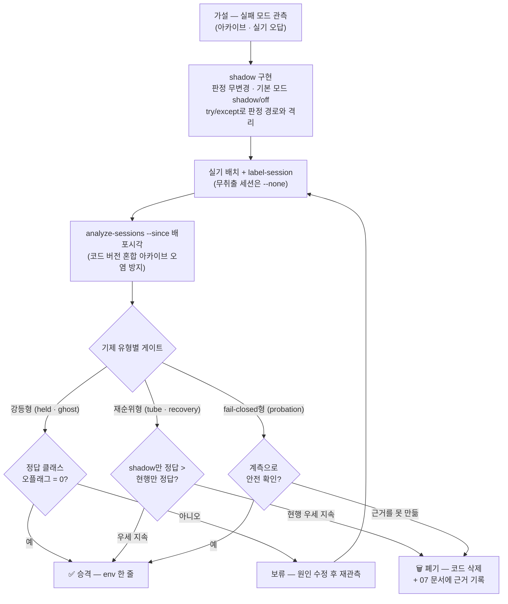

# 07. 배제·폐기 결정 기록

> 대상: 후속 개발자 · 최종 갱신: 2026-07-30
> 선행 문서: [03. 판정과 정산](03-judgment-and-settlement.md) · [04. 설정 레퍼런스](04-configuration.md)

---

이 문서의 목적은 하나입니다. **같은 시도를 반복하지 않게 하는 것.**

이 저장소에는 "그럴듯한 가설 → 구현 → 실기 실측 → 폐기"를 완주한 기제가 열 개
넘게 있습니다. 폐기된 것은 코드에 남지 않으므로, 근거가 사라지면 6개월 뒤 누군가
같은 아이디어를 같은 순서로 다시 만듭니다. 아래 기록은 그 재발을 막기 위한 것이며,
"실패"를 감추지도 과장하지도 않습니다.

**목차**

| # | 절 | 내용 |
|---|---|---|
| 1 | [왜 이 문서가 있는가](#1-왜-이-문서가-있는가--저장소의-3원칙) | 운영 3원칙과 그 실측 근거 |
| 2 | [전체 현황 한눈에](#2-전체-현황-한눈에) | 기제별 도입·처분·근거 요약표 |
| 3 | [폐기 항목 상세](#3-폐기-항목-상세) | 9개 기제 + 부수 정리 |
| 4 | [실패로 판명된 기술 선택](#4-실패로-판명된-기술-선택) | 기제가 아닌 구현 선택의 오답 |
| 5 | [하지 말 것 — 성능](#5-하지-말-것--성능) | 리서치로 배제 확정된 최적화 방향 |
| 6 | [금지된 전제 — 정적 planogram](#6-금지된-전제--정적-planogram) | "배치를 알면 쉬운데"에 대한 답 |
| 7 | [재시도 체크리스트](#7-재시도-체크리스트) | 폐기 항목을 다시 켜려면 |
| 8 | [이 기록의 한계와 알려진 불일치](#8-이-기록의-한계와-알려진-불일치) | 자료 간 어긋남 |
| 9 | [관련 문서](#9-관련-문서) | |

---

## 1. 왜 이 문서가 있는가 — 저장소의 3원칙

이 저장소는 판정 기제를 다음 3원칙으로 관리합니다. 세 원칙 모두 사고와 실측에서
역산된 것입니다.

### 원칙 ① 기제는 shadow(관측만)로 먼저 배포하고, 승격/폐기는 실측으로 결정한다

새 판정 기제는 판정을 바꾸지 않는 **관측 전용 모드**로 먼저 배포합니다. 아카이브에
"이 기제가 active였다면 무엇이 달라졌는가"만 기록하고, 라벨 실측이 우세를 보인
뒤에만 켭니다.

이 절차는 장식이 아니라 **실제로 잘못된 승격을 막았습니다.**

| 사례 | shadow가 잡아낸 것 | 출처 |
|---|---|---|
| held T2 (carried-in 트랙 강등) | 10차 배치에서 정답 클래스 오플래그 5건. 결정타는 ses-6 z1 c40의 **60/61표** — active였다면 진짜 취출 표 60개를 몰수할 뻔했다 (진열 상품도 프리롤 0프레임부터 관측되므로 "진열→취출 전환" 트랙이 carried-in과 구분되지 않았다) | `docs/devdoc/fix_logs.md` 10차 배치 |
| ghost (세션 고스트 원장) | 11차 배치에서 정답 오플래그 3/3 세션. 원인은 검출 로직이 아니라 입력 결함 — 동시·연쇄 취출의 존 트리거들이 병합된 같은 에피소드 영상을 공유해 모든 클래스가 공짜로 "2존 등장" | `docs/devdoc/fix_logs.md` 11차 배치 |
| baseline (프리롤 배경 억제) | issue #16 트레이스의 `baseline_drops_by_class`가 side class 40의 표 **12/12 전부**를 드랍 대상으로 계수 — active 승격이 그 이슈를 악화시킨다는 신호 | `docs/devdoc/fix_logs.md` issue #16 |

### 원칙 ② 승격은 env 한 줄, **폐기는 코드 삭제**

승격은 코드 배포 없이 env 한 줄로 되게 미리 배선합니다(실측→적용 사이클 단축).
반대로 폐기는 **".env에서 0으로 꺼두기"가 아니라 코드 삭제**입니다.

근거는 static_track 전례입니다. `.env.example`에는 0(비활성)으로 적혀 있었지만
**코드 기본값은 24로 살아 있었습니다** — 즉 기기 `.env`에
`MODEL__VISION__STATIC_TRACK_MIN_FRAMES=0`이 명시되지 않은 배포에서는
static_track이 실제로 검출을 드랍하고 있었습니다. 문서상 "끈 기능"이 코드에서는
돌고 있었던 것이고, 라이브러리를 직접 인스턴스화하는 경로에는 부활 경로가 그대로
남아 있었습니다 (`docs/devdoc/fix_logs.md` 2026-07-24 대청소).

### 원칙 ③ 폐기 근거는 여기(07번 문서) 남긴다

폐기 결정은 "안 된다"가 아니라 **"이 조건에서 이 수치로 안 됐다"**입니다. 조건이
바뀌면 결론도 바뀔 수 있으므로, 각 항목에 **재시도 선행 조건**을 함께 적습니다.
코드에서도 세 곳이 이 문서를 근거 문서로 링크합니다 —
`crk_model/perception/voting.py`(튜브 몰수 폐기),
`crk_model/perception/motion_evidence.py`(같음),
`crk_model/frames/__init__.py`(FixedBatchCollector 삭제).

### 절차 (mermaid)

절차의 정본은 `docs/devdoc/field-tests/0724_shadow_status_review.md` §5입니다.

---

## 2. 전체 현황 한눈에

승격 확정군을 대조로 함께 싣습니다 — shadow-first는 "전부 버리는 절차"가 아니라
**절반은 실제로 승격되는 절차**입니다.

| 기제 | 도입 | 최종 처분 | 결정 일자 | 근거 요약 |
|---|---|---|---|---|
| BOCPD 로드셀 분석기 | 2026-07-22 (shadow) | **승격** (`ANALYZER=bocpd`) | 2026-07-23 | 63관측/2 mismatch → 승격 후 10차 17건 mismatch 0. #14 무음 0원에서 plateau delta 0 vs BOCPD −297.5±2.6 채널 분해 |
| cross-zone 오염 페널티 | 2026-07-11 (shadow) | **승격** (기본 ON) | 2026-07-21 (Phase 3) | 4차 ses-6: zone4 오판(13 partial)을 CLOSE에서 3×1로 교정 — 첫 실기 성공. 11차 self-fit 가드 포함 정상 동작 |
| 모션 변위 증거 (표 몰수) | 2026-07-22 | **승격** (기본 ON) | 2026-07-22 (issue #16 4·5차) | static_track·baseline이 대리 신호로 쫓던 물리("집어간 것만 움직인다")의 직접 검사. 트랙 단위로 승격되며 진열+취출 동시 케이스까지 처리 |
| close 비전 조합 중재 | 2026-07-24 | **승격** (기본 ON, 가드 5중) | 2026-07-24 → 07-27 보강 | `3+44 → 44×4` 무게 정수배 스냅 7회 재발 대응. 12~14차에서 역방향 사고 6건 발생 → 자격 5중 가드로 재정비 후 유지 |
| held T2 (carried-in 트랙 강등) | 2026-07-23 | **보류** (`HELD_TRACK_DEMOTION=shadow`) | — | 10차 정답 오플래그 5건 → head 이동 요건 추가 후에도 11차 3건. 실패 모드는 실존(11차 ses-9 z3 take-return 표 홍수)이라 관측 유지 |
| ghost (세션 고스트 원장) | 2026-07-24 | **보류** (`GHOST__MODE=shadow`) | — | 11차 오플래그 3/3 → 주 원인(에피소드 공유) 수정 완료, 재관측 중. 냉장 재평가 가치 높음(top 공용 1대가 5존 진열을 본다) |
| static_track (정지 트랙 억제) | 초기 | 🗑 **폐기** | 2026-07-24 (T3 은퇴) | 연속 IoU 요건이 "깜빡이는 정지 물체"를 놓쳤고, 변위 몰수가 같은 물리를 직접 측정하며 흡수 |
| baseline (프리롤 배경 억제) | 2026-07-21 | 🗑 **폐기** | 2026-07-24 (퇴역) | 실기 4건: top 무력(프리롤에 이미 손 → 등록창 0) / side 폭주(353~1,735 드랍 vs top 0) |
| BOCPD shadow 병행 기록 장치 | 2026-07-22 | 🗑 **폐기** (승격 완료) | 2026-07-24 | primary 승격 확정으로 대칭 diff 기록·아카이브 필드·리포트 섹션 삭제. plateau 분석기는 롤백 스위치로 유지 |
| CROSS_ZONE__SHADOW + ShadowSettlerRunner | 2026-07-11 | 🗑 **폐기** (dead code) | 2026-07-24 | Phase 3 승격(기본 ON) 이후 배선 조건이 항상 False |
| vote_recovery (저신뢰 표 회수) | 2026-07-23 | 🗑 **폐기** | **2026-07-30** | 긍정 증거 0, 부정 증거만 — 13 저신뢰 산탄 증폭 가설이 tube 열세 3건의 유력 원인 |
| tube_identity (튜브 다수결 표 몰수) | 2026-07-23 | 🗑 **폐기** (계측만 존속) | **2026-07-30** | 10차 라벨 정오 0:3:2로 현행 우세 — 1위 변경 5건 중 3건이 shadow를 c13(옷) 쪽으로 |
| track_min_hits / track_max_gap | 2026-07-23 | 🗑 **폐기** | **2026-07-30** | 발동 이력 0회. 단절이 심각(실질 트랙/클래스 median 4)해 fail-closed 스위치 근거를 만들 수 없었다 |
| likelihood (무게 우도 score) + tray_prior | 2026-07-23 | 🗑 **폐기** | **2026-07-30** | 4차 mismatch 정오 3:4:4로 Phase 2 부결 → 11차 2/1/1. "동일 상품 n개 우연 적합" 선호의 구조적 한계 |
| FixedBatchCollector (D8 설계 산출물) | 초기 재설계 | 🗑 **폐기** (대체됨) | **2026-07-30** | 2026-07-28 T2 실구현(파이프라인 마이크로배치 루프 + `detect_batch`)이 같은 목적을 대체, 운영 경로 완전 미사용 |

출처는 전부 `docs/devdoc/fix_logs.md`(배치별 실측)와
`docs/devdoc/field-tests/0724_shadow_status_review.md`(처분 권고)입니다.

**폐기 규모**: 2026-07-24 대청소가 코드+테스트 순감 약 500줄,
2026-07-30 삭제가 `crk_model/` + `tests/`에서 **1,926줄 삭제 / 211줄 삽입 =
순감 1,715줄**(28파일). 파일째 삭제 5개 — 구현 3(`judgment/likelihood.py` 198줄,
`ledger/tray_memory.py` 141줄, `frames/batch.py` 35줄), 테스트 2
(`tests/test_likelihood.py` 242줄, `tests/test_tray_memory.py` 258줄) — 와
env 노브 11종
(`LIKELIHOOD_SHADOW`/`LIKELIHOOD_K`/`LIKELIHOOD_SIGMA_DB`/`TRAY_PRIOR`/
`TRAY_PRIOR_BOOST`/`TRAY_PRIOR_PENALTY`/`TUBE_IDENTITY`/`VOTE_RECOVERY`/
`VOTE_RECOVERY_FLOOR`/`TRACK_MIN_HITS`/`TRACK_MAX_GAP`).

---

## 3. 폐기 항목 상세

각 항목은 동일 서식입니다 — **가설 / 구현 / 실측 / 폐기 판단 / 남긴 것 /
재시도 선행 조건**.

### 3-1. static_track — 정지 트랙 억제 (2026-07-24 T3 은퇴)

| 항목 | 내용 |
|---|---|
| **가설** | "정지한 물체 = 진열 상품" — 같은 위치에 계속 있는 검출은 취출이 아니다 |
| **구현** | `perception/filters.py`의 `_StaticAnchor`/`_is_static` — 연속 24프레임 IoU ≥ 0.85면 그 위치의 검출을 드랍. env `MODEL__VISION__STATIC_TRACK_MIN_FRAMES`(24) / `_IOU`(0.85) |
| **실측** | 긍정: #10 돌출 진열 225표 인플레이션 억제에 기여(`0723_tracklet_cost_benefit.md` §3 "해결됨"). 부정: **연속 IoU 요건이 bbox가 출렁이는 고정 물체**(원거리·부분 가림)를 놓쳤다 — baseline이 태어난 동기 자체가 이 사각이었다(`baseline_and_judgment_iv.md` §2). 2026-07-22 이식된 모션 변위 증거가 같은 물리를 트랙 단위로 직접 측정하며 흡수해, `0723_tracklet_cost_benefit.md` §5는 static_track을 "변위 몰수의 취약한 대리 신호 · 중복 방어층"으로 분류하고 은퇴 후보로 지정했다 |
| **폐기 판단** | 2026-07-24 T3 은퇴 — 필터·config 필드·env 파싱·model_service 배선·테스트 5건 삭제. **원칙 ②의 전례**: `.env.example`은 0이었지만 코드 기본값 24가 살아 있어 env 미명시 배포는 실제로 드랍 중이었다. 기기 `.env`에 `=0` 명시가 있었음을 사용자가 확인해(2026-07-24) 냉동 실기 판정 입력 무변화로 확정했다 |
| **남긴 것** | 없음. static_track·baseline만 쓰던 `_iou` 유틸도 함께 제거(`_intersects`/`_expand`/`_center_x`는 hand_path·side ROI가 사용하므로 유지). 구 아카이브의 `filter_drops_by_stage.static_track` 키는 리포트가 키 무관 제네릭 파싱 + 0행 숨김이라 깨지지 않는다 |
| **재시도 선행** | ① 변위 몰수가 놓치는 정지 물체 사례를 아카이브 실측으로 제시할 것. ② IoU 앵커로 재구현하지 말 것 — 빠른 이동에서 IoU는 무너지므로 `MotionEvidence`는 중심거리 매칭(점프 상한 150px)을 쓴다. ③ 2026-07-29의 `MOTION_UNMEASURABLE=exempt`가 이미 "측정된 정지만 몰수"로 정밀도를 조정했으므로, 새 억제층은 그 경계 밖에서 가치를 증명해야 한다 |

### 3-2. baseline — 프리롤 배경 억제 (2026-07-24 퇴역)

| 항목 | 내용 |
|---|---|
| **가설** | 정지의 정의를 시간 경계로 바꾼다 — **"손이 등장하기 전부터 그 자리에 있던 것 = 장면 배경"**. static_track이 못 잡는 "출렁이는 고정 물체"를 시간축으로 잡는다 |
| **구현** | 프리롤의 비손 검출을 baseline으로 등록 → 손 등장 시 등록 중지 → 이후 같은 위치 재검출을 억제(손에 든 상품은 위치를 이탈하므로 통과). 모드 3종(`off`/`shadow`/`active`), `BASELINE_SUPPRESS_IOU` 0.5. 관측 필드 `filter_drops_by_stage.baseline` + `baseline_drops_by_class` |
| **실측** | 긍정 1건: #15 12:22 세션 active에서 top 배경 class 27을 470회, 13을 157회 억제해 진짜 상품 23이 65표 1위로 올라왔다. 부정(지배적): 실기 4건에서 **top 무력** — 프리롤에 이미 손이 있어 등록창이 0. **side 폭주** — side에서 hand를 추론하지 않아 등록이 무한, side 드랍 353~1,735건 vs top 0. 추가로 issue #16 트레이스의 `baseline_drops_by_class`가 정답 side class 40의 표 12/12 전부를 드랍 대상으로 계수했다 |
| **폐기 판단** | 2026-07-22 issue #16 4차에서 퇴역 권고(기본 off) → 2026-07-24 코드 삭제. `_is_baseline`/`_hand_seen`/`baseline_drops_by_class`(**write-only 필드였다 — 소비자 전무 확인**), config `baseline_suppress_mode`(코드 기본 `"shadow"`)·`_iou`, vote_summary 기록, 테스트 7건 |
| **남긴 것** | 설계 문서 `docs/devdoc/design/baseline_and_judgment_iv.md`는 상태 배지를 달고 유지 — **§3 판정 불변식 I-V와 §5 env 튜닝 다이어그램은 현행 정본**이다(폐기된 것은 §2 필터뿐) |
| **재시도 선행** | ① side hand 재포함 — 2026-07-29 `MODEL__VISION__SIDE_HAND_ENABLED`가 이 조건의 절반을 만들었다(다만 냉장 한정 opt-in). ② hand-release 신호(손이 언제 물건을 놓았는지) 선행. ③ 그보다 먼저, 변위 몰수가 같은 물리를 이미 재고 있으므로 **새로운 가치**를 아카이브로 입증할 것 |

### 3-3. BOCPD shadow 병행 기록 장치 (2026-07-24, 승격 완료로 삭제)

| 항목 | 내용 |
|---|---|
| **가설** | 로드셀 "안정 구간"의 정의를 3연속 std 창에서 run-length 사후분포(Adams & MacKay 2007)로 바꾸면 빠른 취출의 delta 소실(#14 무음 0원)이 해소된다. 검증은 **대칭 diff** — primary가 무엇이든 반대 분석기를 병행 계산해 mismatch를 기록 |
| **구현** | `ingest/bocpd.py` + pipeline이 매 트리거 try/except로 계산해 `trace.loadcell_shadow`(delta/std/채널 레벨/primary와의 mismatch)에 기록. env `MODEL__LOADCELL__BOCPD_SHADOW`. 승격 스위치 `MODEL__LOADCELL__ANALYZER`를 미리 배선해 실측→적용을 env 한 줄로 |
| **실측** | shadow 63관측 중 mismatch 2 → 2026-07-23 primary 승격 → 10차 배치 17건 mismatch **0**. #14 계열에서 plateau delta 0인데 BOCPD는 −297.5±2.6까지 채널 분해 |
| **폐기 판단** | 기제가 아니라 **관측 장치**의 폐기다. 승격이 확정되면 "일치가 정상"이 되므로 대칭 diff 기록·`trace.loadcell_shadow`·아카이브 필드·analyze-sessions 섹션을 전부 삭제했다. 남겨두면 정상 상태에서도 매 트리거 계산 비용과 덤프 노이즈를 낸다 |
| **남긴 것** | **plateau 분석기 자체는 롤백 킬스위치로 유지** (`MODEL__LOADCELL__ANALYZER=plateau`) — 냉장 로드셀 환경에서 BOCPD는 미검증이므로 킬스위치 가치가 있다. 계약 동형이라 코드 무변경 롤백 |
| **재시도 선행** | 냉장에서 BOCPD 이상이 관측되면 먼저 `ANALYZER=plateau`로 되돌린 뒤 shadow 장치를 재도입한다. 재도입 시 **판정 경로 밖 try/except 격리**와 "기본 경로 기능 무변경"은 그대로 지킬 것. 부수 주의: 우도 shadow의 σ_d 소스가 이 장치의 `delta_std`였고 bocpd primary 체제에서는 이미 항상 None이었다 |

### 3-4. CROSS_ZONE__SHADOW + ShadowSettlerRunner (2026-07-24, dead code 삭제)

| 항목 | 내용 |
|---|---|
| **가설** | 교차존 오염 페널티를 정산 2차 패스에 넣기 전, 같은 정산을 shadow 러너로 병행 실행해 확정 금액 diff를 관측한다 |
| **구현** | `ledger/shadow.py`의 `ShadowSettlerRunner` + `MODEL__CROSS_ZONE__SHADOW` |
| **실측** | Phase 3 승격(2026-07-21, 기본 ON) 이후 **배선 조건이 항상 False** — 즉 이 코드는 그 시점부터 한 번도 실행되지 않았다 |
| **폐기 판단** | 2026-07-24 파일째 삭제. 승격 근거는 4차 ses-6 첫 실기 교정 성공과 11차 self-fit 가드 포함 정상 동작 |
| **남긴 것** | 롤백 스위치 `MODEL__CROSS_ZONE__PENALTY_ENABLED=0` |
| **재시도 선행** | 없음. **교훈만 남긴다**: shadow 장치는 승격과 동시에 삭제 대상이 된다. "항상 False인 분기"를 남기면 코드를 읽는 사람이 살아 있는 경로로 오해한다 |

### 3-5. vote_recovery — 갭 2 저신뢰 표 회수 (2026-07-30 삭제)

| 항목 | 내용 |
|---|---|
| **가설** | 빠른 취출에서 진짜 상품이 **표 기아**에 빠진다(5차 배치의 "정답 23이 1표"). 진입 컷(운영 0.70) 미달이지만 `FLOOR`(0.35) 이상인 검출을 조건부로 회수하면 정답이 후보로 살아난다 |
| **구현** | 회수 풀에 보관한 뒤 combine에서 "변위 통과 트랙 + 같은 (클래스,트랙)의 진입 표 앵커 ≥1"을 검증해 회수. 앵커 조건이 방어의 핵심 설계였다 — 진입 표가 0인 순저신뢰 궤적(의류 산탄의 바닥)은 회수 불가. env `MODEL__VISION__VOTE_RECOVERY`(shadow) / `_FLOOR`(0.35) |
| **실측** | **긍정 증거 0.** 부정 증거: 10차 튜브 shadow 1위 변경 5건 중 3건이 shadow를 c13(옷 클래스) 쪽으로 밀었고(라벨 정오 0:3:2), 원인 가설이 "회수가 c13의 저신뢰 산탄을 증폭한다(c13은 자기 튜브의 다수라 소수 몰수가 비적용)"였다. 즉 앵커 조건이 의류 바닥 회수를 막는다는 설계 가정이 실기에서 확인되지 않았다 |
| **폐기 판단** | `0724_shadow_status_review.md`가 **유일하게 "폐기 후보 — 명시 제안"**으로 지정한 항목이며, "산탄 증폭이 재확인되면 배치를 기다리지 않고 즉시 삭제" 조건까지 명시했다. 2026-07-30 회수 경로 + env 2종 삭제 |
| **남긴 것** | **저신뢰 검출의 트랙 연속성 기여는 그대로**다 — detector가 conf 하한을 걸지 않으므로(I4) 진입 컷 미달 검출도 `observe()`에 들어가 트랙을 잇는다. 이 구조가 ByteTrack 2단계 연관과 동형이며, 폐기된 것은 "표를 되돌려주는" 경로뿐이다 |
| **재시도 선행** | ① **같은 증상의 다른 원인이 먼저 처리됐는지 확인**할 것 — 2026-07-29에 `MOTION_UNMEASURABLE=exempt`(1~2프레임 취출이 `no_motion`으로 몰수되는 구조적 사각)와 `VOTE_RATIO_DENOMINATOR=hand_window`(분모 희석)가 "정답 상품의 표가 죽는다"를 각각 다른 층에서 다룬다. ② 재도입 시 **클래스 단위 회수 상한**이 설계에 포함돼야 한다(산탄 증폭 차단). ③ `vote_summary.tube_diag`로 증폭 여부를 관측하며 shadow-first |

### 3-6. tube_identity — 갭 4/T2′ 튜브 다수결 표 몰수 (2026-07-30 삭제, 계측만 존속)

| 항목 | 내용 |
|---|---|
| **가설** | 의류(옷 프린트) 산탄의 시그니처는 **"한 궤적 위에서 클래스가 깜빡인다"**. 사람이 움직이므로 궤적 자체는 변위 몰수를 통과한다 — 클래스 무관 튜브로 연관한 뒤 "결정적 소수"(자기 클래스 관측 < 최다 클래스의 30%) 클래스의 표를 몰수하면 잡힌다 |
| **구현** | `motion_evidence.py`의 `_Tube` 층을 기존 클래스-조건 트랙과 **병행** 연관 + `tube_minority()`. 위험 한정: 표 **이전이 아니라 몰수** — `0723_tracklet_cost_benefit.md` §2 G1이 지적한 "히스토그램 오통합 시 표가 틀린 쪽으로 전량 이동"(fail-closed가 아닌 방향)을 증거 제거로만 허용. env `MODEL__VISION__TUBE_IDENTITY`(shadow) |
| **실측** | 냉동 10차 배치 라벨 정오 **0:3:2**(shadow만 정답 0 / 현행만 정답 3 / 둘 다 오답 2) — 현행 판정 우세. 1위 변경 5건 중 3건이 shadow를 오히려 c13(옷) 쪽으로 기울였다. 당시 `--session` 덤프에 갭별 분해가 없어 원인 확정이 늦었고(다음 배치에서 분해 계측 추가), vote_recovery와의 합성 효과가 유력 원인으로 지목됐다 |
| **폐기 판단** | 재순위형 게이트("shadow만 정답 > 현행만 정답 우세 지속")의 반대 결과가 나왔고 개선 경로가 vote_recovery 폐기와 얽혀 있어, 2026-07-30에 **표 몰수 경로와 env만** 삭제 |
| **남긴 것** | **튜브 계측 자체는 유지**한다 — `MotionEvidence`의 `_Tube`/`tube_minority()`/`tube_detail()`과 `VotingEnsemble.tube_summary()`가 아카이브 `vote_summary.tube_diag`에 클래스별 유효표·결정적 소수 표 수·`tube_conf` + 튜브 구성을 싣는다. **"한 궤적, 여러 클래스"라는 실패 모드는 여전히 진단 가능**하고, 사라진 것은 그 진단으로 표를 몰수하는 경로다. 아카이브 키는 `tube_shadow` → `tube_diag`로 개칭(의미가 "승격 대기 shadow"에서 "진단 계측"으로 바뀌었으므로) |
| **재시도 선행** | ① `tube_diag`가 이미 계측을 싣고 있으므로 **새 코드 없이** 냉장 아카이브에서 "결정적 소수 표"와 정답 클래스의 관계를 먼저 볼 것. ② 냉장은 존 전용 side(근접 촬영)라 의류 노출 기하가 냉동(공용 광각)과 다르다는 리뷰의 가설이 **미검증으로 남아 있다**(§8 참조). ③ 몰수를 다시 켜려면 shadow-first + 재순위형 게이트 통과 |

### 3-7. track_min_hits / track_max_gap — 갭 1 probation·트랙 소멸 (2026-07-30 삭제)

| 항목 | 내용 |
|---|---|
| **가설** | 단명 트랙(관측 < N)은 산탄이므로 표를 몰수하고(probation), 공백이 N프레임을 넘은 트랙은 죽인다 |
| **구현** | env `MODEL__VISION__TRACK_MIN_HITS` / `TRACK_MAX_GAP`, **둘 다 기본 0=off**. `0723_tracklet_cost_benefit.md` §9는 이 갭이 §4-3의 최대 리스크(집는 순간의 트랙 단절 → 진짜 상품 표 몰수)와 **정면 충돌하는 fail-closed 방향**이므로 계측 실측 후에만 켜라고 못박았다 |
| **실측** | **발동 이력 0회** — 켠 적이 없다. 반대 방향 실측이 지배적이었다: 단절이 심각해 **실질 트랙/클래스 median 4**(10차 배치)였고, σ_db 제안치도 오염 표본으로 불신되는 상황이었다. 즉 "단명 트랙을 죽여도 정답이 안 죽는다"는 근거를 만들 수가 없었다 |
| **폐기 판단** | 2026-07-30 env 2종 + 코드 삭제. 유지 비용이 0에 가까웠지만, 켤 근거를 만들 실측 경로가 없는 스위치는 "언젠가 켜자"는 부채로만 남는다 |
| **남긴 것** | **단절 계측은 유지** — 트리거당 트랙 수, `track_detail`(first/last/obs/head_obs/passed), `tube_diag`의 튜브 구성으로 단절률을 계속 볼 수 있다. 같은 문제의 **반대 방향(fail-open) 해법인 G2 재연관 창**(공백 ≤ 12추론프레임 트랙에 1.5×max_jump 완화 반경)은 구현·유지된다 |
| **재시도 선행** | ① short probe 계측으로 단명 트랙 분포와 정답 상품의 위치를 **분리 실증**할 것. ② fail-closed 스위치는 "정답 상품이 그 분포에 없다"가 보인 뒤에만. ③ 냉장은 김서림·성에가 없어 검출 연속성 개선이 기대되지만, 켜기 전 계측 요건은 동일하다 |

### 3-8. likelihood (무게 우도 score) + tray_prior (세션 트레이 메모리) — 2026-07-30 삭제

| 항목 | 내용 |
|---|---|
| **가설 (우도)** | 냉동 판정의 무게 규칙이 전부 이산 경계(gate_n·near 밴드·single_share·conf_override·margin)라 경계 안팎에서 판정이 뒤집힌다 — #15는 3g, #16 로그 3은 near 밴드 2g 초과가 원인이었다. 단일 score `log P_vision + clamp(log L_weight, ±log k)`로 연속화하고, **clamp를 I-V("무게는 거부권만")의 연속판**으로 삼는다 (설계: `docs/devdoc/design/0722_weight_likelihood_design.md`) |
| **가설 (tray_prior)** | 정적 planogram은 이 제품의 금지 전제(§6)이므로, **세션 스코프 대안**을 쓴다 — (zone, channel) 키 증거 맵을 세션 안에서 학습하고 OPEN마다 리셋(cold start = 현행 동작). 등록은 COMPLETE + 무게 뒷받침 + vision-top-billed 판정만 통과시켜 오판정 전파를 차단 |
| **구현** | `judgment/likelihood.py`의 `WeightLikelihoodScorer` — 적용 조건은 FreezerVisionFirst와 동형(freezer removal + 후보 존재), σ_eff² = σ_d² + Σn·σ_db². `ledger/tray_memory.py`의 `SessionTrayMemory`를 soft `log_p_tray` 항으로만 소비. env 6종(`LIKELIHOOD_SHADOW`/`_K`(20)/`_SIGMA_DB`, `TRAY_PRIOR`/`_BOOST`/`_PENALTY`). 판정 무변경, `trace.likelihood_shadow`에 ranking 분해 기록 |
| **실측** | 4차 배치 mismatch 라벨 정오 **3:4:4** → **Phase 2 승격 부결**. score 오답의 다수가 "동일 상품 n개 우연 적합 선호"(40×2, 46×3, 30×3, 13×2)였고 원인은 **구조적 한계** — 배정 후보군에 다품종 조합이 없어 `log_p_vision`이 count에 무감하다. 11차에서도 2/1/1로 보류. tray_prior는 penalty 2.5가 #17 ses-5의 순위를 뒤집는 것까지는 확인됐으나 우도 score 자체가 부결이라 독립 승격 경로가 없었다 |
| **폐기 판단** | 2026-07-30 파일 2개(`judgment/likelihood.py`, `ledger/tray_memory.py`) + env 6종 + 리포트 섹션 2개 + `trace.likelihood_shadow` 삭제, 테스트 2개 파일(500줄) 정리. 냉장 관점에서는 applicable 조건이 freezer removal 한정(`weight_is_discriminative=False`)이라 **순냉장 기기에서 구조적 휴면**(관측 0)이었다 |
| **남긴 것** | **개당 잔차 실측은 유지**된다. 리포트 키가 `sigma_db` → `unit_residual`로, 제안 대상 env가 `MODEL__JUDGMENT__LIKELIHOOD_SIGMA_DB` → `MODEL__JUDGMENT__COUNT_UNIT_SLACK`으로 바뀌었다. 즉 우도가 없어도 "DB 개당 편차의 개수 비례 누적"이라는 관측은 **현행 이산 게이트**(`gate_n = count_gate + slack×(n−1)`)의 보정 입력으로 계속 쓰인다 — 우도 설계는 이 이산 규칙이 자기 모델의 특수해임을 밝혀 놓았다 |
| **재시도 선행** | ① **조합 배정 열거(다품종) + count 페널티**가 선행돼야 한다 — 이것 없이는 같은 "동일 상품 n개" 편향이 재발한다. ② σ_d를 primary `BocpdLoadcellAnalyzer`에서 직접 뽑는 경로를 새로 연결할 것(구 경로는 삭제된 BOCPD shadow의 `delta_std`였다). ③ 승격 게이트는 사고 재현 스위트 전건 green(#10 필러 차단, #15 함정 185×2 잔차 0 차단, #16 A~D, 370g 격상, 모호 폴스루) + shadow diff 정오 우세. ④ tray_prior 재시도는 §6의 금지 전제를 계속 지켜야 하고(운영 입력 0), 등록 게이트로 오판정 전파를 막는 구조를 유지해야 한다 |

### 3-9. FixedBatchCollector — D8 배치 수집기 (2026-07-30 삭제, 대체됨)

| 항목 | 내용 |
|---|---|
| **가설** | 배치 추론(D8)으로 커널 런치를 상각한다. 배치는 **고정 배치 + 패딩**(부족분 더미, 결과 폐기)이 1안 — dynamic batch의 TRT 프로파일 재선택·할당자 파편화 리스크를 회피. 카메라 인터리빙은 금지(hand_path tracker가 카메라별 프레임 순서에 의존, L3 승인 조건) |
| **구현** | `crk_model/frames/batch.py`의 `FixedBatchCollector` — `add(camera, frame)`이 가득 차면 배치 반환, `flush(camera)`가 잔여 + 필요한 패딩 수 반환. **설계 단계 산출물로, 기본 OFF(batch_size=1)** 상태로만 존재했다 |
| **실측** | 2026-07-28 T2 실구현이 같은 목적을 다른 위치에서 달성했다 — `TriggerPipeline`의 마이크로배치 루프 + `adapters/yolo_detector.detect_batch`(전처리 완료 GPU 텐서 BCHW를 단일 predict에 투입, zero-frame 패딩). 단일 `consume()` 경로가 프레임별 루프와 배치 루프 양쪽을 서비스하므로 **배치가 판정을 바꿀 수 없다**는 성질이 구조로 보장된다 |
| **폐기 판단** | 2026-07-30 삭제 — 운영 경로에서 **완전 미사용**. 계승된 설계 결정(고정 배치 + 패딩, 카메라 인터리빙 금지)은 실구현에 그대로 남았다 |
| **남긴 것** | `crk_model/frames/__init__.py` 모듈 docstring이 "배치 추론은 이 계층의 수집기가 아니라 파이프라인의 마이크로배치 루프로 구현됐다"를 명시하고 이 문서를 링크한다 |
| **재시도 선행** | 없음. 배치 관련 작업은 `service/pipeline.py`의 마이크로배치 루프와 `adapters/yolo_detector.detect_batch`를 고칠 것. 엔진/배치 짝이 어긋난 조합은 기동 프로브가 즉시 실패시킨다 |

### 3-10. 부수 정리 — 아카이브·리포트 필드와 구 아카이브 호환

기제를 삭제하면 그 기제가 쓰던 관측 필드도 사라집니다. 아카이브는 **코드 버전이
섞이는 자료**이므로(수 개월치 세션 YAML), 호환 정책은 **"폐기 필드는 조용히
무시"**(관용 파싱)입니다.

| 필드 / 키 | 처분 | 시점 |
|---|---|---|
| `trace.loadcell_shadow` | 삭제 (BOCPD 승격) | 2026-07-24 |
| `vote_summary.baseline_drops_by_class` | 삭제 (write-only 필드였음) | 2026-07-24 |
| `filter_drops_by_stage.static_track` / `.baseline` | 스테이지 소멸 — 리포트는 키 무관 제네릭 파싱 + 0행 숨김 | 2026-07-24 |
| `trace.likelihood_shadow` (`tray_prior` 항 포함) | 삭제 | 2026-07-30 |
| `vote_summary.tube_shadow` | → `vote_summary.tube_diag` (의미 변경: 승격 대기 shadow → 진단 계측) | 2026-07-30 |
| 리포트 `sigma_db.unit_residuals` | → `unit_residual.samples`, 제안 env가 `LIKELIHOOD_SIGMA_DB` → `COUNT_UNIT_SLACK` | 2026-07-30 |
| analyze-sessions 섹션: 무게 우도 정오 / tray prior 개입 / 튜브 shadow 정오 | 삭제 | 2026-07-30 |

회귀 테스트로 고정돼 있습니다 —
`tests/test_analyze_cli.py::test_old_archive_retired_shadow_fields_ignored`
(구 아카이브에 `loadcell_shadow`·`likelihood_shadow`·`tube_shadow`가 있어도
예외 없이 파싱되고, 폐기된 리포트 키는 생성되지 않는다).

**새 관측 필드를 만들 때는 이 관용 파싱 계약을 함께 지키십시오.** 필드가 없거나
낯설다는 이유로 예외를 던지면, 과거 세션 전체가 분석 불가가 됩니다.

---

## 4. 실패로 판명된 기술 선택

기제가 아니라 **구현 선택**입니다. 코드에는 이미 대체안이 들어가 있으므로, 아래는
"왜 지금 이 모양인가"의 답이기도 합니다. 되돌리지 마십시오.

| 선택 | 실기에서 드러난 문제 (수치) | 현행 대체 |
|---|---|---|
| **squash resize** — 640×480을 480×480으로 비등방 축소 | 가로 25% 압축이 conf 하락 + **bbox 좌표계 왜곡**의 원천. 이 왜곡 좌표계에 맞춰 잡힌 `SIDE_ROI_MAX_CENTER_X` 240이 side 검출 **195개 중 194개를 제거**하는 사건을 만들었다 | 크롭으로 전환 — 2026-07-22 left-crop(P0-1) → 2026-07-24 center-crop(사용자 결정). 운영 640×480에서 스케일은 1:1 no-op, ROI는 400 |
| **결합 후 `conf_floor`(0.4)로 노이즈 방어** | 진입 컷 없이 conf 0.01부터 전부 투표시키면 클래스별 평균이 희석된다. 실측: 진짜 상품이 **94~96표(360프레임의 26%)를 받고도 전부 `rejected_by: conf_floor`**, 클래스 weighted_conf가 0.10~0.16 | 방어 지점을 **카메라별 진입 컷**으로 이동(`TOP/SIDE_CONFIDENCE_THRESHOLD`, 코드 기본 0.70·운영 0.50), `CONF_FLOOR` 기본 0.0 |
| **카메라별 평균 conf로 결합** | 같은 장면에서 최종 conf가 항상 낮게 나온다 — 0.72 1회 + 0.45 20회면 max 0.72 vs 평균 0.46. 후단의 모든 신뢰도 비교(vision_only ×0.7, 동일 무게대 최고 conf 채택, tie-break, 아카이브)가 구조적 열세 | **카메라별 max**(P1-4). 가중 산식(0.60/0.40 + common bonus 0.2)은 그대로 |
| **단일 카메라 검출에 공용 0.5/0.5 가중** | 한쪽만 검출되면 conf가 사실상 반토막(top 0.7 → weighted 0.35)나 하한에서 전멸 — issue #6 "vision_candidates 전멸"의 한 축 | 단일 카메라 **전용 가중** `top_only`(0.60)/`side_only`(0.40) 분리. 5종 가중치 전부 env 노출 |
| **plateau 3연속 안정 창으로 무게 delta 추출** | 0.8s 캐던스 × post-roll 4s = 샘플 5개뿐이라 3연속 안정이 실패하면 delta=0 → 판정은 맞는데 **0원 확정(무음 매출 누락, #14)** | **BOCPD** run-length 사후분포로 "안정 구간" 재정의 → 승격. plateau는 킬스위치로 존속 |
| **고정 debounce를 인과 신호로 대체(선행 배포 확인 없이)** | 원본의 `close_initial_wait_seconds=3.0`을 카메라 seq 워터마크(D2)로 대체하는 전제로 제거했는데 **펌웨어가 미배포(P5)**여서 방어가 아예 없었다. 실기: CLOSE가 트리거보다 **0.66s 빨라 0원 확정** + late trigger rejected = **7,400원 누락** | `close_grace_s`(3.0) 복원 **+ 엣지 워터마크**(`expected_triggers` — Node가 존별 녹화 수를 세어 CLOSE payload에 실음)로 인과 정보 완결. 워터마크 부재 시 시간 유예 폴백 |
| **재현 없는 추정으로 상태기계 수정** | issue #5에서 "FINALIZED가 다음 세션을 막는다"고 오진단해 넣은 `finalized_hold_s` 타임아웃이, 확정된 결제 payload를 `status=processing`(빈 payload)으로 덮어써 **없던 회귀를 새로 만들었다** | 되돌린 뒤 로그 중복 억제로 대체. 이후 원본 코드 대조로 실제 계약(확정 결과 1회 전달 후 IDLE 복귀)을 확정 |
| **weight_only의 과도 일반화** | issue #6(2품목 우연 조합 오과금)을 막으려 count를 1로 고정해 **"동일 상품 n개 취출"이라는 정상 케이스까지 no_detection**으로 차단(회귀) | 다품목 조합 금지는 유지, 동일 상품 n개만 구제(유일 매칭, 2쌍 이상은 `weight_only_ambiguous`) |
| **refit 중재를 상대 margin만으로 결정** | margin 우세만으로는 **"덜 흐린 유령"이 이긴다** — 4차 ses-1에서 conf 0.69 유령이 채택돼 과청구 방향으로 악화 | 절대 하한 `REFIT_ARB_CONF_FLOOR`(0.8) 추가. 정당 케이스(conf 0.82)는 통과, 유령(0.69)은 차단 |
| **close 콤보의 "count > 증분" 가드** | 냉동 판정의 count 자체가 무게 산정(I12)이라, 판정이 이미 44×4로 부풀리면 증분==스냅이 되어 가드가 탐색을 차단(11차 ses-1 `3+44 → 44×4` 재발) | 가드 제거 — 진짜 ×N 보호는 조합 게이트가 담당 |
| **콤보 재료 자격을 "표 3개 이상"으로** | 그 문턱은 오분류 플리커(7~9표)·멀티존 공유 영상 유입 표·판정층이 이미 기각한 클래스를 전부 통과시킨다. 정산은 판정보다 적은 정보(무게 산수)만 보는데 잔차 2g vs 스냅 11g로 판정을 덮었다 — **12~14차에 오과금 6건** | 자격 **5중 가드**(실존 증거 하한 / 교차존 설명 제외 / 고스트 제외 / 판정 기각 존중 / 확신 스냅 보호 conf<0.95). 실패 방향은 전부 "콤보 미형성 = 비전 판정 유지" |
| **vote_ratio 분모를 게이트 통과 프레임 전체로** | 분모는 양 카메라의 프리롤·포스트롤·상대 스트림을 다 세는데 분자는 취출 창 안 → 정답 상품이 **ratio 0.03~0.07**로 플리커와 같은 구간에 놓이고 **영상이 길수록 정답이 불리해지는** 길이 의존 지표였다(냉장 ses-6: class 49가 10표/186 = 0.054) | `VOTE_RATIO_DENOMINATOR=hand_window` opt-in — 손이 보이거나 래치가 열린 프레임만 세는 길이 불변 밀도. 기본은 `gate` 유지, 세션에 `ratio_denominator`를 기록해 정의 혼합 방지 |
| **`ffmpeg -hwaccels` 목록으로 hwaccel 가용성 판정** | 그 목록은 **빌드에 컴파일된 목록**이라 드라이버 없는 호스트에서도 cuda가 나온다 → `-hwaccel cuda`가 EPERM으로 죽고 **CI 34/35회 실패**. 실기에서도 CUDA 상태가 깨지면 디코드 전체가 error 이벤트가 되는 위험 | **실사용 프로브**(`-init_hw_device cuda …`의 rc==0) + 0프레임 실패 시에만 CPU 재시도(프레임 방출 후 실패는 폴백 금지). 후속 리서치가 "NVDEC은 MJPEG를 디코드하지 못한다"를 확정 — 이 경로는 **한 번도 성공한 적이 없고 디코드는 항상 100% CPU였다** |
| **엔진 파일명이 배치 구성을 표현하지 않음** | ultralytics export는 항상 `{stem}.engine`을 써서 batch-4 재빌드가 배포된 batch-1 파일을 **조용히 대체**하는데 `.env`는 옛 `BATCH_SIZE`를 선언한 채였다 | `{stem}_batch{N}.engine` 접미사 + env 템플릿이 접미사 파일을 가리키게. 짝이 어긋난 조합은 기동 프로브에서 즉시 실패 |
| **env 템플릿에 같은 블록을 두 번** | CROSS_ZONE 신블록을 추가하며 구블록을 지우지 않아 `SOURCE_CONF_MIN` 0.35/0.5가 공존 → **dotenv last-wins로 실효 0.5**가 되어 수정 취지가 무효였다 | 단일 블록 병합. **env 템플릿 변경은 항상 전수 grep** |

출처: 위 전부 `docs/devdoc/fix_logs.md`의 해당 일자 항목(2026-07-09 issue #5·#6·#8,
2026-07-22 원본 정합 웨이브·issue #16, 2026-07-23 CI 34연속 실패·3·4차 실측,
2026-07-24 11차 배치, 2026-07-27 12~14차, 2026-07-28~29 T2, 2026-07-29 issue #18)와
`docs/devdoc/research/0728_freezer_latency_research.md`.

**미확정 리스크 1건 (되돌리기 대상이 아니라 확인 대상)**: 2026-07-24 center-crop
전환으로 가로 크롭 원점이 x=0 → x=80으로 이동했는데 `SIDE_ROI_MAX_CENTER_X`(400)는
**재계산되지 않았습니다**(코드·README에 "실기 재측정 필요" 주석만 있음). 11차
ses-8/ses-5의 "정답 상품이 후보에 아예 없음" + hand_path 드랍 급증(551·667/트리거)이
같은 날 전환과 상관 의심 상태로 남아 있습니다. 세로축 상수(`FREEZER_ROI_Y_SPLIT`)와
픽셀 임계(`MOTION_EVIDENCE_FLOOR_PX`)는 1:1 크롭이라 영향 없습니다.

---

## 5. 하지 말 것 — 성능

레이턴시 최적화는 조사로 방향이 확정돼 있습니다. 아래는
`docs/devdoc/research/0728_freezer_latency_research.md`에 배제 확정으로 기록된
항목이며, **다시 제안하기 전에 그 문서를 읽으십시오.**

전제로 확정된 비용 모델: `processing_time_ms ≈ 40.1ms × yolo_calls`(34개 실기
트레이스 전수 회귀, 평균 절대오차 4.4%). 냉동 트리거당 평균 **13.7s** vs 냉장
5.7~6.8s이고 `close_timeout 10s < 13.7s`라 구조적으로 추론이 배리어보다 깁니다.
40ms의 **~72%가 CPU측 오버헤드**(ultralytics 프레임별 letterbox/BGR→RGB/HWC→CHW//255)
이고 GPU는 놉니다 — **"모델이 느리다"가 아니라 "모델 주변이 느리다".**

| 방향 | 배제 사유 (문서 확정) |
|---|---|
| 냉동 조기 종료 허용 (I15 변경) | 3중 독립 근거 — 후반 프레임 증거 / `weight_is_discriminative=False` + ±15g count_gate의 오조합 성립률 / 다중 트레이·pool_exhaustion이 완전 투표 풀을 전제. 절감 대비 과금 오류 비대칭 |
| DLA 오프로드 | **Orin Nano에 DLA가 없다**(NVIDIA 공식. 검색 상위 일부 블로그의 거짓 서술 주의) |
| HW MJPEG 디코드 (NVDEC / NVJPG / nvjpegdec) | NVDEC 코덱 목록에 JPEG 없음, AVI MJPEG는 4:2:2(`yuvj422p`)라 NVJPG 경로도 차단, VGA에서 HW가 CPU에 일관 패배(25 vs 4.2fps), JP6.0 다중 파일 버그. **부수 확정: 기존 hwaccel 경로는 한 번도 성공한 적이 없다** |
| CUDA multi-stream / 다중 context | Orin 실측 역효과(10스트림 18ms vs 1회 2ms), NVIDIA 내부 버그 미해결 |
| 멀티프로세싱 / MPS | CUDA context가 프로세스당 300~600MB — 4GB에서 불가 |
| Pruning / KD / 2:4 sparsity | FLOPs −65% → latency −25%. TOPS를 6~10%만 쓰는 기기에서 무의미하고 수 주 소요 |
| DeepStream | 스트림 지향이라 트리거 버스트에 형태 불일치, 인식 로직 전면 재작성 |
| Detect-then-track으로 추론 프레임 대체 | 프레임 갭 10에서 IDF1 −13pt. 손 취출은 IoU-칼만이 가장 약한 영역 (현행 트랙릿 투표 **보조**는 유지) |
| 프리롤/포스트롤 단축 | 프리롤 첫 30프레임이 head_votes/held 계측의 기반(자르면 이중과금 신호 소멸), 포스트롤 4s는 로드셀 안정화 2.4s 제약 |
| `imgsz` 480 → 416/384 | 이득이 sublinear(~0.6~1.2ms)인데 **좌표계 상수 전면 재보정 연쇄**(side ROI, y_split, hand_margin, motion floor, max_jump, crop 계약) — 비용 대비 비권장 |
| INT8 양자화 (지금) | nano급 이득 1.18~1.27×(~0.7~1.0ms)에 캘리브레이션 함정 다수(`data=` 생략 시 coco8 8장 폴백 → mAP −48% 전례, 자기 도메인 ≥500장, 배포 기기에서, conf 재선정). Tier 2·3 이후에 재평가 |
| 전력 모드 상향 | 실기는 이미 **25W 확인**(2026-07-28) — 전력 상한은 최적 근처다. 남은 것은 DVFS 램프업 제거뿐이며 기대치는 원안 15~25%에서 **~5-10%로 하향** |
| dynamic batch | TRT 프로파일 재선택·할당자 파편화 리스크 — D8 설계가 **고정 배치 + 패딩**을 1안으로 확정했고 2026-07-28 실구현도 zero-frame 패딩을 채택 |

### 프레임을 덜 볼 때 깨지는 것 (안전 한계)

| 불변식·지표 | 주의 |
|---|---|
| I16 (손 래치) | 래치 활성 중 스킵 금지 — 게이트·배치 어떤 변경도 이 불변식을 유지해야 한다 |
| head 계측 | `pos`(디코드 위치) 기준이므로 게이트/ET로 **추론 수**를 줄이는 건 안전, **디코드 프레임 자체를 줄이는 건 위험**. 단 `track_held`의 `head_obs`는 관측 수 기준이라 스킵률 증가에 민감 |
| 투표 분모 | 기본 분모가 게이트 통과 수라 스킵률을 올리면 ratio 게이트가 **자동 완화**된다 — 게이트 변경 배치에는 `MIN_VOTE_RATIO`/`SHARE` 재점검을 동봉 |
| 배치 구성 | 속도 변경과 판정 변경을 **같은 배치에 섞지 않는다**(교락 방지). Tier 0/1은 판정 불변이라 즉시 가능 |
| 재생 검증 | 게이트 변경 재생 시 `MODEL__VIDEO__DECODER=ffmpeg` 고정 — opencv 경로는 그레이 변환·리사이즈 방식이 달라 게이트 결정이 조용히 달라진다 |

---

## 6. 금지된 전제 — 정적 planogram

**정적 planogram**은 "이 트레이/채널에 어떤 상품이 배치돼 있는가"를 운영단이
유지·입력하는 배치 사전정보입니다. 이 제품에서는 **금지 전제**입니다.

### 왜 매력적인가 (정직하게)

- AIM3S(BuildSys 2019)는 카메라 + 선반 무게 + **planogram prior** 3원 융합으로
  vision-only 대비 우위를 실증했습니다.
- 우리 실패 모드 상당수를 구조적으로 차단합니다 — 예: 채널 4에서 무게가 빠졌는데
  후보가 채널 4 배치 상품이 아니면 페널티. #15에서 만두(다른 트레이 배치)가 존1
  취출로 과금되는 사고가 여기 해당합니다 (`docs/devdoc/research/research_judgment_performance_20260722.md` §1).

### 왜 채택하지 않는가

| 사유 | 내용 |
|---|---|
| 계약 의존 | OPEN payload에 배치 정보를 실어야 하므로 Edge_Environment 협조가 필요하고, **그 협조가 불가**로 확인됐다. 2026-07-22 research 검토 결론이 "planogram prior·임베딩 인식은 채택 안 함"이다 |
| 운영 입력 의존 | 운영이 배치를 바꾼 순간 판정이 **조용히** 틀린다. 운영 입력 0이 이 저장소의 설계 전제다 |
| 실패 방향 | planogram 페널티는 "배치에 없는 상품"을 감점하는 방향이라 **fail-closed가 아니다** — 배치 정보가 낡으면 진짜 취출을 깎는다. 이 저장소의 원칙은 과청구 < 미청구이지만, 그것이 "정답을 감점해도 된다"는 뜻은 아니다 |

### 대체로 시도했던 것 — 그것도 폐기됐다

세션 트레이 메모리(`tray_prior`)가 그 대체였습니다 — 운영 입력 0, 세션 OPEN마다
리셋(cold start = 현행 동작), 등록 게이트로 오판정 전파 차단. **2026-07-30에
폐기**됐습니다(§3-8). 즉 현재 이 저장소에는 배치 사전정보 계열 신호가 **전혀
없습니다**.

### "배치를 알면 쉬운데"류 제안이 오면 확인할 것

1. **정보의 출처가 운영 입력인가, 세션 관측인가?** 운영 입력이면 계약 변경(Edge)과
   유지 책임이 함께 옵니다. 세션 관측이면 검토 가치가 있습니다.
2. **배치 정보가 어긋났을 때 실패 방향이 fail-closed인가?** 아니면 채택 불가입니다.
3. **같은 실패 모드를 세션 관측으로 잡을 수 있는가?** 이미 그 계열이 여럿 있습니다 —
   cross-zone 오염 페널티(승격), 세션 고스트 원장(shadow), close 콤보의 교차존
   설명 제외·고스트 제외 가드(승격). 코드에도 "planogram 아님 — 세션 관측 증거"라는
   주석이 명시돼 있습니다(`crk_model/ledger/settler.py`).

---

## 7. 재시도 체크리스트

폐기된 기제를 다시 시도하거나 새 기제를 넣을 때, 아래를 전부 만족시키십시오.

| # | 조건 | 왜 |
|---|---|---|
| 1 | **shadow-first로만 배포** — 판정 무변경, 기본 모드 `shadow`/`off`, 계산은 판정 경로 밖 try/except 격리, 라이브러리 직접 생성 경로는 기본 OFF | 잘못된 승격을 막은 실적이 있다(§1 원칙 ①). 격리는 shadow 예외가 판정을 죽이지 않게 하기 위한 것 |
| 2 | **배포 시각을 기록**하고 `analyze-sessions --since <배포시각>` | 코드 버전 혼합 아카이브의 집계 오염 방지. 기준은 세션 id 말미 epoch(없으면 파일 mtime) — 아카이브의 `finalized_at`은 monotonic clock이라 벽시계 비교 불가 |
| 3 | **라벨 실측** — `label-session --latest --zone N --take <class>x<n>`, 무취출 세션은 `--none` | 라벨 없는 배치는 shadow 정오를 셀 수 없다. `--none` 세션(청구 0이어야 정답)이 오과금 방향 검증에 필수 |
| 4 | **정답 오플래그 0 확인** (강등형: held·ghost 계열) | 정답 클래스를 강등 대상으로 세는 배치가 하나라도 있으면 active 금지. 리포트가 ⚠ 신호를 직접 출력한다 |
| 5 | **재순위형은 "shadow만 정답 > 현행만 정답" 우세 지속** (tube·recovery 계열) | 한 배치 우세는 표본 노이즈다. **현행 우세가 지속되면 폐기**가 결론이다 — tube_identity가 그 경로로 폐기됐다 |
| 6 | **fail-closed형은 계측 실측이 선행** (probation 계열) | 몰수 방향 스위치는 "정답이 그 분포에 없다"가 보인 뒤에만. track_min_hits는 그 근거를 못 만들어 폐기됐다 |
| 7 | **승격은 env 한 줄, 폐기는 코드 삭제 + 이 문서에 항목 추가** | `.env` 0으로 꺼두면 코드 기본값과 미동기화로 부활 경로가 남는다(static_track 전례) |
| 8 | 새 관측 필드는 **구 아카이브 관용 파싱 + 회귀 테스트**와 함께 | 아카이브는 코드 버전이 섞인다. `tests/test_analyze_cli.py`의 폐기 필드 무시 테스트가 그 계약의 예시 |
| 9 | **속도 변경과 판정 변경을 같은 배치에 섞지 않는다** | 교락되면 두 변경 모두 평가 불가가 된다 |

---

## 8. 이 기록의 한계와 알려진 불일치

이 문서는 사후 기록이므로, 자료 간 어긋난 지점을 감추지 않고 적어 둡니다.

| 항목 | 어긋남 | 실제 판단 |
|---|---|---|
| tube_identity | `0724_shadow_status_review.md`의 처분은 "**유지**하되 냉장에서도 현행 우세가 지속되면(예: 2배치 연속 tube_eval 열세) 몰수는 폐기하고 tube_conf 계측만 남기는 축소를 검토"였다 | 2026-07-30 삭제는 그 축소를 **냉장 실측 전에 앞당겨 실행**한 것이다. 냉장 `tube_eval` 표본은 0이며, "냉장 side(존 전용 근접 촬영)의 의류 노출 기하가 냉동(공용 광각)과 달라 재실측 가치가 있다"는 리뷰의 가설은 **미검증으로 남았다**. 다만 계측(`tube_diag`)이 유지되므로 재평가 비용은 낮다 |
| likelihood + tray_prior | 리뷰의 처분은 "**유지**(냉장 기기에 무해·무비용), 승격/폐기 판단은 냉동 데이터로만, 혼합 기기 대비 보존 가치" | 삭제는 그 유지 권고와 다른 결정이다. 근거는 ① Phase 2 부결(4차 3:4:4 → 11차 2/1/1)과 원인이 **구조적 한계**라는 점, ② 순냉장 기기에서 구조적 휴면(관측 0), ③ 개선에 조합 배정 열거 + count 페널티가 선행돼야 하므로 재도입 시 사실상 재설계라는 점 |
| track_min_hits / max_gap | 리뷰의 처분은 "off 유지(유지 비용 0). 냉장 2배치 내 단절 지표가 개선되지 않으면 env 2종은 삭제하고 계측만 남기는 정리를 검토" | 삭제는 그 **조건부 정리를 먼저 실행**한 것이다. 계측은 리뷰 권고대로 남겼다 |
| vote_recovery | 리뷰의 "폐기 후보 — 명시 제안"과 **일치** | 유일하게 리뷰가 명시 제안한 삭제 항목이다 |
| static_track의 판정 입력 영향 | 코드 기본값 24 vs `.env.example` 0의 미동기화 | "기기 `.env`에 `=0` 명시가 있었다"는 **사용자 확인(2026-07-24)**에 근거해 냉동 실기 판정 입력 무변화로 기록했다. 코드만으로는 검증할 수 없는 유일한 근거다 |
| 실측 표본의 편향 | 폐기 판단의 실측은 **거의 전부 냉동 배치(4~14차)** 에서 나왔다 | 냉장 표본은 issue #18 fitting 초기라 얇다. 냉장 고유 기하(top 공용 1대 + 존별 side 근접)에서 결론이 달라질 수 있는 항목은 tube_identity·track 계열이며, 각 항목의 "재시도 선행"이 그 조건을 적어 두었다 |

또한 이 문서는 **폐기된 것만** 다룹니다. 보류 중인 shadow(held T2, ghost)와 기본
off 상태의 냉장 fitting 노브 3종(`SIDE_HAND_ENABLED`,
`VOTE_RATIO_DENOMINATOR=hand_window`, `MOTION_UNMEASURABLE=exempt`)은 현재 진행형
과제이므로 [08. 인수인계](08-handover.md)를 보십시오.

---

## 9. 관련 문서

| 문서 | 이 문서와의 관계 |
|---|---|
| [03. 판정과 정산](03-judgment-and-settlement.md) | 폐기 항목이 붙어 있던 판정·정산 계층의 현행 규칙. I-V 불변식, 게이트 5중 콤보 가드 등 |
| [04. 설정 레퍼런스](04-configuration.md) | 살아 있는 env 카탈로그. 이 문서에 나오는 노브 중 **삭제된 것은 04에 없다**(있으면 문서 불일치이므로 고칠 것) |
| [06. 검증 보고서](06-verification-report.md) | 승격 확정군의 검증 상태와 실기 배치 이력 |
| [08. 인수인계](08-handover.md) | 보류 중 shadow, 승격 대기 항목, 미확정 리스크(side ROI 재측정 등)와 재개 절차 |
| [devdoc/](devdoc/README.md) | 1차 자료 — `fix_logs.md`(전 개발 이력), `field-tests/0724_shadow_status_review.md`(처분 권고 정본), `design/0723_tracklet_cost_benefit.md`(T3 은퇴 근거), `design/baseline_and_judgment_iv.md`(baseline 퇴역), `design/0722_weight_likelihood_design.md`(우도 설계), `research/0728_freezer_latency_research.md`(성능 배제 확정) |
