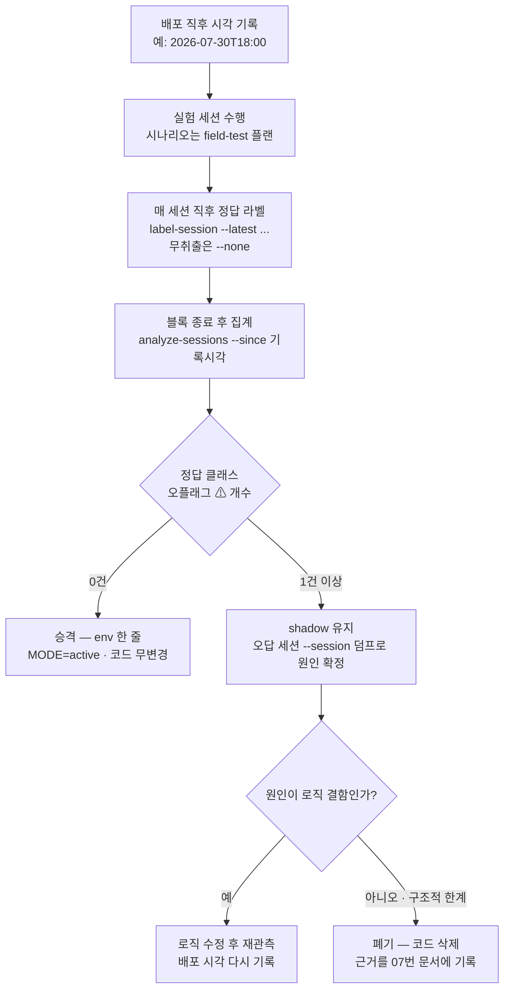

# 08. 인수인계

> 대상: 인수 담당자 · 후속 개발자 · 기준일: 2026-07-30
> 선행 문서: [06. 검증 보고서](06-verification-report.md) · [07. 배제·폐기 결정 기록](07-rejected-and-retired.md)
> 목적: 이 저장소를 이어받아 첫날 무엇을 하고, 다음에 무엇을 해야 하는지

---

## 1. 인수 체크리스트

### 1.1 문서 읽는 순서 (반나절)

| 순서 | 문서 | 여기서 얻는 것 |
|---|---|---|
| 1 | [01. 서비스 개요](01-service-overview.md) | 이 시스템이 무엇을 판단해 매출을 확정하는지, 외부 4개 시스템과의 관계 |
| 2 | [02. 시스템 아키텍처](02-system-architecture.md) | 계층 경계, 트리거 처리 흐름, 냉장·냉동 겸용 구조 |
| 3 | [03. 판정과 정산](03-judgment-and-settlement.md) | "무엇을 몇 개"를 정하는 규칙과 close 정산 4층 |
| 4 | [06. 검증 보고서](06-verification-report.md) | 무엇이 검증됐고 무엇이 안 됐는지 (§8 알려진 한계는 필수) |
| 5 | [07. 배제·폐기 결정 기록](07-rejected-and-retired.md) | **시도했다 버린 것** — 같은 시도를 반복하지 않기 위해 |
| 6 | 이 문서 (08) | 남은 작업, 리스크, 운영 규칙 |
| 참고 | [04. 설정 레퍼런스](04-configuration.md) · [05. 운영·진단 가이드](05-operations.md) | 배포 직전에 펼쳐 놓고 보는 레퍼런스 |

`devdoc/`는 개발 당시의 원본 기록입니다. 급하지 않지만
[`devdoc/fix_logs.md`](devdoc/fix_logs.md)는 "왜 이 코드가 이렇게 생겼는지"의
유일한 답이 들어 있는 곳이라, 판정 로직을 손대기 전에는 해당 부분을 반드시
찾아 읽으세요.

### 1.2 로컬 검증 (30분)

개발 PC에서 도메인 코어만 확인합니다 — YOLO·카메라 없이 전부 돕니다.

```bash
git clone <저장소 URL>
cd <저장소>

python -m venv .venv
source .venv/bin/activate
pip install -e ".[dev]"

python -m pytest tests -q          # 기대: 444 passed
ruff check .                       # CI와 같은 검사
```

- **444 passed**가 기준선입니다. 건수가 적으면 선택 의존성(`numpy` / `ffmpeg`
  바이너리 / `fastapi`) 미설치로 skip된 것입니다 — CI는 셋을 모두 설치합니다.
- lint의 정본은 CI(`.github/workflows/ci.yml`)입니다. 로컬 실행은 위처럼
  개발 의존성을 설치한 뒤에만 가능합니다.

### 1.3 env 템플릿 선택

**템플릿 3종 중 기기 종류에 맞는 것 하나를 `.env`로 복사**합니다. 어느 것을
골랐는지가 판정 방식 전체를 결정하므로 첫 단계에서 가장 중요합니다.

| 템플릿 | 대상 기기 | 핵심 값 |
|---|---|---|
| `freezer.env.example` | **냉동 기기** (실기 확정값) | `CABINET_TYPE=freezer`, `CAMERA_LAYOUT=dual_top_proxy`, 냉동 수직 ROI |
| `refrg.env.example` | **냉장 기기** (2026-07-28 현장 결정값) | `CABINET_TYPE=refrigerated`, `CAMERA_LAYOUT=dual`, `SIDE_CROP=left`, side ROI 0~300 |
| `.env.example` | 냉장 기본 템플릿 + **전 env 카탈로그·튜닝 가이드** | 값보다 주석을 읽는 용도. 새 기기 세팅의 출발점 |

> ⚠ `MODEL__MACHINE__CABINET_TYPE`을 냉동 기기에서 설정하지 않으면 전 존이
> 냉장(±5g) 프로파일로 판정됩니다 — 이슈 #6과 같은 오판정이 재발합니다.

### 1.4 기기 배포 (Jetson)

```bash
cd <저장소>
git pull origin master

chmod +x scripts/setup_jetson.sh
./scripts/setup_jetson.sh                 # system-site venv + 어댑터 의존성
source .venv/bin/activate
uv pip install --no-deps -e .             # 콘솔 스크립트 3종 엔트리포인트 등록

cp freezer.env.example .env               # 또는 refrg.env.example (§1.3)
# .env에서 MODEL__VISION__YOLO_MODEL_PATH를 실제 엔진 파일로 맞춘다
model-service
```

**엔진 빌드** — `.engine` 파일은 저장소에 없습니다. TensorRT 버전·GPU에
종속이므로 **반드시 그 Jetson 위에서** 빌드해야 합니다.

```bash
PT_FILE=<모델>.pt scripts/convert_engine.sh              # batch-1 (기본)
BATCH=4 PT_FILE=<모델>.pt scripts/convert_engine.sh      # T2-2 측정용
#   → models/<모델>_batch4.engine  (접미사로 배치 엔진 덮어쓰기 방지)
```

`.env`의 `MODEL__VISION__BATCH_SIZE`와 엔진 파일의 배치 수가 어긋나면
**기동 프로브가 즉시 실패**합니다 — 무증상 기동이 없도록 의도한 설계입니다.

**헬스 체크와 기동 로그** — 아래 셋을 모두 확인하고 넘어가세요.

```bash
curl http://localhost:8002/api/health
# {"status":"ok","door_state":"idle","queue_pending":0,"barrier_satisfied":true,...}
```

| 확인 항목 | 무엇을 보는가 |
|---|---|
| 기동 프로브 통과 | 엔진 로드·CUDA 가용성. 실패 시 서비스가 즉시 죽습니다(무증상 기동 금지) |
| `[CONFIG] cabinet_type=... default_profile=... camera_layout=...` | 템플릿이 의도대로 먹었는지. 여기서 프로파일이 틀리면 이후 전부 오판정 |
| `[MULTI-ZONE OPEN] mapped=n/total` | 상품→YOLO 클래스 매핑 성공률. `unmapped`가 있으면 그 상품은 청구되지 않습니다 |
| `MODEL__SESSION__ARCHIVE_DIR` 활성 | 모든 사후 분석이 아카이브 YAML에 걸려 있습니다 |

**상품 DB `unit_weight` 실측 재등록 확인**도 배포 전 필수입니다. 공칭 무게와
실측 총중량이 13~27g 차이 나 정답이 구조적으로 매칭되지 않았던 실사고가
있습니다(이슈 #6 ③). 냉장은 ±5g라 냉동(±15g)보다 훨씬 민감합니다.

---

## 2. 남은 작업 (우선순위)

| 우선 | 항목 | 왜 필요한가 | 선행 조건 | 난이도 |
|---|---|---|---|---|
| **P0** | T2 레버 A/B/C/D 기기 실측 | 냉동 13.7s/트리거 > `close_timeout` 10s 구조적 충돌의 유일한 정면 해결 경로. 절감폭(40ms→15~20ms)이 아직 **가설** | Jetson 접근, C단계는 `_batch4` 엔진 재빌드, 동일 AVI 재생 대조 | 중 |
| **P0** | 냉장 fitting 완료 (issue #18 노브 3종 A/B) | side hand 추론·`vote_ratio` 분모·모션 면제 3종이 전부 기본 off 상태로 미결. 정답 상품 `vote_ratio`가 0.03~0.07로 플리커와 구분되지 않는 문제가 남아 있음 | 냉장 실기 세션 + `label-session` 라벨 | 중 |
| **P1** | 승격 대기 shadow 2종 판정 | held 강등·고스트 원장이 관측만 하고 결론이 없는 상태. 미결이 길어지면 쓰이지 않는 코드가 남습니다 | 정답 클래스 오플래그 0 배치 확인 (§3) | 중 |
| **P1** | side ROI 400의 center-crop 재측정 | 입력 기하 전환으로 가로축 크롭 원점이 x=0 → 80으로 이동했는데 `SIDE_ROI_MAX_CENTER_X` 값을 재계산하지 않았습니다. 진짜 상품 과잉 제거와 오투표 잔존이 **양방향으로** 가능 | 실기 카메라 + `vote_summary.filter_drops_by_stage.side_roi` 관측 | 하 |
| **P1** | 24h+ soak (G4) | 무한 성장 방지가 코드·단위 테스트로만 검증됐습니다. `EventLog.rejected`가 아직 무상한이며 발열 스로틀링도 미확인 | Jetson 전용 점유, `tegrastats` 모니터 | 중 |
| **P1** | G1 판정 등가성 인수 (924 시나리오) | I9만 미커버 — 재설계가 원본과 다른 답을 내는 회귀를 자동으로 잡을 수 없습니다 | 현장 AVI 코퍼스(P1), 세션 아카이브 replay(P2) | 상 |
| **P2** | 냉동 게이트 정상화 (Tier 3) | 추론 호출 수 자체를 줄이는 유일한 근본 해법(스킵률 25%→50~70%, 추가 30~50%). AE/김서림 내성 게이트가 핵심 | T2 완료 + G2 재생 하네스. **판정이 바뀔 수 있어 반드시 별도 배치** + `MIN_VOTE_RATIO`/`SHARE` 동시 재점검 | 상 |
| **P2** | 엣지 워터마크 Node 측 구현 | `expected_triggers`가 오면 CLOSE 유예 3초 시간 휴리스틱이 인과 정보로 대체됩니다. 우리 쪽 수신·배리어 구현은 완료 | Edge_Environment 팀 협조 (`feature/edge-watermark` 브랜치) | 중 (우리 쪽 0) |
| **P2** | interim 의미론·에러 정책 Node 합의 (P3·P4) | G3 완결 조건. `MODEL__SESSION__ERROR_POLICY` 변경은 Node 합의 없이는 금지 | Node 팀 합의 | 중 |
| **P3** | 카메라 노출·AE fitting (issue #19) | 냉동 게이트 임계를 올릴 수 없는 원인 중 하나가 AE 스윙입니다. 추론단 감마보다 캡처단 수정이 문헌상 1순위 | `scripts/camera_luma_probe.py` 실행 결과 | 중 |

난이도 기준: 하 = env·설정 수준 · 중 = 실기 세션 1~2배치 또는 국소 코드 변경 ·
상 = 코퍼스·하네스 구축이 선행되는 별도 트랙.

---

## 3. 승격 대기 항목의 판정 절차

2026-07-30 기준 승격 대기 shadow는 **2종**입니다. 나머지 미채택 shadow 5종은
같은 날 코드째 삭제했습니다(내역은 [07번 문서](07-rejected-and-retired.md)).

| 기제 | env | 무엇을 관측 중인가 | 승격 게이트 | 폐기 기준 |
|---|---|---|---|---|
| **held 트랙 강등** | `MODEL__VISION__HELD_TRACK_DEMOTION` = `off`\|`shadow`\|`active` | 프리롤부터 지속 관측된 carried-in(들고 들어온) 트랙의 표를 몰수했을 때의 정오 | **정답 클래스 오플래그(⚠) 0** 배치 확인 → `active` | 냉장에서도 오플래그가 계속 나오고 "shadow만 정답" 기여가 없으면 폐기 |
| **세션 고스트 원장** | `MODEL__GHOST__MODE` = `off`\|`shadow`\|`active` | 여러 존(≥2 에피소드)에서 자격 표를 얻고도 세션 내 무게 뒷받침 과금이 0인 클래스 | **정답 클래스 오플래그(⚠) 0** 배치 확인 → `active` | 에피소드 ≥2 수정(11차 video_paths + 이슈 #22 같은 순간 창 겹침 병합) 후에도 오플래그가 재현되면 강등 로직 축소 검토 |

두 기제 모두 **강등형**입니다 — 판정을 뒤집는 방향이 "표를 빼는" 쪽이라,
잘못 켜면 진짜 취출 표를 몰수해 **매출 누락**이 납니다. 그래서 게이트가
"정답 클래스를 한 번도 잘못 지목하지 않았다(오플래그 0)"입니다. 10차 배치에서
held가 진열→취출 전환 트랙의 60/61표를 오플래그한 기록이 있고, 만약 active
였다면 진짜 취출 표 60개를 몰수했을 상황이었습니다 — 이 게이트는 실제로
잘못된 승격을 막았습니다.

### 3.1 절차 흐름



### 3.2 명령 절차

```bash
# ① 배포 직후 시각을 반드시 적어 둔다 (구 코드 세션의 집계 오염 방지)
date -Iseconds

# ② 실험 → 매 세션 직후 정답 라벨
label-session --latest --zone 2 --take 27x1 --note "S1 단일 취출"
label-session --latest --none                      # 무취출 세션 (청구 0이 정답)

# ③ 블록 단위 집계 — --since는 필수
analyze-sessions --since 2026-07-30T18:00
analyze-sessions --session <세션 id>               # 오답·플래그 세션 상세
analyze-sessions --session <세션 id> --full        # 원자료 전체

# ④ 완전 리셋이 필요하면 아카이브 디렉토리를 옮긴다 (서비스가 재생성)
mv data/sessions data/sessions.pre-<태그>
```

리포트에서 볼 섹션은 두 개입니다 — **과금 정오**(정답 n/전체 + 오답 세션의
`과금 ← 정답` diff)가 최우선 지표이고, **트랙릿 T1 / 고스트 shadow** 섹션이
오플래그 ⚠ 신호를 직접 출력합니다. 리포트가 승격 가능 여부 문구를 직접
찍어 주므로, 사람이 세션을 눈으로 뒤질 필요는 없습니다.

### 3.3 승격·폐기 시 해야 하는 일

| 결정 | 해야 하는 일 |
|---|---|
| **승격** | env 한 줄 변경(`...=active`) + 재기동. 코드는 건드리지 않습니다. 승격 근거(배치·오플래그 수)를 `devdoc/fix_logs.md`에 추가 |
| **폐기** | **코드째 삭제** — 로직 + env 파싱 + 템플릿 3종 + 테스트. 근거는 [07번 문서](07-rejected-and-retired.md)에 기록 |

`.env`에서 `0`으로 꺼두는 것으로 폐기를 갈음하지 마세요. 코드 기본값과
미동기화되어 부활 경로가 남습니다 — `static_track`이 `.env`에서는 0인데 코드
기본값 24로 살아 있어 실제로는 드랍 중이었던 전례가 있습니다.

---

## 4. 리스크 등록부

| 리스크 | 영향 | 현재 완화책 | 잔존 위험 |
|---|---|---|---|
| **콘솔 스크립트 이름이 레거시와 동일** — 2026-07-30에 `model-service-hg` → `model-service`로 교체 | 한 venv에 레거시 CRK-model과 같이 설치되면 나중 설치가 이름을 차지해 **의도와 다른 서비스가 기동**될 수 있다 | 두 서비스를 같은 venv에 섞지 않는다. 기동 후 `/api/health` 응답 형태로 확인 가능 | 이름만으로는 구분 불가 — 배포 스크립트가 venv 경로를 명시해야 한다 |
| **venv가 JetPack torch를 빌려 쓰는 구조** — 정상 torch는 venv 밖에 있고 `--system-site-packages`로 참조된다 | venv 안에 torch가 들어오면(의존성 해석이 PyPI CUDA 13 빌드를 끌어올 때) 기동 불가. `.venv` 재생성 시 재발했다 | `setup_jetson.sh`가 torch를 끌어오는 패키지를 `--no-deps`로 설치하고, 검증 실패 시 venv 로컬 torch를 자동 회수한다. 검증이 `PyTorch origin` 경로를 출력 | 수동으로 `pip install`을 하면 언제든 재현 가능 — venv 안에서는 `uv pip`만 쓰고 torch를 직접 설치하지 않는다 |
| **로드셀 물리 한계** — 5g 양자화, 냉동 오차 5~15g | 무게로 정체성을 판별하면 오식별 과금 | `weight_is_discriminative=False`로 냉동의 무게-정체성 경로 전부 억제, 냉동 `segment_step` 20g, ±15g 개수 게이트 | 5g 미만 차이는 원리적으로 구분 불가. DB `unit_weight` 편차가 더해지면 정답이 게이트를 통과하지 못함 |
| **옷 프린트 유령** — 사람 옷의 프린트가 상품으로 검출 | 오과금. 트리거 안에서는 진짜와 구분 불가(변위 통과·다수 표) | 세션 고스트 원장(shadow), close 콤보 자격 5중 가드, `min_vote_share` | 고스트가 shadow라 실제 차단은 아직 없음. 오플래그 위험 때문에 승격도 못 하는 교착 |
| **side 카메라 광학 공유** | 타 존 진열이 이 존 영상에 찍혀 교차 오염·고스트 오플래그 | 교차존 페널티(기본 ON) + self-fit 자격, 고스트 에피소드 ≥2 요건, side x-ROI | ROI 경계값이 center-crop 재측정 대기 상태. 냉장은 존별 side 카메라라 냉동(공용 광각)과 기하가 다름 |
| **엔진 파일의 기기 종속성** | 다른 기기에서 빌드한 `.engine`은 사용 불가. 배치 수가 어긋나면 기동 실패 | 기동 프로브 1회 추론(fail-fast), `convert_engine.sh`, `_batch{N}` 접미사 | 기기 리셋·JetPack 재플래시마다 재빌드 필요. 엔진은 저장소에 없어 별도 관리 |
| **NumPy 2.x 오염** | Jetson torch 비호환 → 추론 전멸 | `setup_jetson.sh` 사전 검사, `YOLO_AUTOINSTALL=false`, `--no-deps` 설치, export 의존성 핀 | 수동 `pip install` 한 번으로 깨질 수 있음. venv를 남이 만지면 재발 |
| **아카이브 용량** (`SAVE_DETECTIONS`) | 세션당 수백 KB → 디스크 압박, 조회 지연 | 보존기간 14일, `--session` O(1) 조회, libyaml 사용 | 진단용 opt-in인데 상시 ON으로 두면 누적됩니다. 배포 후 끄는 것을 잊기 쉬움 |
| **코드 버전 혼합 아카이브 집계 오염** | 구 코드 세션의 오답·mismatch가 최신 코드 평가에 섞여 잘못된 승격/폐기 판단 | `analyze-sessions --since`, 디렉토리 이동 리셋, `vote_summary.ratio_denominator` 기록 | `--since`를 빼면 조용히 오염됩니다. 배포 시각 기록이 사람 손에 달려 있음 |

---

## 5. 운영 규칙 (반드시 지켜야 하는 것)

이 여섯 개는 취향이 아니라, 실제 사고로 확정된 규칙입니다.

### ① 새 판정 기제는 shadow-first로 배포한다

관측만 하고 판정은 바꾸지 않는 모드로 먼저 배포합니다. 실기 라벨 실측으로
게이트를 통과한 뒤에 켭니다. **이 규칙이 실제로 사고를 막았습니다** — held
오플래그 5건(10차), 고스트 오플래그 3/3(11차)이 active 배포였다면 진짜 취출
표를 몰수했을 것입니다.

### ② 승격은 env 한 줄, 폐기는 코드 삭제

승격에 코드 변경이 필요하면 실측→적용 사이클이 길어집니다. 반대로 폐기를
`.env`의 `0`으로 갈음하면 코드 기본값과 미동기화되어 부활 경로가 남습니다
(`static_track` 전례).

### ③ 폐기 근거는 07번 문서에 기록한다

"왜 안 했는지"가 남지 않으면 같은 시도가 반복됩니다. 삭제 커밋의 diff만으로는
"시도했다가 실패했다"와 "필요 없어졌다"를 구분할 수 없습니다.

### ④ env를 추가·삭제하면 템플릿 3종 + 04번 문서를 같은 커밋에서 갱신한다

대상: `.env.example` · `refrg.env.example` · `freezer.env.example` +
[04. 설정 레퍼런스](04-configuration.md). 템플릿 하나만 고쳐서 값이 어긋난
전례가 있습니다 — `.env.example`의 CROSS_ZONE 블록이 중복되어 dotenv
last-wins로 의도한 값이 무효가 된 사고입니다.

### ⑤ 실측 인용은 반드시 `--since`로 코드 버전을 분리한다

아카이브는 코드가 바뀌어도 계속 쌓입니다. `--since` 없이 집계하면 구 코드
세션의 오답이 최신 코드 평가에 섞여 승격·폐기 판단을 오염시킵니다. 배포
직후 시각을 적어 두는 것이 절차의 1단계인 이유입니다.

### ⑥ 과청구보다 미청구(fail-closed) 원칙을 깨는 변경은 금지

확신이 없으면 청구하지 않습니다. 미청구는 매출 누락이지만 과청구는 신뢰
사고입니다. 구체적으로 아래를 약화시키는 변경은 넣지 마세요.

- 에러 세션의 무성 확정(I13) — `ERROR_POLICY` 변경은 Node 합의(P4) 필요
- `weight_only`의 다품목 조합 탐색 금지(이슈 #6) — 우연한 무게 합 일치가 과금이 됨
- 잠정 집계의 결제 전달 금지(I10) — 타입 분리를 우회하지 마세요
- 미매핑 상품의 `class_id=-1` 센티널 — `0`으로 되돌리면 손(hand)으로 둔갑합니다
- 정산 count의 음수 차단(I14), 재고 상한(I12), 품절 배제(I5)

성능 최적화도 이 규칙 아래입니다 — T1·T2가 "출력 비트 동일 / 판정 결과 동일"을
회귀 테스트로 고정하는 이유이고, T3(게이트 정상화)를 별도 배치로 분리하는
이유입니다. **속도 변경과 판정 변경을 같은 배치에 섞지 마세요.**

---

## 6. 연락·자료 위치

### 6.1 관련 저장소와 역할 경계

자판기 한 대 안에서 네 개의 소프트웨어가 협력합니다. 이 저장소는 그중
**판정 엔진 하나**만 담당합니다.

| 저장소 | 역할 | 이 저장소와의 경계 |
|---|---|---|
| **CRK-CAMERA** | 카메라 녹화(AVI) + 로드셀 시계열 기록 | `POST /trigger`로 zone·영상 경로·로드셀을 보냅니다. 프레임 예산(프리롤 4s + 포스트롤 4s × 30fps × 2캠)이 CRK-CAMERA 계약입니다 |
| **CRK-IO-BOARD** | 문 개폐·로드셀 하드웨어 입출력 | 직접 통신하지 않습니다. 신호는 카메라·엣지를 경유합니다 |
| **Edge_Environment** | 엣지 오케스트레이션(Node). 세션 진행, 녹화 디렉토리 소유 | `POST /api/judge/multi-zone`으로 OPEN/CLOSE + `active_products`를 보내고 확정 결과를 받습니다. **엣지 워터마크(`expected_triggers`) 구현이 이쪽 몫**입니다 |
| **CRK-model** (레거시) | 이 서비스의 참조 구현 (FastAPI + TensorRT, 단일 판정 엔진) | 외부 계약을 그대로 계승합니다. "원본은 어떻게 했나"의 답이 여기 있고, 이식 누락 결함을 찾을 때 대조 대상입니다 |

**우리가 하지 않는 일**을 명확히 해 둡니다 — 녹화, 결제 처리, 세션 진행 관리,
상품 DB 관리는 이 저장소의 책임이 아닙니다. 특히 상품 `unit_weight` 실측
재등록은 운영·DB 측 이관 항목입니다.

### 6.2 저장소 안의 자료 위치

| 위치 | 내용 |
|---|---|
| `docs/01`~`08` | **정본 문서집.** 코드가 바뀌면 같은 커밋에서 함께 고칩니다 |
| `docs/devdoc/design/` | 재설계 당시의 설계 문서 (아키텍처 다이어그램, 판정 중재 설계, 트랙릿 비용·편익 등) |
| `docs/devdoc/field-tests/` | 실기 테스트 플랜과 shadow 승격/폐기 현황 리뷰 |
| `docs/devdoc/research/` | 리서치 노트 (레이턴시 비용 모델, 판정 성능 조사, 전략 리딩 리스트) |
| `docs/devdoc/fix_logs.md` | **전 개발 이력.** 증상·원인·해결·테스트가 시간순으로 누적 |
| `crk_model/<패키지>/README.md` | 패키지별 세부 기능 문서 (모듈 단위 책임·계약·불변식) |
| `.env.example` 외 템플릿 2종 | env 카탈로그 + 기기별 확정값 + 튜닝 가이드 |
| `scripts/` | 개발·운영 보조 스크립트 (`crk_model` 비의존) |

### 6.3 devdoc을 다루는 규칙

**devdoc은 히스토리이므로 소급 수정하지 않습니다.** 과거 판단의 근거이기
때문입니다 — 내용이 현행과 어긋나면 **정본(01~08)을 고치고 devdoc은 그대로
둡니다.** 새 기록은 추가만 합니다.

이 규칙 때문에 devdoc에는 이미 현행과 다른 서술이 섞여 있습니다. 예를 들어
초기 fix_logs는 냉장 tolerance를 ±3g로 적고 있으나 현행 코드
(`core/profiles.py`)는 5g입니다. **수치가 필요할 때는 코드와 정본 문서를
먼저 보세요.** devdoc은 "왜 그렇게 결정했는가"를 읽는 곳입니다.

---

## 관련 문서

| 문서 | 이 문서와의 관계 |
|---|---|
| [06. 검증 보고서](06-verification-report.md) | §2 남은 작업의 근거 — §8 알려진 한계를 작업 항목으로 전환한 것이 §2입니다 |
| [07. 배제·폐기 결정 기록](07-rejected-and-retired.md) | §3.3 폐기 절차의 기록 대상. 재시도 방지의 정본 |
| [04. 설정 레퍼런스](04-configuration.md) | §1.3 env 템플릿 선택·§5 ④ 규칙의 대상 문서 |
| [05. 운영·진단 가이드](05-operations.md) | §3.2 명령 절차에 쓰는 진단 도구 사용법 |
| [`devdoc/field-tests/0724_shadow_status_review.md`](devdoc/field-tests/0724_shadow_status_review.md) | §3 승격/폐기 절차와 게이트 기준의 원본 |
| [`devdoc/field-tests/0724_fridge_field_test_plan.md`](devdoc/field-tests/0724_fridge_field_test_plan.md) | §2 P0 냉장 fitting의 시나리오·검증 우선순위 |
| [`devdoc/research/0728_freezer_latency_research.md`](devdoc/research/0728_freezer_latency_research.md) | §2 P0 T2 실측·P2 Tier 3의 측정 매트릭스와 안전 한계 |
| [`devdoc/fix_logs.md`](devdoc/fix_logs.md) | §4 리스크 등록부의 사례 원자료 |
