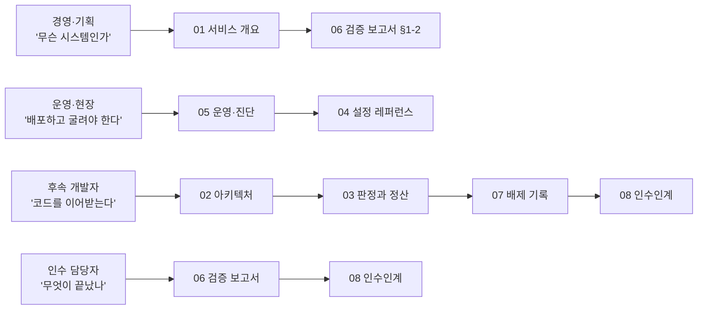

# CRK 모델 서비스 문서집

> AI 스마트 자판기 판정 서비스(CRK-model-HG)의 공식 문서집입니다.
> 최종 정리: 2026-07-30 · 대상 독자: 인수 담당자, 운영자, 후속 개발자

---

## 1. 이 문서집의 구성

문서는 **읽는 순서**대로 번호가 붙어 있습니다. 앞쪽은 "무엇을 하는 시스템인가",
뒤쪽으로 갈수록 "어떻게 만들었고, 무엇을 버렸고, 무엇이 남았는가"입니다.

| # | 문서 | 한 줄 설명 | 주 독자 |
|---|---|---|---|
| 01 | [서비스 개요](01-service-overview.md) | 이 시스템이 무엇을 판단해 매출을 확정하는지 (비전공자용) | 경영·기획·전사 |
| 02 | [시스템 아키텍처](02-system-architecture.md) | 외부 계약, 계층 구조, 트리거 처리 흐름 | 개발·아키텍트 |
| 03 | [판정과 정산](03-judgment-and-settlement.md) | "무엇을 몇 개"를 정하는 규칙과 문 닫힘 후 정산 4층 | 개발·QA |
| 04 | [설정 레퍼런스](04-configuration.md) | 환경변수 전체 카탈로그, 냉장/냉동 프로파일 | 운영·현장 배포 |
| 05 | [운영·진단 가이드](05-operations.md) | 배포, 로그 읽기, 오판정 사후 분석 3종 도구 | 운영·현장 지원 |
| 06 | [검증 보고서](06-verification-report.md) | 개발 완료 범위, 테스트·게이트 현황, 실기 검증 이력 | 인수 담당자 |
| 07 | [배제·폐기 결정 기록](07-rejected-and-retired.md) | 시도했으나 버린 접근과 그 근거 (재시도 방지) | 후속 개발자 |
| 08 | [인수인계](08-handover.md) | 남은 작업, 리스크, 승격 대기 항목, 재개 절차 | 인수 담당자 |

부속:

- [`devdoc/`](devdoc/README.md) — 개발 당시의 원본 설계·리서치·실기 기록.
  **현행성을 보장하지 않는 히스토리 자료**이며, 위 01~08이 정본입니다.
- 코드 안 문서 — `crk_model/<패키지>/README.md`에 패키지별 세부 기능 문서가
  있습니다 (모듈 단위 책임·계약·불변식).

## 2. 3분 요약

- **하는 일**: 손님이 냉장고 문을 열고 상품을 꺼내 닫으면, 카메라 영상과 무게
  변화만으로 "무엇을 몇 개 가져갔는지" 판정해 결제 금액을 확정합니다.
- **어디서 도는가**: 자판기 안의 Jetson Orin Nano (엣지). 영상은 기기 밖으로
  나가지 않습니다.
- **핵심 원칙**: **과청구보다 미청구** — 확신이 없으면 청구하지 않습니다
  (fail-closed). 모든 청구는 사후에 재구성 가능해야 합니다.
- **현재 상태**: 냉동 실기 E2E 검증 완료, 냉장 실기 fitting 진행 중.
  자동 검증 443건 통과. 상세는 [06-검증 보고서](06-verification-report.md).

## 3. 독자별 추천 경로

## 4. 문서 관리 규칙

1. **정본은 01~08**입니다. 코드가 바뀌면 해당 문서를 같은 커밋에서 고칩니다.
2. **devdoc은 추가만** 합니다 — 과거 판단의 근거이므로 소급 수정하지 않습니다.
   내용이 현행과 어긋나면 정본 문서를 고치고 devdoc은 그대로 둡니다.
3. **폐기 결정은 07번에 기록**합니다. "왜 안 했는지"가 남지 않으면 같은 시도가
   반복됩니다.
4. 환경변수를 추가·삭제하면 [04-설정 레퍼런스](04-configuration.md)와 env
   템플릿 3종(`.env.example`, `refrg.env.example`, `freezer.env.example`)을
   함께 갱신합니다.
