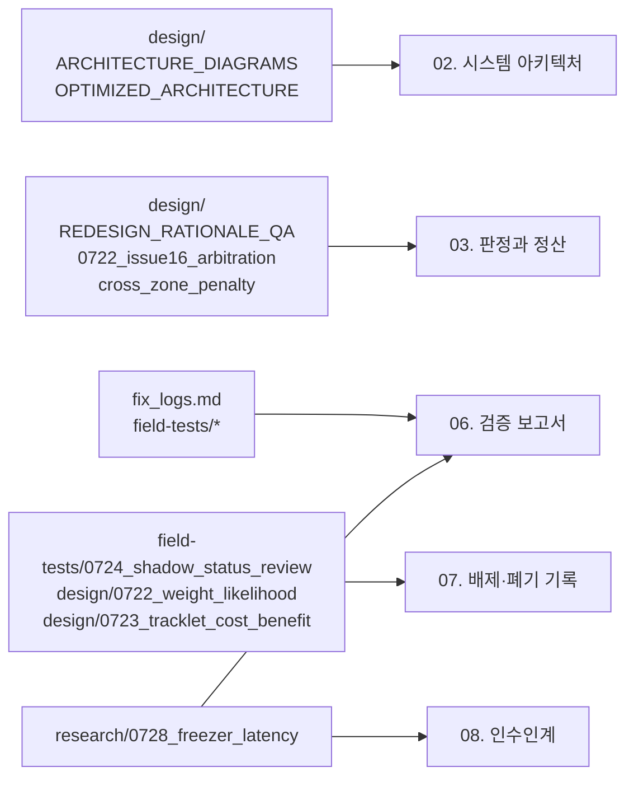

# devdoc — 개발 히스토리 자료

> 이 폴더는 **개발 당시의 원본 문서**입니다. 현행성을 보장하지 않습니다.
> 정본은 상위 폴더의 [01~08 문서집](../README.md)입니다.

---

## 1. 이 폴더의 규칙

1. **소급 수정하지 않습니다.** 여기 있는 문서는 "그 시점에 무엇을 알고 무엇을
   결정했는가"의 기록입니다. 현행 코드와 어긋나는 서술이 있어도 고치지 않고,
   정본 문서(01~08)를 갱신합니다.
2. **인용은 출처를 남깁니다.** 정본 문서가 실측 수치를 인용할 때
   `docs/devdoc/fix_logs.md` 같은 경로를 함께 적습니다.
3. **파일 경로가 옛 위치일 수 있습니다.** 2026-07-30 정리 이전에는 이 문서들이
   `docs/` 최상위와 `claudedocs/`에 있었습니다. 문서 안의 상호 참조 경로는
   당시 그대로입니다.
4. **폐기된 기능이 살아 있는 것처럼 서술된 부분이 있습니다.** 무엇이 폐기됐는지는
   [07. 배제·폐기 결정 기록](../07-rejected-and-retired.md)이 정본입니다.

## 2. 구성

### `fix_logs.md` — 개발·수정 이력 (가장 중요)

증상 → 원인 → 해결방안 형식으로 2026-07-09부터의 모든 수정을 시간순 기록.
실기 배치 1~14차와 냉장 issue #18의 실측 근거가 전부 여기 있습니다. 정본 문서가
수치를 인용할 때 대개 이 파일을 가리킵니다.

### `design/` — 설계 문서

| 문서 | 내용 | 현재 상태 |
|---|---|---|
| `ARCHITECTURE_DIAGRAMS.md` | 재설계 당시의 전체 다이어그램 모음 | [02. 시스템 아키텍처](../02-system-architecture.md)로 승계 |
| `OPTIMIZED_ARCHITECTURE.md` | 성능 레버 L1~L6 설계와 승인 조건 | L1·L2·L5·L6 구현 완료, L3(배치)는 T2로 재구현 |
| `REDESIGN_RATIONALE_QA.md` | 불변식 I1~I17의 도출 과정 (Q&A) | [03. 판정과 정산](../03-judgment-and-settlement.md) §5로 요약 승계 |
| `0713_held_object_demotion.md` | held-object(들고 들어온 상품) 강등 설계 | A-2 클래스 단위 → T2 트랙 단위로 재구현, 현재 shadow |
| `0722_issue16_arbitration_design.md` | 무게 중재 재설계 (이슈 #16) | 구현 완료 (판정 노브로 남음) |
| `0722_weight_likelihood_design.md` | 무게 우도 확률화 설계 | **폐기** (Phase 2 부결, 2026-07-30 코드 삭제) |
| `0723_tracklet_cost_benefit.md` | 트랙릿 갭 4종의 비용·편익 분석 | T1 계측 유지, T2 held는 shadow, 갭 1·2·4는 **폐기** |
| `cross_zone_penalty.md` | 교차존 비전 오염 페널티 설계 | Phase 3 승격 완료 (기본 ON) |
| `baseline_and_judgment_iv.md` | baseline 억제와 불변식 I-V | baseline **퇴역**, I-V는 현행 유지 |
| `improvements_over_original.md` | 레거시 대비 개선 정리 | [06. 검증 보고서](../06-verification-report.md)로 승계 |

### `field-tests/` — 실기 실측 계획과 현황

| 문서 | 내용 |
|---|---|
| `0723_field_test_plan.md` | 냉동 실기 테스트 플랜 |
| `0724_fridge_field_test_plan.md` | 냉장 실기 테스트 플랜 |
| `0724_shadow_status_review.md` | shadow 기제 승격/은퇴/보류 현황 + 처분 권고 — 2026-07-30 폐기 판단의 근거 문서 |

### `research/` — 문헌 조사와 성능 리서치

| 문서 | 내용 |
|---|---|
| `research_judgment_performance_20260722.md` | 판정·추론 성능 향상 문헌 조사 (BOCPD 채택 근거) |
| `0723_strategy_reading_list.md` | 전략 관련 리딩 리스트 |
| `0728_freezer_latency_research.md` | 냉동 트리거 13.7s 원인 분석과 T1/T2 레버 설계, "하지 말 것" 목록 |

### `transcripts/` — 원시 작업 기록

버전 관리 대상이 아닌 개발 세션 원문입니다. 참고용으로만 두었습니다.

## 3. 정본 문서와의 매핑

